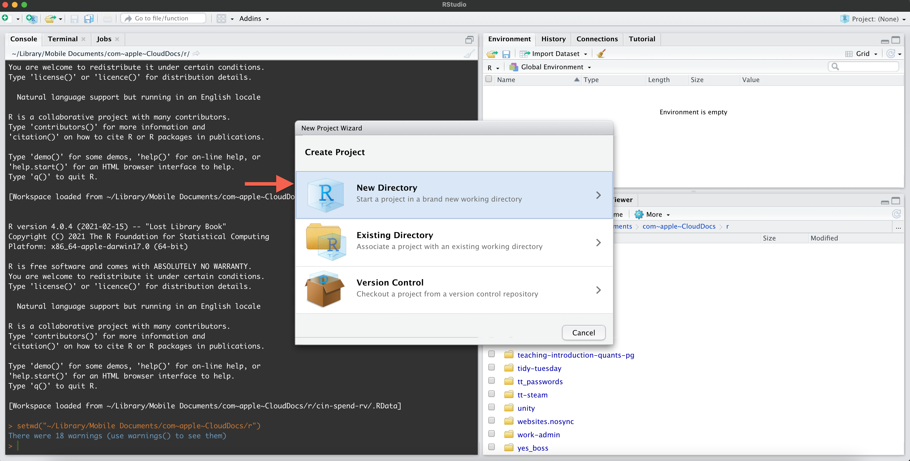
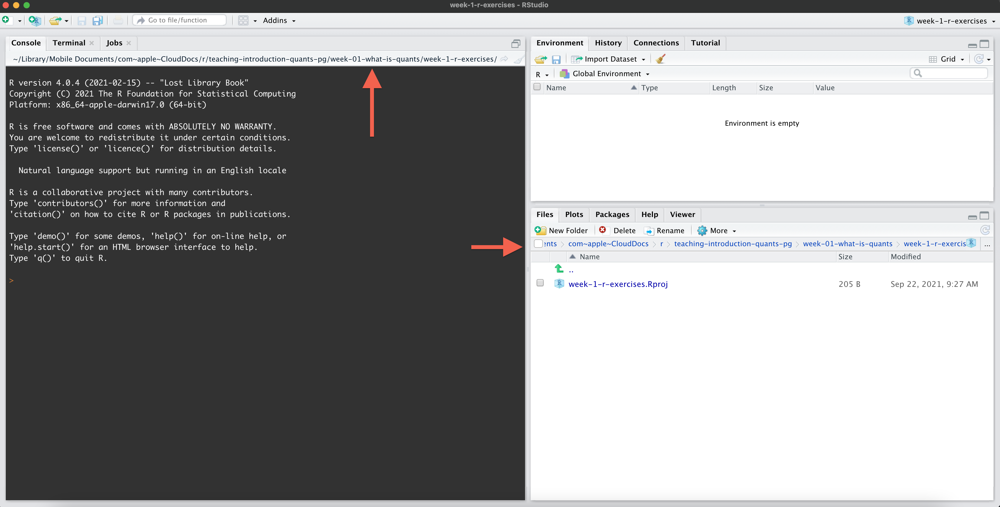

```{r setup, include=FALSE}
library(tidyverse)
# invalidate cache when the tufte version changes
knitr::opts_chunk$set(cache.extra = packageVersion('tufte'))
options(htmltools.dir.version = FALSE)
options(tinytex.verbose = TRUE)
```

### Open `Rstudio`

``` {r echo = FALSE, layout = "l-page"}


```

### Click the `R` Project menu in the top right and then click 'New project...'

``` {r echo = FALSE, layout = "l-page"}


```


### If you want to create a folder (directory) for your project to live in at the same time (recommended), click 'New Directory'

``` {r echo = FALSE, layout = "l-page"}



```

### Click 'New Project'

``` {r echo = FALSE, layout = "l-page"}


```


### Set where you want your new project directory to be added: e.g. I generally keep all of my `R` projects in a parent directory called 'r'. Type in a name for your project and then click 'Create Project'.

``` {r echo = FALSE, layout = "l-page"}


```

### Check that your working directory has now changed to the project you just created; you should also see your .Rproj file in the 'Files' tab of the Files/Viewer pane and the name of your project in the top right hand corner

``` {r echo = FALSE, layout = "l-page"}



```

### Click the button in the top left that looks like a white square with a plus sign over it, then click "R Script" (or R Markdown if you wish to use R Markdown)

``` {r echo = FALSE, layout = "l-page"}


```

### You should now have a new, untitled R script open in your Script pane. Remember to save this script.

``` {r echo = FALSE, layout = "l-page"}


```

## Reopening your R project after closing.

### You can either open your R project directly by going to the directory in your computer's files system (e.g. file explorer), or you can open Rstudio and open it from the recently used list in the top right corner.

``` {r echo = FALSE, layout = "l-page"}


```

