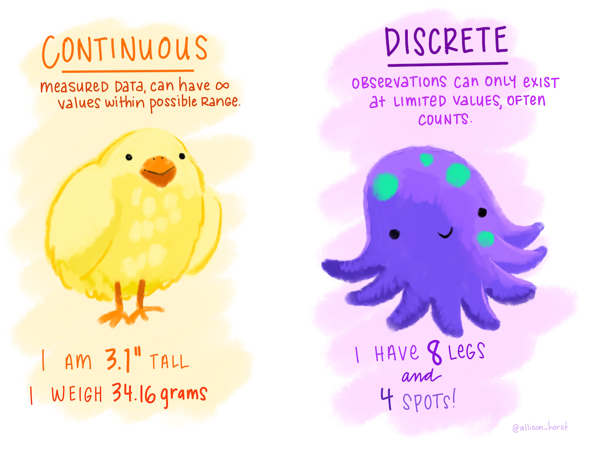
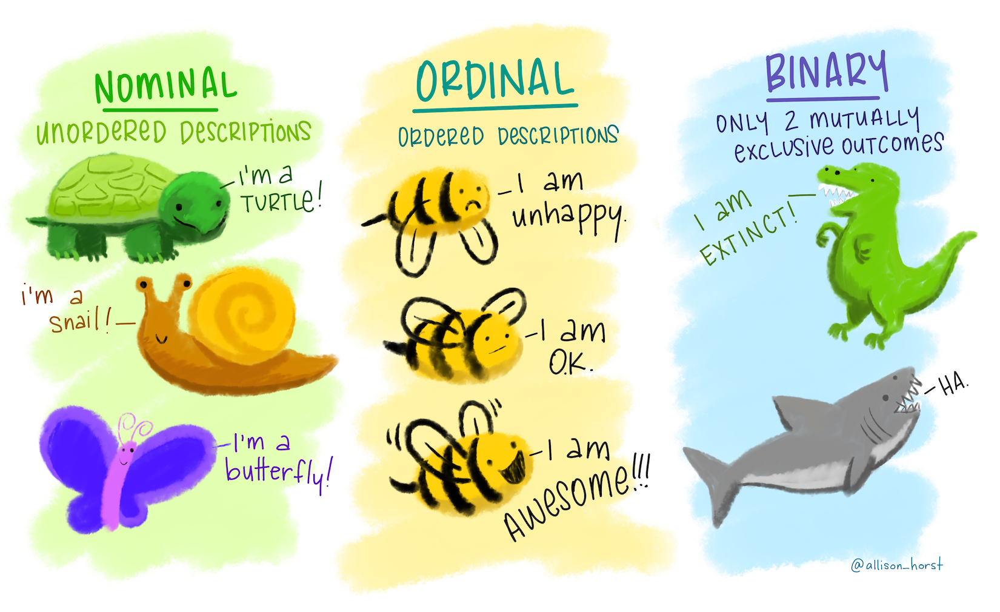
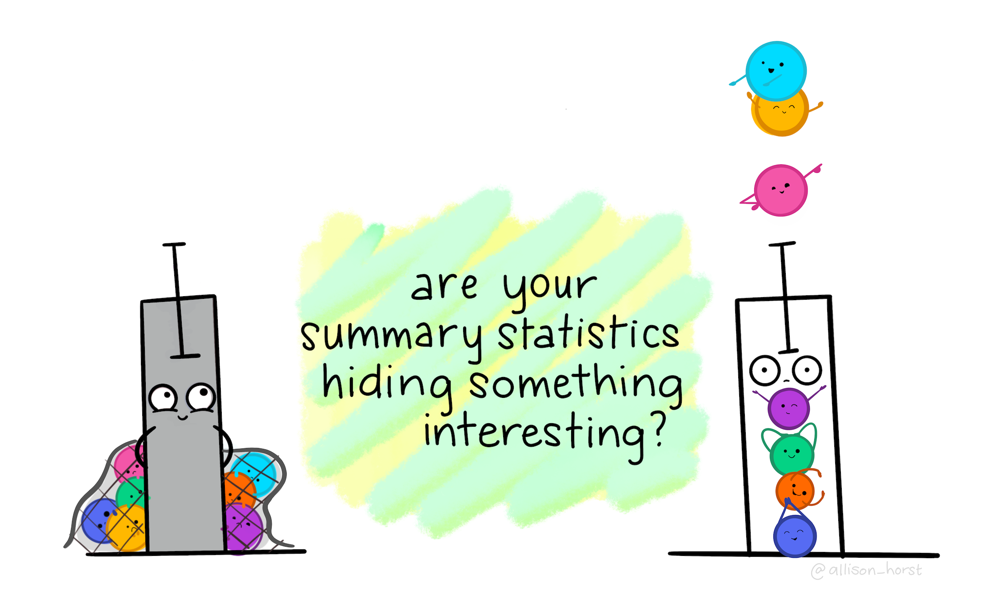

class: middle
background-size: contain

<!----- Make a pdf using:

decktape generic --key=ArrowRight --load-pause 1800 --slides '1-65' --size '1216x684'  "week-02-types-of-quantification/slides/week-02-types-of-quantification.html" week-02-types-of-quantification/slides/week-02-types-of-quantification.pdf

----->


<br><br>

# .tuos_purple[EDC459: Week 2<br>Types of quantification]

<br><br>

**Dr. Calum Webb**<br>
Sheffield Methods Institute, the University of Sheffield.<br>
[c.j.webb@sheffield.ac.uk](mailto:c.j.webb@sheffield.ac.uk)

```{r setup, include=FALSE}
options(htmltools.dir.version = FALSE)

# These packages are required for creating the slides
# Many will need to be installed from Github
library(icons)
library(tidyverse)
library(xaringan)
library(xaringanExtra)
library(xaringanthemer)

# Defaults for code
knitr::opts_chunk$set(
  fig.width=9, fig.height=3.5, fig.retina=3,
  out.width = "100%",
  cache = FALSE,
  echo = TRUE,
  message = FALSE, 
  warning = FALSE,
  fig.show = TRUE,
  hiline = TRUE
)

# set global theme for ggplot to make background #F8F8F8F8 (off white),
# but otherwise keep all ggplot themes default (better for teaching)
theme_set(
  theme(plot.background = element_rect(fill = "#F8F8F8", colour = "#F8F8F8"), 
        panel.background = element_rect(fill = "#F8F8F8", colour = "#F8F8F8"))
  )


```

```{r xaringan-tile-view, echo=FALSE}
# Use tile overview by hitting the o key when presenting
xaringanExtra::use_tile_view()
```

```{r xaringan-logo, echo=FALSE}
# Add logo to top right
xaringanExtra::use_logo(
  image_url = "header/smi-logo-white.png",
  exclude_class = c("inverse", "hide_logo"), 
  width = "180px", position = css_position(top = "1em", right = "2em")
)
```

```{r xaringan-themer, include=FALSE, warning=FALSE}

# Set some global objects containing the colours
# of the university's branding
primary_color <- "#131E29"
secondary_color <- "#440099"
tuos_blue <- "#9ADBE8"
white = "#F8F8F8"
tuos_yellow <- "#FCF281"
tuos_purple <- "#440099"
tuos_red <- "#E7004C"
tuos_midnight <- "#131E29"

# The bulk of the styling is handled by xaringanthemer
style_duo_accent(
  primary_color = "#131E29",
  secondary_color = "#440099",
  colors = c(tuos_purple = "#440099", 
             grey = "#131E2960", 
             tuos_blue ="#9ADBE8",
             tuos_mint = "#00CE7C"),
  header_font_google = xaringanthemer::google_font("Source Serif Pro", "600", "600i"),
  text_font_google   = xaringanthemer::google_font("Source Sans Pro", "300", "300i", "600", "600i"),
  code_font_google   = xaringanthemer::google_font("Lucida Console"),
  header_h1_font_size = "2rem",
  header_h2_font_size = "1.5rem", 
  header_h3_font_size = "1.25rem", 
  text_font_size = "0.9rem",
  code_font_size = "0.65rem", 
  code_inline_background_color = "#F8F8F8", 
  inverse_text_color = "#9ADBE8", 
  background_color = "#F8F8F8", 
  text_color = "#131E29", 
  link_color = "#005A8F", 
  inverse_link_color = "#F8F8F8",
  text_slide_number_color = "#44009970",
  table_row_even_background_color = "transparent", 
  table_border_color = "#44009970",
  text_bold_font_weight = 600
)

```


```{r xaringan-panelset, echo=FALSE}
# Allow for adding panelsets (see example on slide 2)
xaringanExtra::use_panelset(in_xaringan = TRUE)

style_panelset_tabs(
  background = "#F8F8F8",
  active_background = "#F8F8F8",
  hover_background = "#F8F8F8"
)


```

```{r xaringanExtra, echo = FALSE}
# Adds white progress bar to top
xaringanExtra::use_progress_bar(color = "#F8F8F8", location = "top")
```

```{r xaringan-extra-styles, echo = FALSE}
# Allow for code to be highlighted on hover
xaringanExtra::use_extra_styles(
  hover_code_line = TRUE,         #<<
  mute_unhighlighted_code = TRUE  #<<
)
```

```{r share-again, echo=FALSE}
# Add sharing links and other embedding tools
xaringanExtra::use_share_again()
```

```{r xaringanExtra-search, echo=FALSE}
# Add magnifying glass search function to bottom left for quick
# searching of slides
xaringanExtra::use_search(show_icon = TRUE, auto_search = FALSE)
```


---
class: middle

.pull-right[

<br><br><br><br><br><br>

# Sign In

]
---
class: middle

## Learning Objectives

.panelset[

.panel[.panel-name[What will I learn?]

By the end of this week you will:

* Be able to identify different variables using the continuous/ordinal/categorical typology.

* Be able to relate these variable types to variable classes in `R`.

* Know how a range of descriptive statistics can be used to summarise and simplify large amounts of data, and which ones to use for different types of variable.

* Be able to produce descriptive statistics and basic visualisations of different types of variables using `R`.

]

.panel[.panel-name[How does this week fit into my course?]

* Being able to interpret summary and descriptive statistics is a key skill in quantitative social science, with the first table of any research paper often being a table describing all variables.

* Social researchers regularly make use of descriptive statistics and visualisations to inform their analytical approach.

* Visualising distributions is an important part of checking for outliers, errors, and violated assumptions in statistical modelling. 

]


]


???


---
class: middle
background-color: white

.center[
```{r, echo = FALSE, out.width = "60%"}



```
]

*Illustration by Allison Horst*

---
class: middle

## Continuous and discrete variables in `R`

Continuous and discrete variables are largely handled through the __numeric__ class that we saw in last week's practical.

```{r}

continuous <- c(1.00735, 2.0873, 9.328, 12.4747)
class(continuous)

```

```{r}

discrete <- c(1, 2, 3, 4)
class(discrete)

```

--


However, `R` does have a class of variable with specific functionality for discrete data: integer.

```{r}

as.integer(continuous)

```


---
class: middle 
background-color: white

.center[
```{r, echo = FALSE, out.width = "80%"}



```
]

*Illustration by Allison Horst*

---

class: middle

## Nominal, Ordinal, and Binary Variables in `R`

There are multiple different ways to handle these kinds of variables in `R`. You can use simple character variables for nominal and binary variables:

```{r}

nominal <- c("turtle", "snail", "butterfly")
class(nominal)

```

---

class: middle

## Nominal, Ordinal, and Binary Variables in `R`

You can use ordered factors for ordinal variables...

```{r}

ordinal <- factor(c("unhappy", "ok", "awesome"), levels = c("unhappy", "ok", "awesome"),
                  ordered = TRUE)
print(ordinal)
class(ordinal)

```

--

... or simply make a numeric variable that corresponds to their character labels.

```{r}

tibble(label = c("unhappy", "ok", "awesome"), numeric_val = c(1, 2, 3))

```

---

class: middle

## Nominal, Ordinal, and Binary Variables in `R`

And lastly, we could store our binary variables as either numeric (identified by 0 = false or 1 = true); character; factor; or logical variables...

```{r}

binary_num <- c(1, 0)
binary_chr <- c("extinct", "not extinct")
binary_fct <- factor(c("extinct", "not extinct"), levels = c("not extinct", "extinct"))
binary_lgc <- c(TRUE, FALSE)

tibble(binary_num, binary_chr, binary_fct, binary_lgc)

```

---
class: middle

## Why do we need to know 'types' of variable?

### .tuos_purple[The kinds of statistical methods and data visualisations we need to use depends on the type of variable we are analysing/visualising.]

### .tuos_purple[Knowing this will also help us know how we need to tidy our data in `R` before we can analyse it.]


---
class: middle, inverse

``` {r hse-prep, include=FALSE}
library(tidyverse)
library(haven)
library(labelled)

options(max.print = 999)
options(width = 45)

hse_cleaned <- read_dta("hse-2011.dta") %>%
  user_na_to_na() %>%
  unlabelled() %>%
  janitor::clean_names() %>%
  filter(age > 16) 

hse_cleaned <- hse_cleaned %>%
  select(hserial, pserial, tenureb, sex, age, topqual3, econact, 
         nssec8, eth_origin = origin, totinc, eqvinc, say_wgt, 
         say_diet, htval, wtval, omsysval, omdiaval, dnnow, totalwu,
         porfv, cigst1, cigst2, cigs, health, marital, employed, fruitveg)

```

.pull-left[

<br><br><br><br><br><br><br>

### .tuos_blue[Univariate Descriptive Statistics]<br>.tuos_purple[Measures of Central Tendency]

* Summarising data using the most frequent response.

]

.pull-right[

#### How do we effectively communicate this?
 
Percentage of children in poverty
 
```{r, out.width=200, echo = FALSE}

idaci <- read_csv("idaci.csv", skip = 7) %>%
  select(-1) %>%
  dplyr::rename(lad = 1, idaci = 2) %>%
  mutate(idaci = idaci*100)

head(idaci$idaci, 200)

```


]

---
class: middle

## Univariate Descriptive Statistics<br>.tuos_purple[Measures of Central Tendency]

<br>

```{r, echo = FALSE}

idaci %>%
  ggplot() +
  geom_histogram(aes(x = idaci), col = "grey20", fill = "transparent") +
  scale_y_continuous(limits = c(0, 30)) +
  theme_minimal() +
  xlab("Income Deprivation Affecting Children Index (% in low income)") +
  ylab("Frequency") +
  theme(plot.background = element_rect(fill = "#F8F8F8", colour = "#F8F8F8"), 
        panel.background = element_rect(fill = "#F8F8F8", colour = "#F8F8F8"))

```

---

class: middle

## Side note: How did I create this plot?

```{r, echo = TRUE, eval=FALSE}

idaci %>% # My data
  ggplot() + # start up ggplot
  geom_histogram(aes(x = idaci), col = "grey20", fill = "transparent") + # create a histogram
  theme_minimal() + # make a nice background
  xlab("Income Deprivation Affecting Children Index (% in low income)") + # Add an x axis label
  ylab("Frequency") # add a y axis label

```


---
class: middle

## Univariate Descriptive Statistics<br>.tuos_purple[Measures of Central Tendency]

<br>

```{r, echo = FALSE}

# Change to IDACI

idaci %>%
  ggplot() +
  geom_histogram(aes(x = idaci), col = "grey20", fill = "transparent") +
  geom_vline(xintercept = mean(idaci$idaci, na.rm = TRUE), col = tuos_purple) +
  scale_y_continuous(limits = c(0, 30)) +
  annotate("text", x = mean(idaci$idaci, na.rm=TRUE) + 0.5, y = 26, 
           label = paste("Mean IDACI:", round(mean(idaci$idaci, na.rm = FALSE), 1)),
           hjust = 0, colour = tuos_purple) +
  theme_minimal() +
  xlab("Income Deprivation Affecting Children Index (% in low income)") +
  ylab("Frequency") +
  theme(plot.background = element_rect(fill = "#F8F8F8", colour = "#F8F8F8"), 
        panel.background = element_rect(fill = "#F8F8F8", colour = "#F8F8F8"))


```


---
class: middle

## Univariate Descriptive Statistics<br>.tuos_purple[Measures of Central Tendency]

<br>

```{r, echo = FALSE}

# Change to IDACI

idaci %>%
  ggplot() +
  geom_histogram(aes(x = idaci), col = "grey20", fill = "transparent") +
  geom_vline(xintercept = mean(idaci$idaci, na.rm = TRUE), col = "darkgrey") +
  scale_y_continuous(limits = c(0, 30)) +
  annotate("text", x = mean(idaci$idaci, na.rm=TRUE) + 0.5, y = 26, 
           label = paste("Mean IDACI:", round(mean(idaci$idaci, na.rm = FALSE), 1)),
           hjust = 0, colour = "grey20") +
  geom_vline(xintercept = median(idaci$idaci, na.rm = TRUE), col = tuos_purple) +
  annotate("text", x = mean(idaci$idaci, na.rm=TRUE) + 0.5, y = 24, 
           label = paste("Median IDACI:", round(median(idaci$idaci, na.rm = FALSE), 1)),
           hjust = 0, colour = tuos_purple) +
  theme_minimal() +
  xlab("Income Deprivation Affecting Children Index (% in low income)") +
  ylab("Frequency") +
  theme(plot.background = element_rect(fill = "#F8F8F8", colour = "#F8F8F8"), 
        panel.background = element_rect(fill = "#F8F8F8", colour = "#F8F8F8"))


```


---
class: middle

## Univariate Descriptive Statistics<br>.tuos_purple[Measures of Central Tendency]

<br>

```{r, include=FALSE}

options(width = 80)

```

```{r, echo = FALSE}

library(modeest)

# mfv(round(idaci$idaci, 0), na_rm = TRUE)

# Change to IDACI

idaci %>%
  ggplot() +
  geom_histogram(aes(x = idaci), col = "grey20", fill = "transparent") +
  geom_vline(xintercept = mean(idaci$idaci, na.rm = TRUE), col = "grey20") +
  scale_y_continuous(limits = c(0, 30)) +
  annotate("text", x = mean(idaci$idaci, na.rm=TRUE) + 0.5, y = 26, 
           label = paste("Mean IDACI:", round(mean(idaci$idaci, na.rm = FALSE), 1)),
           hjust = 0, colour = "grey20") +
  geom_vline(xintercept = median(idaci$idaci, na.rm = TRUE), col = "grey20") +
  annotate("text", x = mean(idaci$idaci, na.rm=TRUE) + 0.5, y = 24, 
           label = paste("Median IDACI:", round(median(idaci$idaci, na.rm = FALSE), 1)),
           hjust = 0, colour = "grey20") +
  geom_vline(xintercept = mfv(round(idaci$idaci, 0), na_rm = TRUE), col = tuos_purple) +
  annotate("text", x = mean(idaci$idaci, na.rm=TRUE) + 0.5, y = 22, 
           label = paste("Mode IDACI:", mfv(round(idaci$idaci, 0), na_rm = TRUE)),
           hjust = 0, colour = tuos_purple) +
  theme_minimal() +
  xlab("Income Deprivation Affecting Children Index (% in low income)") +
  ylab("Frequency") +
  theme(plot.background = element_rect(fill = "#F8F8F8", colour = "#F8F8F8"), 
        panel.background = element_rect(fill = "#F8F8F8", colour = "#F8F8F8"))


```


---

class: middle

## Univariate Descriptive Statistics<br>.tuos_purple[Measures of Central Tendency]


<br><br>

```{r}

library(modeest) # Package for calculating the mode

hse_cleaned %>%
  summarise(
    height_mean =   mean(htval,    na.rm = TRUE), # Height
    topqual3_mode = mfv(topqual3,  na.rm = TRUE), # Qualifications
    eqvinc_mean =   mean(eqvinc,   na.rm = TRUE), # Income
    eqvinc_median = median(eqvinc, na.rm = TRUE)  # Income
            )

```

---

class: middle

## Univariate Descriptive Statistics<br>.tuos_purple[Measures of Central Tendency]

<br><br>

```{r}

library(modeest)

hse_cleaned %>%
  summarise(
    height_mean =   mean(htval,    na.rm = TRUE), # Height #<<
    topqual3_mode = mfv(topqual3,  na.rm = TRUE), # Qualifications
    eqvinc_mean =   mean(eqvinc,   na.rm = TRUE), # Income
    eqvinc_median = median(eqvinc, na.rm = TRUE)  # Income
            )

```

---

class: middle

## Univariate Descriptive Statistics<br>.tuos_purple[Measures of Central Tendency]

<br><br>

```{r}

library(modeest)

hse_cleaned %>%
  summarise(
    height_mean =   mean(htval,    na.rm = TRUE), # Height 
    topqual3_mode = mfv(topqual3,  na.rm = TRUE), # Qualifications #<<
    eqvinc_mean =   mean(eqvinc,   na.rm = TRUE), # Income
    eqvinc_median = median(eqvinc, na.rm = TRUE)  # Income
            )

```

---

class: middle

## Univariate Descriptive Statistics<br>.tuos_purple[Measures of Central Tendency]

<br><br>

```{r}

library(modeest)

hse_cleaned %>%
  summarise(
    height_mean =   mean(htval,    na.rm = TRUE), # Height 
    topqual3_mode = mfv(topqual3,  na.rm = TRUE), # Qualifications 
    eqvinc_mean =   mean(eqvinc,   na.rm = TRUE), # Income #<<
    eqvinc_median = median(eqvinc, na.rm = TRUE)  # Income
            )

```

---

class: middle

## Univariate Descriptive Statistics<br>.tuos_purple[Measures of Central Tendency]

<br><br>

```{r}

library(modeest)

hse_cleaned %>%
  summarise(
    height_mean =   mean(htval,    na.rm = TRUE), # Height 
    topqual3_mode = mfv(topqual3,  na.rm = TRUE), # Qualifications 
    eqvinc_mean =   mean(eqvinc,   na.rm = TRUE), # Income 
    eqvinc_median = median(eqvinc, na.rm = TRUE)  # Income #<<
            )


```

---
class: middle

## Univariate Descriptive Statistics<br>.tuos_purple[Measures of Central Tendency]

```{r, echo = FALSE}

hse_cleaned %>%
  ggplot() +
  geom_histogram(aes(x = htval), col = "grey20", fill = "transparent") +
  geom_vline(xintercept = mean(hse_cleaned$htval, na.rm = TRUE), col = tuos_purple) +
  annotate("text", x = mean(hse_cleaned$htval, na.rm = TRUE) + 1,
           y = 750, label = paste("Mean: ", round(mean(hse_cleaned$htval, na.rm = TRUE), 0)),
           col = tuos_purple, hjust = 0) +
  scale_y_continuous(limits = c(0, 800)) +
  theme_minimal() +
  xlab("Height distribution Age > 16 (in Health Survey England), cm") +
  ylab("Frequency") +
  theme(plot.background = element_rect(fill = "#F8F8F8", colour = "#F8F8F8"), 
        panel.background = element_rect(fill = "#F8F8F8", colour = "#F8F8F8"))

```

---
class: middle

## Univariate Descriptive Statistics<br>.tuos_purple[Measures of Central Tendency]

```{r, echo = FALSE}

hse_cleaned %>%
  ggplot() +
  geom_histogram(aes(x = htval), col = "grey20", fill = "transparent") +
  geom_vline(xintercept = mean(hse_cleaned$htval, na.rm = TRUE), col = "grey20") +
  annotate("text", x = mean(hse_cleaned$htval, na.rm = TRUE) + 1,
           y = 750, label = paste("Mean: ", round(mean(hse_cleaned$htval, na.rm = TRUE), 0)),
           col = "grey20", hjust = 0) +
  geom_vline(xintercept = median(hse_cleaned$htval, na.rm = TRUE), col = tuos_purple) +
  annotate("text", x = mean(hse_cleaned$htval, na.rm = TRUE) + 1,
           y = 700, label = paste("Median: ", round(median(hse_cleaned$htval, na.rm = TRUE), 0)),
           col = tuos_purple, hjust = 0) +
  scale_y_continuous(limits = c(0, 800)) +
  theme_minimal() +
  xlab("Height distribution Age > 16 (in Health Survey England), cm") +
  ylab("Frequency") +
  theme(plot.background = element_rect(fill = "#F8F8F8", colour = "#F8F8F8"), 
        panel.background = element_rect(fill = "#F8F8F8", colour = "#F8F8F8"))

```

---
class: middle

## Univariate Descriptive Statistics<br>.tuos_purple[Measures of Central Tendency]

```{r, echo = FALSE}

mode_height <- mfv(hse_cleaned$htval, na.rm = TRUE)

hse_cleaned %>%
  ggplot() +
  geom_histogram(aes(x = htval), col = "grey20", fill = "transparent") +
  geom_vline(xintercept = mean(hse_cleaned$htval, na.rm = TRUE), col = "grey20") +
  annotate("text", x = mean(hse_cleaned$htval, na.rm = TRUE) + 1,
           y = 750, label = paste("Mean: ", round(mean(hse_cleaned$htval, na.rm = TRUE), 0)),
           col = "grey20", hjust = 0) +
  geom_vline(xintercept = median(hse_cleaned$htval, na.rm = TRUE), col = "grey20") +
  annotate("text", x = mean(hse_cleaned$htval, na.rm = TRUE) + 1,
           y = 700, label = paste("Median: ", round(median(hse_cleaned$htval, na.rm = TRUE), 0)),
           col = "grey20", hjust = 0) +
  geom_vline(xintercept = mode_height, col = tuos_purple) +
  annotate("text", x = mean(hse_cleaned$htval, na.rm = TRUE) + 1,
           y = 650, label = paste("Mode: ", mode_height),
           col = tuos_purple, hjust = 0) +
  scale_y_continuous(limits = c(0, 800)) +
  theme_minimal() +
  xlab("Height distribution Age > 16 (in Health Survey England), cm") +
  ylab("Frequency") +
  theme(plot.background = element_rect(fill = "#F8F8F8", colour = "#F8F8F8"), 
        panel.background = element_rect(fill = "#F8F8F8", colour = "#F8F8F8"))

```

---
class: inverse, middle


## When a continuous/integer variable is normally distributed, the mean, median, and mode should all agree.


---
class: middle

## Univariate Descriptive Statistics<br>.tuos_purple[Measures of Central Tendency]

```{r, echo = FALSE}

mode_income <- mfv(round(hse_cleaned$eqvinc, 0), na.rm = TRUE)

hse_cleaned %>%
  ggplot() +
  geom_histogram(aes(x = eqvinc), col = "grey20", fill = "transparent", bins = 50) +
  geom_vline(xintercept = mean(hse_cleaned$eqvinc, na.rm = TRUE), col = tuos_blue) +
  annotate("text", x = mean(hse_cleaned$eqvinc, na.rm = TRUE) + 10000,
           y = 1750, label = paste("Mean: ", round(mean(hse_cleaned$eqvinc, na.rm = TRUE), 0)),
           col = tuos_blue, hjust = 0) +
  geom_vline(xintercept = median(hse_cleaned$eqvinc, na.rm = TRUE), col = tuos_blue) +
  annotate("text", x = mean(hse_cleaned$eqvinc, na.rm = TRUE) + 10000,
           y = 1500, label = paste("Median: ", round(median(hse_cleaned$eqvinc, na.rm = TRUE), 0)),
           col = tuos_blue, hjust = 0) +
  geom_vline(xintercept = mode_income, col = tuos_purple) +
  annotate("text", x = mean(hse_cleaned$eqvinc, na.rm = TRUE) + 10000,
           y = 1250, label = paste("Mode: ", mode_income),
           col = tuos_purple, hjust = 0) +
  scale_y_continuous(limits = c(0, 2000)) +
  theme_minimal() +
  xlab("Income distribution Age > 16 (in Health Survey England), £ equivalised") +
  ylab("Frequency") +
  theme(plot.background = element_rect(fill = "#F8F8F8", colour = "#F8F8F8"), 
        panel.background = element_rect(fill = "#F8F8F8", colour = "#F8F8F8"))

```

---
class: middle
background-color: white

.center[

```{r, echo = FALSE, out.width="80%"}



```

]

---
class: inverse, middle


## When a continuous/integer variable is not normally distributed (for example, if it is skewed), the mean, median, and mode will often not align and some will not end up on the 'most likely value'. 

## This is why it's always important to visualise your data.

---
class: middle

.pull-left[

<br><br><br><br><br><br><br>

### .tuos_blue[Univariate Descriptive Statistics]<br>.tuos_purple[Measures of Central Tendency]

* Summarising data using the most frequent response: categorical and ordinal variables.

]

.pull-right[

#### How do we effectively communicate this?

Self-rated health
 
```{r, out.width=200, echo = FALSE}

head(hse_cleaned$health, 50)

```


]


---

## Univariate Descriptive Statistics<br>.tuos_purple[Measures of Central Tendency/Summary Statistics]

.middle-left[

#### What about nominal/categorical variables?

1. For more than two categories, we can still use the mode.

2. .grey[For two categories stored as a logical variable (a binary variable), we can use the mean to calculate the proportion of each category.]

3. .grey[We can use this same logic to create the proportion of all possible options in the categories (your typical percentages).]

]

.pull-right[

```{r, echo = FALSE}

options(width = 45)

```

```{r}

mfv(hse_cleaned$econact, na.rm = TRUE)

```


]

???

Categorical/Ordinal variables

---

## Univariate Descriptive Statistics<br>.tuos_purple[Measures of Central Tendency/Summary Statistics]

.middle-left[

#### What about nominal/categorical variables?

1. .grey[For more than two categories, we can still use the mode.]

2. For two categories stored as a logical variable (a binary variable), we can use the mean to calculate the proportion of each category.

3. .grey[We can use this same logic to create the proportion of all possible options in the categories (your typical percentages).]

]

.pull-right[

```{r, echo = FALSE}

options(width = 45)

```

```{r}

hse_cleaned <- hse_cleaned %>%
  mutate(
    employed_lgc = ifelse(
      test = employed == "1. Employed", 
      yes = TRUE, 
      no = FALSE)
  )

mean(hse_cleaned$employed_lgc, na.rm = TRUE)

```


]

???

Categorical/Ordinal variables

---


## Univariate Descriptive Statistics<br>.tuos_purple[Measures of Central Tendency/Summary Statistics]

.middle-left[

#### What about nominal/categorical variables?

1. .grey[For more than two categories, we can still use the mode.]

2. .grey[For two categories stored as a logical variable (a binary variable), we can use the mean to calculate the proportion of each category.]

3. We can use this same logic to create the proportion of all possible options in the categories (your typical percentages).

]

.pull-right[


```{r}

options(width = 40)

hse_cleaned %>%
  sjmisc::to_dummy("econact", 
                   suffix = "label") %>%
  janitor::clean_names() %>%
  summarise_all(~mean(., na.rm = TRUE))

```


]

---

## Univariate Descriptive Statistics<br>.tuos_purple[Measures of Central Tendency/Summary Statistics]

.middle-left[

#### What about nominal/categorical variables?

1. For more than two categories, we can still use the mode.

2. For two categories stored as a logical variable (a binary variable), we can use the mean to calculate the proportion of each category.

3. We can use this same logic to create the proportion of all possible options in the categories (your typical percentages).

]

.pull-right[


```{r, echo = FALSE, out.height=450, out.width = 500, dpi = 72, fig.height=4.5, fig.width=5}

hse_cleaned %>%
  ggplot(aes(econact)) +
  geom_bar(aes(y = ..count../sum(..count..), fill = econact)) +
  scale_xaringan_fill_discrete() +
  scale_y_continuous(labels=scales::percent_format(), breaks = seq(0, 0.6, 0.1)) +
  theme_minimal() +
  coord_flip() +
  ylab("Percentage of Survey Sample") +
  theme(legend.position = "none") +
  theme(plot.background = element_rect(fill = "#F8F8F8", colour = "#F8F8F8"), 
        panel.background = element_rect(fill = "#F8F8F8", colour = "#F8F8F8"))

```


]


---

class: middle

## Aside: How did I create this bar plot in R?

```{r, echo = TRUE, eval = FALSE}

hse_cleaned %>% # my data
  ggplot(aes(econact)) + # the variable I want to create a bar plot of
  geom_bar(aes(y = ..count../sum(..count..), fill = econact)) + # bar plot as a percentage
  scale_y_continuous(labels=scales::percent_format()) + # formatting my axis as percentages
  theme_minimal() + # change the theme to one I think looks nice
  coord_flip() + # make it a horizontal bar plot
  ylab("Percentage of Survey Sample") + # an informative y label
  theme(legend.position = "none") # hide the legend it creates by default

```


---


## Univariate Descriptive Statistics<br>.tuos_purple[Measures of Central Tendency/Summary Statistics]


.middle-left[


#### What about nominal/categorical variables?

1. .grey[For more than two categories, we can still use the mode.]

2. .grey[For two categories stored as a logical variable (a binary variable), we can use the mean to calculate the proportion of each category.]

3. .grey[We can use this same logic to create the proportion of all possible options in the categories (your typical percentages).]

4. Alternatively, we can use a simple table of __frequency counts__ — best practice is usually to show **both** frequency counts **and** percentages, in case our sample is small.

]

.pull-right[


```{r, include=FALSE}

hse_cleaned <- hse_cleaned %>%
  mutate(econact_s = case_when(econact == "In employment" ~ "Employed",
                               econact == "Unemployed" ~ "Unemployed",
                               econact == "Retired" ~ "Retired",
                               econact == "Other economically inactive" ~ "Inactive",
                               TRUE ~ NA_character_))

```

```{r, echo = TRUE, out.height=450, out.width = 500, dpi = 72, fig.height=4.5, fig.width=5}

library(janitor)

tabyl(hse_cleaned$econact_s) %>% 
  adorn_rounding(digits = 3)

```


]


---

## Univariate Descriptive Statistics<br>.tuos_purple[Measures of Central Tendency/Summary Statistics]

.middle-left[

#### What about nominal/categorical variables?

1. .grey[For more than two categories, we can still use the mode.]

2. .grey[For two categories stored as a logical variable (a binary variable), we can use the mean to calculate the proportion of each category.]

3. .grey[We can use this same logic to create the proportion of all possible options in the categories (your typical percentages).]

4. Alternatively, we can use a simple table of __frequency counts__ — best practice is usually to show **both** frequency counts **and** percentages, in case our sample is small.

]

.pull-right[


```{r, echo = FALSE, out.height=450, out.width = 500, dpi = 72, fig.height=4.5, fig.width=5}

hse_cleaned %>%
  ggplot(aes(econact)) +
  geom_bar(aes(y = ..count.., fill = econact)) +
  scale_xaringan_fill_discrete() +
  theme_minimal() +
  coord_flip() +
  ylab("Frequency") +
  theme(legend.position = "none") +
  theme(plot.background = element_rect(fill = "#F8F8F8", colour = "#F8F8F8"), 
        panel.background = element_rect(fill = "#F8F8F8", colour = "#F8F8F8"))

```


]


---


class: middle

## Aside: How did I create this bar plot in R?

```{r, echo = TRUE, eval = FALSE}

hse_cleaned %>%
  ggplot(aes(econact)) +
  geom_bar(aes(y = ..count.., fill = econact)) + # no longer a percentage
  theme_minimal() +
  coord_flip() +
  ylab("Frequency") +
  theme(legend.position = "none")

```


---

## Univariate Descriptive Statistics<br>.tuos_purple[Measures of Central Tendency/Summary Statistics]

.middle-left[

#### What about ordinal variables?

1. You can still use the mean, but it is unlikely to give a 'valid' value.

2. You can use the median for the numeric equivalent for the value.

3. You can use the mode for either the character equivalent or the numeric equivalent.

]

.pull-right[

```{r}

hse_cleaned %>%
  mutate(
    health_nm = as.numeric(health)
  ) %>%
  summarise(
    health_mean = mean(health_nm, 
                       na.rm = TRUE),
    health_med = median(health_nm, 
                       na.rm = TRUE),
    health_mfv = mfv(health,
                     na.rm = TRUE)
  )

unique(hse_cleaned$health)

```

]
 
---

## Univariate Descriptive Statistics<br>.tuos_purple[Measures of Central Tendency/Summary Statistics]

.middle-left[

#### What about ordinal variables?

1. You can still use the mean, but it is unlikely to give a 'valid' value.

2. You can use the median for the numeric equivalent for the value.

3. You can use the mode for either the character equivalent or the numeric equivalent.

]

.pull-right[

```{r, echo = FALSE, out.height=450, out.width = 500, dpi = 72, fig.height=4.5, fig.width=5}

hse_cleaned %>%
  mutate(
    health_nm = as.numeric(health)
  ) %>%
  ggplot() +
  geom_bar(aes(x = health, fill = health)) +
  scale_xaringan_fill_discrete() +
  theme_minimal() +
  theme(legend.position = "bottom") +
  theme(plot.background = element_rect(fill = "#F8F8F8", colour = "#F8F8F8"), 
        panel.background = element_rect(fill = "#F8F8F8", colour = "#F8F8F8"))

```


]


---

## Univariate Descriptive Statistics<br>.tuos_purple[Measures of Central Tendency/Summary Statistics]

.middle-left[

#### What about ordinal variables?

1. .grey[You can still use the mean, but it is unlikely to give a 'valid' value.]

2. .grey[You can use the median for the numeric equivalent for the value.]

3. .grey[You can use the mode for either the character equivalent or the numeric equivalent.]

4. As before, a table is also an appropriate way to summarise the variable.

]

.pull-right[

```{r, echo = TRUE}

tabyl(hse_cleaned$health) %>% 
  adorn_rounding(digits = 3)

```


]


```{r, echo = FALSE}

options(width = 45)

```


---

class: inverse

.pull-left[

<br><br><br><br><br><br><br>

### .tuos_blue[Univariate Descriptive Statistics]<br>.tuos_purple[Measures of Dispersion]

* We've summarised the most likely outcomes: but how can we effectively describe the range of responses in continuous data?

]

.pull-right[

#### How do we effectively communicate the variation?
 
Percentage of children in poverty
 
```{r, out.width=200, echo = FALSE}

head(idaci$idaci, 200)

```


]


---

class: middle

## Univariate Descriptive Statistics<br>.tuos_purple[Measures of Dispersion]

<br>

```{r, echo = FALSE}

idaci %>%
  ggplot() +
  geom_histogram(aes(x = idaci), col = "grey20", fill = "transparent") +
  geom_vline(xintercept = mean(idaci$idaci, na.rm = TRUE), col = "grey20") +
  annotate("rect", xmin = 2, xmax = 15, 
            ymin = 0, ymax = 30.3, alpha = 0.2) +
  annotate("rect", xmin = 15.6, xmax = 34, 
            ymin = 0, ymax = 23, alpha = 0.2) +
  scale_y_continuous(limits = c(0, 31)) +
  annotate("text", x = mean(idaci$idaci, na.rm=TRUE) + 0.5, y = 26, 
           label = paste("Mean IDACI:", round(mean(idaci$idaci, na.rm = FALSE), 1)),
           hjust = 0, colour = "grey20") +
  theme_minimal() +
  xlab("Income Deprivation Affecting Children Index (% in low income)") +
  ylab("Frequency") +
  theme(plot.background = element_rect(fill = "#F8F8F8", colour = "#F8F8F8"), 
        panel.background = element_rect(fill = "#F8F8F8", colour = "#F8F8F8"))

```

???

Distribution, std deviation 

---

class: middle


## .tuos_purple[If a variable is approximately normally distributed we can describe its dispersion around the mean using 'standard deviation'.]

```{r}

sd(idaci$idaci)

```

---
class: middle

## Univariate Descriptive Statistics<br>.tuos_purple[Measures of Dispersion]

```{r, echo=FALSE}

StatAreaUnderDensity <- ggproto(
  "StatAreaUnderDensity", Stat,
  required_aes = "x",
  compute_group = function(data, scales, xlim = NULL, n = 50) {
    fun <- approxfun(density(data$x))
    StatFunction$compute_group(data, scales, fun = fun, xlim = xlim, n = n)
  }
)

stat_aud <- function(mapping = NULL, data = NULL, geom = "area",
                    position = "identity", na.rm = FALSE, show.legend = NA, 
                    inherit.aes = TRUE, n = 50, xlim=NULL,  
                    ...) {
  layer(
    stat = StatAreaUnderDensity, data = data, mapping = mapping, geom = geom, 
    position = position, show.legend = show.legend, inherit.aes = inherit.aes,
    params = list(xlim = xlim, n = n, ...))
}

set.seed(10000)
normal_dist <- rnorm(100000)
normal_dist <- tibble(x = normal_dist)

ggplot(data = normal_dist, aes(x)) +
  #stat_aud(geom = "area",
   #        xlim = c(-1, 1), fill = tuos_blue, alpha = 0.3) +
  #annotate("text", x = 1, y = 0.35, label = "About 68% within\n1 Standard Deviation", hjust = 0) +
  stat_function(fun = dnorm, n = 101, args = list(mean = 0, sd = 1), size = 1) + 
  ylab("") +
  scale_y_continuous(breaks = NULL) +
  scale_x_continuous(breaks = c(-3, -2, -1, 0, 1, 2, 3),
                     labels = c("-3SD", "-2SD", "-1SD", "Mean", "+1SD", "+2SD", "+3SD"),
                     minor_breaks = NULL) +
  xlab("") +
  ggtitle("The Empirical Rule (68, 95, 99.7 Rule)") +
  theme_minimal() +
  theme(plot.background = element_rect(fill = "#F8F8F8", colour = "#F8F8F8"), 
        panel.background = element_rect(fill = "#F8F8F8", colour = "#F8F8F8"))

```

---
class: middle

## Univariate Descriptive Statistics<br>.tuos_purple[Measures of Dispersion]

```{r, echo=FALSE}

StatAreaUnderDensity <- ggproto(
  "StatAreaUnderDensity", Stat,
  required_aes = "x",
  compute_group = function(data, scales, xlim = NULL, n = 50) {
    fun <- approxfun(density(data$x))
    StatFunction$compute_group(data, scales, fun = fun, xlim = xlim, n = n)
  }
)

stat_aud <- function(mapping = NULL, data = NULL, geom = "area",
                    position = "identity", na.rm = FALSE, show.legend = NA, 
                    inherit.aes = TRUE, n = 50, xlim=NULL,  
                    ...) {
  layer(
    stat = StatAreaUnderDensity, data = data, mapping = mapping, geom = geom, 
    position = position, show.legend = show.legend, inherit.aes = inherit.aes,
    params = list(xlim = xlim, n = n, ...))
}

set.seed(10000)
normal_dist <- rnorm(100000)
normal_dist <- tibble(x = normal_dist)

ggplot(data = normal_dist, aes(x)) +
  stat_aud(geom = "area",
           xlim = c(-1, 1), fill = tuos_blue, alpha = 0.3) +
  annotate("text", x = 1, y = 0.35, label = "About 68% within\n1 Standard Deviation", hjust = 0) +
  stat_function(fun = dnorm, n = 101, args = list(mean = 0, sd = 1), size = 1) + 
  ylab("") +
  scale_y_continuous(breaks = NULL) +
  scale_x_continuous(breaks = c(-3, -2, -1, 0, 1, 2, 3),
                     labels = c("-3SD", "-2SD", "-1SD", "Mean", "+1SD", "+2SD", "+3SD"),
                     minor_breaks = NULL) +
  xlab("") +
  ggtitle("The Empirical Rule (68, 95, 99.7 Rule)") +
  theme_minimal() +
  theme(plot.background = element_rect(fill = "#F8F8F8", colour = "#F8F8F8"), 
        panel.background = element_rect(fill = "#F8F8F8", colour = "#F8F8F8"))

```


---
class: middle

## Univariate Descriptive Statistics<br>.tuos_purple[Measures of Dispersion]

```{r, echo=FALSE}

StatAreaUnderDensity <- ggproto(
  "StatAreaUnderDensity", Stat,
  required_aes = "x",
  compute_group = function(data, scales, xlim = NULL, n = 50) {
    fun <- approxfun(density(data$x))
    StatFunction$compute_group(data, scales, fun = fun, xlim = xlim, n = n)
  }
)

stat_aud <- function(mapping = NULL, data = NULL, geom = "area",
                    position = "identity", na.rm = FALSE, show.legend = NA, 
                    inherit.aes = TRUE, n = 50, xlim=NULL,  
                    ...) {
  layer(
    stat = StatAreaUnderDensity, data = data, mapping = mapping, geom = geom, 
    position = position, show.legend = show.legend, inherit.aes = inherit.aes,
    params = list(xlim = xlim, n = n, ...))
}

set.seed(10000)
normal_dist <- rnorm(100000)
normal_dist <- tibble(x = normal_dist)

ggplot(data = normal_dist, aes(x)) +
  stat_aud(geom = "area",
           xlim = c(-2, 2), fill = tuos_blue, alpha = 0.3) +
  annotate("text", x = 1, y = 0.35, label = "About 95% within\n2 Standard Deviations", hjust = 0) +
  stat_function(fun = dnorm, n = 101, args = list(mean = 0, sd = 1), size = 1) + 
  ylab("") +
  scale_y_continuous(breaks = NULL) +
  scale_x_continuous(breaks = c(-3, -2, -1, 0, 1, 2, 3),
                     labels = c("-3SD", "-2SD", "-1SD", "Mean", "+1SD", "+2SD", "+3SD"),
                     minor_breaks = NULL) +
  xlab("") +
  ggtitle("The Empirical Rule (68, 95, 99.7 Rule)") +
  theme_minimal() +
  theme(plot.background = element_rect(fill = "#F8F8F8", colour = "#F8F8F8"), 
        panel.background = element_rect(fill = "#F8F8F8", colour = "#F8F8F8"))

```

---
class: middle

## Univariate Descriptive Statistics<br>.tuos_purple[Measures of Dispersion]

```{r, echo=FALSE}

StatAreaUnderDensity <- ggproto(
  "StatAreaUnderDensity", Stat,
  required_aes = "x",
  compute_group = function(data, scales, xlim = NULL, n = 50) {
    fun <- approxfun(density(data$x))
    StatFunction$compute_group(data, scales, fun = fun, xlim = xlim, n = n)
  }
)

stat_aud <- function(mapping = NULL, data = NULL, geom = "area",
                    position = "identity", na.rm = FALSE, show.legend = NA, 
                    inherit.aes = TRUE, n = 50, xlim=NULL,  
                    ...) {
  layer(
    stat = StatAreaUnderDensity, data = data, mapping = mapping, geom = geom, 
    position = position, show.legend = show.legend, inherit.aes = inherit.aes,
    params = list(xlim = xlim, n = n, ...))
}

set.seed(10000)
normal_dist <- rnorm(100000)
normal_dist <- tibble(x = normal_dist)

ggplot(data = normal_dist, aes(x)) +
  stat_aud(geom = "area",
           xlim = c(-3, 3), fill = tuos_blue, alpha = 0.3) +
  annotate("text", x = 1, y = 0.35, label = "About 99.7% within\n3 Standard Deviations", hjust = 0) +
  stat_function(fun = dnorm, n = 101, args = list(mean = 0, sd = 1), size = 1) + 
  ylab("") +
  scale_y_continuous(breaks = NULL) +
  scale_x_continuous(breaks = c(-3, -2, -1, 0, 1, 2, 3),
                     labels = c("-3SD", "-2SD", "-1SD", "Mean", "+1SD", "+2SD", "+3SD"),
                     minor_breaks = NULL) +
  xlab("") +
  ggtitle("The Empirical Rule (68, 95, 99.7 Rule)") +
  theme_minimal() +
  theme(plot.background = element_rect(fill = "#F8F8F8", colour = "#F8F8F8"), 
        panel.background = element_rect(fill = "#F8F8F8", colour = "#F8F8F8"))

```


---
class: middle

## Univariate Descriptive Statistics<br>.tuos_purple[Measures of Dispersion]

<br>

```{r, echo = FALSE}

set.seed(1000)
sim_idaci <- tibble(x = rnorm(n = 371, mean = 15.3, sd = 5.977357))
bw <- 1
n_obs <- 317

idaci %>%
  ggplot() +
  geom_histogram(aes(x = idaci), col = "grey20", fill = "transparent", binwidth = 1) +
  stat_function(fun = function(x) 
      dnorm(x, mean = mean(idaci$idaci, na.rm=TRUE), 
                       sd = sd(idaci$idaci, na.rm = TRUE)) * bw * n_obs) +
  geom_vline(xintercept = mean(idaci$idaci, na.rm = TRUE), col = "grey20") +
  scale_y_continuous(limits = c(0, 31)) +
  scale_x_continuous(limits = c(0, 35)) +
  annotate("text", x = mean(idaci$idaci, na.rm=TRUE) + 0.5, y = 26, 
           label = paste("Mean IDACI:", round(mean(idaci$idaci, na.rm = FALSE), 0),
                         "\nStd.Dev.: 6"),
           hjust = 0, colour = "grey20") +
  theme_minimal() +
  xlab("Income Deprivation Affecting Children Index (% in low income)") +
  ylab("Frequency") +
  theme(plot.background = element_rect(fill = "#F8F8F8", colour = "#F8F8F8"), 
        panel.background = element_rect(fill = "#F8F8F8", colour = "#F8F8F8"))

```

---
class: middle

## Univariate Descriptive Statistics<br>.tuos_purple[Measures of Dispersion]

<br>

```{r, echo = FALSE}

idaci2 <- idaci %>%
  mutate(
    idaci_1sd = ifelse(idaci > (15-6) & idaci < (15+6), TRUE, FALSE),
    idaci_2sd = ifelse(idaci > (15-(2*6)) & idaci < (15+(2*6)), TRUE, FALSE),
    idaci_3sd = ifelse(idaci > (15-(3*6)) & idaci < (15+(3*6)), TRUE, FALSE)
  )

# Figure out how to shade under this curve

idaci2 %>%
  ggplot(aes(x = idaci)) +
  geom_histogram(aes(x = idaci, fill = idaci_1sd), col = "grey20", binwidth = 1,
                 alpha = 0.4) +
  stat_function(fun = function(x) 
      dnorm(x, mean = mean(idaci$idaci, na.rm=TRUE), 
                       sd = sd(idaci$idaci, na.rm = TRUE)) * bw * n_obs) +
  geom_vline(xintercept = mean(idaci$idaci, na.rm = TRUE), col = "grey20") +
  stat_aud(geom = "area",
           xlim = c(10, 20), n = 317, fill = tuos_blue, alpha = 0.3) +
  scale_y_continuous(limits = c(0, 31)) +
  scale_x_continuous(limits = c(0, 35)) +
  scale_fill_manual(values = c("transparent", tuos_blue)) +
  annotate("text", x = mean(idaci$idaci, na.rm=TRUE) + 0.5, y = 26, 
           label = paste("Mean IDACI:", round(mean(idaci$idaci, na.rm = FALSE), 0),
                         "\nStd.Dev.: 6"),
           hjust = 0, colour = "grey20") +
  theme_minimal() +
  theme(legend.position = "none") +
  xlab("Income Deprivation Affecting Children Index (% in low income)") +
  ylab("Frequency") +
  theme(plot.background = element_rect(fill = "#F8F8F8", colour = "#F8F8F8"), 
        panel.background = element_rect(fill = "#F8F8F8", colour = "#F8F8F8"))

```


---
class: middle

## Univariate Descriptive Statistics<br>.tuos_purple[Measures of Dispersion]

<br>

```{r, echo = FALSE}

# Figure out how to shade under this curve

idaci2 %>%
  ggplot(aes(x = idaci)) +
  geom_histogram(aes(x = idaci, fill = idaci_2sd), col = "grey20", binwidth = 1,
                 alpha = 0.4) +
  stat_function(fun = function(x) 
      dnorm(x, mean = mean(idaci$idaci, na.rm=TRUE), 
                       sd = sd(idaci$idaci, na.rm = TRUE)) * bw * n_obs) +
  geom_vline(xintercept = mean(idaci$idaci, na.rm = TRUE), col = "grey20") +
  stat_aud(geom = "area",
           xlim = c(10, 20), n = 317, fill = tuos_blue, alpha = 0.3) +
  scale_y_continuous(limits = c(0, 31)) +
  scale_x_continuous(limits = c(0, 35)) +
  scale_fill_manual(values = c("transparent", tuos_blue)) +
  annotate("text", x = mean(idaci$idaci, na.rm=TRUE) + 0.5, y = 26, 
           label = paste("Mean IDACI:", round(mean(idaci$idaci, na.rm = FALSE), 0),
                         "\nStd.Dev.: 6"),
           hjust = 0, colour = "grey20") +
  theme_minimal() +
  theme(legend.position = "none") +
  xlab("Income Deprivation Affecting Children Index (% in low income)") +
  ylab("Frequency") +
  theme(plot.background = element_rect(fill = "#F8F8F8", colour = "#F8F8F8"), 
        panel.background = element_rect(fill = "#F8F8F8", colour = "#F8F8F8"))

```


---
class: middle

## Univariate Descriptive Statistics<br>.tuos_purple[Measures of Dispersion]

<br>

```{r, echo = FALSE}

# Figure out how to shade under this curve

idaci2 %>%
  ggplot(aes(x = idaci)) +
  geom_histogram(aes(x = idaci, fill = idaci_3sd), col = "grey20", binwidth = 1,
                 alpha = 0.4) +
  stat_function(fun = function(x) 
      dnorm(x, mean = mean(idaci$idaci, na.rm=TRUE), 
                       sd = sd(idaci$idaci, na.rm = TRUE)) * bw * n_obs) +
  geom_vline(xintercept = mean(idaci$idaci, na.rm = TRUE), col = "grey20") +
  stat_aud(geom = "area",
           xlim = c(10, 20), n = 317, fill = tuos_blue, alpha = 0.3) +
  scale_y_continuous(limits = c(0, 31)) +
  scale_x_continuous(limits = c(0, 35)) +
  scale_fill_manual(values = c(tuos_blue)) +
  annotate("text", x = mean(idaci$idaci, na.rm=TRUE) + 0.5, y = 26, 
           label = paste("Mean IDACI:", round(mean(idaci$idaci, na.rm = FALSE), 0),
                         "\nStd.Dev.: 6"),
           hjust = 0, colour = "grey20") +
  theme_minimal() +
  theme(legend.position = "none") +
  xlab("Income Deprivation Affecting Children Index (% in low income)") +
  ylab("Frequency") +
  theme(plot.background = element_rect(fill = "#F8F8F8", colour = "#F8F8F8"), 
        panel.background = element_rect(fill = "#F8F8F8", colour = "#F8F8F8"))

```


---

class: middle

## Univariate Descriptive Statistics<br>.tuos_purple[Measures of Dispersion]

```{r}

# Mean = ~15
# Standard deviation = ~6

idaci %>%
    mutate(
    idaci_1sd = ifelse(idaci > (15-(1*6)) & idaci < (15+(1*6)), TRUE, FALSE),
    idaci_2sd = ifelse(idaci > (15-(2*6)) & idaci < (15+(2*6)), TRUE, FALSE),
    idaci_3sd = ifelse(idaci > (15-(3*6)) & idaci < (15+(3*6)), TRUE, FALSE)
  )

```


---

class: middle

## Univariate Descriptive Statistics<br>.tuos_purple[Measures of Dispersion]

```{r}

# Mean = ~15
# Standard deviation = ~6

idaci %>%
    mutate(
    idaci_1sd = ifelse(idaci > (15-(1*6)) & idaci < (15+(1*6)), TRUE, FALSE),
    idaci_2sd = ifelse(idaci > (15-(2*6)) & idaci < (15+(2*6)), TRUE, FALSE),
    idaci_3sd = ifelse(idaci > (15-(3*6)) & idaci < (15+(3*6)), TRUE, FALSE)
  ) %>%
  summarise_all(
    ~mean(., na.rm = TRUE)
  )

```

#### The Empirical Rule states that within __1 standard deviation__ should be approx __68%__ of observations, within __2 standard deviations__ should be around __95%__ of observations, within __3 standard deviations__ should be around __99.7%__ of observations.

---

class: inverse, middle

### However, we know from the example of income we saw before that sometimes variables are not normally distributed. How can we summarise their distribution?


---
class: middle

## Univariate Descriptive Statistics<br>.tuos_purple[Measures of Dispersion: Quantiles]

So what happens if we use the empirical rule with non-normally distributed data?

```{r, echo = FALSE}

set.seed(1000)
sim_idaci <- tibble(x = rnorm(n = 371, mean = 15.3, sd = 5.977357))
bw <- 5000
n_obs <- sum(!is.na(hse_cleaned$eqvinc))


hse_cleaned %>%
  ggplot() +
  geom_histogram(aes(x = eqvinc), col = "grey20", fill = "transparent", binwidth = 5000) +
  stat_function(fun = function(x) 
      dnorm(x, mean = mean(hse_cleaned$eqvinc, na.rm=TRUE), 
                       sd = sd(hse_cleaned$eqvinc, na.rm = TRUE)) * bw * n_obs) +
  geom_vline(xintercept = mean(hse_cleaned$eqvinc, na.rm = TRUE), col = "grey20", size = 0.75) +
  #scale_y_continuous(limits = c(0, 31)) +
  scale_x_continuous(limits = c(-1e+05, 3e+05)) +
  theme_minimal() +
  xlab("Equivalised Household Income") +
  ylab("Frequency") +
  theme(plot.background = element_rect(fill = "#F8F8F8", colour = "#F8F8F8"), 
        panel.background = element_rect(fill = "#F8F8F8", colour = "#F8F8F8"))

```


---
class: middle

## Univariate Descriptive Statistics<br>.tuos_purple[Measures of Dispersion: Quantiles]

So what happens if we use the empirical rule with non-normally distributed data?

```{r, echo = FALSE}

mu <- mean(hse_cleaned$eqvinc, na.rm = TRUE)
sd <- sd(hse_cleaned$eqvinc, na.rm = TRUE)

hse_cleaned2 <- hse_cleaned %>%
  mutate(
    eqvinc_3sd = ifelse(eqvinc > (mu-(3*sd)) & eqvinc < (mu+(3*sd)), TRUE, FALSE)
  )

hse_cleaned2 %>%
  ggplot() +
  geom_histogram(aes(x = eqvinc, fill = eqvinc_3sd), col = "grey20", binwidth = 5000, alpha = 0.4) +
  stat_function(fun = function(x) 
      dnorm(x, mean = mean(hse_cleaned$eqvinc, na.rm=TRUE), 
                       sd = sd(hse_cleaned$eqvinc, na.rm = TRUE)) * bw * n_obs) +
  geom_vline(xintercept = mean(hse_cleaned$eqvinc, na.rm = TRUE), col = "grey20", size = 0.75) +
  #scale_y_continuous(limits = c(0, 31)) +
  scale_x_continuous(limits = c(-1e+05, 3e+05)) +
  theme_minimal() +
  scale_fill_manual(values = c("NA", tuos_blue)) +
  xlab("Equivalised Household Income") +
  ylab("Frequency") +
  theme(legend.position = "none") +
  theme(plot.background = element_rect(fill = "#F8F8F8", colour = "#F8F8F8"), 
        panel.background = element_rect(fill = "#F8F8F8", colour = "#F8F8F8"))

```


---
class: middle

## Univariate Descriptive Statistics<br>.tuos_purple[Measures of Dispersion: Quantiles]

Instead of relying on the Empirical Rule, we can use **quantiles/percentiles** to describe any arbitrary range of our data. 

```{r}

# Default quantiles
quantile(hse_cleaned$eqvinc, na.rm = TRUE)

```

By default, this gives us a minimum, maximum, and "quartiles". This means, for instance, we can tell that 50% of our data lies between £14,300 (the 25th percentile) and £43,624 (the 75th percentile) .grey[because there are 50 percentiles between 25 and 75].


---
class: middle

## Univariate Descriptive Statistics<br>.tuos_purple[Measures of Dispersion: Quantiles]

If we wanted a 95% range we would want to take the 2.5th percentile and the 97.5th percentile (as a probability, this would be 0.025 and 0.975). We can do this by editing our quantiles function. 

```{r}

# Default quantiles
quantile(hse_cleaned$eqvinc, probs = c(0.025, 0.975), na.rm = TRUE)

```

It's useful to provide both quartiles (25th & 75th) and deciles (10th and 90th) to give an idea of a common range and an extreme range.

--
class: middle

.pull-left[
.center[<br><br>Quantiles can be used for any kind of continuous data. But you should always plot your continuous data as a histogram because it might have yet stranger features (like bimodal distributions!)]
]

.pull-right[

```{r, echo=FALSE, fig.width=3, fig.height=2, out.width=300, out.height=200, fig.align='center'}

set.seed(100)
dat <- c(rnorm(1000, -2, 1), rnorm(1000, 2, 1))

ggplot() +
  geom_histogram(aes(x = dat)) +
  theme_minimal()

```

]

---
class: middle

## Univariate Descriptive Statistics<br>.tuos_purple[Measures of Dispersion: Quantiles]

Here are the results if we used quantiles set at pr = 0.025 and pr = 97.5 (95% central distribution of the data)

```{r, echo = FALSE}

hse_cleaned2 <- hse_cleaned %>%
  mutate(
    eqvinc_95q = ifelse(eqvinc > 4062.5 & eqvinc < 115000.0, TRUE, FALSE)
  )

hse_cleaned2 %>%
  ggplot() +
  geom_histogram(aes(x = eqvinc, fill = eqvinc_95q), col = "grey20", binwidth = 5000, alpha = 0.4) +
  stat_function(fun = function(x) 
      dnorm(x, mean = mean(hse_cleaned$eqvinc, na.rm=TRUE), 
                       sd = sd(hse_cleaned$eqvinc, na.rm = TRUE)) * bw * n_obs) +
  geom_vline(xintercept = mean(hse_cleaned$eqvinc, na.rm = TRUE), col = "grey20", size = 0.75) +
  #scale_y_continuous(limits = c(0, 31)) +
  scale_x_continuous(limits = c(-1e+05, 3e+05)) +
  theme_minimal() +
  scale_fill_manual(values = c("NA", tuos_blue)) +
  xlab("Equivalised Household Income") +
  ylab("Frequency") +
  theme(legend.position = "none") +
  theme(plot.background = element_rect(fill = "#F8F8F8", colour = "#F8F8F8"), 
        panel.background = element_rect(fill = "#F8F8F8", colour = "#F8F8F8"))

```


---

class: middle

```{r, echo = FALSE}

library(formattable)

visuals <- tibble(
  `Variable Type` = c("Nominal", "Ordinal", "Continuous"),
  `Central Tendency` = c("Percentage of Each Value<br>Frequency Counts<br>janitor::tabyl()",
                         "Percentage of Each Value<br>Frequency Counts<br>janitor::tabyl()<br>Means/Median/Mode<br>mean(), median(), modeest::mfv()",
                         "Mean/Median/Mode<br>mean(), median(), modeest::mfv()"),
  `Dispersion` = c("Percentage of Each Value<br>Frequency Counts<br>janitor::tabyl()",
                   "Percentage of Each Value<br>Frequency Counts<br>janitor::tabyl()",
                   "Standard Deviation +<br>Empirical Rule (if approx normally distributed)<br>sd()<br>Quantiles/Percentiles<br>quantile()"),
  `Data Vis` = c("Bar Chart<br>geom_bar()/barplot()", "Bar Chart<br>geom_bar()/barplot()", "Histogram<br>geom_histogram()/hist()")
)

visuals_tab <- formattable::formattable(visuals,
                         list(
                           `Variable Type` = formatter("span", style = formattable::style(font.weight = "bold"))
                         ))

as.htmlwidget(visuals_tab, width = "100%")

```


---

class: middle

```{r, include=FALSE}

options(width = 100)

# Data for workshop

#hse_reduced <- hse_cleaned %>%
#  select(hserial, pserial, tenureb, sex, age, topqual3, econact, nssec8, eth_origin,
#         eqvinc, htval, wtval, omsysval, omdiaval, porfv, cigs, health, marital, employed_lgc)

#write_rds(hse_reduced, file = "../week-2-exercises/week-2/www/hse_reduced.rds")

```


## Week 2 `R` Exercises

* Today we will be using a different kind of tutorial using an Rmarkdown document. Check the files below the lecture slides in Week 2 under the learning materials menu.

* __Follow the worksheet__ to learn how to calculate univariate descriptive statistics and visualise single variables in `R` using a few different methods.

* If you finish the tutorial with a lot of time remaining, __try out the Week 2 challenge__! Make sure you finish this workbook and the challenge, as well as your required reading in your own independent study time!
