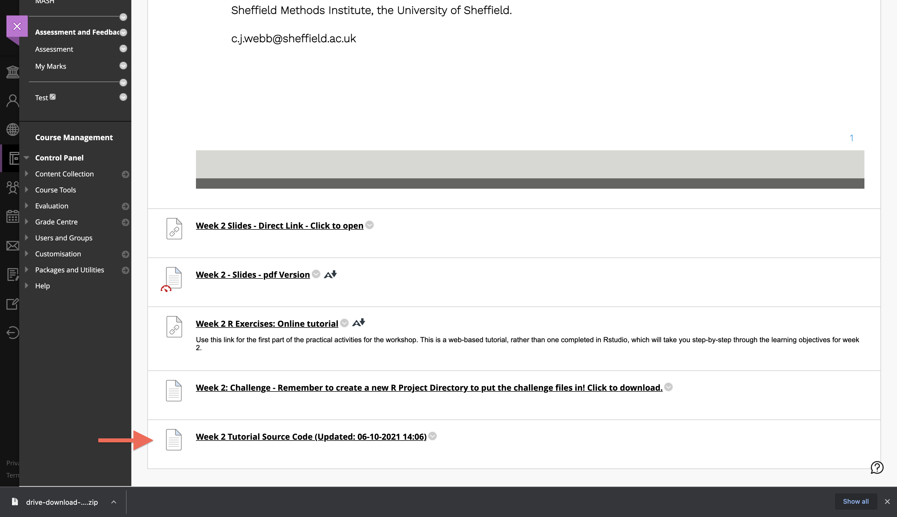
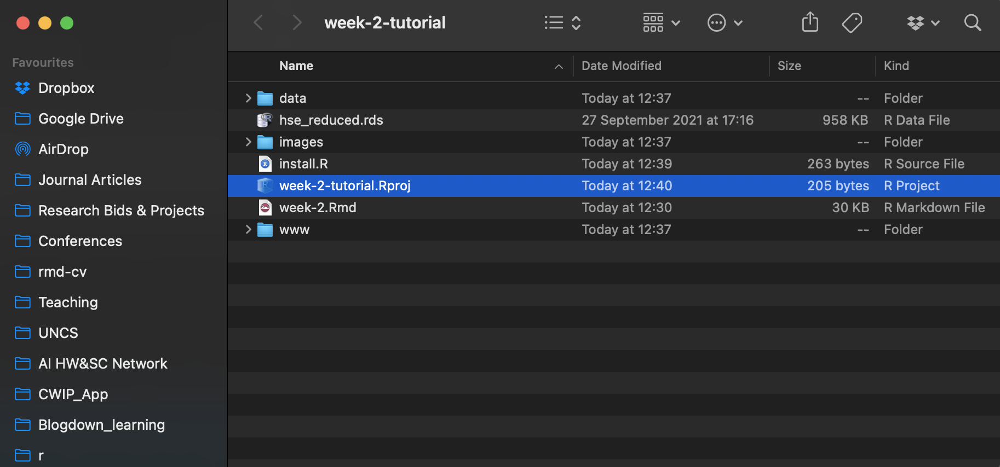
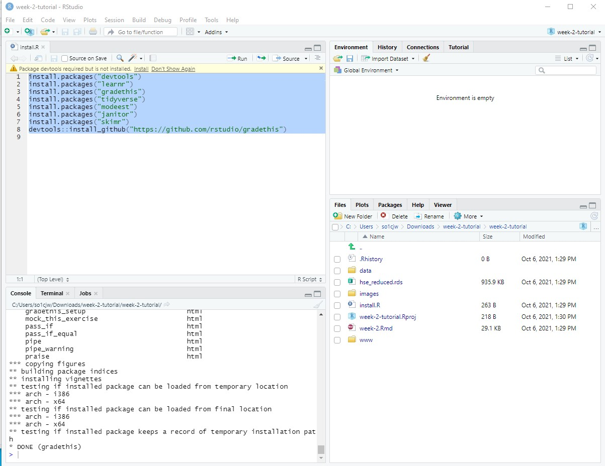
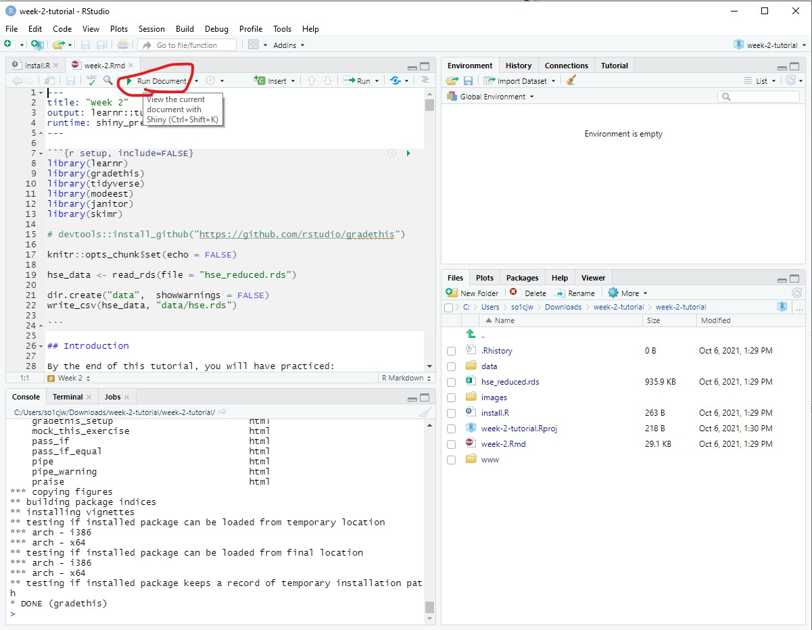

```{r setup, include=FALSE}
library(tidyverse)
library(gt)
# invalidate cache when the tufte version changes
knitr::opts_chunk$set(cache.extra = packageVersion('tufte'))
options(htmltools.dir.version = FALSE)
options(tinytex.verbose = TRUE)
```


## How to install the `Learnr` tutorial locally

Please accept my apologies for the technical problems with the online version of this tutorial. The online version should now be working much better, however, you may wish to install the offline version that runs on your own R and Rstudio installation. You must have R and Rstudio installed to run this version. You can try running the online version again using this link: [https://webb.shinyapps.io/week-no-gradethis/](https://webb.shinyapps.io/week-no-gradethis/)


### Start by downloading and unzipping/extracting the files from the Blackboard learning materials page


``` {r echo = FALSE, layout = "l-page"}



```

### Next, open the .Rproj file. This should open a new Rstudio session that is set to the downloaded tutorial's working directory.


``` {r echo = FALSE, layout = "l-page"}



```

### Next, open the `install.R` file in Rstudio (use the Files window in the bottom right hand side of the Rstudio window).

### Once you've done this, highlight all of the code and run it to install all of the packages needed to run the tutorial.

### If you are asked `Would you like to restart R before installing?`, select Yes.

### If you are asked `Which would you like to update?`, type 1 in the console and press enter. 

### If you are asked whether you wish to compile more recent updates from source, type `Yes` in the console and press enter.

#### If anything else comes up, feel free to email me.

``` {r echo = FALSE, layout = "l-page"}



```

### Now you can open the `week-2.Rmd` file. At the top of the script window, you should see a green arrow that says "Run document". Click this button. This should then prepare and run the tutorial in a new popup window. 

``` {r echo = FALSE, layout = "l-page"}



```