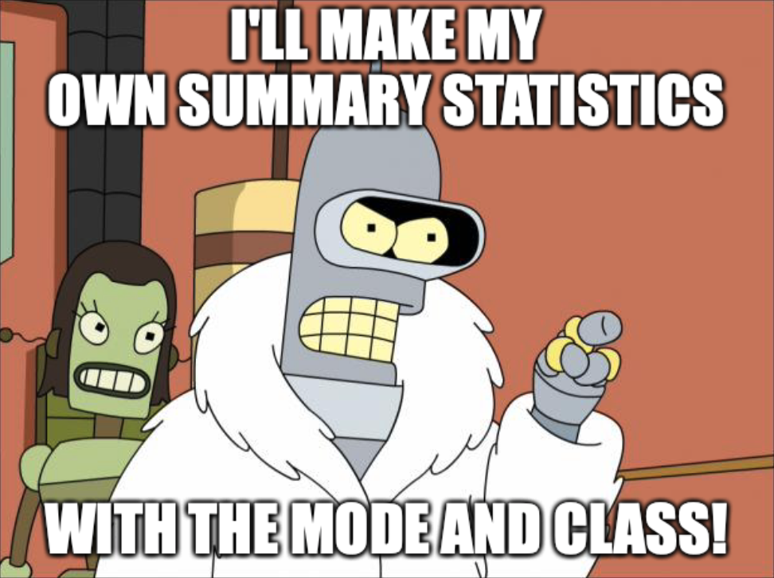

```{r setup, include=FALSE}
library(learnr)
library(gradethis)
library(tidyverse)
library(modeest)
library(janitor)
library(skimr)

# devtools::install_github("https://github.com/rstudio/gradethis")

knitr::opts_chunk$set(echo = FALSE)

hse_data <- read_rds(file = "hse_reduced.rds")

dir.create("data",  showWarnings = FALSE)
write_csv(hse_data, "data/hse.rds")

```

## Introduction

By the end of this tutorial, you will have practiced:

* Using the `mean()`, `median()`, `mfv()`, and `sd()` functions to calculate descriptive statistics (measures of central tendency and dispersion) in `R`
* Using the convenience functions `summary()`, `tabyl()`, and `skim()` to generate multiple descriptive statistics at once
* Programming a custom `summarise()` function with your chosen descriptive statistics
* Plotting histograms and bar charts for visualising continuous and nominal/ordinal variables in both base `R` and in `ggplot2`

You will also be revisiting and reinforcing some of the learning from week one on loading packages, reading in data, and using functions. 


## Load Relevant Packages

### Exercise

Start by writing the code to load the `tidyverse` and `modeest` packages from the library. Remember that the `tidyverse` contains a lot of additional functions that we can use and the `modeest` package can be used for calculating the mode for a given variable.

Remember to load a package to take it down from the `library()`.

```{r load-libs, exercise=TRUE, exercise.blanks = TRUE}

___(___)
___(___)

```

```{r load-libs-solution}

library(tidyverse)
library(modeest)

```

```{r load-libs-code-check}
grade_code()
```


## Load data for these exercises

For this week's exercises we will be using a subset of data from the Health Survey for England (2011) teaching dataset, which is provided as part of Quantitative Social Science Data with `R`.

This data is stored within a folder called 'data' in the working directory. It is called `hse.rds`. 

### Exercise

Write a line of `R` code that allows you to *read* in the data and assign it to the `hse_data` object. Remember that this file type is `.rds` and we use the `read_*()` functions to read in data.

Don't be afraid to check the solution if you get stuck! If you don't understand why the solution works compared to what you wrote, be sure to ask one of us and we'll explain.

```{r read-data, exercise=TRUE, exercise.blanks = TRUE}

hse_data <- ___(___)

```

```{r read-data-solution}

hse_data <- read_rds("data/hse.rds")

```

```{r read-data-code-check}
grade_code()
```


## Summary Statistics: Measures of Central Tendency

## Using the `mean()` function

The first measure of central tendency we will explore using in `R` is the mean. The mean can be calculated through the inbuilt base function `mean()`.

Try running the mean function below to get the mean equivalised income (income adjusted for household size) for households in the Health Survey for England.

```{r mean-example, exercise=TRUE}

mean(hse_data$eqvinc)

```

What do we get? Is this what we would expect? Why/why not?

## `na.rm` and explicit removal of missing data.

In many functions in `R` you are required to explicitly state that you wish to remove missing data when calculating a statistic like a mean. While this might seem counter intuitive as there is always likely some missing data in your dataset, it can actually encourage good practice and help you be aware of the errors that might come from not recognising how much of your data is missing. 

We explicitly state that we wish to remove missing values from our data before calculating the mean by adding the argument: `na.rm = TRUE` — which can be read as missing (na) remove (rm) true.

### Exercise

Add the `na.rm = TRUE` argument to the `mean()` function to calculate the mean. 

```{r mean-exercise-narm, exercise=TRUE, exercise.blanks = TRUE}

mean(hse_data$eqvinc, ___ = ___)

```

```{r mean-exercise-narm-solution}

mean(hse_data$eqvinc, na.rm = TRUE)

```

```{r mean-exercise-narm-code-check}

grade_code()

```


## Using the `median()` function

The `median()` function operates in an almost identical fashion to the `mean()` function, and also requires `na.rm = TRUE` to be manually specified to calculate medians for vectors with missing data. 

### Example

```{r median-example, exercise=TRUE}

median(hse_data$eqvinc, na.rm = TRUE)

```

### Exercise

Use the `median()` function to get the median for the variable `porfv` — 'portions of fruit and vegetables eaten the day prior to the survey': 

```{r median-exercise, exercise=TRUE, exercise.blanks = TRUE}

___(hse_data$___, ___ = ___)

```

```{r median-exercise-solution}

median(hse_data$porfv, na.rm = TRUE)

```

```{r median-exercise-code-check}

grade_code()

```


How many portions of fruit and vegetables does the average person eat? Enter your answer to two decimal places below.

```{r median-exercise-2, exercise=TRUE, exercise.blanks = TRUE}


```

```{r median-exercise-2-solution}

3.33

```

```{r median-exercise-2-code-check}

grade_code()

```


## Using the `mvf()` function (from `modeest`)

There is no base function for calculating the mode (or most frequent value) in `R`, but the package `modeest` contaings a function for doing so called `mvf()`.

### Example

```{r mode-example, exercise=TRUE}

mfv(hse_data$eqvinc, na.rm = TRUE)

```


## Using the `sd()` function for standard deviation

The last of the manual functions for univariate descriptive statistics we'll cover is `sd()`, for calculating standard deviation. The `sd()` function follows the same structure as the `mean()`, `median()`, and `mfv()` functions — using this information, get the standard deviation for the equivalised income variable by calling the `sd()` function below.

### Exercise

No clues or blanks here! Use the `sd()` command to get the standard deviation of the equivalised income variable `eqvinc` — remember, you can bring up the documentation for the `sd()` function by typing `?sd` into your `R` console.

```{r sd-exercise, exercise=TRUE, exercise.blanks = TRUE}


```

```{r sd-exercise-solution}

sd(hse_data$eqvinc, na.rm = TRUE)

```

```{r sd-exercise-code-check}

grade_code()

```


## `summary()` for quick descriptive statistics

Okay! Now that we have gone through the difficult part of how to calculate these statistics using their underlying functions I can introduce you to some convenience functions for quickly getting summary statistics.

The first is `R`'s inbuilt `summary()` function. `summary()` is a context-sensitive function that operates differently depending on what kind of variable or object is passed to it. For example, if you give it a numeric variable it will print is minimum value, its 1st Quartile (25th percentile) value, its median, its mean, its 3rd quartile (75th percentile), and its maximum value.

### Exercise

Use the `summary()` function to get descriptive statistics for the age of the `hse_data` sample using the `hse_data$age` variable.

```{r summary-1-exercise, exercise=TRUE, exercise.blanks = TRUE}

___(___$___)

```

```{r summary-1-exercise-solution}

summary(hse_data$age)

```

```{r summary-1-exercise-code-check}

grade_code()

```

What is the mean age of the sample to two decimal places (e.g. 10.09)? Type the numeric value below and click submit.


```{r summary-1-2-exercise, exercise=TRUE, exercise.blanks = TRUE}


```

```{r summary-1-2-exercise-solution}

50.07

```

```{r summary-1-2-exercise-code-check}

grade_code()

```


### `summary()` for nominal/ordinal variables

When `summary()` detects that it has been passed a nominal or oridinal variable (based on whether it's received a factor or string variable rather than numeric), it will provide a frequency count of all of the values in the dataset. 

### Exercise

Try this out by running `summary()` on the `cigs` variable within the `hse_data` dataset.

```{r summary-2-exercise, exercise=TRUE, exercise.blanks = TRUE}

___(___$___)

```

```{r summary-2-exercise-solution}

summary(hse_data$cigs)

```

```{r summary-2-exercise-code-check}

grade_code()

```

How many people in the `hse_data` sample smoke 20 or more cigarettes a day? Type the numeric value below.

```{r summary-2-2-exercise, exercise=TRUE, exercise.blanks = TRUE}


```

```{r summary-2-2-exercise-solution}

369

```

```{r summary-2-2-exercise-code-check}

grade_code()

```


## `summary()` for entire dataset descriptives

Lastly, you can also use `summary()` to print descriptive statistics for every variable in a dataset by not including a specific variable/vector when you call it (no `$variable_name` after the dataset's name).

Try this below by using `summary()` to output descriptive statistics for the entire `hse_data` dataset.

```{r summary-3-exercise, exercise=TRUE, exercise.blanks = TRUE}


```

```{r summary-3-exercise-solution}

summary(hse_data)

```

```{r summary-3-exercise-code-check}

grade_code()

```


## `select()`ing a subset of variables to `summary()`

As we can see, this is quite a lot of information printed and some datasets have hundreds or even thousands of variables. This would make using `summary()` alone quite unpractical. 

We can use the `select()` function from the `dplyr` package (included in the `tidyverse`) to select only certain variables. 

First, we might need to remind ourselves what variables are in the dataset itself and what they are called. We can do this by running the `names()` function. 

```{r names-exercise, exercise=TRUE, exercise.blanks = TRUE}

names(hse_data)

```

Let's say we only wanted descriptive statistics for the `topqual3` and `econact` variables. We could achieve this by first running a `select()` function that retains only these variables before passing the result through to the `summary()` function. 

Remember that piping the result through to an additional function is achieved using the `%>%` (pipe) operator (part of `tidyverse`), and that the result in a pipe is stored in a `.`. 

### Example

We can use select and pipes to get summary statistics using `summary()` statistics for only a few variables using the following code:

```{r select-sum-exercise, exercise=TRUE, exercise.blanks = TRUE}

hse_data %>% # Pipe the data through to the next argument
  select(topqual3, econact) %>% # Note variables are without quotation marks
  summary(.) # Run summary with the result (explicitly stated with the full stop)

```


### Exercise

Using the above code as a template, write some valid `R` code that selects only the variables `eqvinc` (equivalised income), `porfv` (portions of fruit and vegetables eaten in the previous dat), and `marital` (marital status) — in that order — from the `hse_data` dataset and summarises them using descriptive statistics produced using the `summary()` function, using pipes as above.

```{r select-sum-2-exercise, exercise=TRUE, exercise.blanks = TRUE}


```

```{r select-sum-2-exercise-solution}

hse_data %>%
  select(eqvinc, porfv, marital) %>%
  summary(.)

```

```{r select-sum-2-exercise-code-check}

grade_code()

```


## Using `janitor`'s `tabyl()` for better categorical/ordinal variable summaries

You may have noticed that when you use `summary()` for descriptive statistics for categorical and ordinal variables you only receive the frequency counts and not the percentage of each response. This can be quite unhelpful for getting a sense of the distribution across responses in your data.

One package that adds a range of convenience functions to `R` is the `janitor` package.

### Exercise

Write the code required to load the `janitor` package from the library in `R`. Remember, if you are using your own `R` installation you will need to install `janitor` first using `install.packages("janitor")`.

```{r janitor-load-exercise, exercise=TRUE, exercise.blanks = TRUE}


```

```{r janitor-load-exercise-solution}

library(janitor)

```

```{r janitor-load-exercise-code-check}

grade_code()

```


### Example

Use the `tabyl()` function in `janitor` to create a more detailed set of summary statistics including percentages for the `health` variable in the `hse_data` dataset.

```{r janitor-tabyl-example, exercise=TRUE, exercise.blanks = TRUE}

hse_data %>%
  tabyl(health)

```

The `tabyl()` function produces four columns: the first column shows all of the unique values for the variable in the tabyl; the second column (`n`) shows the frequency counts for each response; the third — somewhat incorrectly named — column (`percent`) shows the proportion of responses that fall into each value, *including* missing (`NA`) values; the final column (`valid_percent`) shows the proportion of responses across all non-missing values.

A proportion can be converted into a percentage by multiplying it by 100 — e.g. the proportion of people saying that have bad or very bad health is 0.0729 but the percentage of people saying they have bad or very bad health is 7.29%.

### Exercise 

Use the `tabyl()` function to create univariate descriptive statistics for the `cigs` variable in the `hse_data` dataset. Use a pipe, as above, to pass the data to the `tabyl()` function.

```{r janitor-tabyl-exercise, exercise=TRUE, exercise.blanks = TRUE}


```

```{r janitor-tabyl-exercise-solution}

hse_data %>%
  tabyl(cigs)

```

```{r janitor-tabyl-exercise-code-check}

grade_code()

```


## Using `skimr`'s `skim()` for better and multiple continuous variable summaries

Another useful package for summary statistics is `skimr` — it contains a function called `skim()` which returns summary statistics for all variables as well as text-based histograms showing the distribution of responses. This can save some time over producing individual plots for every variable.

### Exercise: load the package `skimr`

```{r load-skimr-exercise, exercise=TRUE, exercise.blanks = TRUE}


```

```{r load-skimr-exercise-solution}

library(skimr)

```

```{r load-skimr-exercise-code-check}

grade_code()

```

### Example

Now that `skimr` is loaded we can use the `skim()` function to get descriptive statistics for variables. We will continue using pipes (`%>%`) here for consistency.

```{r skimr-example, exercise=TRUE, exercise.blanks = TRUE}

hse_data %>%
  skim(eqvinc, porfv)

```

`skim()` gives us some additional statistics (and nice little ASCII histogram) that `summary()` does not provide. It also makes it easier to read descriptive statistics across a large number of variables at once. `skim()` provides us with:

* `skim_variable` - the name of the variable being skimmed
* `n_missing` - the number of observations with missing data for this variable
* `complete_rate` - the proportion observations in the data *with* valid values for this variable
* `mean` - the arithmetic mean for the variable
* `sd` - the standard deviation for the variable
* `p0` - the "zeroth-percentile", in other words, the minimum value in the variable
* `p25` - the 25th percentile value
* `p50` - the 50th percentile value, which is equal to the median
* `p75` - the 75th percentile value
* `p100` - the "100th-percentile" value, in other others, the maximum value in the variable
* `hist` - an ASCII histogram showing the dispersion of the variable values (for indicating any skewness)


### Exercise

Try running the `skim()` function on the variables `age`, `wtval` (weight in kg), and `eth_origin` (ethnic origin).

```{r skimr-exercise, exercise=TRUE, exercise.blanks = TRUE}

hse_data %>%
  ___(___, ___, ___)

```


```{r skimr-exercise-solution}

hse_data %>%
  skim(age, wtval, eth_origin)

```

```{r skimr-exercise-code-check}

grade_code()

```

Notice how `skim()` can sometimes be less useful than `summary()` or `tabyl()` for categorical/ordinal variables, especially those with large numbers of categories.


## Creating your own custom summaries using dplyr's `summarise()`

So, finally, what if none of `summary()`, `skim()`, or `tabyl()` do what you want them to do? We can create our own summary statistics using `dplyr`'s `summarise()` function (or `summarize()` if you prefer international English).

<center>
{width="50%"}
</center>

`summarise()` requires manual specification of everything you wish it to calculate. It works similar to other functions in `dplyr`, including `mutate()`, but `mutate()` does not change the shape of the dataset, it only adds new columns. We will use `mutate()` in the future.

### Example

The following code summarises the variable `eqvinc` with its mean, mode, median, and standard deviation using the `summarise()` function.

```{r summarise-example, exercise=TRUE, exercise.blanks = TRUE}

hse_data %>%
  summarise(
    mean_eqvinc = mean(eqvinc, na.rm = TRUE),
    mode_eqvinc = mfv(eqvinc, na.rm = TRUE),
    median_eqvinc = median(eqvinc, na.rm = TRUE),
    sd_eqvinc = sd(eqvinc, na.rm = TRUE)
  )

```

Note that this uses the base functions for calculating summary statistics within the `summarise()` function. Note also that, within the `summarise()` function, each summary statistic or other calculation/function requested is named on the left hand side using a single equals sign (=). 

By this I mean, the calculation for the mean is assigned *within* the `summarise()` argument to the name `mean_eqvinc` — any name could have been chosen.

### Exercise

Try adding a new column to the `summarise()` function that adds the `class()` of the variable `eqvinc.` Name this new summary variable `class_eqvinc`.

```{r summarise-exercise, exercise=TRUE, exercise.blanks = TRUE}

hse_data %>%
  summarise(
    mean_eqvinc = mean(eqvinc, na.rm = TRUE),
    mode_eqvinc = mfv(eqvinc, na.rm = TRUE),
    median_eqvinc = median(eqvinc, na.rm = TRUE),
    sd_eqvinc = sd(eqvinc, na.rm = TRUE),
    ___ = ___(___)
  )

```

```{r summarise-exercise-solution}

hse_data %>%
  summarise(
    mean_eqvinc = mean(eqvinc, na.rm = TRUE),
    mode_eqvinc = mfv(eqvinc, na.rm = TRUE),
    median_eqvinc = median(eqvinc, na.rm = TRUE),
    sd_eqvinc = sd(eqvinc, na.rm = TRUE),
    class_eqvinc = class(eqvinc)
  )

```

```{r summarise-exercise-code-check}

grade_code()

```


## A note on packages

Okay, that's enough different packages for summary statistics. Now is a good time to pause and address all of the different ways of doing things in `R` and the many, many different packages and functions that can be used to reach the same results. This can feel overwhelming.

The key thing to remember is that there is no wrong way to reach some end goal in `R`, just lots of different ways of going about it. You don't need to know all of the different ways — just the ones that work best for you. The goal here is to introduce you to a small range of different ways to reach the same important statistical analyses in social science projects, not to have you retain every different way. You **will** forget how to do things, particularly if you've not done them in a while. This is natural and everyone who uses `R` — from professionals who created the thing to people just starting out — need to Google how to do things from time to time, especially simple things! Do not be afraid to consult Google.

However, having some exposure to different ways of doing things in `R` can lead to some unintended benefits later down the line. For example, functions like `summarise()` can be a lot more useful than functions like `summary()`, `tabyl()`, or `skim()` when you are trying to aggregate a dataset up to a higher level (for example, if you have a dataset of millions of pupils and want to create a dataset for school results). However, if you had no awareness of tools like `summarise()` it might take you a long time to find out where to start to achieve this end goal. 

So, basically — use as many packages and as many different functions as you wish. You should feel free to seek out new packages and functions that work better for you, don't be restricted to the packages we use in the class (we will, as your module leaders, generally, be able to figure out how things that are new to us work and how to troubleshoot 99% of issues you run into with them). Very often you will be introduced to new packages and functions when trying to troubleshoot error messages or search for how to achieve something in `R` using Google. There is nothing wrong with using packages and functions outside of the scope of the module, as long as they reach the same end goal — you will not be penalised in any way for doing this in your assessments. 

Okay, now let's wrap up with some exercises for plotting univariate data.


## Plots for describing data: Base `R` Histogram

You can quickly produce a *histogram* with `R` by using the built in `hist()` function.

### Example

```{r base-r-hist-example, exercise=TRUE, exercise.blanks = TRUE}

hist(hse_data$age)

```


### Exercise

Use the `hist()` function to plot a histogram of the `eqvinc` variable.

```{r base-r-hist-exercise, exercise=TRUE, exercise.blanks = TRUE}


```

```{r base-r-hist-exercise-solution}

hist(hse_data$eqvinc)

```

```{r base-r-hist-exercise-code-check}

grade_code()

```


## Plots for describing data: `ggplot2` Histogram

While `hist()` can be very helpful for quickly checking the distribution of a variable, base `R` plotting functions can be difficult to customise and make visually appealing. 

A commonly used alternative to base `R` plotting functions is the `ggplot2` package, which is included in the `tidyverse`. `ggplot2` uses an entire 'grammar of graphics' to make it possible to create an practically infinite range of data-driven visualisations. The topic of plotting using `ggplot2` is too large to cover in detail in this module, but a full book published by its creator is [available for free online](https://ggplot2-book.org).

### Example

Rather than making assumptions about what kind of data visualisation is appropriate, `ggplot2` requires you to specify which `geom_` you wish to use. This is because it allows you to layer multiple geoms on top of one another. The `geom_` function for a histogram is `geom_histogram()`, so we would start our data visualisation code with the following:

```{r gg-hist-1-exercise, exercise=TRUE, exercise.blanks = TRUE}

ggplot(data = hse_data) + # Initialise ggplot2
  geom_histogram()

```

There is no point running this code yet as we have not entered any arguments for data, but there is already quite a lot going on. Note that we initialise `ggplot2` first using the `ggplot()` function. Any arguments in the `ggplot()` function are included throughout all following arguments as 'collective geoms'. For example, in `ggplot()` I have included the argument `data = hse_data`, which will mean that we will use this dataset in all of the geoms that follow.

The second thing to note is that instead of using the pipe we have used before (`%>%`), we chain together layers of the `ggplot` function using a plus sign (`+`).

Now let's add our arguments for `geom_histogram()`. 

```{r gg-hist-2-exercise, exercise=TRUE, exercise.blanks = TRUE}

ggplot(data = hse_data) + # Initialise ggplot2
  geom_histogram(aes(x = eqvinc))

```

Notice that the variable we are visualising is wrapped within an `aes()` function. These functions are used to delineate between fixed (things that are constant and do not differ) and variable (things that differ) parts of the appearence of the plot. Because we are interested in visualising something that varies — a variable — we need to include this within the `aes()` function.

The best way to understand this is probably if we add something to the 'fixed' part of the `geom_histogram()` function for contrast — let's change the colour that each bar of the histogram is filled in with. 

```{r gg-hist-3-exercise, exercise=TRUE, exercise.blanks = TRUE}

ggplot(data = hse_data) + # Initialise ggplot2
  geom_histogram(aes(x = eqvinc), fill = "blue")

```

Because the `fill` argument is outside of the `aes()` function's brackets it means we are telling ggplot we want everything to follow the same aesthetic rule here — not for it to be variable based on something that changes in our data. In this case, we're telling it to make all of the bins in the histogram blue.

Alternatively, we could include the `fill` argument _within_ the `aes` function to make it variable based on some other variable *in* the dataset. For example, if we wanted to fill the histogram bars based on the `sex` of the respondents in each bin (bar). 

```{r gg-hist-4-exercise, exercise=TRUE, exercise.blanks = TRUE}

ggplot(data = hse_data) + # Initialise ggplot2
  geom_histogram(aes(x = eqvinc, fill = sex))

```

Notice how fill is not within the `aes()` function, not outside of it. Incorrect placement of 'static/fixed' and 'dynamic/variable' aesthetic mappings is a frequent source of errors in ggplot. 

By adding this additional variable we can incorporate more information into our plot — in this case, we see how much of each bar is made up by women and how much is made up by men (though - keep in mind - this dataset may not necessarily be the best for exploring this question, especially if household income is used).

There are a wide range of aesthetic arguments that we can map to fixed or variable data. Some commonly used ones include:

* `size` = the size of points or lines
* `fill` = the filled in colour of a shape
* `colour` = usually, the border colour of a shape, or the fill when `fill` is not specified
* `alpha` = the transparency of the shapes in the geom, 1 = no transparency, 0 = complete transparency (not visible)
* `pch` = the shape of points (e.g. circles, triangles, boxes)

Lastly, we can change other parts of the plot, like through adding a title with the `ggtitle()` function. 

```{r gg-hist-5-exercise, exercise=TRUE, exercise.blanks = TRUE}

ggplot(data = hse_data) + # Initialise ggplot2
  geom_histogram(aes(x = eqvinc)) +
  ggtitle("Plot of equivalised income")

```

This may seem like a *lot* to learn at once — which is why I recommend you spend some time with either the ggplot2 book (https://ggplot2-book.org) or with the R for Data Science book (https://r4ds.had.co.nz) — but can be a huge time saver when it comes to creating interesting plots in the future (compared to the frustrations of trying to customise things in the base plotting functions). 

The best way to learn `ggplot2` is through practice - experimenting with many different kinds of visualisation using different forms of data — for example by taking part in [TidyTuesday](https://github.com/rfordatascience/tidytuesday). However, once you have mastered it you can create unique and interesting visualisations very quickly.

Try creating a histogram of the `age` or `porfv` variables before moving onto the next section.

```{r gg-hist-6-exercise, exercise=TRUE, exercise.blanks = TRUE}


```


## Plots for describing data: Base `R` Bar Chart

By default, base `R`'s `plot()` function uses the context of the class of the variable you give it to create a suitable data visualisation (interestingly, the default for numeric variables is a scatterplot, not a histogram, hence why we had to call `hist()` before).

### Example

Using `plot()` to create a bar chart for the self-reported `health` of participants. 

```{r base-bar-exercise, exercise=TRUE, exercise.blanks = TRUE}

plot(hse_data$health)

```

### Exercise

Use the `plot()` function to create a bar chart plot for the `marital` status of respondents.

```{r base-bar-2-exercise, exercise=TRUE, exercise.blanks = TRUE}


```

```{r base-bar-2-exercise-solution}

plot(hse_data$marital)

```

```{r base-bar-2-exercise-code-check}

grade_code()

```


## Plots for describing data: `ggplot2` Bar Chart

Finally, we can learn a second geom from the `ggplot2` package for plotting the same bar charts. Intuitively, the geom for plotting bar charts in `ggplot2` is called `geom_bar`. 

### Example

```{r gg-bar-1-exercise, exercise=TRUE, exercise.blanks = TRUE}

ggplot(data = hse_data) +
  geom_bar(aes(x = health))

```

### Exercise

Try creating a bar chart for the variable `cigs` and making the `fill` colour for the bars "green". 

```{r gg-bar-2-exercise, exercise=TRUE, exercise.blanks = TRUE}

ggplot(data = hse_data) +
  geom_bar(____________)

```

```{r gg-bar-2-exercise-solution}

ggplot(data = hse_data) +
  geom_bar(aes(x = cigs), fill = "green")

```

```{r gg-bar-2-exercise-code-check}

grade_code()

```

## End

Well done for making it through this tutorial! Hopefully you are starting to feel a little more familiar with `R`s syntax and have had some experience dealing with error messages.

Being able to describe and visualise variables in our data is an essential skill in quantitative research methods. It is important for identifying outliers or unexpected responses; for checking what the distribution looks like; and for comparing our sample to what we know about the wider population and samples from other studies. 

It is common for the first table in a quantitative social research paper to be a table of univariate descriptive statistics for all variables used in an analysis. What we find in our descriptive and summary statistics can help us avoid breaking the assumptions of various tests or models we may wish to run (for example, we would know not to trust the 68, 95, 99.7 rule for standard deviation if we knew our variable was very heavily skewed). Therefore it is an essential part of being an effective and responsible quantitative social science researcher.

We have covered a lot today, as we also did last week! Try to keep it up — it may feel like a trial by fire but you will be surprised at how far you have come in `R` by December.


