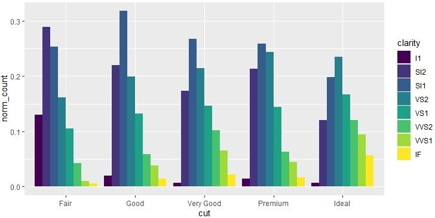
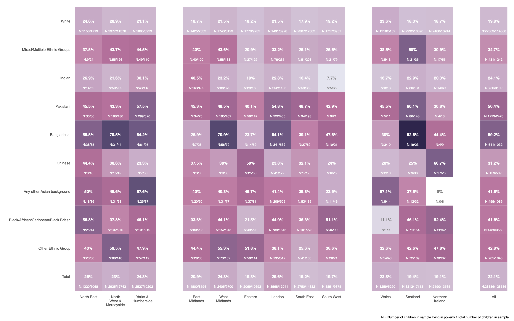
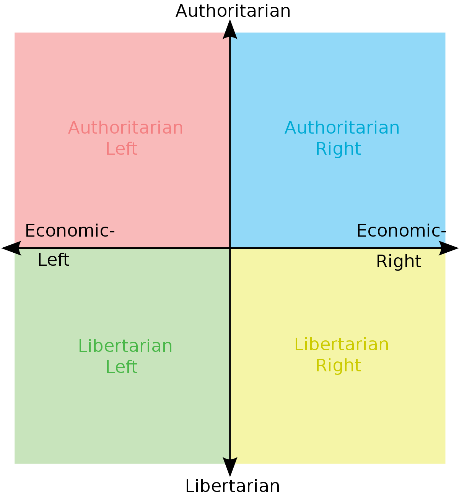

class: middle
background-size: contain

<!----- Make a pdf using:

decktape generic --key=ArrowRight --load-pause 1800 --slides '1-77' --size '1216x684'  "week-03-relationships-between-variables/slides/week-03-relationships-between-variables.html" week-03-relationships-between-variables/slides/week-03-relationships-between-variables.pdf

----->

<br><br><br>

# .tuos_purple[EDC459: Week 3<br>Relationships between variables]

<br><br>

**Dr. Calum Webb**<br>
Sheffield Methods Institute, the University of Sheffield.<br>
[c.j.webb@sheffield.ac.uk](mailto:c.j.webb@sheffield.ac.uk)

```{r setup, include=FALSE}
options(htmltools.dir.version = FALSE)

# These packages are required for creating the slides
# Many will need to be installed from Github
library(icons)
library(tidyverse)
library(xaringan)
library(xaringanExtra)
library(xaringanthemer)

# Defaults for code
knitr::opts_chunk$set(
  fig.width=9, fig.height=3.5, fig.retina=3,
  out.width = "100%",
  cache = FALSE,
  echo = TRUE,
  message = FALSE, 
  warning = FALSE,
  fig.show = TRUE,
  hiline = TRUE
)

# set global theme for ggplot to make background #F8F8F8F8 (off white),
# but otherwise keep all ggplot themes default (better for teaching)
theme_set(
  theme(plot.background = element_rect(fill = "#F8F8F8", colour = "#F8F8F8"), 
        panel.background = element_rect(fill = "#F8F8F8", colour = "#F8F8F8"), 
        legend.background = element_rect(fill = "#F8F8F8", colour = "#F8F8F8")
        )
  )


```

```{r xaringan-tile-view, echo=FALSE}
# Use tile overview by hitting the o key when presenting
xaringanExtra::use_tile_view()
```

```{r xaringan-logo, echo=FALSE}
# Add logo to top right
xaringanExtra::use_logo(
  image_url = "header/smi-logo-white.png",
  exclude_class = c("inverse", "hide_logo"), 
  width = "180px", position = css_position(top = "1em", right = "2em")
)
```

```{r xaringan-themer, include=FALSE, warning=FALSE}

# Set some global objects containing the colours
# of the university's branding
primary_color <- "#131E29"
secondary_color <- "#440099"
tuos_blue <- "#9ADBE8"
white = "#F8F8F8"
tuos_yellow <- "#FCF281"
tuos_purple <- "#440099"
tuos_red <- "#E7004C"
tuos_midnight <- "#131E29"

# The bulk of the styling is handled by xaringanthemer
style_duo_accent(
  primary_color = "#131E29",
  secondary_color = "#440099",
  colors = c(tuos_purple = "#440099", 
             grey = "#131E2960", 
             tuos_blue ="#9ADBE8",
             tuos_mint = "#00CE7C"),
  header_font_google = xaringanthemer::google_font("Source Serif Pro", "600", "600i"),
  text_font_google   = xaringanthemer::google_font("Source Sans Pro", "300", "300i", "600", "600i"),
  code_font_google   = xaringanthemer::google_font("Lucida Console"),
  header_h1_font_size = "2rem",
  header_h2_font_size = "1.5rem", 
  header_h3_font_size = "1.25rem", 
  text_font_size = "0.9rem",
  code_font_size = "0.65rem", 
  code_inline_background_color = "#F8F8F8", 
  inverse_text_color = "#9ADBE8", 
  background_color = "#F8F8F8", 
  text_color = "#131E29", 
  link_color = "#005A8F", 
  inverse_link_color = "#F8F8F8",
  text_slide_number_color = "#44009970",
  table_row_even_background_color = "transparent", 
  table_border_color = "#44009970",
  text_bold_font_weight = 600
)

```


```{r xaringan-panelset, echo=FALSE}
# Allow for adding panelsets (see example on slide 2)
xaringanExtra::use_panelset(in_xaringan = TRUE)

style_panelset_tabs(
  background = "#F8F8F8",
  active_background = "#F8F8F8",
  hover_background = "#F8F8F8"
)


```

```{r xaringanExtra, echo = FALSE}
# Adds white progress bar to top
xaringanExtra::use_progress_bar(color = "#F8F8F8", location = "top")
```

```{r xaringan-extra-styles, echo = FALSE}
# Allow for code to be highlighted on hover
xaringanExtra::use_extra_styles(
  hover_code_line = TRUE,         #<<
  mute_unhighlighted_code = TRUE  #<<
)
```

```{r share-again, echo=FALSE}
# Add sharing links and other embedding tools
xaringanExtra::use_share_again()
```

```{r xaringanExtra-search, echo=FALSE}
# Add magnifying glass search function to bottom left for quick
# searching of slides
xaringanExtra::use_search(show_icon = TRUE, auto_search = FALSE)
```


---
class: middle

.pull-right[

<br><br><br><br><br><br>

# Sign In

]
---
class: middle

## Learning Objectives

.panelset[

.panel[.panel-name[What will I learn?]

By the end of this week you will:

* Learn how to __use variable types to select appropriate bivariate data visualisations and descriptive statistics__.

* Be able to create and interpret __bivariate bar charts, heatmaps, boxplots, ridgeplots, scatterplots, and hexbin plots__ using `R`.

* Be able to calculate and interpret several __bivariate descriptive statistics including__ __contingency tables, Cramer's V, Mean/Median differences, Spearman's $\rho$, and Pearson's R__ in `R`.


]

.panel[.panel-name[How does this week fit into my course?]

* Bivariate statistics an be important parts of research studies themselves, especially research studies with *a priori* controls (e.g. randomised controlled trials).

* Bivariate statistics and data visualisations are important for checking assumptions and for communicating findings in research. 

* Bivariate statistics can also be used to develop the rationale behind case studies in mixed methods research.


]


]


???

* Grid of variable types and relevant visualisations and descriptive statistics (no tests yet)


---

class: middle

## Visualisations for Exploring Relationships (Dependence) Between Variables

```{r, echo = FALSE}

library(formattable)

visuals <- tibble(
  `Variable Type` = c("Nominal", "Ordinal", "Continuous"),
  Nominal = c("Heatmap/<br>Bivariate Bar Chart", "Heatmap/<br>Bivariate Bar Chart", "Boxplot/<br>Ridgeplot"),
  Ordinal = c("", "Heatmap/<br>Bivariate Bar Chart", "Boxplot/<br>Ridgeplot"),
  Continuous = c("", "", "Scatterplot/<br>Hex Bin Plot")
)

visuals_tab <- formattable::formattable(visuals,
                         list(
                           `Variable Type` = formatter("span", style = formattable::style(font.weight = "bold"))
                         ))

as.htmlwidget(visuals_tab, width = "100%")

```


---

class: middle

## Descriptive Statistics for Describing Relationships (Dependence) Between Variables

```{r, echo = FALSE}

library(formattable)

descripts <- tibble(
  `Variable Type` = c("Nominal", "Ordinal", "Continuous"),
  Nominal = c("Contingency Table +<br>Cramer's V", "Contingency Table +<br>Cramer's V", "Mean/<br>Median Difference"),
  Ordinal = c("", "Spearman's Rho/<br>Contingency Table", "Mean/<br>Median Difference"),
  Continuous = c("", "", "Pearson's R or<br>Spearman's Rho")
)

descripts_tab <- formattable::formattable(descripts,
                         list(
                           `Variable Type` = formatter("span", style = formattable::style(font.weight = "bold"))
                         ))


as.htmlwidget(descripts_tab, width = "100%")


```


---

class: middle

## Visualisations for Exploring Relationships (Dependence) Between Variables

```{r, echo = FALSE}

library(formattable)

visuals <- tibble(
  `Variable Type` = c("Nominal", "Ordinal", "Continuous"),
  Nominal = c("<strong>Heatmap/<br>Bivariate Bar Chart</strong>", "<strong>Heatmap/<br>Bivariate Bar Chart</strong>", "Boxplot/<br>Ridgeplot"),
  Ordinal = c("", "<strong>Heatmap/<br>Bivariate Bar Chart</strong>", "Boxplot/<br>Ridgeplot"),
  Continuous = c("", "", "Scatterplot/<br>Hex Bin Plot")
)

visuals_tab <- formattable::formattable(visuals,
                         list(
                           `Variable Type` = formatter("span", style = formattable::style(font.weight = "bold"))
                         ))

as.htmlwidget(visuals_tab, width = "100%")

```

---

class: middle
background-color: white

.center[
```{r, echo=FALSE, out.width="90%"}



```
]

---

class: middle
background-color: white

.center[
<br>

```{r, echo=FALSE, out.width="85%"}



```
]

---

class: middle, inverse

# Is there a relationship between peoples' attitudes towards the adequacy of benefits (welfare) payments and their attitudes towards immigration in Scotland?


---

## Grouped bar chart

<br>

.pull-left[

```{r, include=FALSE}

library(haven)
library(labelled)

# Opinions differ about the level of benefits for unemployed people. Which of these two statements comes closest to your own view ...READ OUT...
# 1 ...benefits for unemployed people are too low and cause hardship,
# 2 or, benefits for unemployed people are too high and discourage them from finding
# jobs?
# 3 (Neither)

# Do you think the number of immigrants to Britain nowadays should be increased a lot, increased a little, remain the same as it is, reduced a little or reduced a lot?

ssa <- read_dta("data/ssa-2014") %>%
  janitor::clean_names() %>%
  user_na_to_na() %>%
  unlabelled() %>%
  mutate(
    dole_fct = case_when(
      dole_no_na == 1 ~ "Too low",
      dole_no_na == 2 ~ "Too high",
      dole_no_na == 3 ~ "Neither",
      TRUE ~ NA_character_
    ),
    imig_fct = case_when(
      let_in_no_na == 1 ~ "Increased a lot",
      let_in_no_na == 2 ~ "Increased a little",
      let_in_no_na == 3 ~ "Remain the same",
      let_in_no_na == 4 ~ "Reduced a little",
      let_in_no_na == 5 ~ "Reduced a lot",
      TRUE ~ NA_character_
    )
  ) %>%
  mutate(
    dole_fct = factor(dole_fct, levels = c("Too low", "Neither", "Too high")),
    imig_fct = factor(imig_fct, levels = c("Reduced a lot", "Reduced a little", "Remain the same", "Increased a little", "Increased a lot"))
  ) 

```

```{r, eval = FALSE}

ssa %>%
  # Remove missing
  filter(!is.na(imig_fct) & !is.na(dole_fct)
    ) %>% 
  # Plot bar chart
  ggplot() +
  geom_bar(aes(x = imig_fct, fill = dole_fct), 
           position = "dodge") +
  theme(legend.position = "bottom")
 
# imig_fct = views on how immigration should change

# dole_fct = views on whether benefits are too high, too low, or neither

```

]

.pull-right[

```{r, echo = FALSE, dpi = 200, fig.height=5, fig.width=5.5, out.height=500, out.width=550}

ssa %>%
  filter(!is.na(imig_fct) & !is.na(dole_fct)) %>% # Remove missing
  ggplot() +
  geom_bar(aes(x = imig_fct, fill = dole_fct), position = "dodge") +
  theme(legend.position = "bottom")

```


]


---

## Grouped bar chart (Within Group %)

<br>

.pull-left[

```{r, eval = FALSE}

ssa %>%
  # Remove missing
  filter(!is.na(imig_fct) & !is.na(dole_fct)
    ) %>% 
  janitor:: tabyl(imig_fct, dole_fct) %>%
  janitor::adorn_percentages("row") %>%
  pivot_longer(-1) %>%
  mutate(name = factor(name, 
                       levels = c("Too low", "Neither", "Too high"))
         ) %>%
  # Plot bar chart
  ggplot() +
  geom_col(aes(x = imig_fct, y = value, fill = name), 
           position = "dodge") +
  theme(legend.position = "bottom") +
  ylab("Proportion within group") +
  xlab("People who feel that immigration should [be]...") +
  labs(fill = "Benefits are currently...")

```

]

.pull-right[
```{r, echo = FALSE, dpi = 200, fig.height=5, fig.width=5.5, out.height=500, out.width=550}

ssa %>%
  # Remove missing
  filter(!is.na(imig_fct) & !is.na(dole_fct)
    ) %>% 
  janitor:: tabyl(imig_fct, dole_fct) %>%
  janitor::adorn_percentages("row") %>%
  pivot_longer(-1) %>%
  mutate(name = factor(name, 
                       levels = c("Too low", "Neither", "Too high"))
         ) %>%
  # Plot bar chart
  ggplot() +
  geom_col(aes(x = imig_fct, y = value, fill = name), 
           position = "dodge") +
  theme(legend.position = "bottom") +
  ylab("Proportion within group") +
  xlab("People who feel that immigration should [be]...") +
  labs(fill = "Benefits are currently...")

```
]


---

## Grouped bar chart (Within Group %)

<br>

.pull-left[

```{r, eval = FALSE}

ssa %>%
  # Remove missing
  filter(!is.na(imig_fct) & !is.na(dole_fct)
    ) %>% 
  janitor:: tabyl(imig_fct, dole_fct) 

```

Filter out the missing values and then create a __two-way contingency table__ using `janitor`, which shows the __frequency__ of responses in every combination of categories across the two variables.

]

.pull-right[
```{r, echo = FALSE, dpi = 200, fig.height=5, fig.width=5.5, out.height=500, out.width=550}

ssa %>%
  # Remove missing
  filter(!is.na(imig_fct) & !is.na(dole_fct)
    ) %>% 
  janitor:: tabyl(imig_fct, dole_fct) #%>%
  # janitor::adorn_percentages("row") %>%
  # pivot_longer(-imig_fct) %>%
  # mutate(name = factor(name, 
  #                      levels = c("Too low", "Neither", "Too high"))
  #        ) %>%
  # # Plot bar chart
  # ggplot() +
  # geom_col(aes(x = imig_fct, y = value, fill = name), 
  #          position = "dodge") +
  # theme(legend.position = "bottom") +
  # ylab("Proportion within group") +
  # xlab("People who feel that immigration should [be]...") +
  # labs(fill = "Benefits are currently...")

```
]


---


## Grouped bar chart (Within Group %)

<br>

.pull-left[

```{r, eval = FALSE}

ssa %>%
  # Remove missing
  filter(!is.na(imig_fct) & !is.na(dole_fct)
    ) %>% 
  janitor:: tabyl(imig_fct, dole_fct) %>%
  janitor::adorn_percentages("row")

```

Now, we use the `adorn_percentages()` function from the `janitor` package to convert these responses into __proportions within each row__. 

For example, the first row would read as: "For all of the survey respondents who said imigration should be reduced a lot, 30.4% said that benefits were too low, 14.5% said that benefits were neither too high nor too low, and 54.9% said that benefits were too high". 

The percentage here is based on the __row total__, because we specified "row" in the `adorn_percentages` function. 


]

.pull-right[
```{r, echo = FALSE, dpi = 200, fig.height=5, fig.width=5.5, out.height=500, out.width=550}

ssa %>%
  # Remove missing
  filter(!is.na(imig_fct) & !is.na(dole_fct)
    ) %>% 
  janitor:: tabyl(imig_fct, dole_fct) %>%
  janitor::adorn_percentages("row") #%>%
  # pivot_longer(-imig_fct) %>%
  # mutate(name = factor(name, 
  #                      levels = c("Too low", "Neither", "Too high"))
  #        ) %>%
  # # Plot bar chart
  # ggplot() +
  # geom_col(aes(x = imig_fct, y = value, fill = name), 
  #          position = "dodge") +
  # theme(legend.position = "bottom") +
  # ylab("Proportion within group") +
  # xlab("People who feel that immigration should [be]...") +
  # labs(fill = "Benefits are currently...")

```
]

---


## Grouped bar chart (Within Group %)

<br>

.pull-left[

```{r, eval = FALSE}

ssa %>%
  # Remove missing
  filter(!is.na(imig_fct) & !is.na(dole_fct)
    ) %>% 
  janitor:: tabyl(imig_fct, dole_fct) %>%
  janitor::adorn_percentages("row") %>%
  pivot_longer(-1)

```

To turn this table into something ggplot can plot as a bar chart, we need to do a kind of confusing transformation.

We want all of the categories from our two variables to be in their own columns, with every valid combination, and then all of our proportions to be in their own column. For now, don't worry about what is going on with `pivot_longer`, just know that we can get from a janitor contingency tabyl into a structure we can plot using `pivot_longer(1)`.

]

.pull-right[
```{r, echo = FALSE, dpi = 200, fig.height=5, fig.width=5.5, out.height=500, out.width=550}

ssa %>%
  # Remove missing
  filter(!is.na(imig_fct) & !is.na(dole_fct)
    ) %>% 
  janitor:: tabyl(imig_fct, dole_fct) %>%
  janitor::adorn_percentages("row") %>%
  pivot_longer(-1) #%>%
  # mutate(name = factor(name, 
  #                      levels = c("Too low", "Neither", "Too high"))
  #        ) %>%
  # # Plot bar chart
  # ggplot() +
  # geom_col(aes(x = imig_fct, y = value, fill = name), 
  #          position = "dodge") +
  # theme(legend.position = "bottom") +
  # ylab("Proportion within group") +
  # xlab("People who feel that immigration should [be]...") +
  # labs(fill = "Benefits are currently...")

```
]


---


## Grouped bar chart (Within Group %)

<br>

.pull-left[

```{r, eval = FALSE}

ssa %>%
  # Remove missing
  filter(!is.na(imig_fct) & !is.na(dole_fct)
    ) %>% 
  janitor:: tabyl(imig_fct, dole_fct) %>%
  janitor::adorn_percentages("row") %>%
  pivot_longer(-1) %>%
  mutate(name = factor(name, 
     levels = c("Too low", "Neither", "Too high"))
        ) 

```

The last thing we do before plotting is reset the benefits column (now called `name`, thanks to `pivot_longer`) back to a factor type with the levels in the correct order ("Too low", "Neither", "Too high"). This will help ggplot arrange them in an intuitive way. 


]

.pull-right[
```{r, echo = FALSE, dpi = 200, fig.height=5, fig.width=5.5, out.height=500, out.width=550}

ssa %>%
  # Remove missing
  filter(!is.na(imig_fct) & !is.na(dole_fct)
    ) %>% 
  janitor:: tabyl(imig_fct, dole_fct) %>%
  janitor::adorn_percentages("row") %>%
  pivot_longer(-1) %>%
  mutate(name = factor(name, 
     levels = c("Too low", "Neither", "Too high"))
        ) #%>%
  # # Plot bar chart
  # ggplot() +
  # geom_col(aes(x = imig_fct, y = value, fill = name), 
  #          position = "dodge") +
  # theme(legend.position = "bottom") +
  # ylab("Proportion within group") +
  # xlab("People who feel that immigration should [be]...") +
  # labs(fill = "Benefits are currently...")

```
]


---

## Grouped bar chart (Within Group %)

<br>

.pull-left[

```{r, eval = FALSE}

ssa %>%
  # Remove missing
  filter(!is.na(imig_fct) & !is.na(dole_fct)
    ) %>% 
  janitor:: tabyl(imig_fct, dole_fct) %>%
  janitor::adorn_percentages("row") %>%
  pivot_longer(-1) %>%
  mutate(name = factor(name, 
     levels = c("Too low", "Neither", "Too high"))
        ) %>%
  # Plot bar chart
   ggplot() +
   geom_col(aes(x = imig_fct, y = value, fill = name), 
            position = "dodge")

```

Now we can plot the results. Note that with this kind of data format, where ggplot isn't doing any processing of statistics itself (we've already given it the proportions and are just telling them what they are), we switch to `geom_col` rather than using `geom_bar`.

]

.pull-right[
```{r, echo = FALSE, dpi = 200, fig.height=5, fig.width=5.5, out.height=500, out.width=550}

ssa %>%
  # Remove missing
  filter(!is.na(imig_fct) & !is.na(dole_fct)
    ) %>% 
  janitor:: tabyl(imig_fct, dole_fct) %>%
  janitor::adorn_percentages("row") %>%
  pivot_longer(-1) %>%
  mutate(name = factor(name, 
     levels = c("Too low", "Neither", "Too high"))
        ) %>%
  # Plot bar chart
   ggplot() +
   geom_col(aes(x = imig_fct, y = value, fill = name), 
            position = "dodge") #+
  # theme(legend.position = "bottom") +
  # ylab("Proportion within group") +
  # xlab("People who feel that immigration should [be]...") +
  # labs(fill = "Benefits are currently...")

```
]

---

## Grouped bar chart (Within Group %)

<br>

.pull-left[

```{r, eval = FALSE}

ssa %>%
  # Remove missing
  filter(!is.na(imig_fct) & !is.na(dole_fct)
    ) %>% 
  janitor:: tabyl(imig_fct, dole_fct) %>%
  janitor::adorn_percentages("row") %>%
  pivot_longer(-1) %>%
  mutate(name = factor(name, 
     levels = c("Too low", "Neither", "Too high"))
        ) %>%
  # Plot bar chart
   ggplot() +
   geom_col(aes(x = imig_fct, y = value, fill = name), 
            position = "dodge") + 
   theme(legend.position = "bottom") +
   ylab("Proportion within group") +
   xlab("People who feel that immigration should [be]...") +
   labs(fill = "Benefits are currently...")

```

Finally, we can add some custom labels and formatting changes to make our plot look nicer and make it so that anyone can interpret it. 

]

.pull-right[
```{r, echo = FALSE, dpi = 200, fig.height=5, fig.width=5.5, out.height=500, out.width=550}

ssa %>%
  # Remove missing
  filter(!is.na(imig_fct) & !is.na(dole_fct)
    ) %>% 
  janitor:: tabyl(imig_fct, dole_fct) %>%
  janitor::adorn_percentages("row") %>%
  pivot_longer(-1) %>%
  mutate(name = factor(name, 
     levels = c("Too low", "Neither", "Too high"))
        ) %>%
  # Plot bar chart
   ggplot() +
   geom_col(aes(x = imig_fct, y = value, fill = name), 
            position = "dodge") +
   theme(legend.position = "bottom") +
   ylab("Proportion within group") +
   xlab("People who feel that immigration should [be]...") +
   labs(fill = "Benefits are currently...")

```
]


---

background-color: white

## Heatmap

.pull-left[

```{r, echo = FALSE, dpi = 200, fig.height=5.5, fig.width=5.5, out.height=550, out.width=550}

ssa %>%
  filter(!is.na(imig_fct) & !is.na(dole_fct)) %>% # Remove missing
  janitor::tabyl(imig_fct, dole_fct) %>%
  pivot_longer(-1, names_to = "dole_fct") %>%
  mutate(
    dole_fct = factor(dole_fct, 
                      levels = c("Too low", "Neither", "Too high"))
  ) %>%
  ggplot() +
  geom_tile(aes(x = imig_fct, y = dole_fct, fill = value)) +
  theme(legend.position = "bottom") +
  coord_fixed(1) +
  scale_fill_gradient2(low = "white", high = "seagreen")

```

]

.pull-right[

```{r, eval = FALSE}

ssa %>%
  filter(!is.na(imig_fct) & !is.na(dole_fct)) %>% # Remove missing
  janitor::tabyl(imig_fct, dole_fct) %>%
  pivot_longer(-1, names_to = "dole_fct") %>%
  mutate(
    dole_fct = factor(dole_fct, 
                      levels = c("Too low", "Neither", "Too high"))
  ) %>%
  ggplot() +
  geom_tile(aes(x = imig_fct, y = dole_fct, fill = value)) +
  theme(legend.position = "bottom") +
  coord_fixed(1) +
  scale_fill_gradient2(low = "white", high = "seagreen")

```


]

---

background-color: white

## Heatmap

.pull-left[

```{r, echo=FALSE}

ssa %>%
  filter(!is.na(imig_fct) & !is.na(dole_fct)) %>% # Remove missing
  janitor::tabyl(imig_fct, dole_fct)

```

]


.pull-right[

```{r, eval=FALSE}

ssa %>%
  filter(!is.na(imig_fct) & !is.na(dole_fct)) %>% # Remove missing
  janitor::tabyl(imig_fct, dole_fct) # Get crosstab

```

Filter the missing data out of the dataset using `filter()` and then create a contingency table using `janitor::tabyl()`.

]


---

background-color: white

## Heatmap

.pull-left[

```{r, echo=FALSE}

ssa %>%
  filter(!is.na(imig_fct) & !is.na(dole_fct)) %>% # Remove missing
  janitor::tabyl(imig_fct, dole_fct) %>%
  pivot_longer(`Too low`:`Too high`, names_to = "dole_fct")

```

]


.pull-right[

```{r, eval=FALSE}

ssa %>%
  filter(!is.na(imig_fct) & !is.na(dole_fct)) %>% # Remove missing
  janitor::tabyl(imig_fct, dole_fct) %>% # Get crosstab
  pivot_longer(-1, names_to = "dole_fct") # Create 'long' data

```

Here I've used the `pivot_longer` trick again, but I've also used the optional argument `names_to` to make the names of the columns be placed in a new column called "dole_fct", which makes the plotting a little clearer. 

]

---

background-color: white

## Heatmap

.pull-left[

```{r, echo=FALSE}

ssa %>%
  filter(!is.na(imig_fct) & !is.na(dole_fct)) %>% # Remove missing
  janitor::tabyl(imig_fct, dole_fct) %>%
  as_tibble() %>%
  pivot_longer(-1, names_to = "dole_fct") %>%
  mutate( # re-factorise dole_fct
    dole_fct = 
      factor(dole_fct, levels = c("Too low", "Neither", "Too high"))
  )

```

]


.pull-right[

```{r, eval=FALSE}

ssa %>%
  filter(!is.na(imig_fct) & !is.na(dole_fct)) %>% # Remove missing
  janitor::tabyl(imig_fct, dole_fct) %>% # Get crosstab
  as_tibble() %>% # Convert to tibble
  pivot_longer(-1, names_to = "dole_fct") %>% # Create 'long' data
  mutate( # re-factorise dole_fct
    dole_fct = factor(dole_fct, levels = c("Too low", "Neither", "Too high"))
  )
  
```

Here, I am mutating the `dole_fct` variable to put the levels in the correct order (because it is an ordinal variable).  

]

---

background-color: white

## Heatmap

.pull-left[

```{r, echo=FALSE, dpi = 200, fig.height=5.5, fig.width=5.5, out.height=550, out.width=550}

ssa %>%
  filter(!is.na(imig_fct) & !is.na(dole_fct)) %>% # Remove missing
  janitor::tabyl(imig_fct, dole_fct) %>%
  as_tibble() %>%
  pivot_longer(-1, names_to = "dole_fct") %>%
  mutate( # re-factorise dole_fct
    dole_fct = 
      factor(dole_fct, levels = c("Too low", "Neither", "Too high"))
  ) %>%
  ggplot() +
  geom_tile(aes(x = imig_fct, y = dole_fct, fill = value))

```

]


.pull-right[

```{r, eval=FALSE}

ssa %>%
  filter(!is.na(imig_fct) & !is.na(dole_fct)) %>% # Remove missing
  janitor::tabyl(imig_fct, dole_fct) %>% # Get crosstab
  as_tibble() %>% # Convert to tibble
  pivot_longer(-1, names_to = "dole_fct") %>% # Create 'long' data
  mutate( # re-factorise dole_fct
    dole_fct = factor(dole_fct, levels = c("Too low", "Neither", "Too high"))
  ) %>%
  ggplot() + # plot data
  geom_tile(aes(x = imig_fct, y = dole_fct, fill = value)) # create heatmap
  
```

And now we can use `geom_tile` to create a heatmap. `geom_tile` essentially just draws squares on a grid, using the x and y variables as guides for locations. The `fill` optional argument can be used colour the tiles according to their value (here we are using frequencies, but we could have added the intermediate `adorn_percentages("row")` or `adorn_percentages("col")` function from `janitor` to make these row or column proportions)

]

---

background-color: white

## Heatmap

.pull-left[

```{r, echo=FALSE, dpi = 200, fig.height=5.5, fig.width=5.5, out.height=550, out.width=550}

ssa %>%
  filter(!is.na(imig_fct) & !is.na(dole_fct)) %>% # Remove missing
  janitor::tabyl(imig_fct, dole_fct) %>%
  as_tibble() %>%
  pivot_longer(-1, names_to = "dole_fct") %>%
  mutate( # re-factorise dole_fct
    dole_fct = 
      factor(dole_fct, levels = c("Too low", "Neither", "Too high"))
  ) %>%
  ggplot() +
  geom_tile(aes(x = imig_fct, y = dole_fct, fill = value)) +
  theme(legend.position = "bottom") + # move legend to bottom
  coord_fixed(1) # force squares

```

]


.pull-right[

```{r, eval=FALSE}

ssa %>%
  filter(!is.na(imig_fct) & !is.na(dole_fct)) %>% # Remove missing
  janitor::tabyl(imig_fct, dole_fct) %>% # Get crosstab
  as_tibble() %>% # Convert to tibble
  pivot_longer(-1, names_to = "dole_fct") %>% # Create 'long' data
  mutate( # re-factorise dole_fct
    dole_fct = factor(dole_fct, levels = c("Too low", "Neither", "Too high"))
  ) %>%
  ggplot() + # plot data
  geom_tile(aes(x = imig_fct, y = dole_fct, fill = value)) +  # create heatmap
  theme(legend.position = "bottom") + # move legend to bottom
  coord_fixed(1) # force squares
  
```

We can use the `coord_fixed(1)` function to force a 1 to 1 relationship between the X and Y axis, this will make the tiles display as perfect squares (which looks quite nice!)

]


---

background-color: white

## Heatmap

.pull-left[

```{r, echo=FALSE, dpi = 200, fig.height=5.5, fig.width=5.5, out.height=550, out.width=550}

ssa %>%
  filter(!is.na(imig_fct) & !is.na(dole_fct)) %>% # Remove missing
  janitor::tabyl(imig_fct, dole_fct) %>%
  as_tibble() %>%
  pivot_longer(-1, names_to = "dole_fct") %>%
  mutate( # re-factorise dole_fct
    dole_fct = 
      factor(dole_fct, levels = c("Too low", "Neither", "Too high"))
  ) %>%
  ggplot() +
  geom_tile(aes(x = imig_fct, y = dole_fct, fill = value)) +
  theme(legend.position = "bottom") + # move legend to bottom
  coord_fixed(1) + # force squares
  scale_fill_gradient2(low = "white", high = "seagreen")
  
```

]


.pull-right[

```{r, eval=FALSE}

ssa %>%
  filter(!is.na(imig_fct) & !is.na(dole_fct)) %>% # Remove missing
  janitor::tabyl(imig_fct, dole_fct) %>% # Get crosstab
  as_tibble() %>% # Convert to tibble
  pivot_longer(-1, names_to = "dole_fct") %>% # Create 'long' data
  mutate( # re-factorise dole_fct
    dole_fct = factor(dole_fct, levels = c("Too low", "Neither", "Too high"))
  ) %>%
  ggplot() + # plot data
  geom_tile(aes(x = imig_fct, y = dole_fct, fill = value)) +  # create heatmap
  theme(legend.position = "bottom") + # move legend to bottom
  coord_fixed(1) + # force squares
  scale_fill_gradient2(low = "white", high = "seagreen") # change colour scheme
  
```

Finally, we can use `scale_fill_gradient2()` to set any arbitrary fill colour scale between two colours we choose (here, a white and a green). `R` has a list of pre-named colours (you can see all of these by running `colors()` in your console), or you can use any hex code colour (e.g. <span style="color:#B00100">#B00100</span>)

]

---

class: middle, inverse

## How do we effectively summarise and communicate this relationship in a standardised way?


---

class: middle

## Descriptive Statistics for Describing Relationships (Dependence) Between Variables

```{r, echo = FALSE}

library(formattable)

descripts <- tibble(
  `Variable Type` = c("Nominal", "Ordinal", "Continuous"),
  Nominal = c("<strong>Contingency Table +<br>Cramer's V</strong>", "<strong>Contingency Table +<br>Cramer's V</strong>", "Mean/<br>Median Difference"),
  Ordinal = c("", "Spearman's Rho/<br>Contingency Table", "Mean/<br>Median Difference"),
  Continuous = c("", "", "Pearson's R or<br>Spearman's Rho")
)

descripts_tab <- formattable::formattable(descripts,
                         list(
                           `Variable Type` = formatter("span", style = formattable::style(font.weight = "bold"))
                         ))


as.htmlwidget(descripts_tab, width = "100%")


```

---

## Contingency tables ("Crosstabs")

<br>

.pull-left[

Contingency tables show the __frequency of responses that fall within all combinations of categories within two variables__ with mutually exclusive categories.

]

.pull-right[

```{r}
library(janitor)

ssa %>%
  tabyl(imig_fct, dole_fct)

```


]


---

## Contingency tables ("Crosstabs")

<br>

.pull-left[

Contingency tables show the __frequency of responses that fall within all combinations of categories within two variables__ with mutually exclusive categories.

Most visualisations rely on contingency but assign aesthetic elements (e.g. height of a bar or fill of a square) to illustrate variation.

]

.pull-right[

```{r}
library(janitor)

ssa %>%
  tabyl(imig_fct, dole_fct)

```


]

---

## Contingency tables ("Crosstabs")

<br>

.pull-left[

Contingency tables show the __frequency of responses that fall within all combinations of categories within two variables__ with mutually exclusive categories.

Most visualisations rely on contingency but assign aesthetic elements (e.g. height of a bar or fill of a square) to illustrate variation.

* Interpreting and communicating dependence between two categorical or ordinal variables using a contingency table __often requires the use of percentages__. 

  * These can be calculated based on the rows

]

.pull-right[

```{r}
library(janitor)

ssa %>%
  tabyl(imig_fct, dole_fct) %>%
  adorn_percentages(denominator = "row") %>%
  adorn_totals(where = c("col")) %>%
  adorn_pct_formatting() 

```


]

---

## Contingency tables ("Crosstabs")

<br>

.pull-left[

Contingency tables show the __frequency of responses that fall within all combinations of categories within two variables__ with mutually exclusive categories.

Most visualisations rely on contingency but assign aesthetic elements (e.g. height of a bar or fill of a square) to illustrate variation.

* Interpreting and communicating dependence between two categorical or ordinal variables using a contingency table __often requires the use of percentages__. 

  * These can be calculated based on the rows
  
  * Or based on columns

]

.pull-right[

```{r}
library(janitor)

ssa %>%
  tabyl(imig_fct, dole_fct) %>%
  adorn_percentages(denominator = "col") %>%
  adorn_totals(where = c("row")) %>%
  adorn_pct_formatting() 

```


]

---

## Contingency tables ("Crosstabs")

<br>

.pull-left[

Contingency tables show the __frequency of responses that fall within all combinations of categories within two variables__ with mutually exclusive categories.

Most visualisations rely on contingency but assign aesthetic elements (e.g. height of a bar or fill of a square) to illustrate variation.

* Interpreting and communicating dependence between two categorical or ordinal variables using a contingency table __often requires the use of percentages__. 

  * These can be calculated based on the rows
  
  * Or based on columns

* However, this should **always be clearly labelled** and actual frequency counts should **always be available** to be transparent about small numbers of respondents.

]

.pull-right[

```{r}
library(janitor)

ssa %>%
  tabyl(imig_fct, dole_fct) %>%
  adorn_percentages(denominator = "col") %>%
  adorn_totals(where = c("row")) %>%
  adorn_pct_formatting() 

```

```{r, echo=FALSE}
ssa %>%
  tabyl(imig_fct, dole_fct) 

```


]

---

## Cramer's V

<br>

.pull-left[

Measure of asymmetry/dependence.

* 0 = Total independence
* 1 = Total dependence

Does knowing the value of one of the variables help you know the value of the other variable (dependence), or does it make no difference (independence)?

]

.pull-right[

```{r}

library(rcompanion)

ssa %>%
  tabyl(imig_fct, dole_fct)

cramerV(x = ssa$dole_fct, y = ssa$imig_fct) 

```

]

---

## Cramer's V

<br>

.pull-left[

Measure of asymmetry/dependence.

* 0 = Total independence
* 1 = Total dependence

Does knowing the value of one of the variables help you know the value of the other variable (dependence), or does it make no difference (independence)?

]

.pull-right[

```{r}

zero_dep <- matrix(c(50, 50, 50, 50), nrow = 2, ncol = 2) 

zero_dep

```

```{r}

cramerV(zero_dep)

```

]

---

## Cramer's V

<br>

.pull-left[

Measure of asymmetry/dependence.

* 0 = Total independence
* 1 = Total dependence

Does knowing the value of one of the variables help you know the value of the other variable (dependence), or does it make no difference (independence)?

]

.pull-right[

```{r}

total_dep <- matrix(c(0, 100, 100, 0), nrow = 2, ncol = 2) 

total_dep

```

```{r}

cramerV(total_dep)

```

]

---

## Cramer's V

<br>

.pull-left[

Measure of asymmetry/dependence.

* 0 = Total independence
* 1 = Total dependence

Does knowing the value of one of the variables help you know the value of the other variable (dependence), or does it make no difference (independence)?

]

.pull-right[

```{r}

partial_dep <- matrix(c(25, 75, 75, 25), nrow = 2, ncol = 2) 

partial_dep

```

```{r}

cramerV(partial_dep)

```

]

---


## Cramer's V

<br>

.pull-left[

```{r, echo = FALSE, fig.cap="Interpretation Guide for Cramér's V, Cohen (1988)"}

cramerVint <- tibble::tribble(
  ~`df*`, ~Negligible,      ~Weak,     ~Moderate,        ~Strong,
      1L,   "0 < .10", ".10 < .30", ".30 < .50", ".50 or more",
      2L,   "0 < .07", ".07 < .21", ".21 < .35", ".35 or more",
      3L,   "0 < .06", ".06 < .17", ".17 < .29", ".29 or more",
      4L,   "0 < .05", ".05 < .15", ".15 < .25", ".25 or more",
      5L,   "0 < .05", ".05 < .13", ".13 < .22", ".22 or more"
  )

knitr::kable(cramerVint) %>% kableExtra::kable_styling(font_size = 14)


```

<br>

The degrees of freedom (df) are calculated by subtracting 1 from the smallest number of rows or columns in our crosstab.

For example here we have 6 rows and 4 columns; 4 is smaller than 6; so our "df" is equal to 4 minus 1, which equals 3.

For 3 degrees of freedom a result of 0.1169 could be interpreted as a __weak__ association between attitudes towards immigration and benefits policies.


]

.pull-right[

```{r}

ssa %>%
  tabyl(imig_fct, dole_fct)

cramerV(x = ssa$dole_fct, y = ssa$imig_fct) 

```


]

---


class: middle

## Descriptive Statistics for Describing Relationships (Dependence) Between Variables

```{r, echo = FALSE}

library(formattable)

descripts <- tibble(
  `Variable Type` = c("Nominal", "Ordinal", "Continuous"),
  Nominal = c("Contingency Table +<br>Cramer's V", "Contingency Table +<br>Cramer's V", "Mean/<br>Median Difference"),
  Ordinal = c("", "<strong>Spearman's Rho/<br>Contingency Table</strong>", "Mean/<br>Median Difference"),
  Continuous = c("", "", "Pearson's R or<br>Spearman's Rho")
)

descripts_tab <- formattable::formattable(descripts,
                         list(
                           `Variable Type` = formatter("span", style = formattable::style(font.weight = "bold"))
                         ))


as.htmlwidget(descripts_tab, width = "100%")


```


---

## Spearman's rho ( $\rho$ ): Rank order correlation

<br>


.pull-left[

```{r}

# Change factors to be ordered
ssa <- ssa %>%
  mutate(
    imig_fct = factor(imig_fct, ordered = TRUE),
    dole_fct = factor(dole_fct, ordered = TRUE)
  )

# Immigration should be...
# 5 Levels: Reduced a lot < Reduced a little < ... < Increased a lot

# Benefits payments are...
# Levels: Too low < Neither < Too high

cor(x = as.numeric(ssa$imig_fct), # Must be numeric
    y = as.numeric(ssa$dole_fct), # Must be numeric
    use = "complete.obs", # Remove missing values
    method = "spearman" # Use spearman's rho
    )

```
]

.pull-right[

How closely do the orders of the two variables match up when ranked?

* 1 = Ranks increase at exactly the same rate
* 0 = Ranks neither increase or decrease consistently between the two variables
* -1 = As the rank of one variable increases, the other decreases.

]

---

## Spearman's rho ( $\rho$ ): Rank order correlation

<br>


.pull-left[

```{r}

# Change factors to be ordered
ssa <- ssa %>%
  mutate(
    imig_fct = factor(imig_fct, ordered = TRUE),
    dole_fct = factor(dole_fct, ordered = TRUE)
  )

# Immigration should be...
# 5 Levels: Reduced a lot < Reduced a little < ... < Increased a lot

# Benefits payments are...
# Levels: Too low < Neither < Too high

cor(x = as.numeric(ssa$imig_fct), # Must be numeric
    y = as.numeric(ssa$dole_fct), # Must be numeric
    use = "complete.obs", # Remove missing values
    method = "spearman" # Use spearman's rho
    )

```
]

.pull-right[

How closely do the orders of the two variables match up when ranked?

* 1 = Ranks increase at exactly the same rate
* 0 = Ranks neither increase or decrease consistently between the two variables
* __-1 = As the rank of one variable increases, the other decreases.__

__As the rank of immigration attitudes increases__ (people feel more that it should immigration should be increased and less that it should be reduced), __the rank of attitudes towards benefits tends to decrease__ (people feel more that benefits are too low rather than too high).

People who are pro-immigration are also more likely to support greater welfare generosity, though this is only a weak association. 

]

---

## Spearman's rho ( $\rho$ ): Rank order correlation

<br>


.pull-left[

```{r}

# Change factors to be ordered
ssa <- ssa %>%
  mutate(
    imig_fct = factor(imig_fct, ordered = TRUE),
    dole_fct = factor(dole_fct, ordered = TRUE)
  )

# Immigration should be...
# 5 Levels: Reduced a lot < Reduced a little < ... < Increased a lot

# Benefits payments are...
# Levels: Too low < Neither < Too high

cor(x = as.numeric(ssa$imig_fct), # Must be numeric
    y = as.numeric(ssa$dole_fct), # Must be numeric
    use = "complete.obs", # Remove missing values
    method = "spearman" # Use spearman's rho
    )

```
]

.pull-right[

Spearman's Rank Order Correlation is __directional__, Cramer's V is __not__.

Cohen's (1988) commonly used effect sizes for rho:

* 0 to 0.1 or 0 to -0.1: Negligible
* 0.1 to 0.3 or -0.1 to -0.3: Weak
* 0.3 to 0.5 or -0.3 to -0.5: Moderate
* 0.5 to 1 or -0.5 to -1: Strong

However, __context matters most__: if you are looking for things that might affect an outcome __at scale__, or __when assessing a potentially cheap intervention__ even a relatively weak effect size is important.

* If the evidence suggested giving students a free notepad and pen at the start of a semester had a weak effect on their grades, would we do it?
* If the evidence suggested giving students £1million at the start of a semester had a strong effect on their grades, would we do it?

]

---

class: middle, inverse

## Are attitudes towards immigration associated with age?

---


class: middle

## Visualisations for Exploring Relationships (Dependence) Between Variables

```{r, echo = FALSE}

library(formattable)

visuals <- tibble(
  `Variable Type` = c("Nominal", "Ordinal", "Continuous"),
  Nominal = c("Heatmap/<br>Bivariate Bar Chart", "Heatmap/<br>Bivariate Bar Chart", "<strong>Boxplot/<br>Ridgeplot</strong>"),
  Ordinal = c("", "Heatmap/<br>Bivariate Bar Chart", "<strong>Boxplot/<br>Ridgeplot</strong>"),
  Continuous = c("", "", "Scatterplot/<br>Hex Bin Plot")
)

visuals_tab <- formattable::formattable(visuals,
                         list(
                           `Variable Type` = formatter("span", style = formattable::style(font.weight = "bold"))
                         ))

as.htmlwidget(visuals_tab, width = "100%")

```

---

class: middle

## Data preparation: Recoding

It's sometimes necessary to "recode" variables. Some reasons why you may want to do this are:

--

* To combine some related groups within each there are __too small a number of cases to be statistically informative__ (generally, fewer than 30 is not very informative for frequentist hypothesis testing)

--

* To compress certain groups to make a __data visualisation more clear or appealing__, or to use a different type of visualisation.

--

* __To remove missing data categories__ that were placed in the data to be informative but are not needed for your analysis

--

* Example of ways you might recode a variable:
  * Recoding a 7-point Likert scale to a 5-point scale; 
  * Turning a continuous variable like age into an ordinal variable like 'age group'; 
  * Turning an ordinal variable into a binary variable, e.g. simplifying a five point scale from Strongly Agree -- Strongly Disagree into a simple "Agree / Does not agree" binary;
  * Changing the categorical responses "Refused to answer", "Not applicable", and "Not sure" into `NA`.


---

## Data preparation: Recoding

<br>

```{r}

ssa <- ssa %>%
  mutate(
    imig_fct_3 = case_when(imig_fct == "Reduced a lot" ~ "Reduced",
                           imig_fct == "Reduced a little" ~ "Reduced",
                           imig_fct == "Remain the same" ~ "Same",
                           imig_fct == "Increased a little" ~ "Increased",
                           imig_fct == "Increased a lot" ~ "Increased",
                           TRUE ~ NA_character_)
  ) %>%
  mutate(
    imig_fct_3 = factor(imig_fct_3, 
                        levels = c("Reduced", "Same", "Increased"), 
                        ordered = TRUE)
  ) 

ssa %>%
  tabyl(imig_fct, imig_fct_3)

```

---

## Boxplot 

<br>

```{r, echo = FALSE, out.height=500, out.width=1000, fig.height=5, fig.width=10}

ssa %>%
  filter(!is.na(rage) & !is.na(imig_fct_3)) %>%
  ggplot() +
  geom_boxplot(aes(x = imig_fct_3, y = rage))

```

---

## Boxplot 

<br>

.pull-left[

```{r, eval = FALSE}

ssa %>%
  # Remove missing
  filter(!is.na(rage) & !is.na(imig_fct_3)) %>%
  # Start plotting
  ggplot() +
  geom_boxplot(aes(x = imig_fct_3, y = rage))

# rage = Respondent's Age

```

<br>

* Whiskers = Minimum and Maximum
* Box = 25th to 75th percentile (50% of observations)
* Medial = Median

]

.pull-right[
```{r, echo = FALSE, out.height=500, out.width=500, fig.height=5, fig.width=5}

ssa %>%
  filter(!is.na(rage) & !is.na(imig_fct_3)) %>%
  ggplot() +
  geom_boxplot(aes(x = imig_fct_3, y = rage))

```

]

---

## Ridgeplot

<br>

```{r, echo = FALSE, out.height=500, out.width=1000, fig.height=5, fig.width=10}

library(ggridges)

ssa %>%
  filter(!is.na(rage) & !is.na(imig_fct_3)) %>%
  ggplot() +
  geom_density_ridges(aes(x = rage, y = imig_fct_3, fill = imig_fct_3),
                      alpha = 0.5)

```

---

## Ridgeplot

<br>

.pull-left[

```{r, eval = FALSE}

library(ggridges)

ssa %>%
  filter(!is.na(rage) & !is.na(imig_fct_3)) %>%
  ggplot() +
  geom_density_ridges(
    aes(x = rage, y = imig_fct_3, fill = imig_fct_3),
    alpha = 0.5
    )

# rage = Respondent's Age

```

<br>

* Shows distribution across the range - makes it easy to assess the distribution across groups (e.g. whether the variable is normally distributed across all groups).

]

.pull-right[
```{r, echo = FALSE, out.height=500, out.width=500, fig.height=5, fig.width=5}

ssa %>%
  filter(!is.na(rage) & !is.na(imig_fct_3)) %>%
  ggplot() +
  geom_density_ridges(
    aes(x = rage, y = imig_fct_3, fill = imig_fct_3),
    alpha = 0.5
    )

```

]

---

class: middle

## Descriptive Statistics for Describing Relationships (Dependence) Between Variables

```{r, echo = FALSE}

library(formattable)

descripts <- tibble(
  `Variable Type` = c("Nominal", "Ordinal", "Continuous"),
  Nominal = c("Contingency Table +<br>Cramer's V", "Contingency Table +<br>Cramer's V", "<strong>Mean/<br>Median Difference</strong>"),
  Ordinal = c("", "Spearman's Rho/<br>Contingency Table", "<strong>Mean/<br>Median Difference</strong>"),
  Continuous = c("", "", "Pearson's R or<br>Spearman's Rho")
)

descripts_tab <- formattable::formattable(descripts,
                         list(
                           `Variable Type` = formatter("span", style = formattable::style(font.weight = "bold"))
                         ))


as.htmlwidget(descripts_tab, width = "100%")


```

---

## Mean/Median Differences (and Ranges)

<br>


```{r, eval=FALSE}

ssa %>%
  group_by(imig_fct_3) %>%
  summarise(
    mean_age      = mean(rage, na.rm = TRUE),
    median_age    = median(rage, na.rm = TRUE),
    min_age       = min(rage, na.rm = TRUE),
    percentile_25 = quantile(rage, probs = 0.25),
    percentile_75 = quantile(rage, probs = 0.75),
    max_age       = max(rage, na.rm = TRUE)
  )

```


#### __Age summary statistics by attitudes towards future immigration policy __

```{r, echo=FALSE}

ssa %>%
  group_by(imig_fct_3) %>%
  summarise(
    mean_age      = mean(rage, na.rm = TRUE),
    median_age    = median(rage, na.rm = TRUE),
    min_age       = min(rage, na.rm = TRUE),
    percentile_25 = quantile(rage, probs = 0.25),
    percentile_75 = quantile(rage, probs = 0.75),
    max_age       = max(rage, na.rm = TRUE)
  )

```


---

class: middle

.big[.center["The median age of someone who answered immigration should be reduced was 54 years, while the median age if participants who responded that immigration should be increased was 46 years. The interquartile range between those who believed immigration should be Reduced and those who believed it should be increased had some degree of overlap, but those who felt immigration should be reduced had a considerably younger range. The inter-quartile range was between age 39 and age 67 for those who felt immigration should be reduced and from 33 to 58 for those who felt it should be increased."]]

---

## Mean/Median Differences (and Ranges)

<br>


```{r, eval=FALSE}

ssa %>%
  group_by(dole_fct) %>%
  summarise(
    mean_age      = mean(rage, na.rm = TRUE),
    median_age    = median(rage, na.rm = TRUE),
    min_age       = min(rage, na.rm = TRUE),
    percentile_25 = quantile(rage, probs = 0.25),
    percentile_75 = quantile(rage, probs = 0.75),
    max_age       = max(rage, na.rm = TRUE)
  )

```


#### __Age summary statistics by attitudes towards welfare generousity__

```{r, echo=FALSE}

ssa %>%
  group_by(dole_fct) %>%
  summarise(
    mean_age      = mean(rage, na.rm = TRUE),
    median_age    = median(rage, na.rm = TRUE),
    min_age       = min(rage, na.rm = TRUE),
    percentile_25 = quantile(rage, probs = 0.25),
    percentile_75 = quantile(rage, probs = 0.75),
    max_age       = max(rage, na.rm = TRUE)
  )

```

.center[How would you summarise this table in text form?]

---

class: middle, inverse

## Is a person's age associated with their position on an Authoritarian-Libertarian scale?

---

<br>

.center[
```{r, echo = FALSE, out.width="40%"}



```
]

---

<br><br>

__'Young people today don't have enough respect for traditional British values'__

1. Agree strongly
2. Agree
3. Neither agree nor disagree
4. Disagree
5. Disagree strongly
8. (Don't know)
9. (Refusal)

__'People who break the law should be given stiffer sentences'__

__'For some crimes, the death penalty is the most appropriate sentence'__

__'Schools should teach children to obey authority'__

__'The law should always be obeyed, even if a particular law is wrong'__

__'Censorship of films and magazines is necessary to uphold moral standards'__

__'Gay or lesbian couples should have the right to marry one another if they want to.'__

--

.center[Variable `libauth` is a scale based on responses where the value 1 represents the most libertarian position and 5 the most authoritarian.]

---

class: middle

```{r, include=FALSE}

ssa <- ssa %>%
  filter(libauth >= 1 & libauth <= 5) 

cor(ssa$rage, ssa$libauth)

```

## Visualisations for Exploring Relationships (Dependence) Between Variables

```{r, echo = FALSE}

library(formattable)

visuals <- tibble(
  `Variable Type` = c("Nominal", "Ordinal", "Continuous"),
  Nominal = c("Heatmap/<br>Bivariate Bar Chart", "Heatmap/<br>Bivariate Bar Chart", "Boxplot/<br>Ridgeplot"),
  Ordinal = c("", "Heatmap/<br>Bivariate Bar Chart", "Boxplot/<br>Ridgeplot"),
  Continuous = c("", "", "<strong>Scatterplot/<br>Hex Bin Plot</strong>")
)

visuals_tab <- formattable::formattable(visuals,
                         list(
                           `Variable Type` = formatter("span", style = formattable::style(font.weight = "bold"))
                         ))

as.htmlwidget(visuals_tab, width = "100%")

```

---

## Scatterplot

<br>

```{r, echo=FALSE, out.height=500, out.width=1000, fig.height=5, fig.width=10}

ssa %>%
  ggplot() +
  geom_point(aes(x = rage, y = libauth))

```

---

## Scatterplot

<br>

.pull-left[

```{r, echo=FALSE, out.height=500, out.width=550, fig.height=5, fig.width=5.5}

ssa %>%
  ggplot() +
  geom_point(aes(x = rage, y = libauth))

```

]

.pull-right[

```{r, eval = FALSE}

ssa %>%
  ggplot() +
  geom_point(aes(x = rage, y = libauth))

```


]

---

## Scatterplot

<br>

.pull-left[

```{r, echo=FALSE, out.height=500, out.width=550, fig.height=5, fig.width=5.5}

ssa %>%
  ggplot() +
  geom_point(aes(x = rage, y = libauth))

```

]

.pull-right[

```{r, eval = FALSE}

ssa %>%
  ggplot() +
  geom_point(aes(x = rage, y = libauth))

```

<br>

* Can easily end up with overplotting - especially with discrete variables.

Possible solutions:

* Add jitter to points (artificially spread them out from their true value) - not great as it manipulates data.
* Make points smaller - useful for overplotting with continuous variables but less useful for discrete
* Add transparency - same as above

Or...

* Use a hexbin plot.

]

---

## Hexbin plot
<br>

.pull-left[

```{r, eval = FALSE, out.height=500, out.width=550, fig.height=5, fig.width=5.5}

ssa %>%
  ggplot() +
  geom_hex(aes(x = rage, y = libauth), bins = 25)

```

]

.pull-right[

```{r, echo = FALSE, out.height=500, out.width=550, fig.height=5, fig.width=5.5}

ssa %>%
  ggplot() +
  geom_hex(aes(x = rage, y = libauth), bins = 25)

```

]

---

class: middle

## Descriptive Statistics for Describing Relationships (Dependence) Between Variables

```{r, echo = FALSE}

library(formattable)

descripts <- tibble(
  `Variable Type` = c("Nominal", "Ordinal", "Continuous"),
  Nominal = c("Contingency Table +<br>Cramer's V", "Contingency Table +<br>Cramer's V", "Mean/<br>Median Difference"),
  Ordinal = c("", "Spearman's Rho/<br>Contingency Table", "Mean/<br>Median Difference"),
  Continuous = c("", "", "<strong>Pearson's R or<br>Spearman's Rho</strong>")
)

descripts_tab <- formattable::formattable(descripts,
                         list(
                           `Variable Type` = formatter("span", style = formattable::style(font.weight = "bold"))
                         ))


as.htmlwidget(descripts_tab, width = "100%")


```

---

## Correlation: Pearson's R

<br>

.pull-left[

```{r}

cor(x = ssa$rage, y = ssa$libauth,
    use = "complete.obs",
    method = "pearson")

```

```{r}

cor(x = ssa$rage, y = ssa$libauth,
    use = "complete.obs",
    method = "spearman")

```

]

.pull-right[

Pearson's correlation coefficient R, is a measure of __how closely associated the variance in one variable is with the variance in another variable__, relative to the maximum possible covariance they could share.

* `-1` = Perfect negative correlation - as the value of one variable increases the other decreases.
* `0 ` = No correlation - changes in the value of one variable are not associated with changes in the other.
* `1` = Perfect positive correlation - as the value of one variable increases the other also increases.

__Rules of thumb__:

* ±0.01 - 0.19 = Very weak/Negligible correlation
* ±0.20 - 0.39 = Weak correlation
* ±0.40 - 0.59 = Moderate correlation
* ±0.60 - 0.79 = Strong correlation
* ±0.80 - 0.99 = Very strong correlation

]

---

background-color: white

<br><br><br>

```{r, echo = FALSE}

knitr::include_graphics("images/correl-ex.svg")

```

---

## Difference between Spearman & Pearson

<br>

.pull-left[

* Pearson's correlation relies on the use of means and variance (__assuming normal distribution__), and therefore can be sensitive to outliers or non-linearity (relationships that aren't a straight line).

* Spearman's correlation uses the __rank__ order association, so outliers will not affect it if the rank order remains the same.


]

.pull-right[

```{r}

x <- c(1, 2, 3, 4, 15)
y <- c(1, 2, 3, 4, 5)

cor(x, y, method = "pearson")

cor(x, y, method = "spearman")

```

]

---

<br>

.pull-left[

## Pearson (raw values) = 0.832

```{r, out.height=400, out.width=400, fig.height=4, fig.width=4}

ggplot() +
  geom_point(
    aes(x = x, y = y), size = 5
  )

```

]

.pull-right[

## Spearman (ranks) = 1

```{r, out.height=400, out.width=400, fig.height=4, fig.width=4}

ggplot() +
  geom_point(
    aes(x = rank(x), y = rank(y)), size = 5
  )

```

]

---

class: middle

## Summary

```{r, echo = FALSE}

library(formattable)

descripts <- tibble(
  `Variable Type` = c("Nominal", "Ordinal", "Continuous"),
  Nominal = c("Contingency Table +<br>Cramer's V", "Contingency Table +<br>Cramer's V", "Mean/<br>Median Difference"),
  Ordinal = c("", "Spearman's Rho/<br>Contingency Table", "Mean/<br>Median Difference"),
  Continuous = c("", "", "Pearson's R or<br>Spearman's Rho")
)

descripts_tab <- formattable::formattable(descripts,
                         list(
                           `Variable Type` = formatter("span", style = formattable::style(font.weight = "bold"))
                         ))


as.htmlwidget(descripts_tab, width = "100%")


```

---

class: middle

## Summary

```{r, echo = FALSE}

library(formattable)

visuals <- tibble(
  `Variable Type` = c("Nominal", "Ordinal", "Continuous"),
  Nominal = c("Heatmap/<br>Bivariate Bar Chart", "Heatmap/<br>Bivariate Bar Chart", "Boxplot/<br>Ridgeplot"),
  Ordinal = c("", "Heatmap/<br>Bivariate Bar Chart", "Boxplot/<br>Ridgeplot"),
  Continuous = c("", "", "Scatterplot/<br>Hex Bin Plot")
)

visuals_tab <- formattable::formattable(visuals,
                         list(
                           `Variable Type` = formatter("span", style = formattable::style(font.weight = "bold"))
                         ))

as.htmlwidget(visuals_tab, width = "100%")

```

---

class: middle

# Summary

<br>

* There are a large range of ways to visualise and statistically describe relationships between variables in `R`; __appropriate methods can be chosen by considering the type of variables we wish to analyse using what we learned in Week 2.__ 

--

* __Visualisations of relationships__ between variables can help us get a full and proportionate picture of relationships, whereas __bivariate descriptive statistics__ (contingency tables, Spearman's Rho, Cramer's V, and Pearson's R) can give us a standardised, shorthand way of describing what these relationships are.

--

* Note: I don't expect you to remember all of these different methods: __Use the table and the slides as a cheat sheet__! When viewing the slides on your computer you can press "o" on your keyboard to quickly browse through them all.


---

class: middle

# R Exercise

<br>

* This week, the focus is on __interpreting output__ from `R` in a quantitative research context - not on writing `R` code. This is an opportunity to take a bit of a break from code-writing in class, but I would encourage you to experiment on your own or through textbook examples. 

<br>
<hr>
<br>

* __Download and unzip the Week 3 R Exercise files from the Blackboard page and open the .Rproj and week-3.Rmd files in Rstudio.__


```{r include = FALSE}

# Tidying SSA data - correcting codes etc

ssa_tidy <- ssa %>%
  rename(
    party_allg = pty_allg_s_no_na,
    gov_trust = gov_trust_no_na,
    tax_view = tax_spend_no_na,
    eu_policy = ec_policy_no_na,
    ev_cameron = ev_cameron_no_na,
    ev_salmond = ev_salmond_no_na,
    knowind = knowind_no_na,
    likely_vote = liklyvt_no_na,
    referend_vote = refvote_no_na,
    uk_scot_spend_fair = uk_spen_gb_no_na,
    scot_identity = scot_id_no_na,
    highest_quals = h_ed_qual2_no_na,
    union_benef = se_ben_gb_no_na
  ) %>%
  mutate(
    party_allg = case_when(party_allg == 1 ~ "Conservative",
                           party_allg == 2 ~ "Labour",
                           party_allg == 3 ~ "Liberal Democrats",
                           party_allg == 4 ~ "Scottish National Party",
                           party_allg == 5 ~ "Green Party",
                           party_allg == 6 ~ "UKIP",
                           party_allg == 7 ~ "British National Party",
                           party_allg == 8 ~ "Socialist Parties",
                           party_allg == 9 ~ "Other Party",
                           party_allg == 10 ~ "Other Answer",
                           party_allg == 11 ~ "None",
                           TRUE ~ NA_character_),
    gov_trust = case_when(gov_trust == 1 ~ "Always Trust",
                          gov_trust == 2 ~ "Often Trust",
                          gov_trust == 3 ~ "Sometimes Trust",
                          gov_trust == 4 ~ "Never Trust",
                          TRUE ~ NA_character_),
    gov_trust = factor(gov_trust, levels = c("Never Trust", "Sometimes Trust",
                                             "Often Trust", "Always Trust"),
                       ordered = TRUE),
    tax_view = case_when(tax_view == 1 ~ "Reduce taxes",
                         tax_view == 2 ~ "Keep the same",
                         tax_view == 3 ~ "Increase taxes",
                         TRUE ~ NA_character_),
    tax_view = factor(tax_view, levels = c("Reduce taxes", "Remain the same", "Increase taxes"), 
                      ordered = TRUE),
    eu_policy = factor(case_when(eu_policy == 1 ~ "Leave the EU",
                                 eu_policy == 2 ~ "Stay in EU but reduce its powers",
                                 eu_policy == 3 ~ "Keep the same",
                                 eu_policy == 4 ~ "Stay in EU and increase its powers",
                                 eu_policy == 5 ~ "Form a single European government",
                                 TRUE ~ NA_character_),
                       levels = c("Leave the EU",
                                  "Stay in EU but reduce its powers",
                                  "Keep the same",
                                  "Stay in EU and increase its powers",
                                  "Form a single European government"),
                       ordered= TRUE),
    knowind = factor(case_when(knowind == 1 ~ "A great deal",
                               knowind == 2 ~ "Quite a lot",
                               knowind == 3 ~ "Some",
                               knowind == 4 ~ "Not very much",
                               knowind == 5 ~ "Nothing at all",
                               TRUE ~ NA_character_),
                     levels = c("Nothing at all", "Not very much",
                                "Some", "Quite a lot", "A great deal"),
                     ordered = TRUE),
    referend_vote = factor(case_when(referend_vote == 1 ~ "Yes",
                                     referend_vote == 2 ~ "No",
                                     referend_vote == 3 ~ "Not decided yet",
                                     referend_vote == 4 ~ "Will not vote",
                                     TRUE ~ NA_character_),
                           levels = c("Yes", "No", "Not decided yet", "Will not vote")),
    uk_scot_spend_fair = factor(case_when(uk_scot_spend_fair == 1 ~ "Much more than fair share",
                                          uk_scot_spend_fair == 2 ~ "Little more than fair share", 
                                          uk_scot_spend_fair == 3 ~ "Pretty much fair share",
                                          uk_scot_spend_fair == 4 ~ "Little less fair share",
                                          uk_scot_spend_fair == 5 ~ "Much less fair share",
                                          TRUE ~ NA_character_),
                                levels = c("Much less fair share",
                                           "Little less fair share",
                                           "Pretty much fair share",
                                           "Little more than fair share",
                                           "Much more than fair share"),
                                ordered = TRUE),
    highest_quals = factor(case_when(highest_quals == 1 ~ "Post-grad degree",
                                     highest_quals == 2 ~ "First degree",
                                     highest_quals == 3 ~ "Higher ed below degree",
                                     highest_quals == 4 ~ "Highers/A levels or eq",
                                     highest_quals == 5 ~ "Standard grades 1-3/GCSEs or equiv",
                                     highest_quals == 6 ~"Standard grades 4-7/CSE or equiv",
                                     highest_quals == 7 ~ "Foreign or other",
                                     highest_quals == 8 ~ "No qualification"
                                     ),
                           levels = c("No qualification",
                                      "Foreign or other",
                                      "Standard grades 4-7/CSE or equiv",
                                      "Standard grades 1-3/GCSEs or equiv",
                                      "Highers/A levels or eq",
                                      "Higher ed below degree",
                                      "First degree",
                                      "Post-grad degree")),
    union_benef = case_when(union_benef == 1 ~ "England benefits more",
                            union_benef == 2 ~ "Scotland benefits more",
                            union_benef == 3 ~ "Equal",
                            union_benef == 4 ~ "Neither")
    
    
  ) %>%
  select(-let_in_no_na, -party_fw_no_na, -dole_no_na, -party_labels)


```