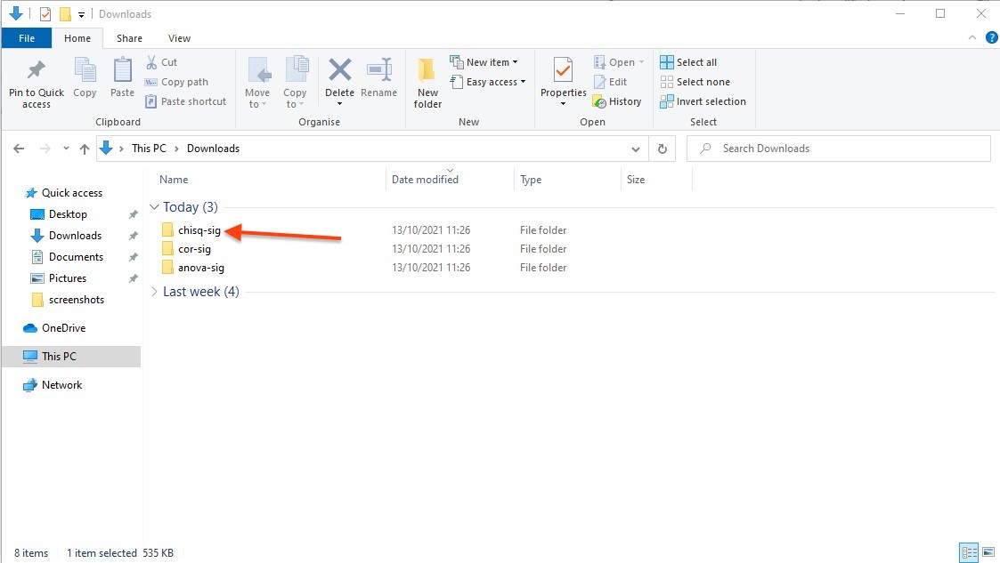
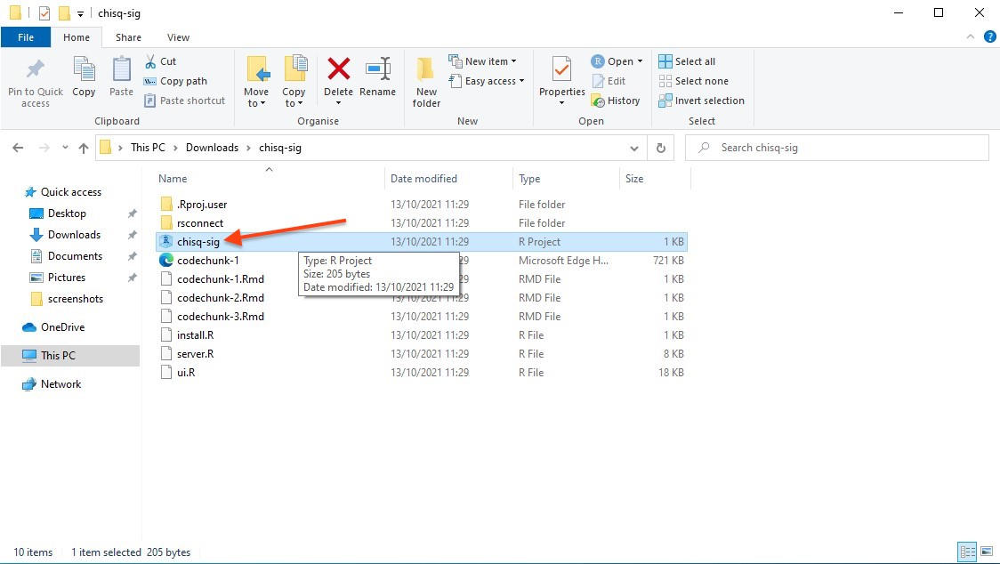
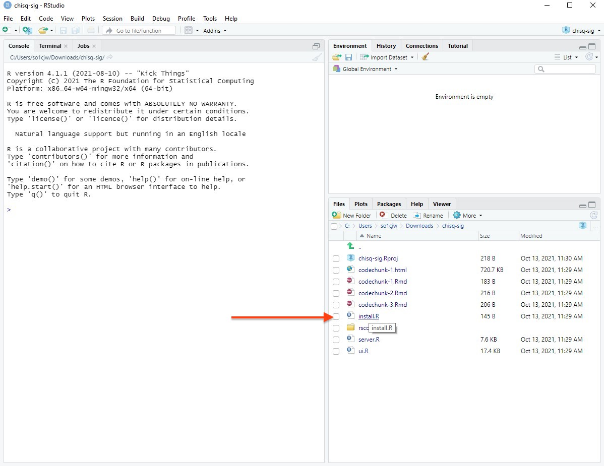
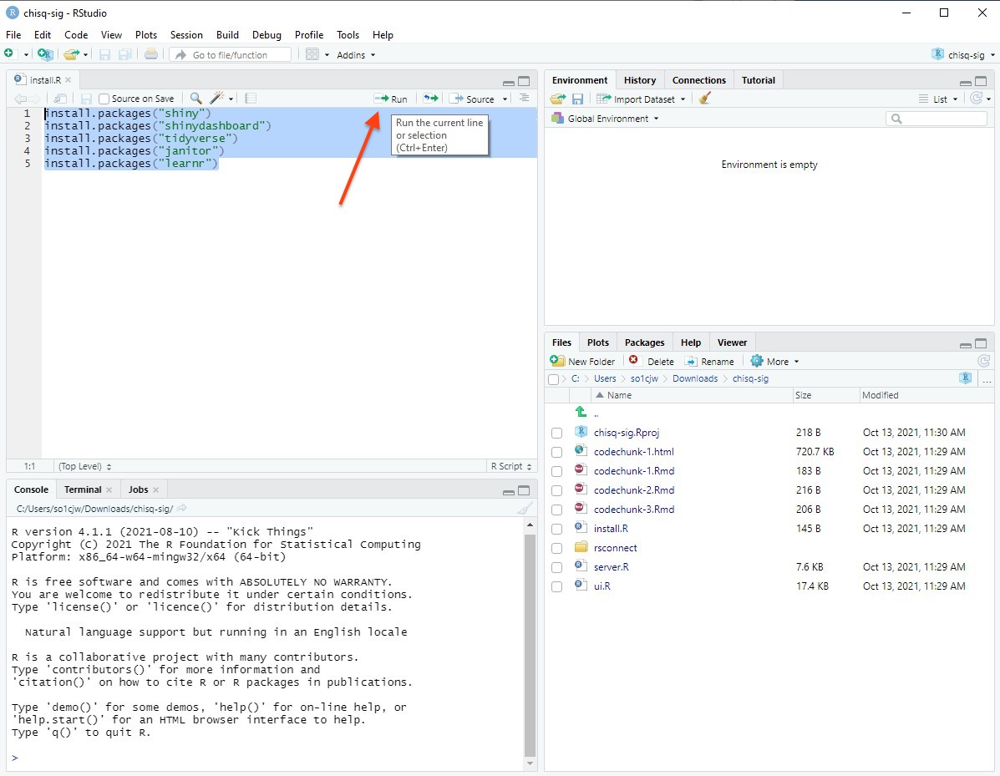
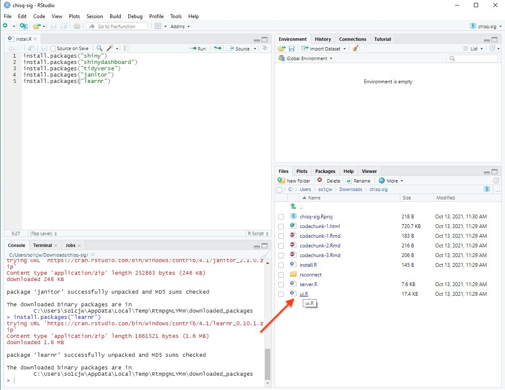
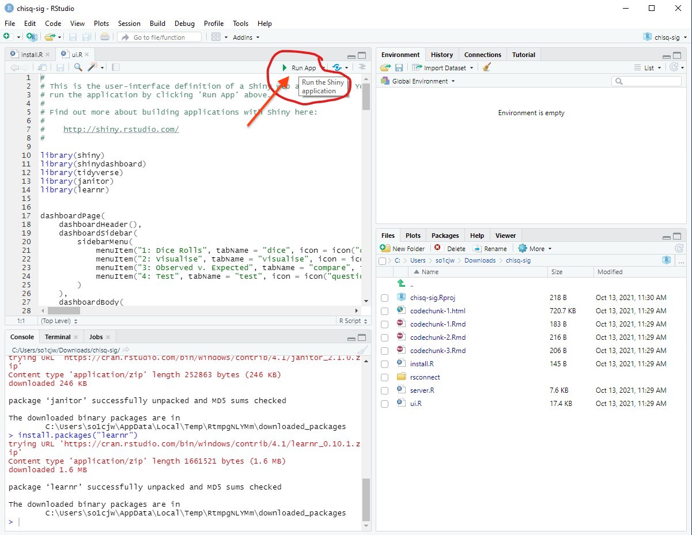
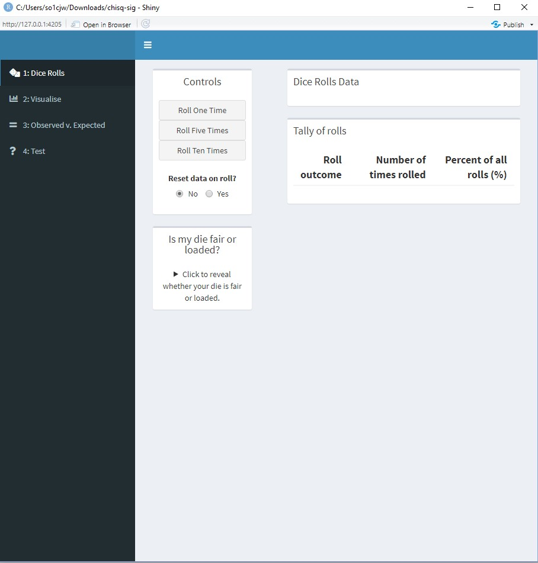

```{r setup, include=FALSE}
library(tidyverse)
# invalidate cache when the tufte version changes
knitr::opts_chunk$set(cache.extra = packageVersion('tufte'))
options(htmltools.dir.version = FALSE)
options(tinytex.verbose = TRUE)
```

### Download and unzip the Shiny app files

``` {r echo = FALSE, layout = "l-page"}



```

### Open the app's associated .Rproj file

``` {r echo = FALSE, layout = "l-page"}



```

### Open the install.R file

``` {r echo = FALSE, layout = "l-page"}



```

### Highlight all of the code used for installing packages and click Run. 

``` {r echo = FALSE, layout = "l-page"}



```

### Now open either the ui.R or the server.R file.

``` {r echo = FALSE, layout = "l-page"}



```

### While viewing the ui.R or server.R script, click the 'Run App' button that appears in Rstudio

``` {r echo = FALSE, layout = "l-page"}



```

### This should open the App in a new window. You can now use the app. 

``` {r echo = FALSE, layout = "l-page"}



```
