class: middle
background-size: contain

<br><br><br>

# .tuos_purple[SMI606: Week 4<br>Inference]

<br><br>

**Dr. Calum Webb**<br>
Sheffield Methods Institute, the University of Sheffield.<br>
[c.j.webb@sheffield.ac.uk](mailto:c.j.webb@sheffield.ac.uk)

```{r setup, include=FALSE}
options(htmltools.dir.version = FALSE)

# These packages are required for creating the slides
# Many will need to be installed from Github
library(icons)
library(tidyverse)
library(xaringan)
library(xaringanExtra)
library(xaringanthemer)

# Defaults for code
knitr::opts_chunk$set(
  fig.width=9, fig.height=3.5, fig.retina=3,
  out.width = "100%",
  cache = FALSE,
  echo = TRUE,
  message = FALSE, 
  warning = FALSE,
  fig.show = TRUE,
  hiline = TRUE
)

# set global theme for ggplot to make background #F8F8F8F8 (off white),
# but otherwise keep all ggplot themes default (better for teaching)
theme_set(
  theme(plot.background = element_rect(fill = "#F8F8F8", colour = "#F8F8F8"), 
        panel.background = element_rect(fill = "#F8F8F8", colour = "#F8F8F8"), 
        legend.background = element_rect(fill = "#F8F8F8", colour = "#F8F8F8")
        )
  )


```

```{r xaringan-tile-view, echo=FALSE}
# Use tile overview by hitting the o key when presenting
xaringanExtra::use_tile_view()
```

```{r xaringan-logo, echo=FALSE}
# Add logo to top right
xaringanExtra::use_logo(
  image_url = "header/smi-logo-white.png",
  exclude_class = c("inverse", "hide_logo"), 
  width = "180px", position = css_position(top = "1em", right = "2em")
)
```

```{r xaringan-themer, include=FALSE, warning=FALSE}

# Set some global objects containing the colours
# of the university's branding
primary_color <- "#131E29"
secondary_color <- "#440099"
tuos_blue <- "#9ADBE8"
white = "#F8F8F8"
tuos_yellow <- "#FCF281"
tuos_purple <- "#440099"
tuos_red <- "#E7004C"
tuos_midnight <- "#131E29"

# The bulk of the styling is handled by xaringanthemer
style_duo_accent(
  primary_color = "#131E29",
  secondary_color = "#440099",
  colors = c(tuos_purple = "#440099", 
             grey = "#131E2960", 
             tuos_blue ="#9ADBE8",
             tuos_mint = "#00CE7C"),
  header_font_google = xaringanthemer::google_font("Source Serif Pro", "600", "600i"),
  text_font_google   = xaringanthemer::google_font("Source Sans Pro", "300", "300i", "600", "600i"),
  code_font_google   = xaringanthemer::google_font("Lucida Console"),
  header_h1_font_size = "2rem",
  header_h2_font_size = "1.5rem", 
  header_h3_font_size = "1.25rem", 
  text_font_size = "0.9rem",
  code_font_size = "0.65rem", 
  code_inline_background_color = "#F8F8F8", 
  inverse_text_color = "#9ADBE8", 
  background_color = "#F8F8F8", 
  text_color = "#131E29", 
  link_color = "#005A8F", 
  inverse_link_color = "#F8F8F8",
  text_slide_number_color = "#44009970",
  table_row_even_background_color = "transparent", 
  table_border_color = "#44009970",
  text_bold_font_weight = 600
)

```


```{r xaringan-panelset, echo=FALSE}
# Allow for adding panelsets (see example on slide 2)
xaringanExtra::use_panelset(in_xaringan = TRUE)

style_panelset_tabs(
  background = "#F8F8F8",
  active_background = "#F8F8F8",
  hover_background = "#F8F8F8"
)


```

```{r xaringanExtra, echo = FALSE}
# Adds white progress bar to top
xaringanExtra::use_progress_bar(color = "#F8F8F8", location = "top")
```

```{r xaringan-extra-styles, echo = FALSE}
# Allow for code to be highlighted on hover
xaringanExtra::use_extra_styles(
  hover_code_line = TRUE,         #<<
  mute_unhighlighted_code = TRUE  #<<
)
```

```{r share-again, echo=FALSE}
# Add sharing links and other embedding tools
xaringanExtra::use_share_again()
```

```{r xaringanExtra-search, echo=FALSE}
# Add magnifying glass search function to bottom left for quick
# searching of slides
xaringanExtra::use_search(show_icon = TRUE, auto_search = FALSE)
```


---
class: middle

.pull-right[

<br><br><br><br><br><br>

# Sign In


]
---
class: middle

## Learning Objectives

.panelset[

.panel[.panel-name[What will I learn?]

By the end of this week you will:

* Get to grips with the intuition behind using inferential statistics for hypothesis testing.
* Be able to interpret a p-value from a hypothesis test, in conjunction with a critical value. 
* Be able to judge when the use of hypothesis testing for generalisation of findings is appropriate depending on the kind of sample our data is from.
* Understand the intuition of some common statistical tests for testing the relationship between two variables.

]

.panel[.panel-name[How does this week fit into my course?]

* Hypothesis testing is an essential skill for doing quantitative social research, and plays to the strengths of quantitative methods for identifying social patterns.
* In order to accurately assess the results from reading other social science research publications, you must be able to interpret the results from statistical significance tests (and p-values) — even if you don't do quantitative research yourself!
* You should have a good sense of the theory behind hypothesis testing to ensure that you use it responsibly and effectively in a research career, including if you are in a leadership role.


]


]


???


---

class: middle

## Inferential statistics for hypothesis testing

```{r, echo = FALSE}

library(formattable)

visuals <- tibble(
  `Variable Type` = c("Nominal", "Ordinal", "Continuous"),
  Nominal = c("Chi-squared Test of Association", "Chi-squared Test of Association", "ANOVA/t-test"),
  Ordinal = c("", "Chi-squared/Spearman Correlation t-test", "ANOVA/t-test"),
  Continuous = c("", "", "Pearson/Spearman Correlation t-test")
)

visuals_tab <- formattable::formattable(visuals,
                         list(
                           `Variable Type` = formatter("span", style = formattable::style(font.weight = "bold"))
                         ))

as.htmlwidget(visuals_tab, width = "100%")

```

---

class: inverse, middle

# Over the last two week we have learned how to describe the different types of variables in data and relationships between them.


---

class: inverse, middle

# But how can we be confident that a relationship or pattern in our data applies to the entire population we are interested in, and isn't just an artefact of our specific sample?

???

But this week we are interested in how we can generalise the kinds of patterns, or tendencies, or relationships in our data to the population as a whole. 

How can we be confident that something we find in a random sample is generalisable knowledge? 

Statistical methods that help us do this are called Inferential Statistics.


---

class: inverse, middle

# We could...

<hr>

## <li>Collect data from the entire population (very expensive, often unfeasible)</li>

--

## <li>Collect more random samples and see if we get the same results consistently (good option, but how many before we can be sure? When do we stop?)</li>

--

## <li>Use inferential statistics</li>


---


# Getting a feel for inferential statistics

<br>

.pull-left[

* Load the `chisq-sig` Shiny app in R (follow the handout if you didn't do this in advance), or load the online version by going here: [https://webb.shinyapps.io/chisq-sig/](https://webb.shinyapps.io/chisq-sig/)

]

.pull-right[

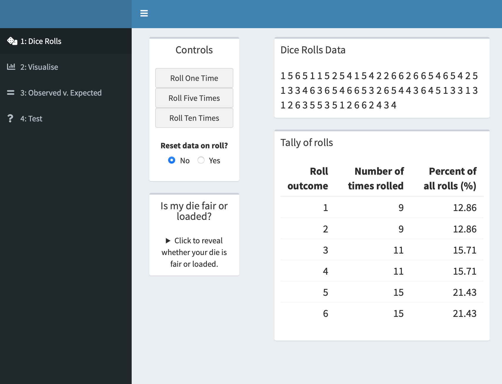

]


???

Before we talk about how inferential statistics are used and expressed in practice, I'd like you to join in with a practical activity with me. 

If you can start by loading up the Shiny app either on your phone by scanning the QR code, or by clicking the link in the chat, and giving it a couple of minutes to load while I explain what we'll be doing.


---

# Getting a feel for inferential statistics

<br>

.pull-left[

* Load the `chisq-sig` Shiny app in R (follow the handout if you didn't do this in advance), or load the online version by going here: [https://webb.shinyapps.io/chisq-sig/](https://webb.shinyapps.io/chisq-sig/)

* We've been contracted by a Las Vegas casino who have discovered that half of their dice are loaded, and do not roll fairly. `r icons::fontawesome("user-secret")`

]

.pull-right[


]

???

So, imagine for a moment that we've been contracted by a Las Vegas casino who have discovered that half of their dice are loaded and do not roll numbers fairly. The problem is, they don't know which of their dice are loaded and which of them are fair.

---

# Getting a feel for inferential statistics

<br>

.pull-left[

* Load the `chisq-sig` Shiny app in R (follow the handout if you didn't do this in advance), or load the online version by going here: [https://webb.shinyapps.io/chisq-sig/](https://webb.shinyapps.io/chisq-sig/)

* We've been contracted by a Las Vegas casino who have discovered that half of their dice are loaded, and do not roll fairly. `r icons::fontawesome("user-secret")`

* Each of you have been given a (virtual) die that you can roll as many times as you like. You don't know whether you have a **fair** die or a **loaded die**. A loaded die will roll some numbers more often than others. `r icons::fontawesome("dice")`

]

.pull-right[


]


???

As you load up the app, you will have been given either a fair or a loaded die that you can roll as many times as you like. 

---

# Getting a feel for inferential statistics

<br>

.pull-left[

* Load the `chisq-sig` Shiny app in R (follow the handout if you didn't do this in advance), or load the online version by going here: [https://webb.shinyapps.io/chisq-sig/](https://webb.shinyapps.io/chisq-sig/)

* We've been contracted by a Las Vegas casino who have discovered that half of their dice are loaded, and do not roll fairly. `r icons::fontawesome("user-secret")`

* Each of you have been given a (virtual) die that you can roll as many times as you like. You don't know whether you have a **fair** die or a **loaded die**. A loaded die will roll some numbers more often than others. `r icons::fontawesome("dice")`

* Our task is to use our data analysis skills to determine whether we have a fair or loaded die. `r icons::fontawesome("search")`

]

.pull-right[


```{r, echo = FALSE, fig.alt="The image shows a preview of the app that will be being used. On the left hand side are buttons for rolling dice and a drop down details list which will reveal whether the dice is loaded or not. On the right hand side is the results of the dice rolls, both as a vector of roll results and as a table. On the far left is a navigation pane with labels for rolling the dice, visualising the result, comparing the rolled numbers versus the expected rolls, and running a chi-squared test."}


```


]


???

Our task is to roll the die and use our data analysis skills to determine whether the die each of us has been been allocated is fair or unfair. 

[Start practical activity: show 20 rolls as an example, inspect outcomes, ask participants to roll die twenty times and inspect their outcome, then do 'hands up' confidence check before repeating two more times. Remember to mention that at the end I would ask people to reflect on what happened to their confidence as they increased the size of their sample. ]

---

class: inverse, middle

# Inferential statistics help us quantify the confidence we have in a hypothesis based on how likely we would expect to see the results we got if it were accurate.

#### (e.g. that a die is fair, or that there is no relationship between two variables)


---

# Hypothesis testing

<br>

.pull-left[

**.tuos_purple[What are the chances we would see a sample of rolls like this...]**

```{r, echo = FALSE, fig.alt="The figure shows a histogram of dice roll outcomes that appears to be skewed more towards the numbers 2 and 6. The number 1 was rolled 5 times. The number 2 was rolled 14 times. The number 3 was rolled 11 times. The number 4 was rolled 6 times. The number 5 was rolled 7 times. The number 6 was rolled 15 times."}

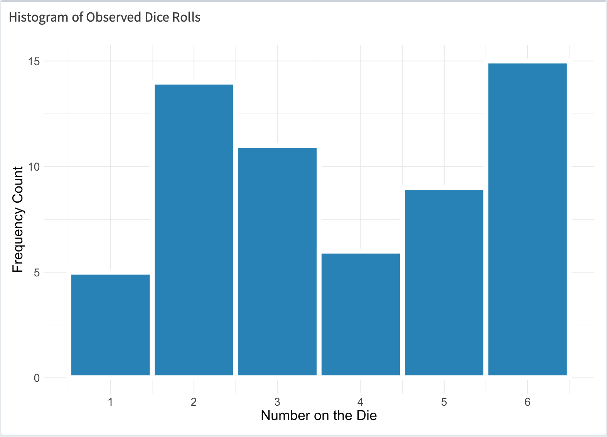

```

<center>(Observed)</center>

]

.pull-right[]

???

What we are doing, in a very unconcious way in our heads with this task is looking at what we were rolling and comparing the chances that we would see something like this... 


---

# Hypothesis testing
<br>

.pull-left[

**.tuos_purple[What are the chances we would see a sample of rolls like this...]**

```{r, echo = FALSE, fig.alt="The figure shows a histogram of dice roll outcomes that appears to be skewed more towards the numbers 2 and 6. The number 1 was rolled 5 times. The number 2 was rolled 14 times. The number 3 was rolled 11 times. The number 4 was rolled 6 times. The number 5 was rolled 7 times. The number 6 was rolled 15 times."}


```

<center>(Observed)</center>

]

.pull-right[

**.tuos_purple[When we know if the die were fair we would expect to see something like this...? (Null hypothesis)]**

```{r, echo = FALSE, fig.alt="The figure shows a histogram of dice roll outcomes where all of the outcomes were rolled exactly the same amount of times. Every single possible outcome from 1 to 6 was rolled 10 times."}

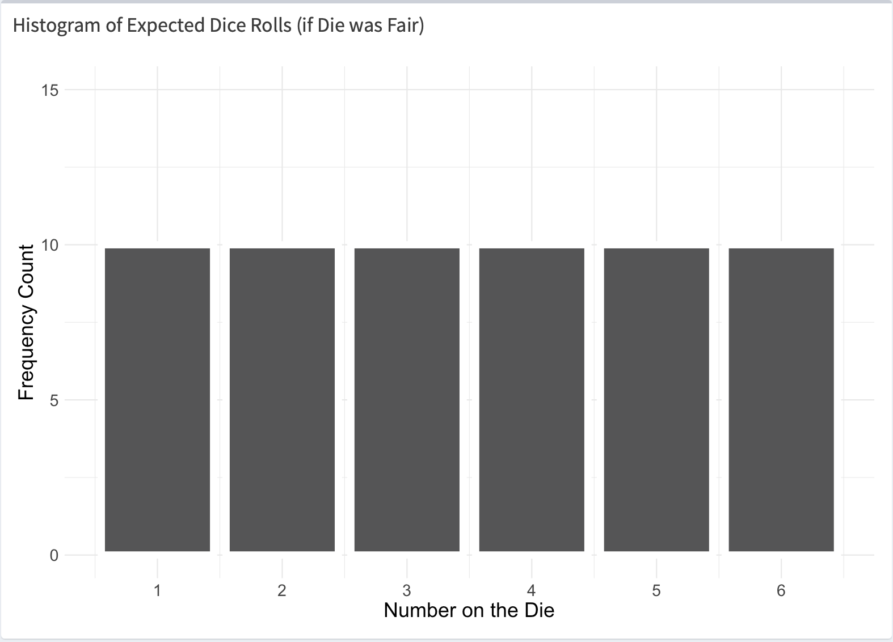

```

<center>(Expected)</center>


]

???

With what we would expect if the die were fair -- we know already what kind of distribution we would expect to see if a die were completely fair, we'd call this our null hypothesis, but we also know there is a lot of randomness in the world and that our dice rolls would very very rarely ever look exactly like this.

---

# Hypothesis testing

<br>
.pull-left[

We can express how unlikely we were to get results like this if the die was fair using a **p-value**.

There are many different kinds of inferential statistics and tests we can use for different hypotheses and kinds of relationships in data. The one we use here is called a __chi-squared goodness-of-fit test__ but don't worry about how it's calculated at this point!

]

.pull-right[

```{r, echo = FALSE, fig.alt="The image shows a histogram split into dark blue, light blue, and pink parts on the top of the image and some R output on the bottom of the image. The pink areas of the plot show where the observed number of rolls was lower than what we would have expected. The light blue areas show the areas where the number of rolls were higher than expected. The first bar of the histogram, for roll outcomes of 1, shows that there were 5 observed rolls which was 5 below what we expected (10). The second bar for outcomes of 2 shows that there were 4 rolls more than the expected 10. The third bar for outcomes of 3 shows that there was 1 roll more than expected. The fourth bar for outcomes of 4 shows that there were 4 rolls less than expected. The fifth bar for outcomes of 5 shows that there was one roll less than expected. The sixth bar shows that there was five rolls more than expected. "}

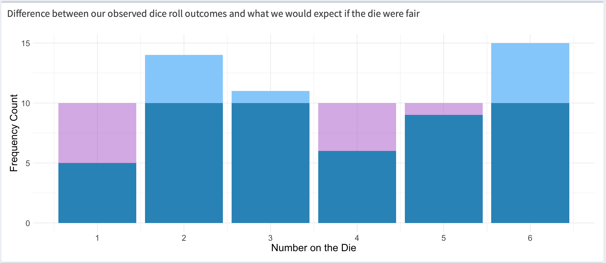

```
```{r, echo=FALSE, fig.alt = "The lower part of the image shows the output: 'Chi-squared test for given probabilities. data: dice_rolls_summary$n. Chi-squared value = 8.4. df (degrees of freedom) = 5. p-value = 0.1355."}

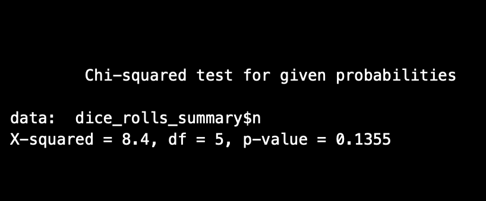

```

]


???

We can quantify how likely we are to see something like this using a *p-value*.

There are many different kinds of tests that produce p-values, and as we go forward into the next few weeks you will learn which ones should be used for what kinds of research questions and types of data. For the exercise we're doing here, we can use a very simple test called a chi-squared test -- don't worry about what that means or how it's calculated for now! Right now, we just want to focus on the p-value.


---


# Hypothesis testing

<br>
.pull-left[

We can express how unlikely we were to get results like this if the die was fair using a **p-value**.

There are many different kinds of inferential statistics and tests we can use for different hypotheses and kinds of relationships in data. The one we use here is called a __chi-squared goodness-of-fit test__ but don't worry about how it's calculated at this point!

* An inferential statistic gives us a __p-value__.


]

.pull-right[
```{r, echo = FALSE, fig.alt="The image shows a histogram split into dark blue, light blue, and pink parts on the top of the image and some R output on the bottom of the image. The pink areas of the plot show where the observed number of rolls was lower than what we would have expected. The light blue areas show the areas where the number of rolls were higher than expected. The first bar of the histogram, for roll outcomes of 1, shows that there were 5 observed rolls which was 5 below what we expected (10). The second bar for outcomes of 2 shows that there were 4 rolls more than the expected 10. The third bar for outcomes of 3 shows that there was 1 roll more than expected. The fourth bar for outcomes of 4 shows that there were 4 rolls less than expected. The fifth bar for outcomes of 5 shows that there was one roll less than expected. The sixth bar shows that there was five rolls more than expected. "}


```
```{r, echo=FALSE, fig.alt = "The lower part of the image shows the output: 'Chi-squared test for given probabilities. data: dice_rolls_summary$n. Chi-squared value = 8.4. df (degrees of freedom) = 5. p-value = 0.1355."}


```


]


???

So - an inferential statistic gives us something called a p-value.


---

# Hypothesis testing
<br>

.pull-left[

We can express how unlikely we were to get results like this if the die was fair using a **p-value**.

There are many different kinds of inferential statistics and tests we can use for different hypotheses and kinds of relationships in data. The one we use here is called a __chi-squared goodness-of-fit test__ but don't worry about how it's calculated at this point!

* An inferential statistic gives us a __p-value__.

* The p-value tells us the probability of seeing the kind of results we got __if the null hypothesis__ (that the die is fair) __is the best explanation for the distribution of the data__.


]

.pull-right[
```{r, echo = FALSE, fig.alt="The image shows a histogram split into dark blue, light blue, and pink parts on the top of the image and some R output on the bottom of the image. The pink areas of the plot show where the observed number of rolls was lower than what we would have expected. The light blue areas show the areas where the number of rolls were higher than expected. The first bar of the histogram, for roll outcomes of 1, shows that there were 5 observed rolls which was 5 below what we expected (10). The second bar for outcomes of 2 shows that there were 4 rolls more than the expected 10. The third bar for outcomes of 3 shows that there was 1 roll more than expected. The fourth bar for outcomes of 4 shows that there were 4 rolls less than expected. The fifth bar for outcomes of 5 shows that there was one roll less than expected. The sixth bar shows that there was five rolls more than expected. "}


```
```{r, echo=FALSE, fig.alt = "The lower part of the image shows the output: 'Chi-squared test for given probabilities. data: dice_rolls_summary$n. Chi-squared value = 8.4. df (degrees of freedom) = 5. p-value = 0.1355."}


```


]

???

The p-value tells us the probability of seeing the kind of results we got *if the null hypothesis that the die is fair were true*


---

# Hypothesis testing
<br>

.pull-left[

We can express how unlikely we were to get results like this if the die was fair using a **p-value**.

There are many different kinds of inferential statistics and tests we can use for different hypotheses and kinds of relationships in data. The one we use here is called a __chi-squared goodness-of-fit test__ but don't worry about how it's calculated at this point!

* An inferential statistic gives us a __p-value__.

* The p-value tells us the probability of seeing the kind of results we got __if the null hypothesis__ (that the die is fair) __is the best explanation for the distribution of the data__.

* For the above example, __our p-value was 0.1355__.

]

.pull-right[
```{r, echo = FALSE, fig.alt="The image shows a histogram split into dark blue, light blue, and pink parts on the top of the image and some R output on the bottom of the image. The pink areas of the plot show where the observed number of rolls was lower than what we would have expected. The light blue areas show the areas where the number of rolls were higher than expected. The first bar of the histogram, for roll outcomes of 1, shows that there were 5 observed rolls which was 5 below what we expected (10). The second bar for outcomes of 2 shows that there were 4 rolls more than the expected 10. The third bar for outcomes of 3 shows that there was 1 roll more than expected. The fourth bar for outcomes of 4 shows that there were 4 rolls less than expected. The fifth bar for outcomes of 5 shows that there was one roll less than expected. The sixth bar shows that there was five rolls more than expected. "}


```
```{r, echo=FALSE, fig.alt = "The lower part of the image shows the output: 'Chi-squared test for given probabilities. data: dice_rolls_summary$n. Chi-squared value = 8.4. df (degrees of freedom) = 5. p-value = 0.1355."}


```


]

???

For the above example of rolls, our p-value was 0.1355


---

# Hypothesis testing
<br>

.pull-left[

We can express how unlikely we were to get results like this if the die was fair using a **p-value**.

There are many different kinds of inferential statistics and tests we can use for different hypotheses and kinds of relationships in data. The one we use here is called a __chi-squared goodness-of-fit test__ but don't worry about how it's calculated at this point!

* An inferential statistic gives us a __p-value__.

* The p-value tells us the probability of seeing the kind of results we got __if the null hypothesis__ (that the die is fair) __is the best explanation for the distribution of the data__.

* For the above example, __our p-value was 0.1355__.

* This means we would see results at least this different to what we would expect around __13.55% of the time or less__, when a die is fair (when the null hypothesis is an accurate description).


]

.pull-right[
```{r, echo = FALSE, fig.alt="The image shows a histogram split into dark blue, light blue, and pink parts on the top of the image and some R output on the bottom of the image. The pink areas of the plot show where the observed number of rolls was lower than what we would have expected. The light blue areas show the areas where the number of rolls were higher than expected. The first bar of the histogram, for roll outcomes of 1, shows that there were 5 observed rolls which was 5 below what we expected (10). The second bar for outcomes of 2 shows that there were 4 rolls more than the expected 10. The third bar for outcomes of 3 shows that there was 1 roll more than expected. The fourth bar for outcomes of 4 shows that there were 4 rolls less than expected. The fifth bar for outcomes of 5 shows that there was one roll less than expected. The sixth bar shows that there was five rolls more than expected. "}


```
```{r, echo=FALSE, fig.alt = "The lower part of the image shows the output: 'Chi-squared test for given probabilities. data: dice_rolls_summary$n. Chi-squared value = 8.4. df (degrees of freedom) = 5. p-value = 0.1355."}


```


]

???

This means we would see results at least this different to what we would expect around 13.55% of the time or less, when a die is fair.


---

class: inverse, middle

# So, what do we think?

# 13.55% is quite a low probability of something happening. Should we report this die as unfair or not?

???

So how do we use that information.

13.55% is quite a low probability of something happening, but it's not completely unreasonable. Should we report this die as unfair or not? 


---


# Hypothesis testing
<br>

.pull-left[

In applied statistics, we compare our p-value with a pre-chosen '__critical value__' (sometimes called *alpha*) below which we decide to reject the null hypothesis. 

* Conventionally, our critical value, **below which we reject the null hypothesis**, is __0.05__.

]

.pull-right[
```{r, echo = FALSE, fig.alt="The image shows a histogram split into dark blue, light blue, and pink parts on the top of the image and some R output on the bottom of the image. The pink areas of the plot show where the observed number of rolls was lower than what we would have expected. The light blue areas show the areas where the number of rolls were higher than expected. The first bar of the histogram, for roll outcomes of 1, shows that there were 5 observed rolls which was 5 below what we expected (10). The second bar for outcomes of 2 shows that there were 4 rolls more than the expected 10. The third bar for outcomes of 3 shows that there was 1 roll more than expected. The fourth bar for outcomes of 4 shows that there were 4 rolls less than expected. The fifth bar for outcomes of 5 shows that there was one roll less than expected. The sixth bar shows that there was five rolls more than expected. "}


```
```{r, echo=FALSE, fig.alt = "The lower part of the image shows the output: 'Chi-squared test for given probabilities. data: dice_rolls_summary$n. Chi-squared value = 8.4. df (degrees of freedom) = 5. p-value = 0.1355."}


```


]

???

In applied social statistics, we often pick a pre-defined critical value in conjunction with the p-value from our test to make that judgement call.

In social science, we usually say that if the p-value is less than 0.05 (or 5%), we reject the null hypothesis, because the results we got are sufficiently unlikely to have happened if it were true.


---

# Hypothesis testing
<br>

.pull-left[

In applied statistics, we compare our p-value with a pre-chosen 'critical value' (sometimes called *alpha*) below which we decide to reject the null hypothesis. 

* Conventionally, our critical value, **below which we reject the null hypothesis**, is __0.05__.

There is no strong reason why 5% is used in the social sciences, and sometimes 10%, 1% or 0.1% are used instead, but it can depend on the following:
  * What are the risks if we set our critical value too high and incorrectly reject the null hypothesis? __(Type I error; false positive)__
  * What are the risks if we set our critical value too low and incorrectly fail to reject the null hypothesis? __(Type II error; false negative)__
  
5%, or 0.05, is often seen as a good compromise between these two risks.

]

.pull-right[
```{r, echo = FALSE, fig.alt="The image shows a histogram split into dark blue, light blue, and pink parts on the top of the image and some R output on the bottom of the image. The pink areas of the plot show where the observed number of rolls was lower than what we would have expected. The light blue areas show the areas where the number of rolls were higher than expected. The first bar of the histogram, for roll outcomes of 1, shows that there were 5 observed rolls which was 5 below what we expected (10). The second bar for outcomes of 2 shows that there were 4 rolls more than the expected 10. The third bar for outcomes of 3 shows that there was 1 roll more than expected. The fourth bar for outcomes of 4 shows that there were 4 rolls less than expected. The fifth bar for outcomes of 5 shows that there was one roll less than expected. The sixth bar shows that there was five rolls more than expected. "}


```
```{r, echo=FALSE, fig.alt = "The lower part of the image shows the output: 'Chi-squared test for given probabilities. data: dice_rolls_summary$n. Chi-squared value = 8.4. df (degrees of freedom) = 5. p-value = 0.1355."}


```


]

???

Why do we pick 5%?

There is not really any strong reason, but it is conventionally considered to be a good balance between the risk of us wrongly rejecting the null hypothesis - wrongly reporting that the dice isn't fair when it is - which is called a type 1 error; and us wrongly failing to reject the null hypotheiss - wrongly claiming the dice is fair when it actually isn't.

It's common to see critical values of 10%, 5%, 1% or 0.1% chosen, and this should depend on the specific risk of making an error in a given research context. 

For example, in drug testing we might want to set a much lower critical value so we don't inadvertantly give people ineffective treatments, but we wouldn't want to make it so low that we end up rejecting potentially beneficial treatments.


---


# Hypothesis testing

<br>

.pull-left[

.middle[

* Our p-value is __0.1355__

* Our critical value is __0.05__

* __0.1355 is greater than 0.05__ (p > 0.05), and therefore we __should not reject our null hypothesis__ (that the die is fair) based on this evidence. 

* We conclude that __our data does not support the idea__ that the die is unfair.

<br>

*Don't worry if this is difficult to grasp immediately! No one is comfortable interpreting p-values the first time they come across them!*

*We will practice using them and interpreting them many many times over the next few weeks!*


]


]

.pull-right[
```{r, echo = FALSE, fig.alt="The image shows a histogram split into dark blue, light blue, and pink parts on the top of the image and some R output on the bottom of the image. The pink areas of the plot show where the observed number of rolls was lower than what we would have expected. The light blue areas show the areas where the number of rolls were higher than expected. The first bar of the histogram, for roll outcomes of 1, shows that there were 5 observed rolls which was 5 below what we expected (10). The second bar for outcomes of 2 shows that there were 4 rolls more than the expected 10. The third bar for outcomes of 3 shows that there was 1 roll more than expected. The fourth bar for outcomes of 4 shows that there were 4 rolls less than expected. The fifth bar for outcomes of 5 shows that there was one roll less than expected. The sixth bar shows that there was five rolls more than expected. "}


```
```{r, echo=FALSE, fig.alt = "The lower part of the image shows the output: 'Chi-squared test for given probabilities. data: dice_rolls_summary$n. Chi-squared value = 8.4. df (degrees of freedom) = 5. p-value = 0.1355."}


```


]


???

So, to recap, for this set of dice rolls our p-value was 0.1355.

Our critical value to reject the hypothesis that the die is fair is 0.05.

0.1355 is more than 0.05, and therefore, based on the criteria we set we should not reject our hypothesis that the die is fair. 

We use these tools to make our decision that our data does not support the idea that this particular die is unfair.

Don't worry if this this difficult to grasp right away! It is difficult stuff and no one is comfortable understanding or interpreting p-values correctly the first time they see them. The best way to learn is through practice and repetition. 

We will be doing this multiple times over this week and in the following weeks with different tests - the majority of them will use p-values so you will become very familiar with them!


---

class: inverse, middle


# Can you see how this statistic performs a similar function to our intuition when raising our hand when we feel confident that the die is or is not fair?

*Now I want you to roll your dice as many times as you think would be a good sample, use the Chi-Square test calculated on the last tab to decide whether you think it is fair or not, and then check if you got it right!*

???

The main thing I want you to think about at the end of this session is this:

* Can you see how this statistic helps quantify the confidence we have in something based on what we observe in our data? Can you see how it gives us a tool to make those decisions about turning something we observe into a more general claim?


---

class: middle

## When should we use inferential statistics in social research?

* When we wish to make generalisations beyond our sample of data to a wider population.

---
class: middle

## When can we use inferential statistics in social research?

* When our data __does not violate any of the assumptions made about it__ by the tests (e.g. bivariate normal distrubution).

--

* When our sample is __proportionally representative__ of the population we wish to generalise to.

--

* The easiest way to know a sample is proportionally representative of the population is by finding out how the sample was collected. If it is **randomly selected** (a random sample), it is likely to be representative of the population because __every 'thing' in the sample had an equal chance of being selected__.

--

* However, __this is quite difficult to achieve with human beings__ — they are annoying and do some of the following things:
  * Ignore your invitations to join the sample
  * Refuse to answer questions
  * Withdraw from the study
  * Die
  * And other things.


---

class: inverse, middle


# Sampling methods

Whether our data are a representative sample of a larger population often depends on the *sampling method*


---

class: middle

# Sampling methods

<br>

* __Volunteer or opportunity sampling__: the sample is chosen based on who is available to take part in the study (e.g. advertising an online survey; selecting people off the street)

---

# Opportunity sampling (60% of pixels)

.center[
```{r, out.height=502, out.width=770, echo = FALSE, fig.alt="The picture shows an older man and woman in a park. The man is pointing at something not shown on the right side of the screen. The image has a dashed border around it which shows that some of the total picture is not visible to the viewer (around 40% of it)."}


```
]

---

# Population

.center[
```{r, out.height=502, out.width=770, echo = FALSE, fig.alt="The picture from before has now been expanded. It now shows the woman and man on the left hand side and the former British Prime Minister Boris Johnson on the right hand side. The man is pointing at the former prime minister in an accusatory way. The prime minister was previously obscured because the sample of the picture did not include him."}


```
]

---

class: middle

# Sampling methods

<br>

* __Volunteer or opportunity sampling__: the sample is chosen based on who is available to take part in the study (e.g. advertising an online survey; selecting people off the street)
  * Very unlikely to be representative of a population you want to generalise to — what about people without internet access? Or who aren't in close vicinity?<br>

--

* __Simple random sampling__: the sample is chosen truly at random from a population sampling frame (e.g. randomly mailing surveys to or visiting addresses on record)

---

# Random sampling (60% of pixels)

.center[
```{r, out.height=502, out.width=770, echo = FALSE, fig.alt="The image is the same as the previous picture in the park: two people stand pointing at the former British prime minister. However, now the image is fuzzy because 60% of the pixels have been selected at random. While it is still easy to roughly make out the 'whole picture', some of the details might be fuzzy - but they are not missing."}

knitr::include_graphics("images/random-sample-60pc.png")

```
]

---

# Random sampling (30% of pixels)

.center[
```{r, out.height=502, out.width=770, echo = FALSE, fig.alt="The image now includes a sample of only 30% of the pixels. Even though the image is much grainier than before, the random sampling of pixels still seems to do a good job of helping us infer what the overall image is showing."}

knitr::include_graphics("images/random-sample-30pc.png")

```
]


---

class: middle

# Sampling methods

<br>

* __Volunteer or opportunity sampling__: the sample is chosen based on who is available to take part in the study (e.g. advertising an online survey; selecting people off the street)
  * Very unlikely to be representative of a population you want to generalise to — what about people without internet access? Or who aren't in close vicinity?<br>

* __Simple random sampling__: the sample is chosen truly at random from a population sampling frame (e.g. randomly mailing surveys to or visiting addresses on record)
  * Ignores the fact that some people in the population may be more prone to non-response than others/participation bias ([Berg, 2010](https://papers.ssrn.com/sol3/papers.cfm?abstract_id=1691967)).<br>


---

# Random sampling (with non-response)

.center[
```{r, out.height=502, out.width=770, echo = FALSE, fig.alt="The image now shows what would happen if one part of the image is less likely to respond to the random selection than another. In the left hand side of the image, the two people are shown in a high degree of clarity as a large number of pixels has been selected. On the right hand side of the image, where the former Prime Minister stands, there are hardly any pixels shown at all. As a result, the left hand side of the image is much clearer than the right hand side."}

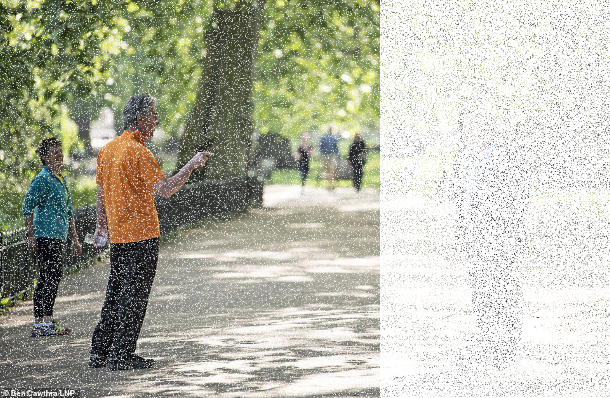

```
]

---

# Random sampling (with non-response)

.center[
```{r, out.height=502, out.width=770, echo = FALSE, fig.alt="The image is the same as the previous image but now includes the caption '50% more likely than average to respond to a survey' on the left hand side and '80% less likely than average to respond to a survey' on the right hand side."}

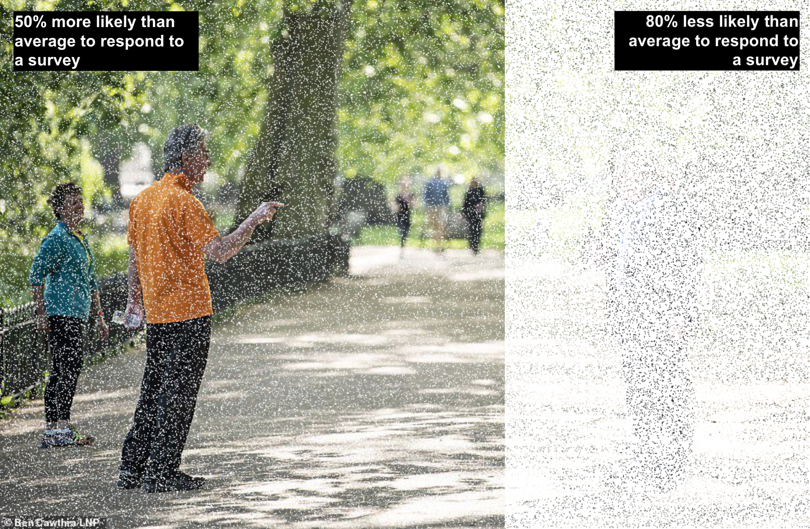

```
]


---

class: middle

# Sampling methods

<br>

* __Volunteer or opportunity sampling__: the sample is chosen based on who is available to take part in the study (e.g. advertising an online survey; selecting people off the street)
  * Very unlikely to be representative of a population you want to generalise to — what about people without internet access? Or who aren't in close vicinity?<br>

* __Simple random sampling__: the sample is chosen truly at random from a population sampling frame (e.g. randomly mailing surveys to or visiting addresses on record)
  * Ignores the fact that some people in the population may be more prone to non-response than others/participation bias ([Berg, 2010](https://papers.ssrn.com/sol3/papers.cfm?abstract_id=1691967)).<br>

* __Stratified random sampling__: important demographic categories are first chosen (strata), and then participants are randomly sampled from within those categories (usually proportional to the percentage of the entire population they make up derived from, e.g. a census)

---

## Stratified random sampling (with non-response adjustment)

.center[
```{r, out.height=502, out.width=770, echo = FALSE, fig.alt="The image shows the result of a sample of pixels where the left hand side is 50% more likely to respond and the right hand side is 80% less likely to respond. Now an additional caption on the left hand side reads: 'send out only 2/3rds of the surveys than random sampling dictates would be needed for a sample of 60%' and an additional caption on the right hand side reads 'send out five times the number of surveys than random sampling dictates would be needed for a sample of 60%'"}

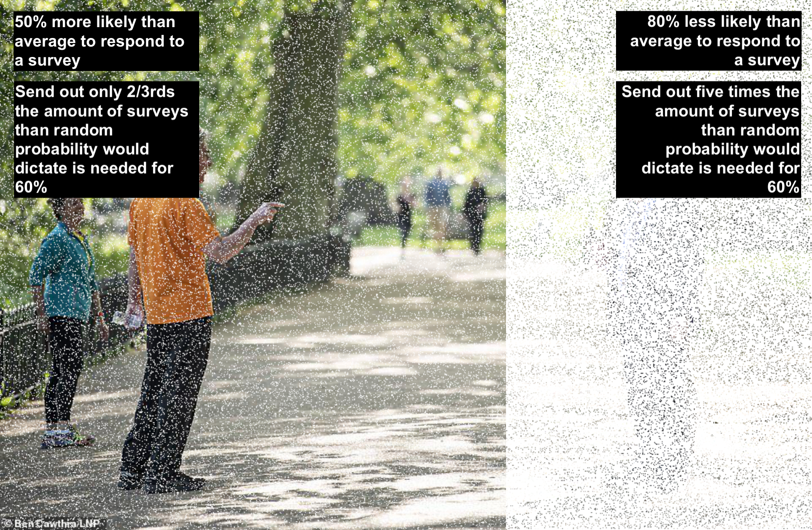

```
]

---

## Stratified random sampling (with non-response adjustment)

.center[
```{r, out.height=502, out.width=770, echo = FALSE, fig.alt="The left hand side and the right hand side are now closer to being in the same level of clarity, but there is still less clarity on the right hand side of the image compared to the left. The caption on the left hand side reads: 3/4s as many surveys sent out. The caption on the right hand side reads: 3 times as many surveys sent out."}

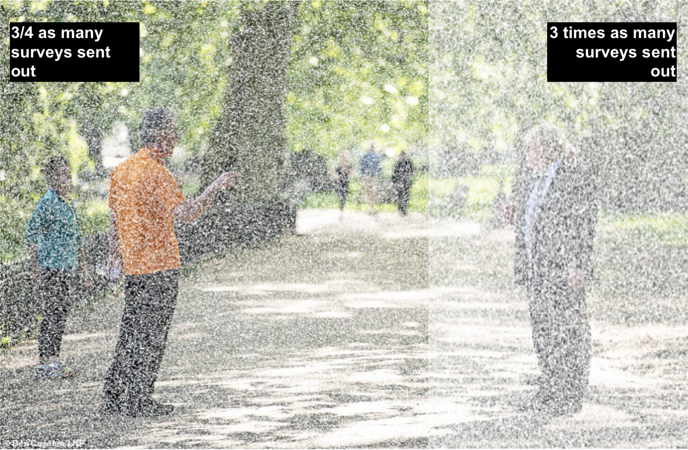

```
]

---

## Stratified random sampling (with non-response adjustment)

.center[
```{r, out.height=502, out.width=770, echo = FALSE, fig.alt="The left hand side and the right hand side are now displayed in about the same level of clarity. The caption on the left hand side reads: 2/3rds as many surveys sent out. The caption on the right hand side reads: 5 times as many surveys sent out."}

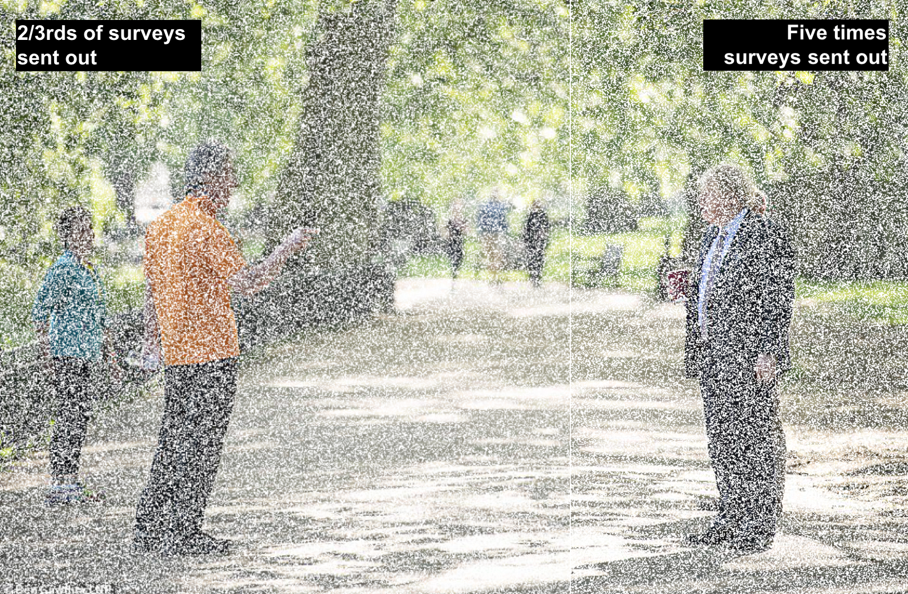

```
]


---

class: middle

# Sampling methods

<br>

* __Volunteer or opportunity sampling__: the sample is chosen based on who is available to take part in the study (e.g. advertising an online survey; selecting people off the street)
  * Very unlikely to be representative of a population you want to generalise to — what about people without internet access? Or who aren't in close vicinity?<br>

* __Simple random sampling__: the sample is chosen truly at random from a population sampling frame (e.g. randomly mailing surveys to or visiting addresses on record)
  * Ignores the fact that some people in the population may be more prone to non-response than others/participation bias ([Berg, 2010](https://papers.ssrn.com/sol3/papers.cfm?abstract_id=1691967)).<br>

* __Stratified random sampling__: important demographic categories are first chosen (strata), and then participants are randomly sampled from within those categories (usually proportional to the percentage of the entire population they make up derived from, e.g. a census)
  * Who decides which demographic categories are meaningful and should be strata and who decides which are unimportant?
  
  
---

class: middle

# _Post-hoc_ adjustment for representativeness

* __Sample weighting__: researchers calculate 'survey weights' which can be used to 're-balance' each observation so that the overall sample proportionally matches the population of interest.

--

  * For example, __imagine we wanted a representative sample of England & Wales.__

--

  * __Approximately 5%__ of people in England & Wales live in Wales.

--

  * We used a stratified sampling method to __survey 1,000 people__ in England and Wales. Ideally, we want 950 English respondents and 50 Welsh respondents.

--

  * However, we ended up with 100 Welsh respondents and 900 English.

--

  * We could count each of those Welsh respondents as only 0.5 of a respondent, and every one of the English respondents as 1.055 of a respondent to "re-balance" our sample to be proportionate to the population.
  
--

In reality this process is far more complicated but that's the basic jist of it! In reality, survey data will come with weights already calculated. You can apply them in analysis using the [`survey` package](https://cran.r-project.org/web/packages/survey/survey.pdf) in `R`, but this is more something to worry about for a PhD project. For now, don't worry about weighting data.
  

---

class: middle

# _Post-hoc_ adjustment for representativeness<br>(Non-response)

We can also have a scenario where we get a proportionally representative sample from our population, but then __not all of this sample respond to all questions or have data for all variables__ (e.g. some might refuse). This would mean that some analyses will end up 'unbalanced' due to this __missing data__ (usually coded as `NA` in `R`) when it is removed.

--

* Multiple ways of dealing with missing data: most common are *listwise* and *pairwise* deletion — where entire observations are deleted if they have missing data in a variable of interest. __This unbalances our sample__.

--

* However, we can try to **impute** missing data — e.g. fill in all of the missing values with our 'best guess' of what it would have been based on responses from respondents who are the most similar to them.

--

* Some methods have specific procedures for handling missing data (e.g. FIML).

--

__Imputation__ and __maximum likelihood__ is too complex a topic to cover here, but is something to be aware of if you are doing a quantitative PhD.


---

class: inverse, middle


# Inference in experimental designs


---

class: middle

# Inference in experimental designs

If your research uses an **experimental** design (e.g. a survey experiment or a randomised controlled trial), you are usually aiming to test the significant differences between the groups *within* your sample. You might try and make your sample representative, but this is often difficult due to cost.

--

This is handled through **a priori randomisation** of conditions (randomly assigning participants to either 'treatment' or 'control' conditions). Because the __assignment is random__, statistical significance/inferential statistics can be used to generalise to the group who participated in the study as a whole. 

--

In other words, inferential statistics can be used to determine __whether the difference between the 'treatment' group and 'control' group would have been different to what would be expected under the null hypothesis if the groups were reverse, or if the random assignment was different__. 

---

class: middle
background-color: white

.center[
```{r, echo = FALSE, fig.alt="The picture shows a scatterplot of a random spread of three different types of shapes, all of which are across five different colours. There is no order to or sorting of the points.", out.width="70%"}

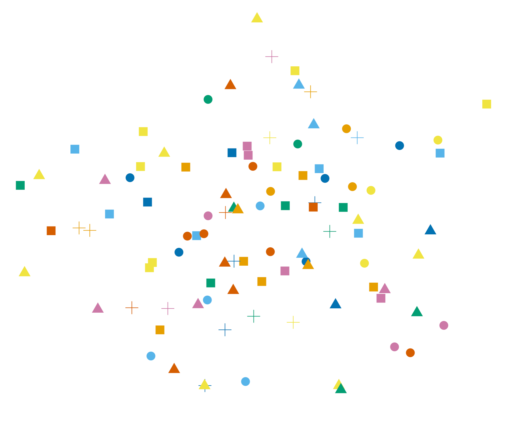

```
]

---

class: middle
background-color: white

.center[
```{r, echo = FALSE, fig.alt="A line is now drawn through the points of random shapes and colours. There are an approximately equal number of points on either side of the line.", out.width="70%"}

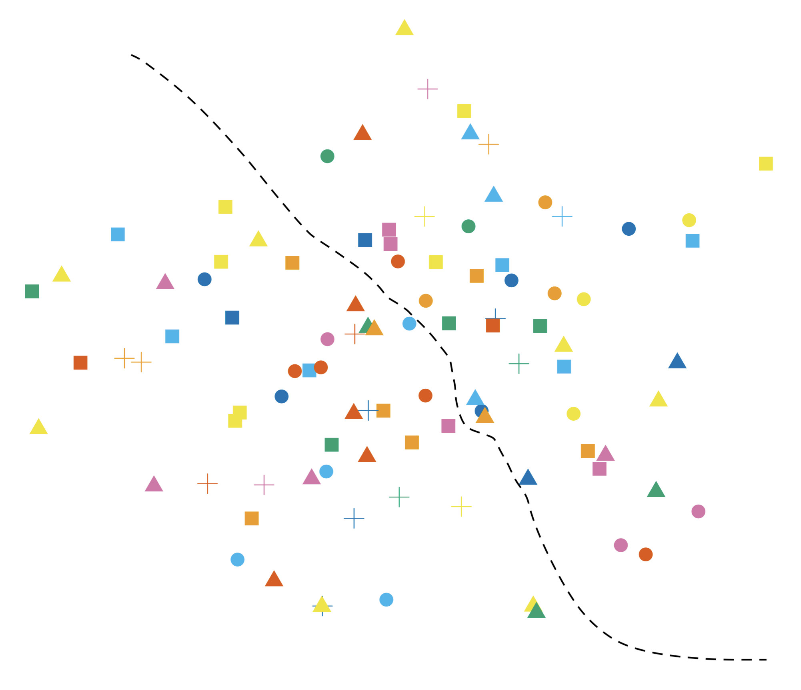

```
]


---

class: middle
background-color: white

.center[
```{r, echo = FALSE, fig.alt="A different line is now drawn through the points of random shapes and colours. There are an approximately equal number of points on either side of the line.", out.width="70%"}

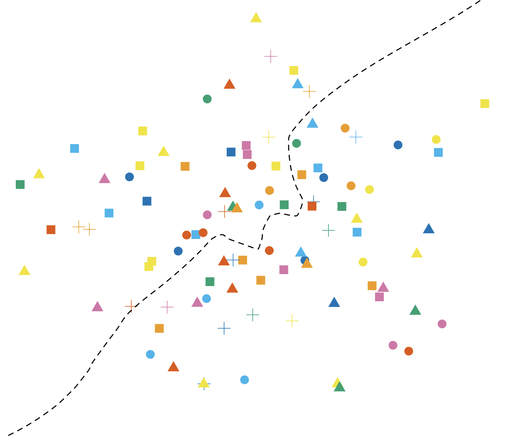

```
]

---

class: middle
background-color: white

.center[
```{r, echo = FALSE, fig.alt="The points are now sorted into those on the 'control' side of the line and those on the 'experiment' side of the line. They have also been sorted into colour and shape.  The random split has resulted in 5 cross shaped points being in the control group and 7 cross shaped points being in the experimental group. 6 square shaped points are in the control group and 7 are in the experimental group. 7 triangles are in the control group and 5 are in the experimental group. 6 circles are in the control group and 7 are in the experimental group. The colours are also fairly evenly represented in both the control group and experimental group. There are 4 green points in both the control and experimental groups. Both groups have at least three of all of the 7 possible colours.", out.width="90%"}

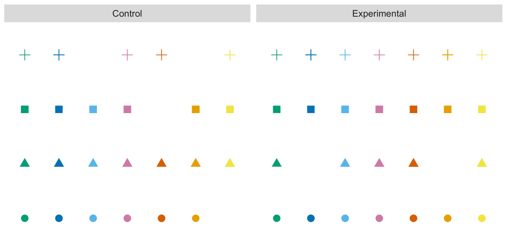

```
]


---

class: inverse, middle


# Inferential statistics for hypothesis testing

Which hypothesis tests should we use for each combination of variables?


---

class: middle

## Inferential statistics for hypothesis testing

```{r, echo = FALSE}

library(formattable)

visuals <- tibble(
  `Variable Type` = c("Nominal", "Ordinal", "Continuous"),
  Nominal = c("Chi-squared Test of Association", "Chi-squared Test of Association", "<strong>ANOVA/t-test</strong>"),
  Ordinal = c("", "Chi-squared/Spearman Correlation t-test", "<strong>ANOVA/t-test</strong>"),
  Continuous = c("", "", "Pearson/Spearman Correlation t-test")
)

visuals_tab <- formattable::formattable(visuals,
                         list(
                           `Variable Type` = formatter("span", style = formattable::style(font.weight = "bold"))
                         ))

as.htmlwidget(visuals_tab, width = "100%")

```

---

class: middle

# ANOVA/t-test

<br>

__Use case__:

* One 'grouping' __nominal/categorical/ordinal__ variable and one __continuous__ variable.
* For t-test, 'grouping' variable must only have two groups. For ANOVA, grouping variable may have any number of groups.

--

__Null hypothesis__:

* __H<sub>0</sub>__: The mean value of all groups is equal. (There are no significant differences between group averages).

--
 

__Assumptions__:

* __Independence of observations__: Each observation has no bearing on the value of other observations (e.g. if there were multiple observations of the same person, this assumption would be violated)
* __Normality__: Normality of *residuals*; in reality, the means from multiple resamples from each group should be normally distributed in the population ([Glass et al. 1972](https://journals.sagepub.com/doi/10.3102/00346543042003237), [Harwell et al. 1992](https://journals.sagepub.com/doi/10.3102/10769986017004315), [Lix et al. 1996](https://www.jstor.org/stable/1170654)). 
* __Homogeneity of variances__: the variance of the continuous variable should be approximately the same in all groups. 


---

class: middle

# ANOVA/t-test Example
<br>

.pull-left[

__Exercise __

* Load up the __`anova-sig`__ `R` Shiny App following the hand-out steps (hopefully you did this in advance!)
* If you can't get this working, you can use the online version:  [https://webb.shinyapps.io/anova-sig/](https://webb.shinyapps.io/anova-sig/)

]

.pull-right[

```{r, echo = FALSE, fig.alt="A screenshot is shown of the ANOVA app. It shows the user interface."}

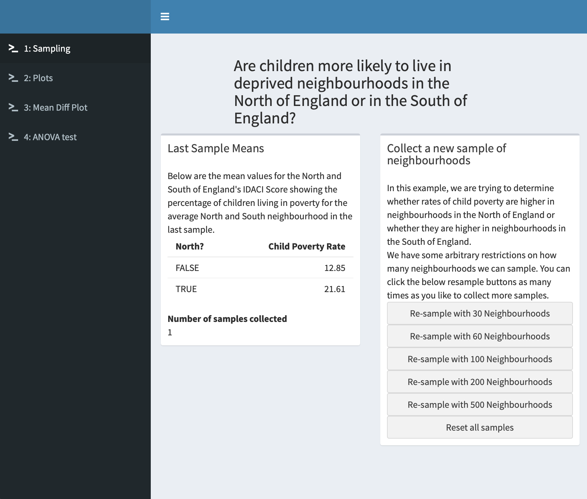

```

]


---

class: middle

## Inferential statistics for hypothesis testing

```{r, echo = FALSE}

library(formattable)

visuals <- tibble(
  `Variable Type` = c("Nominal", "Ordinal", "Continuous"),
  Nominal = c("Chi-squared Test of Association", "Chi-squared Test of Association", "ANOVA/t-test"),
  Ordinal = c("", "Chi-squared/Spearman Correlation t-test", "ANOVA/t-test"),
  Continuous = c("", "", "<strong>Pearson/Spearman Correlation t-test</strong>")
)

visuals_tab <- formattable::formattable(visuals,
                         list(
                           `Variable Type` = formatter("span", style = formattable::style(font.weight = "bold"))
                         ))

as.htmlwidget(visuals_tab, width = "100%")

```

---


class: middle

# Correlation Coefficient Significance Tests

<br>

__Use case__:

* Testing the significance of an association between two continuous variables.

--

__Null hypothesis__:

* __H<sub>0</sub>__: The correlation coefficient for the association between the two variables is equal to zero. (That there is no relationship between them).

--
 

__Assumptions__:

* __Independence of observations__.
* __Linearity__: there is a linear association between the two variables. In other words, if you were to draw a line of best fit through a scatterplot of them, the best fit would be a straight line.
* __No significant outliers__: any large outliers should be identified and removed.
* **Bivariate normal distribution**: the variables should have a bivariate normal distribution. This is always the case if both variables are normally distributed and their relationship is linear, but can also be the case if one or both are non-normally distributed if, for example, the residuals around a line of best fit between them are normally distributed. 


---

class: middle

# Correlation Coefficient Significance Tests
<br>

.pull-left[

__Exercise __

* Load up the __`cor-sig`__ `R` Shiny App following the hand-out steps (hopefully you did this in advance!)
* If you can't get this working, you can use the online version:  [https://webb.shinyapps.io/cor-sig/](https://webb.shinyapps.io/cor-sig/)

]

.pull-right[

```{r, echo = FALSE, fig.alt = "A screenshow is shown of the correlation app. The user interface is shown."}

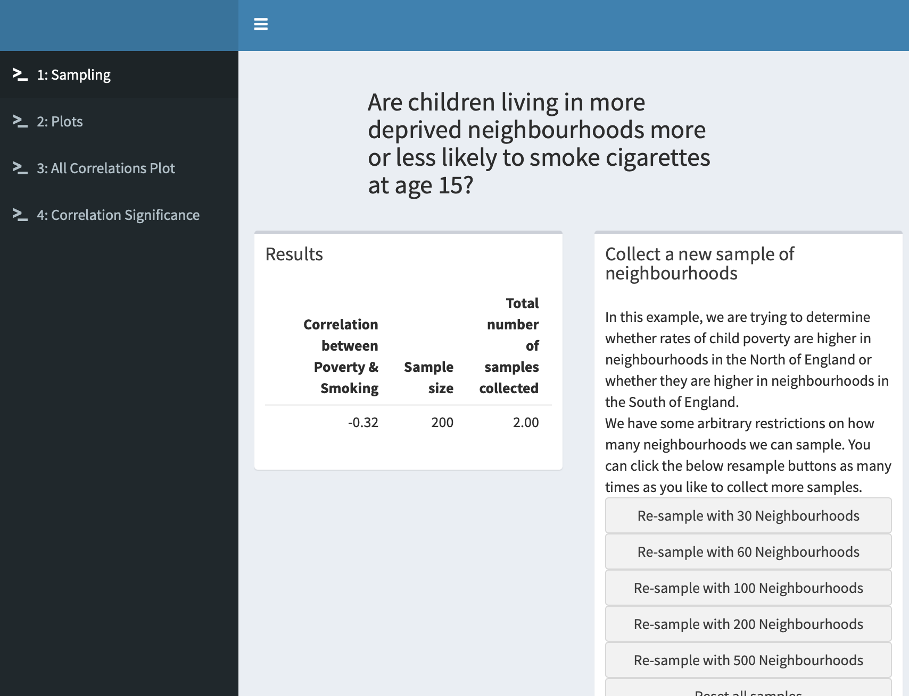

```

]

---
class: middle

# Summary

* Hypothesis tests are one important way we can make broader __generalisations about our findings__ from the data. This can be very powerful.
* _p-values_ and _critical/alpha values_ can be used to make judgements about whether we have enough evidence to reject a given null hypothesis; __if our p-value is lower than our critical value (usually 0.05), we can reject the null hypothesis__.
* The __results of hypothesis tests are determined by sample size__ and by the __strength of the association__ between variables.
* However, their use requires considerable caution to ensure that:
  * We select __the correct kind of hypothesis test__ for our data.
  * p-values are __interpreted correctly__.
  * Hypothesis tests are __used appropriately__ (on a suitable kind of sample or within an appropriate study design).
  * We report any possible __violations of assumptions__.


---

class: middle 

# R Exercise

There is no `R` exercise this week, instead (if we have any time remaining) you should:

- Look at the __assessment 1 details__ that are now on Blackboard
- Go back and finish any exercises you've not been able to finish
- Next week we will practice doing these tests in `R`