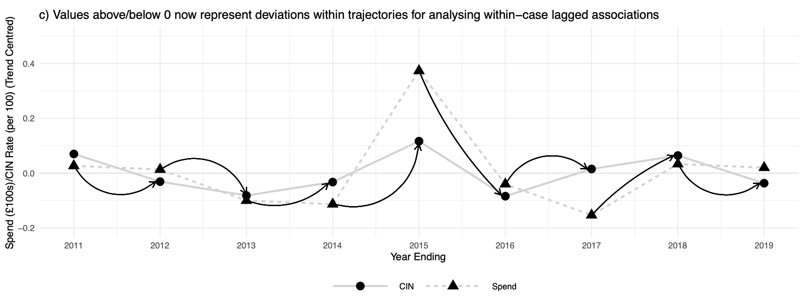
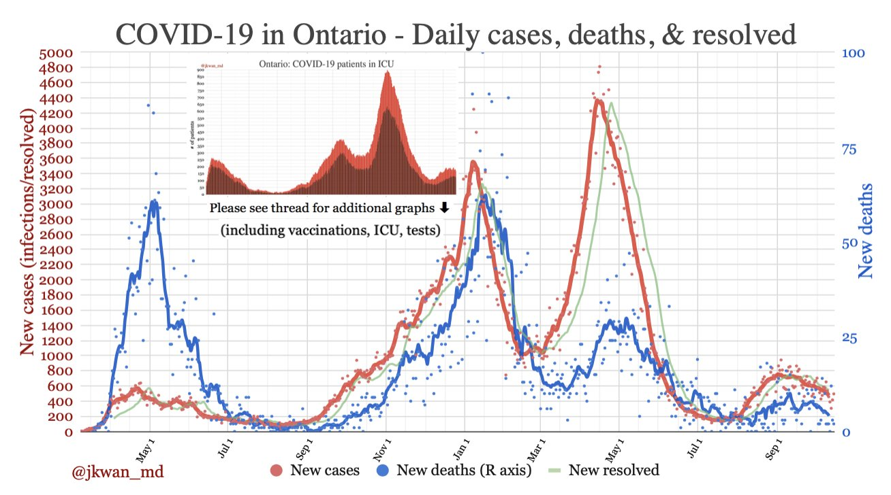
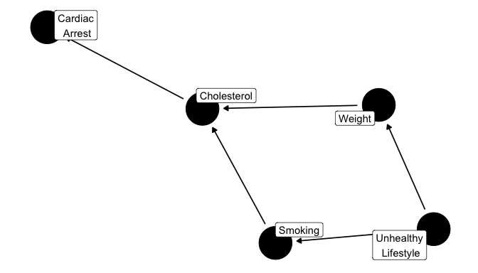

class: middle
background-size: contain

<br><br><br>

# .tuos_purple[SMI606: Week 5<br>Causality]

<br><br>

**Dr. Calum Webb**<br>
Sheffield Methods Institute, the University of Sheffield.<br>
[c.j.webb@sheffield.ac.uk](mailto:c.j.webb@sheffield.ac.uk)

```{r setup, include=FALSE}
options(htmltools.dir.version = FALSE)

# These packages are required for creating the slides
# Many will need to be installed from Github
library(icons)
library(tidyverse)
library(xaringan)
library(xaringanExtra)
library(xaringanthemer)

# Defaults for code
knitr::opts_chunk$set(
  fig.width=9, fig.height=3.5, fig.retina=3,
  out.width = "100%",
  cache = FALSE,
  echo = TRUE,
  message = FALSE, 
  warning = FALSE,
  fig.show = TRUE,
  hiline = TRUE
)

# set global theme for ggplot to make background #F8F8F8F8 (off white),
# but otherwise keep all ggplot themes default (better for teaching)
theme_set(
  theme(plot.background = element_rect(fill = "#F8F8F8", colour = "#F8F8F8"), 
        panel.background = element_rect(fill = "#F8F8F8", colour = "#F8F8F8"), 
        legend.background = element_rect(fill = "#F8F8F8", colour = "#F8F8F8")
        )
  )


```

```{r xaringan-tile-view, echo=FALSE}
# Use tile overview by hitting the o key when presenting
xaringanExtra::use_tile_view()
```

```{r xaringan-logo, echo=FALSE}
# Add logo to top right
xaringanExtra::use_logo(
  image_url = "header/smi-logo-white.png",
  exclude_class = c("inverse", "hide_logo"), 
  width = "180px", position = css_position(top = "1em", right = "2em")
)
```

```{r xaringan-themer, include=FALSE, warning=FALSE}

# Set some global objects containing the colours
# of the university's branding
primary_color <- "#131E29"
secondary_color <- "#440099"
tuos_blue <- "#9ADBE8"
white = "#F8F8F8"
tuos_yellow <- "#FCF281"
tuos_purple <- "#440099"
tuos_red <- "#E7004C"
tuos_midnight <- "#131E29"

# The bulk of the styling is handled by xaringanthemer
style_duo_accent(
  primary_color = "#131E29",
  secondary_color = "#440099",
  colors = c(tuos_purple = "#440099", 
             grey = "#131E2960", 
             tuos_blue ="#9ADBE8",
             tuos_mint = "#00CE7C"),
  header_font_google = xaringanthemer::google_font("Source Serif Pro", "600", "600i"),
  text_font_google   = xaringanthemer::google_font("Source Sans Pro", "300", "300i", "600", "600i"),
  code_font_google   = xaringanthemer::google_font("Lucida Console"),
  header_h1_font_size = "2rem",
  header_h2_font_size = "1.5rem", 
  header_h3_font_size = "1.25rem", 
  text_font_size = "0.9rem",
  code_font_size = "0.65rem", 
  code_inline_background_color = "#F8F8F8", 
  inverse_text_color = "#9ADBE8", 
  background_color = "#F8F8F8", 
  text_color = "#131E29", 
  link_color = "#005A8F", 
  inverse_link_color = "#F8F8F8",
  text_slide_number_color = "#44009970",
  table_row_even_background_color = "transparent", 
  table_border_color = "#44009970",
  text_bold_font_weight = 600
)

```


```{r xaringan-panelset, echo=FALSE}
# Allow for adding panelsets (see example on slide 2)
xaringanExtra::use_panelset(in_xaringan = TRUE)

style_panelset_tabs(
  background = "#F8F8F8",
  active_background = "#F8F8F8",
  hover_background = "#F8F8F8"
)


```

```{r xaringanExtra, echo = FALSE}
# Adds white progress bar to top
xaringanExtra::use_progress_bar(color = "#F8F8F8", location = "top")
```

```{r xaringan-extra-styles, echo = FALSE}
# Allow for code to be highlighted on hover
xaringanExtra::use_extra_styles(
  hover_code_line = TRUE,         #<<
  mute_unhighlighted_code = TRUE  #<<
)
```

```{r share-again, echo=FALSE}
# Add sharing links and other embedding tools
xaringanExtra::use_share_again()
```

```{r xaringanExtra-search, echo=FALSE}
# Add magnifying glass search function to bottom left for quick
# searching of slides
xaringanExtra::use_search(show_icon = TRUE, auto_search = FALSE)
```

---
class: middle


.pull-right[

<br><br><br><br><br><br>

# Sign In

]
---
class: middle

## Learning Objectives

.panelset[

.panel[.panel-name[What will I learn?]

By the end of this week you will:

* Be able to describe what we mean by causality and how we can use statistical methods to explore probabilistic causation.

* Be able to explain three bases upon which causal inference can be made: robust dependence, consequential manipulation, and generative process.

* Be able to critically assess these foundations of causal inference.

* Be introduced to some tools for developing causal models (Directed Acyclic Graphs).

* Be able to identify which types of research design and data are appropriate for making causal inference. 


]

.panel[.panel-name[How does this week fit into my course?]

* It is increasingly important for new social scientists to have a good working knowledge of causality and causal analysis.

* Being able to synthesize different forms of research into generative processes (e.g. DAGs) is increasingly a goal of postgraduate and postdoctoral research projects.

* This week's content will provide some of the fundamental building blocks for more advanced methods (e.g. Structural Equation Modelling, Longitudinal Modelling, A-B testing) you may need to learn in your career or may wish to cover in the rest of your studies.


]


]


???

---

class: inverse, middle


# What do we mean by causality?


---

class: middle

# 'Causality'

Using the work and definitions developed by sociologist John H. Goldthorpe (2001).


.pull-left[

### Deterministic Causality

* In philosophy and theology, the idea of causality as a deterministic force: Given enough information about past events, every outcome can, in theory, be explained or predicted.

[Hoefer, 2003. *Causal Determinism*. Stanford Encyclopedia of Philosophy.](https://plato.stanford.edu/entries/determinism-causal/)

]

.pull-right[

### Probabilistic Causality

* Causes raise the probability of their effects, some of which may be screened off or superseded by other causal relations. <br>&nbsp;

[*Hitchcock, 2018. Probabilistic Causation. Stanford Encyclopedia of Philosophy*](https://plato.stanford.edu/entries/causation-probabilistic/)

]


---

class: inverse, middle

### [S]uppose that Billy and Suzy each throw a rock at a bottle, and that each has a certain probability of hitting and breaking it. As it happens, *Suzy’s rock hits the bottle, and Billy’s doesn’t. As things actually happened, we would say that Suzy’s throw caused the bottle to shatter, while Billy’s didn’t*. Nonetheless, Billy’s throw increased the probability that the bottle would shatter ... Billy’s throw had a tendency to shatter the bottle; it was a potential cause of the bottle shattering; it was the sort of thing that generally causes shattering; but it did not actually cause the bottle to shatter.

[*Hitchcock, 2018. Probabilistic Causation. Stanford Encyclopedia of Philosophy*](https://plato.stanford.edu/entries/causation-probabilistic/)


---

class: inverse, middle

### [S]uppose that Billy and Suzy each throw a rock at a bottle, and that each has a certain probability of hitting and breaking it. As it happens, Suzy’s rock hits the bottle, and Billy’s doesn’t. As things actually happened, we would say that Suzy’s throw caused the bottle to shatter, while Billy’s didn’t. Nonetheless, *Billy’s throw increased the probability that the bottle would shatter* ... *Billy’s throw had a tendency to shatter the bottle; it was a potential cause of the bottle shattering; it was the sort of thing that generally causes shattering; but it did not actually cause the bottle to shatter*.

[*Hitchcock, 2018. Probabilistic Causation. Stanford Encyclopedia of Philosophy*](https://plato.stanford.edu/entries/causation-probabilistic/)


---
class: middle, inverse

# Causation as "robust dependence": temporal causality


---

class: middle

# Causation as Robust Dependence

Causality can be argued to exist when we can observe a consistent, temporal causal effect.

> #### "A variable, X, 'Granger causes' Y if, after taking into account all information apart from values of X, these values still add to one's ability to predict future values of Y."

.right[Goldthorpe, 2001: 2]

--

* Does knowing the value of X at a preceding time point improve our accuracy when predicting Y, after accounting for other competing explanations?

--

* Measurements of X and controls (Z) **must** preceed measurements of Y.

--

* Can be __deepened through 'Lazarfeldian elaboraton'__
  * Identify a 'signal' and 'response'
  * Iteratively introduce possible confounding factors and see if the pattern between 'signal' and 'response' stays the same (or continues to exist)


???


---

class: middle
background-color: white


.center[

```{r, echo = FALSE, out.width="100%"}



```

]

---

class: middle
background-color: white

.center[

```{r, echo = FALSE, out.width="90%"}



```

*Source: Dr. Jennifer Kwan @jkwan_md*

]


---

class: middle

# Causation as Robust Dependence

__Weaknesses of Granger causality__

* **Easy for this approach to end up being atheoretical**, with causality claimed purely on the basis of statistical models.
  * "[S]ociologists have strongly criticized the supposition that statistical techniques can in them- selves provide adequate causal explanations of social phenomena"
  
--

* Is it possible to __fully incorporate all of the possible confounding variables__, or to adequately measure some causes.
  * "[A]vailable sociological theory may just not be strong enough to help produce models that can be treated as genuinely 'structural' — i.e. so parameterized that their co-efficients are sufficiently invariant and autonomous to sustain claims about the consequences of changes in the variables deemed to be 'exogenous'."


---
class: middle, inverse

# Causation as "consequential manipulation": experiments


---

class: middle

# Causation as Consequential Manipulation

Causation as some environmental factor that, when manipulated (or left alone), can be demonstrated to cause some change in an outcome variable of interest.

> #### "Here, attention centres specifically on 'the consequences of performing particular acts' or, in other words, on establishing causation through experimental methods."

.right[Goldthorpe, 2001: 4]

* If I manipulate this thing, does the result change (probabilistically thinking)? If so, the thing I manipulated can be said to have caused a change in something else.

--

* Something __must__ be manipulated or manipulatable, and exposure to the change or difference must be either randomly chosen *or* be unrelated to the variables of interest (as in a random experiment).

---

background-color: white

# Causation as Consequential Manipulation

.pull-left[

**Exercise**

<br>

At the beginning of this session, chocolate buttons were randomly allocated behind the computer lab computers.

If you got chocolate buttons, you are the treatment group. If you did not get chocolate buttons, you are the control group.

* H<sub>0</sub>: Being given chocolate buttons will have no effect on students' enjoyment of learning quantitative methods.

Please now fill out the following form: https://forms.gle/sigw2jprMohiaBZM8 

]

.pull-right[

```{r, echo = FALSE, out.width="85%"}


```

]

```{r, eval = FALSE, include=FALSE}

# Analysis of experiment data

library(googlesheets4)
library(tidyverse)

gs4_deauth()

experiment_data <- googlesheets4::read_sheet("https://docs.google.com/spreadsheets/d/1aZfcAjaTzx8oCnqr2k6pyff9tL3RrpTJ3CA_BJhmT6Q/edit?usp=sharing")

experiment_data <- experiment_data %>%
  rename(timestamp = 1,
         sweet = 2, 
         enjoy_quants = 3)


experiment_data <- experiment_data %>%
  mutate(timestamp = as.character(timestamp)) %>%
  filter(str_detect(timestamp, "2024"))

experiment_data %>%
  group_by(sweet) %>%
  summarise(mean_enjoy_quants = mean(enjoy_quants, na.rm = TRUE))

anova_sweets <- aov(enjoy_quants ~ sweet, data = experiment_data)

experiment_data %>% 
  ggplot() +
  geom_histogram(aes(x = enjoy_quants)) +
  facet_grid(~sweet)

summary(anova_sweets)
TukeyHSD(anova_sweets)

chisq.test(experiment_data$sweet, experiment_data$enjoy_quants)

```


---

background-color: white

# Causation as Consequential Manipulation


.pull-left[

<br><br>

### .tuos_purple[How feasible are these kind of studies in your field? What are the potential weaknesses (having just been subjected to one)?]

[Wooclap Link](https://app.wooclap.com/AXXIZJ?from=instruction-slide)

Event code: **AXXIZJ**

]

.pull-right[

```{r, echo = FALSE, out.width="85%"}


```


]


---
class: middle, inverse

# Causation as "generative process": DAGs and the New Science of Causality


---
class: middle
background-color: white

# Causation as Generative Process


.pull-left[

* __Start with a theoretical model__ of a generative causal process based on a variety of evidence (qual + quants).

* __Develop the processes in this model__, ideally down to the 'methodological individual' — individual actions, characteristics, and events (if appropriate).

* Design hypotheses and research studies to __test the causal associations between each of the processes__. Some may be "stronger" causal evidence, others may be weaker by necessity.

* Aim for __falsification__ of the processes and __adaptation__ of the theoretical model, not "once-and-for-all" __validation__.

]

.pull-right[

<br><br>

```{r, echo = FALSE, out.width="85%"}



```

*Directed Acyclic Graph example by [Malcolm Barrett](https://cran.r-project.org/web/packages/ggdag/vignettes/intro-to-dags.html)*

]


???

Exercise: DAG walkthrough on Jamboard


---

background-color: white

# DAGS: The Total Effect (Estimand)


```{r, out.height=350, fig.height=3.5, echo = FALSE, out.width=1200, fig.width=12}

library(dagitty)

dag1_spec <- 'dag{

  "Prior Education" -> "Degree Classification"
   
}'

dag1_coord <- list(x = c("Prior Education" = 0, "Degree Classification" = 4),
                   y = c("Prior Education" = 0, "Degree Classification" = 0))

dag1 <- dagitty(dag1_spec)
coordinates(dag1) <- dag1_coord

rethinking::drawdag(dag1, xlim = c(-2, 6), ylim = c(-3, 3))

```

.center[We start with the thing we want to estimate (our estimand), in this case the strength of the association between a person's secondary school outcomes and their university degree classification.]


---

background-color: white

# DAGS: Confounders and the Direct Effect


```{r, out.height=350, fig.height=3.5, echo = FALSE, out.width=1200, fig.width=12}

dag_spec <- 'dag{

  "Prior Education" -> "Degree Classification"
  "Subject(s) Studied" -> {"Prior Education" "Degree Classification"}
   
}'

dag_coord <- list(x = c("Prior Education" = 0, "Degree Classification" = 4, "Subject(s) Studied" = 2),
                   y = c("Prior Education" = 0, "Degree Classification" = 0, "Subject(s) Studied" = -2)
                   )

dag <- dagitty(dag_spec)
coordinates(dag) <- dag_coord

rethinking::drawdag(dag, xlim = c(-2, 6), ylim = c(-3, 3))

```

.center[We know that there will be certain confounders in our data: things that influence both the predictor/cause (Prior Education) and the outcome/effect (Degree Classification). We need to control for these things to get an unbiased estimate of the effect. For example, here, we might want to only include people who studied the same subjects.]


---

background-color: white

# DAGS: Pipes, Direct and Indirect Effects


```{r, out.height=350, fig.height=3.5, echo = FALSE, out.width=1200, fig.width=12}

dag_spec <- 'dag{

  "Prior Education" -> "Degree Classification"
  "Prior Education" -> "Study Skills" -> "Degree Classification"
   
}'

dag_coord <- list(x = c("Prior Education" = 0, "Degree Classification" = 4, "Study Skills" = 2),
                   y = c("Prior Education" = 0, "Degree Classification" = 0, "Study Skills" = 2)
                   )

dag <- dagitty(dag_spec)
coordinates(dag) <- dag_coord

rethinking::drawdag(dag, xlim = c(-2, 6), ylim = c(-3, 3))

```

.center["Pipes" occur when the effects of the 'cause' operates through some mechanism(s), for example, the effect of prior education on degree outcome is partially mediated through prior education teaching more effective study skills. You may or may not want to condition effects based on mediators.]

---

background-color: white

# DAGS: "Blocked" Pipes: Post-treatment Bias


```{r, out.height=350, fig.height=3.5, echo = FALSE, out.width=1200, fig.width=12}

dag_spec <- 'dag{

  "Prior Education" -> "Test Scores" -> "Degree Classification"
   
}'

dag_coord <- list(x = c("Prior Education" = 0, "Degree Classification" = 4, "Test Scores" = 2),
                   y = c("Prior Education" = 0, "Degree Classification" = 0, "Test Scores" = 0)
                   )

dag <- dagitty(dag_spec)
coordinates(dag) <- dag_coord

rethinking::drawdag(dag, xlim = c(-2, 6), ylim = c(-3, 3))

```

.center[We can also imagine some of these pipes being 'blockers' rather than mediators — test scores will obviously dictate degree classification and may fully mediate prior education, so conditioning on test scores as well as degree classification would incorrectly negate any effect of prior education.]

---

background-color: white

# DAGS: Collider Bias


```{r, out.height=350, fig.height=3.5, echo = FALSE, out.width=1200, fig.width=12}

dag_spec <- 'dag{

  "Prior Education" -> "Degree Classification"
  {"Prior Education" "Degree Classification"} -> "Self-rated Academic Ability"
   
}'

dag_coord <- list(x = c("Prior Education" = 0, "Degree Classification" = 4, "Self-rated Academic Ability" = 4),
                   y = c("Prior Education" = 0, "Degree Classification" = 0, "Self-rated Academic Ability" = -2)
                   )

dag <- dagitty(dag_spec)
coordinates(dag) <- dag_coord

rethinking::drawdag(dag, xlim = c(-2, 6), ylim = c(-3, 3))

```

.center[Collider bias is an often overlooked source of bias that occurs where the relationship between a cause and an outcome is conditioned on something that is a common consequence of both; e.g. here past educational performance will likely impact a person's self-rated academic ability.]


---

class: middle
background-color: white

# Collider Bias

```{r, echo = FALSE}

set.seed(100)

scores <- MASS::mvrnorm(n = 100, mu = c(0, 0), Sigma = matrix(c(1, 0.7^2, 1, 0.7^2), nrow = 2, ncol = 2),
                        empirical = TRUE)
prior_ed <- scores[,1]*10 + 70 
degree_ed <- scores[,2]*15 + 60 

inv_logit <- function (x) 
{
    p <- 1/(1 + exp(-x))
    p <- ifelse(x == Inf, 1, p)
    p
}

prob_high <- numeric()
for (i in 1:100) {
  prob_high[i] <- inv_logit(rnorm(1, mean = -1.108663 + 2.5*scores[,1][i] + 5*scores[,2][i], sd = 0.3))
}

prob_mid <- numeric()
for (i in 1:100) {
  prob_mid[i] <- inv_logit(rnorm(1, mean = -1, sd = 0.1))
}

prob_low <- numeric()
for (i in 1:100) {
  prob_low[i] <- inv_logit(rnorm(1, mean = -1.108663 - 2.5*scores[,1][i] + - 5*scores[,2][i], sd = 0.3))
}

acad_probs <- tibble(prob_low, prob_mid, prob_high) %>%
  mutate(
    sum_prob = rowSums(across(prob_low:prob_high))
  ) %>%
  mutate_at(vars(prob_low:prob_high), ~./sum_prob) 

acad_abil <- character()
for (i in 1:100) {
  acad_abil[i] <- sample(c("Low", "Medium", "High"), 1, replace = TRUE, prob = acad_probs[i,][1:3])
}

acad_sim <- tibble(prior_ed, degree_ed, acad_abil)

```

```{r, echo = FALSE}

acad_sim %>%
  ggplot() +
  geom_point(aes(x = prior_ed, y = degree_ed)) +
  theme_minimal() +
  ylab("Degree Average Score") +
  xlab("A-level Average Score") +
  scale_x_continuous(limits = c(40,100)) +
  scale_y_continuous(limits = c(25,100)) +
  ggtitle(paste("Correlation = ", round(cor(acad_sim$prior_ed, acad_sim$degree_ed), 2)) )
  

```


---

background-color: white

class: middle

# Collider Bias

```{r, echo = FALSE}

acad_sim %>%
  mutate(acad_abil = factor(acad_abil, levels = c("Low", "Medium", "High"))) %>%
  ggplot() +
  geom_point(aes(x = prior_ed, y = degree_ed, col = acad_abil)) +
  theme_minimal() +
  ylab("Degree Average Score") +
  xlab("A-level Average Score") +
  labs(col = "Self-Rated\nAcademic\nAbility") +
  scale_x_continuous(limits = c(40,100)) +
  scale_y_continuous(limits = c(25,100)) +
  ggtitle(paste("Correlation = ", round(cor(acad_sim$prior_ed, acad_sim$degree_ed), 2)) ) +
  ggthemes::scale_color_colorblind()
  

```

---

class: middle
background-color: white

# Collider Bias

```{r, echo = FALSE}

high_ab <- acad_sim %>% filter(acad_abil == "High")
med_ab <- acad_sim %>% filter(acad_abil == "Medium")
low_ab <- acad_sim %>% filter(acad_abil == "Low")

#round(cor(high_ab$prior_ed, high_ab$degree_ed), 2)
#round(cor(med_ab$prior_ed, med_ab$degree_ed), 2)
#round(cor(low_ab$prior_ed, low_ab$degree_ed), 2)

acad_sim %>%
  mutate(acad_abil = case_when(acad_abil == "High" ~ "High (R = 0.43)",
                               acad_abil == "Medium" ~ "Medium (R = 0.57)",
                               acad_abil == "Low" ~ "Low (R = 0.56)",
                               )) %>%
  mutate(acad_abil = factor(acad_abil, levels = c("Low (R = 0.56)", "Medium (R = 0.57)", "High (R = 0.43)"))) %>%
  ggplot() +
  geom_point(aes(x = prior_ed, y = degree_ed, col = acad_abil)) +
  theme_minimal() +
  ylab("Degree Average Score") +
  xlab("A-level Average Score") +
  labs(col = "Self-Rated\nAcademic\nAbility") +
  facet_wrap(~acad_abil) +
  ggthemes::scale_color_colorblind() +
  theme(legend.position = "none")


```


---

background-color: white

# Collider Bias

```{r, out.height=350, fig.height=3.5, echo = FALSE, out.width=1200, fig.width=12}

dag_spec <- 'dag{

  "Location Quality" -> "Food Quality"
  {"Location Quality" "Food Quality"} -> "Restaurant Still Open"
   
}'

dag_coord <- list(x = c("Location Quality" = 0, "Food Quality" = 4, "Self-rated Academic Ability" = 4, "Restaurant Still Open" = 2),
                   y = c("Location Quality" = 0, "Food Quality" = 0, "Self-rated Academic Ability" = -2, "Restaurant Still Open" = -2)
                   )

dag <- dagitty(dag_spec)
coordinates(dag) <- dag_coord

rethinking::drawdag(dag, xlim = c(-2, 6), ylim = c(-3, 3))

```

.center[What can happen when we have a collider that determines selection?]

---

class: inverse, middle

# Do restaurants in better locations have better quality food?


---
class: middle
background-color: white

# Collider Bias

```{r, out.height=350, fig.height=3.5, out.width=450, fig.width=4.5, echo = FALSE}

set.seed(2022)
location_q <- rnorm(1000)
food_q <- rnorm(1000)

rest_open <- inv_logit(rnorm(1000, -1.203973 + 1*location_q + 1*food_q, 0.5))

restaurant_data <- tibble(location_quality = location_q*12 + 50, 
       food_quality = food_q*12+50, 
       open_status = ifelse(rest_open > 0.5, "Open", "Closed"
                            )
       )

```

.pull-left[

```{r, echo = FALSE, out.height=350, fig.height=3.5, out.width=450, fig.width=4.5}

restaurant_data %>%
  ggplot() +
  geom_point(aes(x = location_quality, y = food_quality), size = 0.7) +
  theme_minimal() +
  xlab("Food Quality /100") +
  ylab("Location Quality /100") +
  ggtitle("Correlation = 0.009")

```

]

.pull-right[

```{r, echo = FALSE, out.height=350, fig.height=3.5, out.width=450, fig.width=4.5}

ggplot() +
  theme_void()

```

]

.center[Before including whether a restaurant is open or closed we find no relationship.]

---
class: middle
background-color: white

# Collider Bias

.pull-left[

```{r, echo = FALSE, out.height=350, fig.height=3.5, out.width=450, fig.width=4.5}

restaurant_data %>%
  ggplot() +
  geom_point(aes(x = location_quality, y = food_quality), size = 0.7) +
  theme_minimal() +
  xlab("Location Quality /100") +
  ylab("Food Quality /100") +
  ggtitle("Correlation = 0.009")

```

]

.pull-right[
```{r, echo = FALSE, out.height=350, fig.height=3.5, out.width=450, fig.width=4.5}

restaurant_data %>%
  ggplot() +
  geom_point(aes(x = location_quality, y = food_quality, alpha = open_status), size = 0.7) +
  scale_alpha_manual(values = c(0.1, 1)) +
  theme_minimal() +
  xlab("Location Quality /100") +
  ylab("Food Quality /100") +
  ggtitle("Correlation = -0.56") +
  theme(legend.position = "none")

```
]

.center[But when only including currently open restaurants...]


---

background-color: white

# DAGS: Putting it all together

```{r, echo = FALSE, out.height=350, fig.height=3.5, out.width=1200, fig.width=12}

dag_spec <- 'dag{

  "Prior Education" -> "Degree Classification"
  {"Prior Education" "Degree Classification"} -> "Self-rated Academic Ability"
  "Subject(s) Studied" -> {"Prior Education" "Degree Classification"}
  "Prior Education" -> "Study Skills" -> "Degree Classification"
   
}'

dag_coord <- list(x = c("Prior Education" = 0, "Degree Classification" = 4, "Self-rated Academic Ability" = 4, "Subject(s) Studied" = 2, "Study Skills" = 2),
                   y = c("Prior Education" = 0, "Degree Classification" = 0, "Self-rated Academic Ability" = -2, "Subject(s) Studied" = -2, "Study Skills" = 2)
                   )

dag <- dagitty(dag_spec)
coordinates(dag) <- dag_coord

rethinking::drawdag(dag, xlim = c(-2, 6), ylim = c(-3, 3))

```

.center[You can follow the rules of '*do*-calculus' to create adjustment sets to find out what kinds of confounding variables you should condition on to identify the total and/or direct effects; the model and findings can then be developed, and their causal claims challenged.]


---

class: middle

# DAGS: Dagitty and Further Reading

```{r}

dagitty::adjustmentSets(dag, exposure = "Prior Education", outcome = "Degree Classification", effect = "total")
dagitty::adjustmentSets(dag, exposure = "Prior Education", outcome = "Degree Classification", effect = "direct")

```

.pull-left-big[

* Peters, J, et al. "Elements of Causal Inference". [Open Access Version Available](https://mitpress.mit.edu/9780262037310/elements-of-causal-inference/) from MIT Press.
* Pearl, J. et al. "Causal Inference in Statistics: A Primer", or "The Book of Why". 
* McElreath, R. "Statistical Rethinking: A Bayesian course with examples in R and Stan. 2nd Edition" 

]

.pull-right-small[

.center[
```{r, echo = FALSE, out.width="30%", fig.alt = "Book cover of The Book of Why by Pearl and Mackenzie"}


```
]

]


---
class: middle, inverse

# Which kinds of research design support causal analyses?

---

## Research Designs & Statistical Causal Analyses

.pull-left[

* __Survey__
  * Cross-sectional
  * Longitudinal
  
* __Experiment__
  * Randomised Controlled Trials
  * Survey Experiments
  * Natural Experiments
  
* __Observation__
  * Administrative Data
  * Scraped/"Big" Data
  * Observational or Sensor Data

]


---

## Research Designs & Statistical Causal Analyses

.pull-left[

* __Survey__
  * __Cross-sectional__
  * Longitudinal
  
* __Experiment__
  * Randomised Controlled Trials
  * Survey Experiments
  * Natural Experiments
  
* __Observation__
  * Administrative Data
  * Scraped/"Big" Data
  * Observational or Sensor Data

]

.pull-right[

#### __Cross-sectional Survey__

Face-to-face or postal questionnaire-based data collection. 

* Usually a very large sample size (>200,000) and representative of the population.
* However, __usually not possible to make causal inferences from__ based on either robust dependence or consequential manipulation.
* UNLESS, the cross-sectional survey either
  * Included data on something where an argument for a natural experiment could be made.
  * Included a survey experiment design in it.
  
Example:

* [Labour Force Survey](https://beta.ukdataservice.ac.uk/datacatalogue/studies/study?id=1756)

]


---

## Research Designs & Statistical Causal Analyses

.pull-left[

* __Survey__
  * Cross-sectional
  * __Longitudinal__
  
* __Experiment__
  * Randomised Controlled Trials
  * Survey Experiments
  * Natural Experiments
  
* __Observation__
  * Administrative Data
  * Scraped/"Big" Data
  * Observational or Sensor Data

]

.pull-right[

#### __Longitudinal Survey__

Face-to-face or postal questionnaire-based data collection. 

* Usually a smaller but often substantial (~5000-15,000) representative sample, __but__ longitudinal surveys follow the same people for multiple years.
* However, __usually possible to make causal inferences from__ on the basis of __robust dependence__.
* But may also include:
  * Included data on something where an argument for a natural experiment could be made.
  * Included a survey experiment design in it.
  
Example:

* [UK HLS/Understanding Society](https://www.understandingsociety.ac.uk/documentation/access-data)

]


---

## Research Designs & Statistical Causal Analyses

.pull-left[

* __Survey__
  * Cross-sectional
  * Longitudinal
  
* __Experiment__
  * __Randomised Controlled Trials__
  * Survey Experiments
  * Natural Experiments
  
* __Observation__
  * Administrative Data
  * Scraped/"Big" Data
  * Observational or Sensor Data

]

.pull-right[

#### __Randomised Controlled Trial__

A trial of some treatment(s) on some outcome where participants are randomly assigned to either treatment or control groups.

* Usually a small sample, not often representative.
* Specifically designed to __allow for causal inference based on__ __consequential manipulation__.

  
Example:

* [Adena, Alizade & Bohner, 2019. Quality certifications for nonprofits, charitable giving, and donor's trust](https://search.gesis.org/research_data/SDN-10.7802-1.2121)

]


---

## Research Designs & Statistical Causal Analyses

.pull-left[

* __Survey__
  * Cross-sectional
  * Longitudinal
  
* __Experiment__
  * Randomised Controlled Trials
  * __Survey Experiments__
  * Natural Experiments
  
* __Observation__
  * Administrative Data
  * Scraped/"Big" Data
  * Observational or Sensor Data

]

.pull-right[

#### __Survey Experiment__

A trial of some treatment(s) on some outcome where participants are randomly assigned to either treatment or control groups, however, this is tested through randomising questions and/or question wording or prompts in a survey.

* Usually a small sample, not often representative but can be when incorporated into a large longitudinal or cross-sectional survey as a module.
* Specifically designed to __allow for causal inference based on__ __consequential manipulation__.

  
Example:

* [Zapryanova, 2016. Eurosceptic Cues and Citizen Attitudes](https://search.gesis.org/research_data/SDN-10.7802-1318)

]


---

## Research Designs & Statistical Causal Analyses

.pull-left[

* __Survey__
  * Cross-sectional
  * Longitudinal
  
* __Experiment__
  * Randomised Controlled Trials
  * Survey Experiments
  * __Natural Experiments__
  
* __Observation__
  * Administrative Data
  * Scraped/"Big" Data
  * Observational or Sensor Data

]

.pull-right[

#### __Natural Experiment__

A naturally occuring scenario where people are randomised into a suitable treatment or control group by circumstances outside of the researcher's control, and as such, can be compared to assess causal effects by consequential manipulation. Data can come from administrative records, surveys, or both.

* Usually a small sample, not often representative.
* An organic scenario that __allows for causal inference based on__ __consequential manipulation__.

  
Example:

* [The Oregon Health Insurance Experiment](https://www.nber.org/programs-projects/projects-and-centers/oregon-health-insurance-experiment?page=1&perPage=50)

.small["[i]n early 2008, Oregon opened a waiting list for its Medicaid program for low-income adults that had previously been closed to new enrollment. Approximately 90,000 people signed up for the available 10,000 openings. The state drew names from this waiting list by lottery to fill the openings."]

]


???

list: http://economicspsychologypolicy.blogspot.com/2015/06/list-of-19-natural-experiments.html


---

## Research Designs & Statistical Causal Analyses

.pull-left[

* __Survey__
  * Cross-sectional
  * Longitudinal
  
* __Experiment__
  * Randomised Controlled Trials
  * Survey Experiments
  * Natural Experiments
  
* __Observation__
  * __Administrative Data__
  * Scraped/"Big" Data
  * Observational or Sensor Data

]

.pull-right[

#### __Administrative Data__

Data that is primarily collected for an administrative purpose which can be re-purposed for social science research. Commonly comes from government departments, schools, and welfare, tax, or healthcare administration.

* Often an enormous sample, usually the majority of the population and often close to 100%.
* Often collected over a person's lifespan and updated, therefore __allowing for causal inference by robust dependence__ (or by consequent manipulation in the case of natural experiments, e.g. Universal Credit rollout).

  
Example:

* [Continuous Recording of Social Housing Lettings and Sales (CORE)](https://beta.ukdataservice.ac.uk/datacatalogue/series/series?id=2000107#!/abstract)

]


---

## Research Designs & Statistical Causal Analyses

.pull-left[

* __Survey__
  * Cross-sectional
  * Longitudinal
  
* __Experiment__
  * Randomised Controlled Trials
  * Survey Experiments
  * Natural Experiments
  
* __Observation__
  * Administrative Data
  * __Scraped/"Big" Data__
  * Observational or Sensor Data

]

.pull-right[

#### __Scraped Data__

Data that is largely unstructured but publicly available on the internet or in some other form (like a pdf). This data is then 'scraped' and sorted into a dataset using its underlying web structure (e.g. its HTML code).

* Sometimes not much of a meaningful sample, e.g. unlikely to be a good sample of people, might be a good sample of interactions on a platform (e.g. Tweets on Twitter) if selected randomly.
* Often longitudinal in nature but sometimes temporality is lost if not scraped repeatedly (e.g. prices of items on Amazon, tweets that get deleted)
* __Some potential for causal inference by robust dependence or consequent manipulation.__

  
Example:

* [Scraping Twitter data in R](https://utstat.toronto.edu/~nathan/teaching/sta4002/Class1/scrapingtwitterinR-NT.html)


]


---

## Research Designs & Statistical Causal Analyses

.pull-left[

* __Survey__
  * Cross-sectional
  * Longitudinal
  
* __Experiment__
  * Randomised Controlled Trials
  * Survey Experiments
  * Natural Experiments
  
* __Observation__
  * Administrative Data
  * Scraped/"Big" Data
  * __Observational or Sensor Data__

]

.pull-right[

#### __Observational or Sensor Data__

Traditionally, observational data is collected by researchers watching and recording events that happen. Increasingly, collected by sensors (e.g. geotracking of devices, wearable medical devices).

* Not frequently used in university social science, but much data like this is held by large corporations (e.g. Google, Apple, Fitbit, Garmin).
* Often has a temporal component, so __can feasibly be used for establishing robust dependence__. Could form the basis for a natural experiment. __Researcher can manipulate environment__ in some way and then try and observe cause through __consequential manipulation__, but is this ethical?

  
Example:

* [Weekly People-Movement GPS Patterns in Spain during the pandemic](https://data.world/citydataai/spain-regions)
* [Pokemon Go](https://kotaku.com/the-creators-of-pokemon-go-mapped-the-world-now-theyre-1838974714) / Strava / Garmin / Fitbit

]


---
class: middle, inverse

# Recap: The difference between inference (inferential statistics) and causality (causal inference)


---
class: middle

# Inference
> #### Can we generalise from our sample to the population of interest?

#### Is our data a sample or is it the entire population?

* If the data is of the entire population of interest inference (p-values) **are usually not meaningful** because we have nothing larger than our sample we can generalise to.

--

#### Is our sample a random sample or otherwise *representative* of our population?

* If our sample *is not* representative of our population then __we cannot safely make inferences about the whole population from it__, and should not use p-values, *unless* our data is from an experimental design where we are making inferences based on comparing control and treatment group.

.center[If our data *is* a sample *and* that sample is representative of the wider population of interest, or a result of an experiment, we can use hypothesis testing (p-values).]

--

.center[<strong>The answers are not in the data!</strong>]

---
class: middle

# Causality
> #### Can we say anything about whether changes in one variable *causes* changes in another?

#### Does our study/analysis look at how *preceding* changes in one variable are associated with _subsequent_ changes in another variable? (Robust Dependence/Granger Causality)

* For example, lagged panel models, cross-lagged panel models. If no, we __cannot infer anything about causality.__

--

#### Does our study use an experimental design or leverage a natural experiment? (Consequential Manipulation)

* If it does, then we __can__ make causal inferences about the __effect of the treatment on the outcome__.

--

#### Does our study present a theoretically-sound causal model and condition appropriately on possible confounders/colliders and other 'backdoor paths'? (Generative Process)

* If it does, then we can __accept the evidence as causal but encourage falsification and development of our model__.

--

.center[<strong>The answers are not in the data!</strong>]

---

class: middle

# R Exercise

* This week, you will be practicing running the inferential statistics tests we covered last week using data from a **mixture** of studies (some where causation can be established, some where it cannot).

* Download the `week-5-exercise.zip` file on the Blackboard page and open the Rproject file. Open the `week-5-exercise.Rmd`.

* Go through the exercises. There is a challenge at the end with some open data experiments!