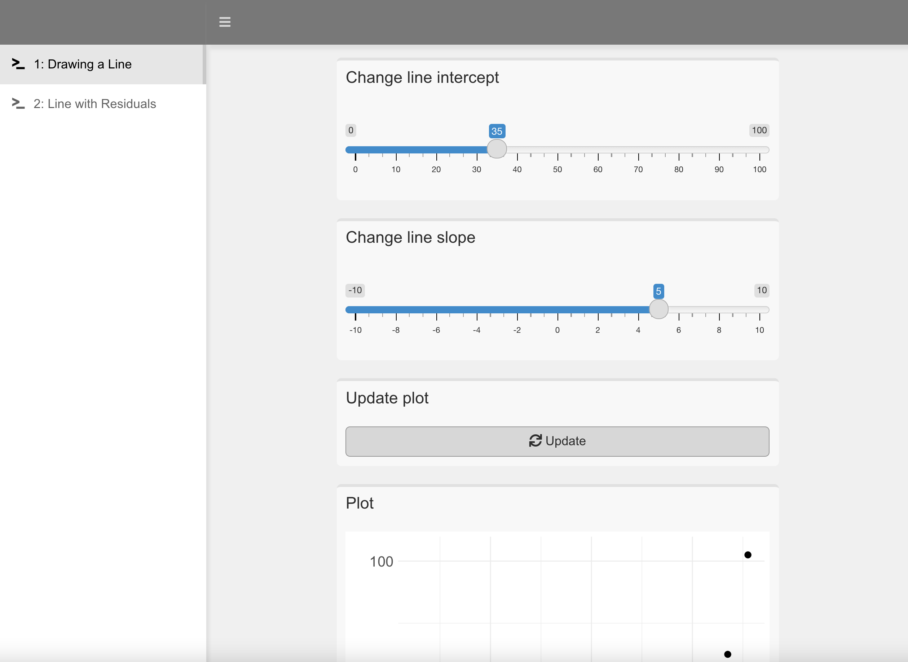

class: middle
background-size: contain

<br><br><br>

# .tuos_purple[EDC459: Week 7<br>Bivariate Linear Regression]

<br><br>

**Dr. Calum Webb**<br>
Sheffield Methods Institute, the University of Sheffield.<br>
[c.j.webb@sheffield.ac.uk](mailto:c.j.webb@sheffield.ac.uk)

```{r setup, include=FALSE}
options(htmltools.dir.version = FALSE)

# These packages are required for creating the slides
# Many will need to be installed from Github
library(icons)
library(tidyverse)
library(xaringan)
library(xaringanExtra)
library(xaringanthemer)

# Defaults for code
knitr::opts_chunk$set(
  fig.width=9, fig.height=3.5, fig.retina=3,
  out.width = "100%",
  cache = FALSE,
  echo = TRUE,
  message = FALSE, 
  warning = FALSE,
  fig.show = TRUE,
  hiline = TRUE
)

# set global theme for ggplot to make background #F8F8F8F8 (off white),
# but otherwise keep all ggplot themes default (better for teaching)
theme_set(
  theme(plot.background = element_rect(fill = "#F8F8F8", colour = "#F8F8F8"), 
        panel.background = element_rect(fill = "#F8F8F8", colour = "#F8F8F8"), 
        legend.background = element_rect(fill = "#F8F8F8", colour = "#F8F8F8")
        )
  )

theme_minimal <- function() 
  {
    ggplot2::theme_minimal() +
    theme(plot.background = element_rect(fill = "#F8F8F8", colour = "#F8F8F8"), 
        panel.background = element_rect(fill = "#F8F8F8", colour = "#F8F8F8"), 
        legend.background = element_rect(fill = "#F8F8F8", colour = "#F8F8F8")
        )
}

theme_void <- function() 
  {
    ggplot2::theme_void() +
    theme(plot.background = element_rect(fill = "#F8F8F8", colour = "#F8F8F8"), 
        panel.background = element_rect(fill = "#F8F8F8", colour = "#F8F8F8"), 
        legend.background = element_rect(fill = "#F8F8F8", colour = "#F8F8F8")
        )
  }

```

```{r xaringan-tile-view, echo=FALSE}
# Use tile overview by hitting the o key when presenting
xaringanExtra::use_tile_view()
```

```{r xaringan-logo, echo=FALSE}
# Add logo to top right
xaringanExtra::use_logo(
  image_url = "header/smi-logo-white.png",
  exclude_class = c("inverse", "hide_logo"), 
  width = "180px", position = css_position(top = "1em", right = "2em")
)
```

```{r xaringan-themer, include=FALSE, warning=FALSE}

# Set some global objects containing the colours
# of the university's branding
primary_color <- "#131E29"
secondary_color <- "#440099"
tuos_blue <- "#9ADBE8"
white = "#F8F8F8"
tuos_yellow <- "#FCF281"
tuos_purple <- "#440099"
tuos_red <- "#E7004C"
tuos_midnight <- "#131E29"

# The bulk of the styling is handled by xaringanthemer
style_duo_accent(
  primary_color = "#131E29",
  secondary_color = "#440099",
  colors = c(tuos_purple = "#440099", 
             grey = "#131E2960", 
             tuos_blue ="#9ADBE8",
             tuos_mint = "#00CE7C"),
  header_font_google = xaringanthemer::google_font("Source Serif Pro", "600", "600i"),
  text_font_google   = xaringanthemer::google_font("Source Sans Pro", "300", "300i", "600", "600i"),
  code_font_google   = xaringanthemer::google_font("Lucida Console"),
  header_h1_font_size = "2rem",
  header_h2_font_size = "1.5rem", 
  header_h3_font_size = "1.25rem", 
  text_font_size = "0.9rem",
  code_font_size = "0.65rem", 
  code_inline_background_color = "#F8F8F8", 
  inverse_text_color = "#9ADBE8", 
  background_color = "#F8F8F8", 
  text_color = "#131E29", 
  link_color = "#005A8F", 
  inverse_link_color = "#F8F8F8",
  text_slide_number_color = "#44009970",
  table_row_even_background_color = "transparent", 
  table_border_color = "#44009970",
  text_bold_font_weight = 600
)

```


```{r xaringan-panelset, echo=FALSE}
# Allow for adding panelsets (see example on slide 2)
xaringanExtra::use_panelset(in_xaringan = TRUE)

style_panelset_tabs(
  background = "#F8F8F8",
  active_background = "#F8F8F8",
  hover_background = "#F8F8F8"
)


```

```{r xaringanExtra, echo = FALSE}
# Adds white progress bar to top
xaringanExtra::use_progress_bar(color = "#F8F8F8", location = "top")
```

```{r xaringan-extra-styles, echo = FALSE}
# Allow for code to be highlighted on hover
xaringanExtra::use_extra_styles(
  hover_code_line = TRUE,         #<<
  mute_unhighlighted_code = TRUE  #<<
)
```

```{r share-again, echo=FALSE}
# Add sharing links and other embedding tools
xaringanExtra::use_share_again()
```

```{r xaringanExtra-search, echo=FALSE}
# Add magnifying glass search function to bottom left for quick
# searching of slides
xaringanExtra::use_search(show_icon = TRUE, auto_search = FALSE)
```

---
class: middle

.pull-left[


]
.pull-right[

<br><br><br><br><br><br>

# Sign In

]
---
class: middle

## Learning Objectives

.panelset[

.panel[.panel-name[What will I learn?]

By the end of this week you will:

* Understand how to interpret and report simple bivariate linear regression models.

* Be able to estimate simple bivariate linear regression models in `R` using the `lm()` function.

* Be able to plot a simple linear regression line using the `geom_smooth()` function in `ggplot()` (with `method = "lm"` argument).

* Be able to check whether data meets the assumptions of simple linear regression.

]

.panel[.panel-name[How does this week fit into my course?]

* Regression is the workhorse of contemporary quantitative social science research, and incorporates within it many of the concepts we've learned.

* This week will prepare you for extending bivariate linear regression to multiple linear regression (week 8), and logistic regression (week 9), to answer more complex (and more interesting!) social science research questions.

* A good understanding of regression will create a foundation for understanding cutting-edge advanced methods for longitudinal and multilevel models (In Advanced Quants module).


]


]


???


---

class: inverse, middle


# What is linear regression?


---

```{r, include = FALSE}

# Data setup

library(ggrepel)

un_data <- read_csv("un-gender-extract.csv")


un_data %>% ggplot() +
  geom_point(aes(x = sec_ed_women, y = lab_force_women)) +
  geom_text_repel(aes(x = sec_ed_women, y = lab_force_women,
                label = country), size = 3)

lm(data = un_data, formula = lab_force_women ~ sec_ed_women) %>%
  summary()


```


## What is linear regression?

.pull-left[

#### Code for UN Data plot

```{r, eval=FALSE}

library(tidyverse)
library(ggrepel)

un_data <- read_csv("un-gender-extract.csv")

un_data %>% 
  ggplot() +
  geom_point(
    aes(x = sec_ed_women, y = lab_force_women)
    ) +
  geom_text_repel(
    aes(x = sec_ed_women, y = lab_force_women, label = country), 
    size = 3) +
  ylab("Proportion of Women in the Labour Force") +
  xlab("Proportion of Women with at least some Secondary Education") +
  labs(title = "UNDP Gender Inequality Index (GII) 2020", 
       caption = "http://hdr.undp.org/en/content/gender-inequality-index-gii")

```

]

.pull-right[


```{r, echo=FALSE, out.height=450, out.width=500, fig.height=4.5, fig.width=5, dpi = 300}


un_data %>% 
  ggplot() +
  geom_point(
    aes(x = sec_ed_women, y = lab_force_women)
    ) +
  geom_text_repel(
    aes(x = sec_ed_women, y = lab_force_women, label = country), 
    size = 3) +
  ylab("Proportion of Women in the Labour Force") +
  xlab("Proportion of Women with at least some Secondary Education") +
  labs(title = "UNDP Gender Inequality Index (GII) 2020", caption = "http://hdr.undp.org/en/content/gender-inequality-index-gii")

```

]

---

## What is linear regression?

.pull-left[

<br>

#### Which of the following statements is more informative?

* There was a moderate correlation of R = 0.5 between rates of women completing at least some secondary education and women's labour market participation.

*Or*

* Every additional 1 percentage point of women completing at least some secondary education was associated with an increase in women's labour market participation of 0.3 percentage points.


]


.pull-right[


```{r, echo=FALSE, out.height=450, out.width=500, fig.height=4.5, fig.width=5, dpi = 300}

un_data <- read_csv("un-gender-extract.csv")

un_data %>% 
  ggplot() +
  geom_point(
    aes(x = sec_ed_women, y = lab_force_women)
    ) +
  ylab("Proportion of Women in the Labour Force") +
  xlab("Proportion of Women with at least some Secondary Education") +
  labs(title = "UNDP Gender Inequality Index (GII) 2020", caption = "http://hdr.undp.org/en/content/gender-inequality-index-gii")

```

]


---

## What is linear regression?

.pull-left[

<br>

#### Which of the following statements is more informative?

* There was a moderate correlation of R = 0.5 between rates of women completing at least some secondary education and women's labour market participation.

*Or*

* Every additional 1 percentage point of women completing at least some secondary education was associated with an increase in women's labour market participation of 0.3 percentage points.


]


.pull-right[


```{r, echo=FALSE, out.height=450, out.width=500, fig.height=4.5, fig.width=5, dpi = 300}

un_data <- read_csv("un-gender-extract.csv")

un_data %>% 
  ggplot() +
  geom_point(
    aes(x = sec_ed_women, y = lab_force_women)
    ) +
  geom_smooth(aes(x = sec_ed_women, y = lab_force_women),
              method = "lm", se = FALSE) +
  ylab("Proportion of Women in the Labour Force") +
  xlab("Proportion of Women with at least some Secondary Education") +
  labs(title = "UNDP Gender Inequality Index (GII) 2020", caption = "http://hdr.undp.org/en/content/gender-inequality-index-gii")

```

]

---

class: middle

.center[

## .tuos_purple[$$y = mx + b$$]

*Equation for a Straight line*

*"y is equal to m times by x (the slope) plus b (the intercept)"*

]

---

class: middle

.center[

## .tuos_purple[$$y = b + mx$$]

*Shift the intercept over*

*"y is equal to b (the intercept) plus m times by x (the slope)"*

]

---

class: middle

.center[

## .tuos_purple[$$y = b_0 + b_1x$$]

*Change all estimates to b with a subscript to differentiate*

*"y is equal to b<sub>0</sub> plus b<sub>1</sub> times by x"*

]

---

class: middle

.center[

## .tuos_purple[$$\bar{y} = b_0 + b_1x$$]

*Put a bar over Y to indicate that it's the mean of Y, not the exact value.*

*"The mean of y is equal to b<sub>0</sub> plus b<sub>1</sub> times by x"*

]


---

class: middle

.pull-left[.center[

### .tuos_purple[$$\bar{y} = b_0 + b_1x$$]

*"The mean of y is equal to b<sub>0</sub> plus b<sub>1</sub> times by x"*

]]

.pull-right[


__Substitute our variables of interest__

Every additional 1 percent of women completing at least some secondary education was associated with an increase in women's labour market participation of 0.3 percentage points.

]


---

class: middle

.pull-left[.center[

### .tuos_purple[$$\bar{\text{womenLMP}} = b_0 + b_1x$$]

*Change Y to be our dependent variable.*

*"The mean of women's labour market participation is equal to b<sub>0</sub> plus b<sub>1</sub> times by x"*

]]

.pull-right[

__Identify our dependent (y) variable__

Every additional 1 percent of women completing at least some secondary education was associated with an increase in __women's labour market participation__ of 0.3 percentage points.

]

---

class: middle

.pull-left[.center[

### .tuos_purple[$$\bar{\text{womenLMP}} = b_0 + b_1\text{womenSER}$$]

*Change X to be our independent variable.*

*"The mean of women's labour market participation is equal to b<sub>0</sub> plus b<sub>1</sub> times by women's secondary education rate"*

]]

.pull-right[

__Identify our independent (x) variable__

Every additional 1 percent of __women completing at least some secondary education__ was associated with an increase in women's labour market participation of 0.3 percentage points.

]


---

class: middle

.pull-left[.center[

### .tuos_purple[$$\bar{\text{womenLMP}} = b_0 + b_1\text{womenSER}$$]

*Change X to be our independent variable.*

*"The mean of women's labour market participation is equal to b<sub>0</sub> plus b<sub>1</sub> times by women's secondary education rate"*

]]

.pull-right[

<br><br><br>

* Find __ $b_0$ __ ?

* Find __ $b_1$ __ ?

]


---
class: middle

## Finding the best fitting line

.pull-left[

#### How do we find the best fitting line? A competition!

* Honour system - no cheating!

* Open the [Shiny app](https://webb.shinyapps.io/find-line/) in your web browser, or download and run the source code in `R`

* In pairs, your task is to get the best fitting line to the data that the app has generated for you by manipulating the intercept and slope values with the sliders.

* Once you've decided on the best fitting line, check the actual results from the linear regression and see how far off you were. Check the residuals plot and see how it changes between your estimate and the linear regression one.

* Whoever gets the closest guess wins!


]


.pull-right[

```{r, echo = FALSE, height = 450, width = 500}


```

[https://webb.shinyapps.io/find-line/](https://webb.shinyapps.io/find-line/)

]


---
class: middle

## Finding the best fitting line

.pull-left[

#### How do we find the best fitting line? A competition!

* Honour system - no cheating!

* Open the [Shiny app](https://webb.shinyapps.io/find-line/) in your web browser, or download and run the source code in `R`

* In pairs, your task is to get the best fitting line to the data that the app has generated for you by manipulating the intercept and slope values with the sliders.

* Once you've decided on the best fitting line, check the actual results from the linear regression and see how far off you were. Check the residuals plot and see how it changes between your estimate and the linear regression one.

* Whoever gets the closest guess wins!


]


.pull-right[

```{r, echo = FALSE, height = 450, width = 500}



```

[https://webb.shinyapps.io/find-line/](https://webb.shinyapps.io/find-line/)

]


---

## Finding the best fitting line with Ordinary Least Squares


.pull-left[

The slope and intercept of the line can be found using the __Ordinary Least Squares regression estimator__, which [__minimizes__ __the sum of the squared residuals__](https://setosa.io/ev/ordinary-least-squares-regression/).


]

.pull-right[


```{r, echo=FALSE, out.height=450, out.width=500, fig.height=4.5, fig.width=5, dpi = 300}

un_data %>% 
  ggplot() +
  geom_point(
    aes(x = sec_ed_women, y = lab_force_women)
    ) +
  # geom_smooth(aes(x = sec_ed_women, y = lab_force_women),
  #             method = "lm", se = FALSE) +
  ylab("Proportion of Women in the Labour Force") +
  xlab("Proportion of Women with at least some Secondary Education") +
  labs(title = "UNDP Gender Inequality Index (GII) 2020", caption = "http://hdr.undp.org/en/content/gender-inequality-index-gii")

```

]


---

## Finding the best fitting line with Ordinary Least Squares


.pull-left[

The slope and intercept of the line can be found using the __Ordinary Least Squares regression estimator__, which [__minimizes__ __the sum of the squared residuals__](https://setosa.io/ev/ordinary-least-squares-regression/).

* This gives us the **slope** of the line (how much, on average, does Y change for every one-unit increase in X)

]

.pull-right[


```{r, echo=FALSE, out.height=450, out.width=500, fig.height=4.5, fig.width=5, dpi = 300}

un_data %>% 
  ggplot() +
  geom_point(
    aes(x = sec_ed_women, y = lab_force_women)
    ) +
  geom_smooth(aes(x = sec_ed_women, y = lab_force_women),
              method = "lm", se = FALSE, fullrange = TRUE) +
  coord_cartesian() +
  ylab("Proportion of Women in the Labour Force") +
  xlab("Proportion of Women with at least some Secondary Education") +
  labs(title = "UNDP Gender Inequality Index (GII) 2020", caption = "http://hdr.undp.org/en/content/gender-inequality-index-gii")

```


]


---

## Finding the best fitting line with Ordinary Least Squares


.pull-left[

The slope and intercept of the line can be found using the __Ordinary Least Squares regression estimator__, which [__minimizes__ __the sum of the squared residuals__](https://setosa.io/ev/ordinary-least-squares-regression/).

* This gives us the **slope** of the line (how much, on average, does Y change for every one-unit increase in X)

* It also tells us the __intercept__ of the line (the point at which the line crosses the Y-axis)

]

.pull-right[


```{r, echo=FALSE, out.height=450, out.width=500, fig.height=4.5, fig.width=5, dpi = 300}

un_data %>% 
  ggplot() +
  geom_point(
    aes(x = sec_ed_women, y = lab_force_women)
    ) +
  stat_smooth(aes(x = sec_ed_women, y = lab_force_women),
              method = "lm", se = FALSE, fullrange = TRUE) +
  scale_x_continuous(limits = c(-1, 100)) +
  coord_cartesian(xlim = c(-1, 100)) +
  ylab("Proportion of Women in the Labour Force") +
  xlab("Proportion of Women with at least some Secondary Education") +
  labs(title = "UNDP Gender Inequality Index (GII) 2020", caption = "http://hdr.undp.org/en/content/gender-inequality-index-gii")

```


]


---

## Finding the best fitting line with Ordinary Least Squares


.pull-left[

The slope and intercept of the line can be found using the __Ordinary Least Squares regression estimator__, which [__minimizes__ __the sum of the squared residuals__](https://setosa.io/ev/ordinary-least-squares-regression/).

* This gives us the **slope** of the line (how much, on average, does Y change for every one-unit increase in X)

* It also tells us the __intercept__ of the line (the point at which the line crosses the Y-axis)

We can estimate a **linear regression model** in `R` using the inbuilt `lm()` function. 

```{r, eval=FALSE}

lab_model <- lm(data = un_data, 
                formula = lab_force_women ~ sec_ed_women)

```


]

.pull-right[


```{r, echo=FALSE, out.height=450, out.width=500, fig.height=4.5, fig.width=5, dpi = 300}

un_data %>% 
  ggplot() +
  geom_point(
    aes(x = sec_ed_women, y = lab_force_women)
    ) +
  stat_smooth(aes(x = sec_ed_women, y = lab_force_women),
              method = "lm", se = FALSE, fullrange = TRUE) +
  #scale_x_continuous(limits = c(-1, 100)) +
  #coord_cartesian(xlim = c(-1, 100)) +
  ylab("Proportion of Women in the Labour Force") +
  xlab("Proportion of Women with at least some Secondary Education") +
  labs(title = "UNDP Gender Inequality Index (GII) 2020", caption = "http://hdr.undp.org/en/content/gender-inequality-index-gii")

```


]


---

class: inverse, middle


# How does the Ordinary Least Squares estimator work?

*You don't need to know this for any assessments, but you should at least understand generally how it works!*


---

# Aside: OLS: how does it work?

.pull-left-small[

$\hat{\beta_1} =  \frac{\sum_{\substack{i=1}}^n (y_i - \bar{y}) (x_i - \bar{x} )}{\sum_{\substack{i=1}}^n(x_i - \bar{x})^2}$

$\hat{\beta_0} = \bar{y} - \hat{\beta_1}\bar{x}$


Let's break down these equations into each of their steps so we can get an understanding of what they are doing.


]

.pull-right-big[
```{r, echo = FALSE}

x = c(1, 3, 2, 4, 7, 8, 10)
y = c(2, 4, 1, 2, 4, 2.5, 5)
group = as.character(c(1, 2, 3, 4, 5, 6, 7))

mean_y <- mean(y)
mean_x <- mean(x)
group <- fct_reorder(factor(group), abs(x - mean_x))


rouge <- "#F26B8A"

plot1 <- ggplot() +
  geom_point(aes(x = x, y = y), size = 3) +
  theme_minimal() +
  scale_x_continuous(breaks = seq(1, 10, 1))

plot2 <- ggplot() +
  geom_point(aes(x = x, y = y), size = 3) +
  geom_vline(xintercept = mean_x, size = 2, col = tuos_blue) +
  theme_minimal() +
  scale_x_continuous(breaks = seq(1, 10, 1))

plot3 <- ggplot() +
  geom_point(aes(x = x, y = y), size = 3) +
  geom_vline(xintercept = mean_x, size = 2, col = tuos_blue) +
  geom_hline(yintercept = mean_y, size = 2, col = rouge) +
  theme_minimal() +
  scale_x_continuous(breaks = seq(1, 10, 1))

plot4 <- ggplot() +
  geom_segment(aes(x = x, xend = mean_x, y = y, yend = y), col = tuos_blue, size = 2) +
  geom_vline(xintercept = mean_x, size = 2, col = tuos_blue) +
  geom_hline(yintercept = mean_y, size = 2, col = rouge) +
  geom_point(aes(x = x, y = y), size = 3) +
  theme_minimal() +
  scale_x_continuous(breaks = seq(1, 10, 1))

plot5 <- ggplot() +
  geom_segment(aes(x = x, xend = mean_x, y = y, yend = y), col = tuos_blue, size = 2) +
  geom_segment(aes(x = x, xend = x, y = y, yend = mean_y), col = rouge, size = 2) +
  geom_vline(xintercept = mean_x, size = 2, col = tuos_blue) +
  geom_hline(yintercept = mean_y, size = 2, col = rouge) +
  geom_point(aes(x = x, y = y), size = 3) +
  theme_minimal() +
  scale_x_continuous(breaks = seq(1, 10, 1))

plot6 <- ggplot() +
  geom_segment(aes(x = x, xend = mean_x, y = y, yend = y, col = group), size = 2) +
  geom_segment(aes(x = x, xend = x, y = y, yend = mean_y, col = group), size = 2) +
  geom_segment(aes(x = mean_x, xend = x[x < mean_x], y = mean_y, yend = mean_y, col = group[x < mean_x]), size = 2, lineend = "square") +
  geom_segment(aes(x = rev(x[x > mean_x]), xend = mean_x, y = mean_y, yend = mean_y, col = rev(group[x > mean_x])), size = 2, lineend = "square") +
  geom_segment(aes(x = mean_x, xend = mean_x, y = mean_y, yend = y[y < mean_y], col = group[y < mean_y]), size = 2, lineend = "square") +
  geom_segment(aes(x = mean_x, xend = mean_x, y = rev(y[y > mean_y]), yend = mean_y, col = rev(group[y > mean_y])), size = 2, lineend = "square") +
  #geom_vline(xintercept = mean_x, size = 2, col = tuos_blue) +
  #geom_hline(yintercept = mean_y, size = 2, col = rouge) +
  geom_point(aes(x = x, y = y), size = 3) +
  theme_minimal() +
  scale_x_continuous(breaks = seq(1, 10, 1)) +
  theme(legend.position = "none")

plot7 <- ggplot() +
  geom_segment(aes(x = mean_x, y = mean_y, xend = x, yend = y, col = group), size = 1) +
  geom_segment(aes(x = x, xend = mean_x, y = y, yend = y, col = group), size = 2) +
  geom_segment(aes(x = x, xend = x, y = y, yend = mean_y, col = group), size = 2) +
  geom_segment(aes(x = mean_x, xend = x[x < mean_x], y = mean_y, yend = mean_y, col = group[x < mean_x]), size = 2, lineend = "square") +
  geom_segment(aes(x = rev(x[x > mean_x]), xend = mean_x, y = mean_y, yend = mean_y, col = rev(group[x > mean_x])), size = 2, lineend = "square") +
  geom_segment(aes(x = mean_x, xend = mean_x, y = mean_y, yend = y[y < mean_y], col = group[y < mean_y]), size = 2, lineend = "square") +
  geom_segment(aes(x = mean_x, xend = mean_x, y = rev(y[y > mean_y]), yend = mean_y, col = rev(group[y > mean_y])), size = 2, lineend = "square") +
  #geom_vline(xintercept = mean_x, size = 2, col = tuos_blue) +
  #geom_hline(yintercept = mean_y, size = 2, col = rouge) +
  geom_point(aes(x = x, y = y), size = 3) +
  theme_minimal() +
  scale_x_continuous(breaks = seq(1, 10, 1)) +
  theme(legend.position = "none")


plot8 <- tibble(x, y, group) %>%
ggplot() +
  geom_rect(aes(xmin = x, ymin = y, xmax = mean_x, ymax = mean_y, fill = group), alpha = 0.6) +
  geom_segment(aes(x = mean_x, y = mean_y, xend = x, yend = y, col = group), size = 1) +
  theme_minimal() +
  scale_x_continuous(breaks = seq(1, 10, 1)) +
  theme(legend.position = "none")

plot9 <- tibble(x, y, group) %>%
  arrange(x) %>%
  mutate(xdist = abs(x - mean_x),
         min_x = c(rank(x) + c(0, cumsum(xdist-1)[1:6] )),
         max_x = min_x + xdist,
         min_y = mean_y
         ) %>%
  ggplot() +
  geom_rect(aes(xmin = min_x, ymin = min_y, xmax = max_x, ymax = y, fill = group), alpha = 0.6) +
  scale_y_continuous(limits = c(0, max(y) * (21 / max(x)) )) +
  scale_x_continuous(limits = c(0, 21)) +
  #geom_segment(aes(x = mean_x, y = mean_y, xend = x, yend = y, col = group), size = 1) +
  theme_minimal() +
  #scale_x_continuous(breaks = seq(1, 10, 1)) +
  theme_void() +
  theme(legend.position = "none") 

plot10 <- tibble(x, y, group) %>%
  arrange(x) %>%
  mutate(xdist = abs(x - mean_x),
         min_x = c(rank(x) + c(0, cumsum(xdist-1)[1:6] )),
         max_x = min_x + xdist,
         min_y = mean_y,
         xmid = (min_x + max_x) / 2
         ) %>%
  ggplot() +
  geom_rect(aes(xmin = min_x, ymin = min_y, xmax = max_x, ymax = y, fill = group), alpha = 0.6) +
  scale_y_continuous(limits = c(0, max(y) * (21 / max(x)) )) +
  scale_x_continuous(limits = c(0, 21)) +
  geom_segment(aes(x = min_x, xend = max_x, y = ifelse(y > 3, y + 0.2, y - 0.2), yend = ifelse(y > 3, y + 0.2, y - 0.2), col = group)) +
  geom_text(aes(x = xmid, y =  ifelse(y > 3, y + 0.5, y - 0.5), label = xdist, col = group )) +
  #geom_segment(aes(x = mean_x, y = mean_y, xend = x, yend = y, col = group), size = 1) +
  theme_minimal() +
  theme(legend.position = "none") +
  #scale_x_continuous(breaks = seq(1, 10, 1)) +
  theme_void() +
  theme(legend.position = "none") 
  
plot11 <- tibble(x, y, group) %>%
  arrange(x) %>%
  mutate(xdist = abs(x - mean_x),
         min_x = c(rank(x) + c(0, cumsum(xdist-1)[1:6] )),
         max_x = min_x + xdist,
         min_y = mean_y,
         ymid = (y + mean_y) / 2,
         xmid = (min_x + max_x) / 2,
         yminusmuy = y - min_y,
         xminusmux = x - mean_x,
         neg_or_pos = ifelse(yminusmuy < 0 & xminusmux < 0 | yminusmuy > 0 & xminusmux > 0, "pos", "neg"),
         abs_y_ch = round(ifelse(neg_or_pos == "pos", abs(yminusmuy), ifelse(yminusmuy > 0, -1*yminusmuy, yminusmuy)), 1),
         ych_div_xdist = abs_y_ch / xdist
         ) %>%
  ggplot() +
  geom_rect(aes(xmin = min_x, ymin = min_y, xmax = max_x, ymax = y, fill = group), alpha = 0.6) +
  scale_y_continuous(limits = c(0, max(y) * (21 / max(x)) )) +
  scale_x_continuous(limits = c(0, 21)) +
  geom_segment(aes(x = min_x, xend = max_x, y = ifelse(y > 3, y + 0.2, y - 0.2), yend = ifelse(y > 3, y + 0.2, y - 0.2), col = group)) +
  geom_text(aes(x = xmid, y =  ifelse(y > 3, y + 0.5, y - 0.5), label = xdist, col = group )) +
  geom_segment(aes(y = ifelse(neg_or_pos == "pos" & x > mean_x, mean_y, NA), yend = ifelse(neg_or_pos == "pos" & x > mean_x, y, NA), x = min_x, xend = max_x), col = "white") +
  geom_segment(aes(y = ifelse(neg_or_pos == "pos" & x < mean_x, y, NA), yend = ifelse(neg_or_pos == "pos" & x < mean_x, mean_y, NA), x = min_x, xend = max_x), col = "white") +
  geom_segment(aes(y = ifelse(neg_or_pos == "neg" & x < mean_x, y, NA), yend = ifelse(neg_or_pos == "neg" & x < mean_x, mean_y, NA), x = min_x, xend = max_x), col = "white") +
  geom_segment(aes(y = ifelse(neg_or_pos == "neg" & x > mean_x, mean_y, NA), yend = ifelse(neg_or_pos == "neg" & x > mean_x, y, NA), x = min_x, xend = max_x), col = "white") +
  geom_text(aes(x = ifelse(group == "3", max_x + 0.55, min_x - 0.5), y = ymid, label = abs_y_ch, color = group)) +
  #geom_segment(aes(x = mean_x, y = mean_y, xend = x, yend = y, col = group), size = 1) +
  theme_minimal() +
  theme(legend.position = "none") +
  #scale_x_continuous(breaks = seq(1, 10, 1)) +
  theme_void() +
  theme(legend.position = "none") 


plot12 <- tibble(x, y, group) %>%
  arrange(x) %>%
  mutate(xdist = abs(x - mean_x),
         min_x = c(rank(x) + c(0, cumsum(xdist-1)[1:6] )),
         max_x = min_x + xdist,
         scaled_x_min = seq(1, 7, 1),
         scaled_x_max = seq(2, 8, 1),
         min_y = mean_y,
         ymid = (y + mean_y) / 2,
         xmid = (min_x + max_x) / 2,
         scaled_xmid = (scaled_x_min + scaled_x_max) / 2,
         yminusmuy = y - min_y,
         xminusmux = x - mean_x,
         neg_or_pos = ifelse(yminusmuy < 0 & xminusmux < 0 | yminusmuy > 0 & xminusmux > 0, "pos", "neg"),
         abs_y_ch = round(ifelse(neg_or_pos == "pos", abs(yminusmuy), ifelse(yminusmuy > 0, -1*yminusmuy, yminusmuy)), 1),
         ych_div_xdist = abs_y_ch / xdist
         ) %>%
  ggplot() +
  geom_rect(aes(xmin = scaled_x_min, ymin = min_y, xmax = scaled_x_max, ymax = y, fill = group), alpha = 0.6) +
  scale_y_continuous(limits = c(0, max(y) * (21 / max(x)) )) +
  scale_x_continuous(limits = c(0, 21)) +
  geom_segment(aes(x = scaled_x_min, xend = scaled_x_max, y = ifelse(y > 3, y + 0.2, y - 0.2), yend = ifelse(y > 3, y + 0.2, y - 0.2), col = group)) +
  geom_text(aes(x = scaled_xmid, y =  ifelse(y > 3, y + 0.5, y - 0.5), label = 1, col = group )) +
  geom_segment(aes(y = ifelse(neg_or_pos == "pos" & x > mean_x, mean_y, NA), yend = ifelse(neg_or_pos == "pos" & x > mean_x, y, NA), x = scaled_x_min, xend = scaled_x_max), col = "white") +
  geom_segment(aes(y = ifelse(neg_or_pos == "pos" & x < mean_x, y, NA), yend = ifelse(neg_or_pos == "pos" & x < mean_x, mean_y, NA), x = scaled_x_min, xend = scaled_x_max), col = "white") +
  geom_segment(aes(y = ifelse(neg_or_pos == "neg" & x < mean_x, y, NA), yend = ifelse(neg_or_pos == "neg" & x < mean_x, mean_y, NA), x = scaled_x_min, xend = scaled_x_max), col = "white") +
  geom_segment(aes(y = ifelse(neg_or_pos == "neg" & x > mean_x, mean_y, NA), yend = ifelse(neg_or_pos == "neg" & x > mean_x, y, NA), x = scaled_x_min, xend = scaled_x_max), col = "white") +
  #geom_text(aes(x = ifelse(group == "3", scaled_x_max + 0.4, scaled_x_min - 0.45), y = ymid, label = abs_y_ch, color = group)) +
  #geom_segment(aes(x = mean_x, y = mean_y, xend = x, yend = y, col = group), size = 1) +
  theme_minimal() +
  theme(legend.position = "none") +
  #scale_x_continuous(breaks = seq(1, 10, 1)) +
  theme_void() +
  theme(legend.position = "none") 


plot13 <- tibble(x, y, group) %>%
  arrange(x) %>%
  mutate(xdist = abs(x - mean_x),
         min_x = c(rank(x) + c(0, cumsum(xdist-1)[1:6] )),
         max_x = min_x + xdist,
         scaled_x_min = seq(1, 7, 1),
         scaled_x_max = seq(2, 8, 1),
         min_y = mean_y,
         ymid = (y + mean_y) / 2,
         xmid = (min_x + max_x) / 2,
         scaled_xmid = (scaled_x_min + scaled_x_max) / 2,
         yminusmuy = y - min_y,
         xminusmux = x - mean_x,
         neg_or_pos = ifelse(yminusmuy < 0 & xminusmux < 0 | yminusmuy > 0 & xminusmux > 0, "pos", "neg"),
         abs_y_ch = round(ifelse(neg_or_pos == "pos", abs(yminusmuy), ifelse(yminusmuy > 0, -1*yminusmuy, yminusmuy)), 1),
         ych_div_xdist = round(abs_y_ch / xdist,1)
         ) %>%
  ggplot() +
  geom_rect(aes(xmin = scaled_x_min, ymin = min_y, xmax = scaled_x_max, ymax = y, fill = group), alpha = 0.6) +
  scale_y_continuous(limits = c(0, max(y) * (21 / max(x)) )) +
  scale_x_continuous(limits = c(0, 21)) +
  geom_segment(aes(x = scaled_x_min, xend = scaled_x_max, y = ifelse(y > 3, y + 0.2, y - 0.2), yend = ifelse(y > 3, y + 0.2, y - 0.2), col = group)) +
  geom_text(aes(x = scaled_xmid, y =  ifelse(y > 3, y + 0.5, y - 0.5), label = 1, col = group )) +
  geom_segment(aes(y = ifelse(neg_or_pos == "pos" & x > mean_x, mean_y, NA), yend = ifelse(neg_or_pos == "pos" & x > mean_x, y, NA), x = scaled_x_min, xend = scaled_x_max), col = "white") +
  geom_segment(aes(y = ifelse(neg_or_pos == "pos" & x < mean_x, y, NA), yend = ifelse(neg_or_pos == "pos" & x < mean_x, mean_y, NA), x = scaled_x_min, xend = scaled_x_max), col = "white") +
  geom_segment(aes(y = ifelse(neg_or_pos == "neg" & x < mean_x, y, NA), yend = ifelse(neg_or_pos == "neg" & x < mean_x, mean_y, NA), x = scaled_x_min, xend = scaled_x_max), col = "white") +
  geom_segment(aes(y = ifelse(neg_or_pos == "neg" & x > mean_x, mean_y, NA), yend = ifelse(neg_or_pos == "neg" & x > mean_x, y, NA), x = scaled_x_min, xend = scaled_x_max), col = "white") +
  geom_text(aes(x = ifelse(group == "3", scaled_x_max + 0.45, scaled_x_min - 0.5), y = ymid, label = ych_div_xdist, color = group)) +
  #geom_segment(aes(x = mean_x, y = mean_y, xend = x, yend = y, col = group), size = 1) +
  theme_minimal() +
  theme(legend.position = "none") +
  #scale_x_continuous(breaks = seq(1, 10, 1)) +
  theme_void() +
  theme(legend.position = "none") 


plot14 <- tibble(x, y, group) %>%
  arrange(x) %>%
  mutate(xdist = abs(x - mean_x),
         min_x = c(rank(x) + c(0, cumsum(xdist-1)[1:6] )),
         max_x = min_x + xdist,
         scaled_x_min = seq(1, 7, 1),
         scaled_x_max = seq(2, 8, 1),
         min_y = mean_y,
         ymid = (y + mean_y) / 2,
         xmid = (min_x + max_x) / 2,
         scaled_xmid = (scaled_x_min + scaled_x_max) / 2,
         yminusmuy = y - min_y,
         xminusmux = x - mean_x,
         neg_or_pos = ifelse(yminusmuy < 0 & xminusmux < 0 | yminusmuy > 0 & xminusmux > 0, "pos", "neg"),
         abs_y_ch = round(ifelse(neg_or_pos == "pos", abs(yminusmuy), ifelse(yminusmuy > 0, -1*yminusmuy, yminusmuy)), 1),
         ych_div_xdist = round(abs_y_ch / xdist,1)
         ) %>%
  summarise_at(vars(x, y, xdist:ych_div_xdist), ~mean(.)) %>%
  mutate(neg_or_pos = ifelse(ych_div_xdist > 0, "pos", "neg"),
         y = min_y + ych_div_xdist) %>%
  ggplot() +
  geom_rect(aes(xmin = scaled_x_min, ymin = min_y, xmax = scaled_x_max, ymax = y), fill = tuos_blue, alpha = 0.6) +
  scale_y_continuous(limits = c(0, max(y) * (21 / max(x)) )) +
  scale_x_continuous(limits = c(0, 21)) +
  geom_segment(aes(x = scaled_x_min, xend = scaled_x_max, y = ifelse(y > 3, y + 0.2, y - 0.2), yend = ifelse(y > 3, y + 0.2, y - 0.2)), colour = tuos_blue) +
  geom_text(aes(x = scaled_xmid, y =  ifelse(y > 3, y + 0.5, y - 0.5), label = 1 ), colour = tuos_blue) +
  geom_segment(aes(y = mean_y, yend = y, x = scaled_x_min, xend = scaled_x_max), col = "white") +
  geom_text(aes(x = scaled_x_max + 0.75, y = (min_y + y) / 2, label = round(ych_div_xdist, 2)), colour = tuos_blue) +
  #geom_segment(aes(x = mean_x, y = mean_y, xend = x, yend = y, colour = tuos_blue), size = 1) +
  theme_minimal() +
  theme(legend.position = "none") +
  #scale_x_continuous(breaks = seq(1, 10, 1)) +
  theme_void() +
  theme(legend.position = "none") 


# then need to find intercept
plot15_intercept <- ggplot() +
  geom_point(aes(x = x, y = y), size = 3) +
  theme_minimal() +
  scale_x_continuous(breaks = seq(1, 10, 1))

plot16 <- ggplot() +
  geom_point(aes(x = x, y = y), size = 3) +
  theme_minimal() +
  scale_x_continuous(breaks = seq(1, 10, 1)) +
  geom_abline(slope = 0.29, intercept = 0)

plot17 <- ggplot() +
  geom_point(aes(x = x, y = y), size = 3) +
  theme_minimal() +
  scale_x_continuous(breaks = seq(1, 10, 1)) +
  geom_abline(slope = 0.29, intercept = 1)

plot18 <- ggplot() +
  geom_point(aes(x = x, y = y), size = 3) +
  theme_minimal() +
  scale_x_continuous(breaks = seq(1, 10, 1)) +
  geom_abline(slope = 0.29, intercept = 1.8)


# intercept equation 

# at mean X y = mux*coef
# Y cross 0 at muy - mux*coef

plot19 <- ggplot() +
  geom_point(aes(x = x, y = y), size = 3) +
  geom_vline(xintercept = mean_x, size = 2, col = tuos_blue) +
  geom_hline(yintercept = mean_y, size = 2, col = rouge) +
  theme_minimal() +
  scale_x_continuous(breaks = seq(1, 10, 1))

plot20 <- ggplot() +
  geom_point(aes(x = x, y = y), size = 3) +
  geom_vline(xintercept = mean_x, size = 2, col = tuos_blue) +
  geom_hline(yintercept = mean_y, size = 2, col = rouge) +
  annotate("point", x = mean_x, y = mean_y, pch = 4, size = 6) +
  theme_minimal() +
  scale_x_continuous(breaks = seq(1, 10, 1))

plot21 <- ggplot() +
  geom_point(aes(x = x, y = y), size = 3) +
  geom_vline(xintercept = mean_x, size = 2, col = tuos_blue) +
  geom_hline(yintercept = mean_y, size = 2, col = rouge) +
  annotate("point", x = mean_x, y = mean_y, pch = 4, size = 6) +
  annotate("segment", x = mean_x, xend = mean_x - 1, y = mean_y, yend = mean_y) +
  annotate("segment", x = mean_x - 1, xend = mean_x - 1, y = mean_y, yend = mean_y - 0.29) +
  annotate("segment", x = mean_x, xend = mean_x - 1, y = mean_y, yend = mean_y - 0.29) +
  theme_minimal() +
  scale_x_continuous(breaks = seq(1, 10, 1))

plot22 <- ggplot() +
  geom_point(aes(x = x, y = y), size = 3) +
  geom_vline(xintercept = mean_x, size = 2, col = tuos_blue) +
  geom_hline(yintercept = mean_y, size = 2, col = rouge) +
  annotate("point", x = mean_x, y = mean_y, pch = 4, size = 6) +
  annotate("segment", x = mean_x, xend = mean_x - 1, y = mean_y, yend = mean_y) +
  annotate("segment", x = mean_x - 1, xend = mean_x - 1, y = mean_y, yend = mean_y - 0.29) +
  annotate("segment", x = mean_x, xend = mean_x - 1, y = mean_y, yend = mean_y - 0.29) +
  annotate("segment", x = mean_x-1, xend = mean_x - 2, y = mean_y - 1*0.29, yend = mean_y -1*0.29) +
  annotate("segment", x = mean_x - 2, xend = mean_x - 2, y = mean_y - 1*0.29, yend = mean_y - 2*0.29) +
  annotate("segment", x = mean_x - 1, xend = mean_x - 2, y = mean_y - 1*0.29, yend = mean_y - 2*0.29) +
  theme_minimal() +
  scale_x_continuous(breaks = seq(1, 10, 1))

plot22.2 <- ggplot() +
  geom_point(aes(x = x, y = y), size = 3) +
  geom_vline(xintercept = mean_x, size = 2, col = tuos_blue) +
  geom_hline(yintercept = mean_y, size = 2, col = rouge) +
  annotate("point", x = mean_x, y = mean_y, pch = 4, size = 6) +
  annotate("segment", x = mean_x, xend = mean_x - 1, y = mean_y, yend = mean_y) +
  annotate("segment", x = mean_x - 1, xend = mean_x - 1, y = mean_y, yend = mean_y - 0.29) +
  annotate("segment", x = mean_x, xend = mean_x - 1, y = mean_y, yend = mean_y - 0.29) +
  annotate("segment", x = mean_x-1, xend = mean_x - 2, y = mean_y - 1*0.29, yend = mean_y -1*0.29) +
  annotate("segment", x = mean_x - 2, xend = mean_x - 2, y = mean_y - 1*0.29, yend = mean_y - 2*0.29) +
  annotate("segment", x = mean_x - 1, xend = mean_x - 2, y = mean_y - 1*0.29, yend = mean_y - 2*0.29) +
  annotate("segment", x = mean_x - 2, xend = mean_x - 3, y = mean_y - 2*0.29, yend = mean_y -2*0.29) +
  annotate("segment", x = mean_x - 3, xend = mean_x - 3, y = mean_y - 2*0.29, yend = mean_y - 3*0.29) +
  annotate("segment", x = mean_x - 2, xend = mean_x - 3, y = mean_y - 2*0.29, yend = mean_y - 3*0.29) +
  theme_minimal() +
  scale_x_continuous(breaks = seq(0, 10, 1))

plot22.3 <- ggplot() +
  geom_point(aes(x = x, y = y), size = 3) +
  geom_vline(xintercept = mean_x, size = 2, col = tuos_blue) +
  geom_hline(yintercept = mean_y, size = 2, col = rouge) +
  annotate("point", x = mean_x, y = mean_y, pch = 4, size = 6) +
  annotate("segment", x = mean_x, xend = mean_x - 1, y = mean_y, yend = mean_y) +
  annotate("segment", x = mean_x - 1, xend = mean_x - 1, y = mean_y, yend = mean_y - 0.29) +
  annotate("segment", x = mean_x, xend = mean_x - 1, y = mean_y, yend = mean_y - 0.29) +
  annotate("segment", x = mean_x-1, xend = mean_x - 2, y = mean_y - 1*0.29, yend = mean_y -1*0.29) +
  annotate("segment", x = mean_x - 2, xend = mean_x - 2, y = mean_y - 1*0.29, yend = mean_y - 2*0.29) +
  annotate("segment", x = mean_x - 1, xend = mean_x - 2, y = mean_y - 1*0.29, yend = mean_y - 2*0.29) +
  annotate("segment", x = mean_x - 2, xend = mean_x - 3, y = mean_y - 2*0.29, yend = mean_y -2*0.29) +
  annotate("segment", x = mean_x - 3, xend = mean_x - 3, y = mean_y - 2*0.29, yend = mean_y - 3*0.29) +
  annotate("segment", x = mean_x - 2, xend = mean_x - 3, y = mean_y - 2*0.29, yend = mean_y - 3*0.29) +
  annotate("segment", x = mean_x - 3, xend = mean_x - 4, y = mean_y - 3*0.29, yend = mean_y -3*0.29) +
  annotate("segment", x = mean_x - 4, xend = mean_x - 4, y = mean_y - 3*0.29, yend = mean_y - 4*0.29) +
  annotate("segment", x = mean_x - 3, xend = mean_x - 4, y = mean_y - 3*0.29, yend = mean_y - 4*0.29) +
  theme_minimal() +
  scale_x_continuous(breaks = seq(0, 10, 1))

plot23 <- ggplot() +
  geom_point(aes(x = x, y = y), size = 3) +
  geom_vline(xintercept = mean_x, size = 2, col = tuos_blue) +
  geom_hline(yintercept = mean_y, size = 2, col = rouge) +
  annotate("point", x = mean_x, y = mean_y, pch = 4, size = 6) +
  annotate("segment", x = mean_x, xend = mean_x - 1, y = mean_y, yend = mean_y) +
  annotate("segment", x = mean_x - 1, xend = mean_x - 1, y = mean_y, yend = mean_y - 0.29) +
  annotate("segment", x = mean_x, xend = mean_x - 1, y = mean_y, yend = mean_y - 0.29) +
  annotate("segment", x = mean_x-1, xend = mean_x - 2, y = mean_y - 1*0.29, yend = mean_y -1*0.29) +
  annotate("segment", x = mean_x - 2, xend = mean_x - 2, y = mean_y - 1*0.29, yend = mean_y - 2*0.29) +
  annotate("segment", x = mean_x - 1, xend = mean_x - 2, y = mean_y - 1*0.29, yend = mean_y - 2*0.29) +
  annotate("segment", x = mean_x - 2, xend = mean_x - 3, y = mean_y - 2*0.29, yend = mean_y -2*0.29) +
  annotate("segment", x = mean_x - 3, xend = mean_x - 3, y = mean_y - 2*0.29, yend = mean_y - 3*0.29) +
  annotate("segment", x = mean_x - 2, xend = mean_x - 3, y = mean_y - 2*0.29, yend = mean_y - 3*0.29) +
  annotate("segment", x = mean_x - 3, xend = mean_x - 4, y = mean_y - 3*0.29, yend = mean_y -3*0.29) +
  annotate("segment", x = mean_x - 4, xend = mean_x - 4, y = mean_y - 3*0.29, yend = mean_y - 4*0.29) +
  annotate("segment", x = mean_x - 3, xend = mean_x - 4, y = mean_y - 3*0.29, yend = mean_y - 4*0.29) +
  annotate("segment", x = mean_x - 4, xend = mean_x - 5, y = mean_y - 4*0.29, yend = mean_y -4*0.29) +
  annotate("segment", x = mean_x - 5, xend = mean_x - 5, y = mean_y - 4*0.29, yend = mean_y - 5*0.29) +
  annotate("segment", x = mean_x - 4, xend = mean_x - 5, y = mean_y - 4*0.29, yend = mean_y - 5*0.29) +
  theme_minimal() +
  scale_x_continuous(breaks = seq(0, 10, 1))

plot24 <- ggplot() +
  geom_point(aes(x = x, y = y), size = 3) +
  geom_vline(xintercept = mean_x, size = 2, col = tuos_blue) +
  geom_hline(yintercept = mean_y, size = 2, col = rouge) +
  annotate("point", x = mean_x, y = mean_y, pch = 4, size = 6) +
  annotate("segment", x = mean_x, xend = mean_x - 1, y = mean_y, yend = mean_y) +
  annotate("segment", x = mean_x - 1, xend = mean_x - 1, y = mean_y, yend = mean_y - 0.29) +
  annotate("segment", x = mean_x, xend = mean_x - 1, y = mean_y, yend = mean_y - 0.29) +
  annotate("segment", x = mean_x-1, xend = mean_x - 2, y = mean_y - 1*0.29, yend = mean_y -1*0.29) +
  annotate("segment", x = mean_x - 2, xend = mean_x - 2, y = mean_y - 1*0.29, yend = mean_y - 2*0.29) +
  annotate("segment", x = mean_x - 1, xend = mean_x - 2, y = mean_y - 1*0.29, yend = mean_y - 2*0.29) +
  annotate("segment", x = mean_x - 2, xend = mean_x - 3, y = mean_y - 2*0.29, yend = mean_y -2*0.29) +
  annotate("segment", x = mean_x - 3, xend = mean_x - 3, y = mean_y - 2*0.29, yend = mean_y - 3*0.29) +
  annotate("segment", x = mean_x - 2, xend = mean_x - 3, y = mean_y - 2*0.29, yend = mean_y - 3*0.29) +
  annotate("segment", x = mean_x - 3, xend = mean_x - 4, y = mean_y - 3*0.29, yend = mean_y -3*0.29) +
  annotate("segment", x = mean_x - 4, xend = mean_x - 4, y = mean_y - 3*0.29, yend = mean_y - 4*0.29) +
  annotate("segment", x = mean_x - 3, xend = mean_x - 4, y = mean_y - 3*0.29, yend = mean_y - 4*0.29) +
  annotate("segment", x = mean_x - 4, xend = mean_x - 5, y = mean_y - 4*0.29, yend = mean_y -4*0.29) +
  annotate("segment", x = mean_x - 5, xend = mean_x - 5, y = mean_y - 4*0.29, yend = mean_y - 5*0.29) +
  annotate("segment", x = mean_x - 4, xend = mean_x - 5, y = mean_y - 4*0.29, yend = mean_y - 5*0.29) +
  annotate("point", x = 0, y = 1.49, pch = 4, size = 6) +
  annotate("text", x = 1, y = 1.48, size = 4, label = "B0 = 1.49") +
  theme_minimal() +
  scale_x_continuous(breaks = seq(0, 10, 1))

plot25 <- ggplot() +
  geom_point(aes(x = x, y = y), size = 3) +
  geom_vline(xintercept = mean_x, size = 2, col = tuos_blue) +
  geom_hline(yintercept = mean_y, size = 2, col = rouge) +
  geom_abline(slope = 0.29, intercept = 1.48) +
  annotate("text", x = 1, y = 1.48, size = 4, label = "y = 1.48 + 0.29x\n(y = b0 + b1x)", hjust = 0) +
  theme_minimal() +
  scale_x_continuous(breaks = seq(0, 10, 1), limits = c(0,10))

plot26 <- ggplot() +
  geom_point(aes(x = x, y = y), size = 3) +
  geom_abline(slope = 0.29, intercept = 1.48) +
  annotate("text", x = 1, y = 1.48, size = 4, label = "y = 1.48 + 0.29x\n(y = b0 + b1x)", hjust = 0) +
  theme_minimal() +
  scale_x_continuous(breaks = seq(0, 10, 1), limits = c(0,10))


```

```{r, echo = FALSE, out.height=450, out.width=700, fig.height=4.5, fig.width=7}

plot1

```

]


---

# Aside: OLS: how does it work?

.pull-left-small[

$\hat{\beta_1} =  \frac{\sum_{\substack{i=1}}^n (y_i - \bar{y}) (x_i - \color{blue}{\bar{x}} )}{\sum_{\substack{i=1}}^n(x_i - \color{blue}{\bar{x})}^2}$

$\hat{\beta_0} = \bar{y} - \hat{\beta_1}\color{blue}{\bar{x}}$

One of the terms in the equation is $\bar{x}$ (x bar or bar x), which is referring to the sample mean of the X variable. 

]

.pull-right-big[


```{r, echo = FALSE, out.height=450, out.width=700, fig.height=4.5, fig.width=7}

plot2

```

]


---

# Aside: OLS: how does it work?

.pull-left-small[

$\hat{\beta_1} =  \frac{\sum_{\substack{i=1}}^n (y_i - \color{magenta}{\bar{y}}) (x_i - \color{blue}{\bar{x}} )}{\sum_{\substack{i=1}}^n(x_i - \color{blue}{\bar{x})}^2}$

$\hat{\beta_0} = \color{magenta}{\bar{y}} - \hat{\beta_1}\color{blue}{\bar{x}}$

The other bar, $\bar{y}$ (y bar), refers to the mean of the y variable. Our regression line will have to pass through the point where $\bar{x}$ and $\bar{y}$ meet.


]

.pull-right-big[


```{r, echo = FALSE, out.height=450, out.width=700, fig.height=4.5, fig.width=7}

plot3

```

]

---

# Aside: OLS: how does it work?

.pull-left-small[

$\hat{\beta_1} =  \frac{\sum_{\substack{i=1}}^n (y_i - \color{magenta}{\bar{y}}) (\color{blue}{x_i - \bar{x}} )}{\sum_{\substack{i=1}}^n(\color{blue}{x_i - \bar{x}})^2}$

$\hat{\beta_0} = \color{magenta}{\bar{y}} - \hat{\beta_1}\color{blue}{\bar{x}}$

We can see that in the numerator one of the terms is the sum ( $\sum_{\substack{i=1}}^n$ ) of the difference between the mean of x ( $\bar{x}$ ) and the observed values of x $x_i$. This term is also squared in the denominator.

]

.pull-right-big[


```{r, echo = FALSE, out.height=450, out.width=700, fig.height=4.5, fig.width=7}

plot4

```

]


---

# Aside: OLS: how does it work?

.pull-left-small[

$\hat{\beta_1} =  \frac{\sum_{\substack{i=1}}^n (\color{magenta}{y_i - \bar{y}}) (\color{blue}{x_i - \bar{x}} )}{\sum_{\substack{i=1}}^n(\color{blue}{x_i - \bar{x}})^2}$

$\hat{\beta_0} = \color{magenta}{\bar{y}} - \hat{\beta_1}\color{blue}{\bar{x}}$

Similarly, we also have a term for the equivalent for y - the difference between the mean of y $\bar{y}$ and the observed values of y $y_i$.


]

.pull-right-big[


```{r, echo = FALSE, out.height=450, out.width=700, fig.height=4.5, fig.width=7}

plot5

```

]

---

# Aside: OLS: how does it work?

.pull-left-small[

$\hat{\beta_1} =  \frac{\sum_{\substack{i=1}}^n (\color{magenta}{y_i - \bar{y}}) (\color{blue}{x_i - \bar{x}} )}{\sum_{\substack{i=1}}^n(\color{blue}{x_i - \bar{x}})^2}$

$\hat{\beta_0} = \color{magenta}{\bar{y}} - \hat{\beta_1}\color{blue}{\bar{x}}$

Notice that when we take the product of $(\color{magenta}{y_i - \bar{y}})$ and $(\color{blue}{x_i - \bar{x}} )$ it gives us the area of a rectangle.


]

.pull-right-big[


```{r, echo = FALSE, out.height=450, out.width=700, fig.height=4.5, fig.width=7}

plot6

```

]

---

# Aside: OLS: how does it work?

.pull-left-small[

$\hat{\beta_1} =  \frac{\sum_{\substack{i=1}}^n (\color{magenta}{y_i - \bar{y}}) (\color{blue}{x_i - \bar{x}} )}{\sum_{\substack{i=1}}^n(\color{blue}{x_i - \bar{x}})^2}$

$\hat{\beta_0} = \color{magenta}{\bar{y}} - \hat{\beta_1}\color{blue}{\bar{x}}$

As a result, we can think about the distance from the mean of y and each specific point as a unique incidence of the change in y, relative to its mean, for an increase or decrease in X of however far away it is from the mean of X.


]

.pull-right-big[


```{r, echo = FALSE, out.height=450, out.width=700, fig.height=4.5, fig.width=7}

plot7

```

]

---

# Aside: OLS: how does it work?

.pull-left-small[

$\hat{\beta_1} =  \frac{\sum_{\substack{i=1}}^n (\color{magenta}{y_i - \bar{y}}) (\color{blue}{x_i - \bar{x}} )}{\sum_{\substack{i=1}}^n(\color{blue}{x_i - \bar{x}})^2}$

$\hat{\beta_0} = \color{magenta}{\bar{y}} - \hat{\beta_1}\color{blue}{\bar{x}}$

Because the rectangles are overlapping, I'm going to seperate them out now but keep them to scale to make what happens when we work through the fraction clearer.


]

.pull-right-big[


```{r, echo = FALSE, out.height=450, out.width=700, fig.height=4.5, fig.width=7}

plot8

```

]

---

# Aside: OLS: how does it work?

.pull-left-small[

$\hat{\beta_1} =  \frac{\sum_{\substack{i=1}}^n (\color{magenta}{y_i - \bar{y}}) (\color{blue}{x_i - \bar{x}} )}{\sum_{\substack{i=1}}^n(\color{blue}{x_i - \bar{x}})^2}$

$\hat{\beta_0} = \color{magenta}{\bar{y}} - \hat{\beta_1}\color{blue}{\bar{x}}$

Now we have each of the squares and the distances of X that they cover (keep in mind that half of these will be negative, but will cover the same distance in the other direction).


]

.pull-right-big[


```{r, echo = FALSE, out.height=450, out.width=700, fig.height=4.5, fig.width=7}

plot10

```

]

---

# Aside: OLS: how does it work?

.pull-left-small[

$\hat{\beta_1} =  \frac{\sum_{\substack{i=1}}^n (\color{magenta}{y_i - \bar{y}}) (\color{blue}{x_i - \bar{x}} )}{\sum_{\substack{i=1}}^n(\color{blue}{x_i - \bar{x}})^2}$

$\hat{\beta_0} = \color{magenta}{\bar{y}} - \hat{\beta_1}\color{blue}{\bar{x}}$

We also have the changes from the mean of Y that each of those distances correspond with


]

.pull-right-big[


```{r, echo = FALSE, out.height=450, out.width=700, fig.height=4.5, fig.width=7}

plot11

```

]

---

# Aside: OLS: how does it work?

.pull-left-small[

$\hat{\beta_1} =  \frac{\sum_{\substack{i=1}}^n (\color{magenta}{y_i - \bar{y}})}{\sum_{\substack{i=1}}^n(\color{blue}{x_i - \bar{x}})}$

$\hat{\beta_0} = \color{magenta}{\bar{y}} - \hat{\beta_1}\color{blue}{\bar{x}}$

Now, watch what happens to the distances when we divide by one of the $x - \bar{x}$ terms, removing it completely from the numerator and removing one of the powers of the denominator.

]

.pull-right-big[


```{r, echo = FALSE, out.height=450, out.width=700, fig.height=4.5, fig.width=7}

plot12

```

]

---

# Aside: OLS: how does it work?

.pull-left-small[

$\hat{\beta_1} =  \frac{\sum_{\substack{i=1}}^n (\color{magenta}{y_i - \bar{y}})}{\sum_{\substack{i=1}}^n(\color{blue}{x_i - \bar{x}})}$

$\hat{\beta_0} = \color{magenta}{\bar{y}} - \hat{\beta_1}\color{blue}{\bar{x}}$

Of course, we now also need to re-scale the distances in Y; if the X distance previously was 4 then the Y distance for a 1-unit increase of X will be whatever it originally was divided by 4.

Now all of our changes are on the same scale.

]

.pull-right-big[


```{r, echo = FALSE, out.height=450, out.width=700, fig.height=4.5, fig.width=7}

plot13

```

]

---

# Aside: OLS: how does it work?

.pull-left-small[

$\color{teal}{\hat{\beta_1}} =  \frac{\sum_{\substack{i=1}}^n (\color{magenta}{y_i - \bar{y}}) (\color{blue}{x_i - \bar{x}} )}{\sum_{\substack{i=1}}^n(\color{blue}{x_i - \bar{x}})^2}$

$\hat{\beta_0} = \color{magenta}{\bar{y}} - \color{teal}{\hat{\beta_1}}\color{blue}{\bar{x}}$

If we take the average of all of these scaled changes, we end up with the average change in __Y for a one-unit increase in X__: the definition of a slope in a linear equation!


]

.pull-right-big[


```{r, echo = FALSE, out.height=450, out.width=700, fig.height=4.5, fig.width=7}

plot14

```

]

---

# Aside: OLS: how does it work?

.pull-left-small[

$\hat{\beta_1} =  \frac{\sum_{\substack{i=1}}^n (\color{magenta}{y_i - \bar{y}}) (\color{blue}{x_i - \bar{x}} )}{\sum_{\substack{i=1}}^n(\color{blue}{x_i - \bar{x}})^2}$

$\hat{\beta_0} = \color{magenta}{\bar{y}} - \hat{\beta_1}\color{blue}{\bar{x}}$

But the slope is only one part of the equation! How does the second equation get us the intercept (the point at which we can start drawing the line). Without this we could draw the line...


]

.pull-right-big[


```{r, echo = FALSE, out.height=450, out.width=700, fig.height=4.5, fig.width=7}

plot15_intercept

```

]

---

# Aside: OLS: how does it work?

.pull-left-small[

$\hat{\beta_1} =  \frac{\sum_{\substack{i=1}}^n (\color{magenta}{y_i - \bar{y}}) (\color{blue}{x_i - \bar{x}} )}{\sum_{\substack{i=1}}^n(\color{blue}{x_i - \bar{x}})^2}$

$\hat{\beta_0} = \color{magenta}{\bar{y}} - \hat{\beta_1}\color{blue}{\bar{x}}$

Here?

]

.pull-right-big[


```{r, echo = FALSE, out.height=450, out.width=700, fig.height=4.5, fig.width=7}

plot16

```

]

---

# Aside: OLS: how does it work?

.pull-left-small[

$\hat{\beta_1} =  \frac{\sum_{\substack{i=1}}^n (\color{magenta}{y_i - \bar{y}}) (\color{blue}{x_i - \bar{x}} )}{\sum_{\substack{i=1}}^n(\color{blue}{x_i - \bar{x}})^2}$

$\hat{\beta_0} = \color{magenta}{\bar{y}} - \hat{\beta_1}\color{blue}{\bar{x}}$

Or here?

]

.pull-right-big[


```{r, echo = FALSE, out.height=450, out.width=700, fig.height=4.5, fig.width=7}

plot17

```

]

---

# Aside: OLS: how does it work?

.pull-left-small[

$\hat{\beta_1} =  \frac{\sum_{\substack{i=1}}^n (\color{magenta}{y_i - \bar{y}}) (\color{blue}{x_i - \bar{x}} )}{\sum_{\substack{i=1}}^n(\color{blue}{x_i - \bar{x}})^2}$

$\hat{\beta_0} = \color{magenta}{\bar{y}} - \hat{\beta_1}\color{blue}{\bar{x}}$

Or here??

]

.pull-right-big[


```{r, echo = FALSE, out.height=450, out.width=700, fig.height=4.5, fig.width=7}

plot18

```

]

---

# Aside: OLS: how does it work?

.pull-left-small[

$\hat{\beta_1} =  \frac{\sum_{\substack{i=1}}^n (\color{magenta}{y_i - \bar{y}}) (\color{blue}{x_i - \bar{x}} )}{\sum_{\substack{i=1}}^n(\color{blue}{x_i - \bar{x}})^2}$

$\hat{\beta_0} = \color{magenta}{\bar{y}} - \hat{\beta_1}\color{blue}{\bar{x}}$

Well, if you remember from earlier, we said that we know the line *must* cross the point where the mean of x and the mean of y meet.

]

.pull-right-big[


```{r, echo = FALSE, out.height=450, out.width=700, fig.height=4.5, fig.width=7}

plot19

```

]

---

# Aside: OLS: how does it work?

.pull-left-small[

$\hat{\beta_1} =  \frac{\sum_{\substack{i=1}}^n (\color{magenta}{y_i - \bar{y}}) (\color{blue}{x_i - \bar{x}} )}{\sum_{\substack{i=1}}^n(\color{blue}{x_i - \bar{x}})^2}$

$\hat{\beta_0} = \color{magenta}{\bar{y}} - \hat{\beta_1}\color{blue}{\bar{x}}$

So what if we take that as a starting point and then **work backwards from the mean until we get to X = 0, each time also subtracting the slope value from the mean of Y**.

]

.pull-right-big[


```{r, echo = FALSE, out.height=450, out.width=700, fig.height=4.5, fig.width=7}

plot20

```

]

---

# Aside: OLS: how does it work?

.pull-left-small[

$\hat{\beta_1} =  \frac{\sum_{\substack{i=1}}^n (\color{magenta}{y_i - \bar{y}}) (\color{blue}{x_i - \bar{x}} )}{\sum_{\substack{i=1}}^n(\color{blue}{x_i - \bar{x}})^2}$

$\hat{\beta_0} = \color{magenta}{\bar{y}} - \hat{\beta_1}\color{blue}{\bar{x}}$

One step...

]

.pull-right-big[


```{r, echo = FALSE, out.height=450, out.width=700, fig.height=4.5, fig.width=7}

plot21

```

]

---

# Aside: OLS: how does it work?

.pull-left-small[

$\hat{\beta_1} =  \frac{\sum_{\substack{i=1}}^n (\color{magenta}{y_i - \bar{y}}) (\color{blue}{x_i - \bar{x}} )}{\sum_{\substack{i=1}}^n(\color{blue}{x_i - \bar{x}})^2}$

$\hat{\beta_0} = \color{magenta}{\bar{y}} - \hat{\beta_1}\color{blue}{\bar{x}}$

Two steps...

]

.pull-right-big[


```{r, echo = FALSE, out.height=450, out.width=700, fig.height=4.5, fig.width=7}

plot22

```

]

---

# Aside: OLS: how does it work?

.pull-left-small[

$\hat{\beta_1} =  \frac{\sum_{\substack{i=1}}^n (\color{magenta}{y_i - \bar{y}}) (\color{blue}{x_i - \bar{x}} )}{\sum_{\substack{i=1}}^n(\color{blue}{x_i - \bar{x}})^2}$

$\hat{\beta_0} = \color{magenta}{\bar{y}} - \hat{\beta_1}\color{blue}{\bar{x}}$

Three steps...

]

.pull-right-big[


```{r, echo = FALSE, out.height=450, out.width=700, fig.height=4.5, fig.width=7}

plot22.2

```

]

---

# Aside: OLS: how does it work?

.pull-left-small[

$\hat{\beta_1} =  \frac{\sum_{\substack{i=1}}^n (\color{magenta}{y_i - \bar{y}}) (\color{blue}{x_i - \bar{x}} )}{\sum_{\substack{i=1}}^n(\color{blue}{x_i - \bar{x}})^2}$

$\hat{\beta_0} = \color{magenta}{\bar{y}} - \hat{\beta_1}\color{blue}{\bar{x}}$

Four steps...

]

.pull-right-big[


```{r, echo = FALSE, out.height=450, out.width=700, fig.height=4.5, fig.width=7}

plot22.3

```

]

---

# Aside: OLS: how does it work?

.pull-left-small[

$\hat{\beta_1} =  \frac{\sum_{\substack{i=1}}^n (\color{magenta}{y_i - \bar{y}}) (\color{blue}{x_i - \bar{x}} )}{\sum_{\substack{i=1}}^n(\color{blue}{x_i - \bar{x}})^2}$

$\hat{\beta_0} = \color{magenta}{\bar{y}} - \hat{\beta_1}\color{blue}{\bar{x}}$

And now our regression line is in contact the point at which X = 0: this gives us the intercept, the other part of the equation, of around 1.48.

]

.pull-right-big[


```{r, echo = FALSE, out.height=450, out.width=700, fig.height=4.5, fig.width=7}

plot23

```

]

---

# Aside: OLS: how does it work?

.pull-left-small[

$\hat{\beta_1} =  \frac{\sum_{\substack{i=1}}^n (\color{magenta}{y_i - \bar{y}}) (\color{blue}{x_i - \bar{x}} )}{\sum_{\substack{i=1}}^n(\color{blue}{x_i - \bar{x}})^2}$

$\hat{\beta_0} = \color{magenta}{\bar{y}} - \hat{\beta_1}\color{blue}{\bar{x}}$

And now our regression line is in contact the point at which X = 0: this gives us the intercept, the other part of the equation, of around 1.48.

]

.pull-right-big[


```{r, echo = FALSE, out.height=450, out.width=700, fig.height=4.5, fig.width=7}

plot24

```

]

---

# Aside: OLS: how does it work?

.pull-left-small[

$\hat{\beta_1} =  \frac{\sum_{\substack{i=1}}^n (\color{magenta}{y_i - \bar{y}}) (\color{blue}{x_i - \bar{x}} )}{\sum_{\substack{i=1}}^n(\color{blue}{x_i - \bar{x}})^2}$

$\hat{\beta_0} = \color{magenta}{\bar{y}} - \hat{\beta_1}\color{blue}{\bar{x}}$

Even though the equations above look quite overwhelming, we can see visually exactly what they are doing to calculate the regression line. The result from those equations minimises the squared residuals.

]

.pull-right-big[


```{r, echo = FALSE, out.height=450, out.width=700, fig.height=4.5, fig.width=7}

plot25

```

]

---

# Aside: OLS: how does it work?

.pull-left-small[

$\hat{\beta_1} =  \frac{\sum_{\substack{i=1}}^n (\color{magenta}{y_i - \bar{y}}) (\color{blue}{x_i - \bar{x}} )}{\sum_{\substack{i=1}}^n(\color{blue}{x_i - \bar{x}})^2}$

$\hat{\beta_0} = \color{magenta}{\bar{y}} - \hat{\beta_1}\color{blue}{\bar{x}}$

$\hat{\beta_1} = 0.29$

$\hat{\beta_0} = 1.48$

]

.pull-right-big[


```{r, echo = FALSE, out.height=450, out.width=700, fig.height=4.5, fig.width=7}

plot26

```

]


---

class: inverse, middle


# How to report a regression model


---

## Reporting a regression model


.pull-left[

```{r}

lab_model <- lm(data = un_data, 
                formula = lab_force_women ~ sec_ed_women)

summary(lab_model)

```


]

.pull-right[

Using the `summary()` function then gives us our model output. This gives us a range of results, from very general statements to very specific ones.


]

---

## Reporting a regression model


.pull-left[

```{r}

lab_model <- lm(data = un_data, 
                formula = lab_force_women ~ sec_ed_women)

summary(lab_model)

```


]

.pull-right[

Using the `summary()` function then gives us our model output. This gives us a range of results, from very general statements to very specific ones.

.center[
<svg viewBox="0 0 512 512" style="height:1em;position:relative;display:inline-block;top:.5em;" xmlns="http://www.w3.org/2000/svg">
  <path d="M487.976 0H24.028C2.71 0-8.047 25.866 7.058 40.971L192 225.941V432c0 7.831 3.821 15.17 10.237 19.662l80 55.98C298.02 518.69 320 507.493 320 487.98V225.941l184.947-184.97C520.021 25.896 509.338 0 487.976 0z"></path>
</svg>
]

* __R-squared__: Total variance in Y that can be explained by variance in X.


]

---

## Reporting a regression model


.pull-left[

```{r}

lab_model <- lm(data = un_data, 
                formula = lab_force_women ~ sec_ed_women)

summary(lab_model)

```


]

.pull-right[

Using the `summary()` function then gives us our model output. This gives us a range of results, from very general statements to very specific ones.

.center[
<svg viewBox="0 0 512 512" style="height:1em;position:relative;display:inline-block;top:.5em;" xmlns="http://www.w3.org/2000/svg">
  <path d="M487.976 0H24.028C2.71 0-8.047 25.866 7.058 40.971L192 225.941V432c0 7.831 3.821 15.17 10.237 19.662l80 55.98C298.02 518.69 320 507.493 320 487.98V225.941l184.947-184.97C520.021 25.896 509.338 0 487.976 0z"></path>
</svg>
]

* __R-squared__: Total variance in Y that can be explained by variance in X.
* __p-values (Pr(>|t|))__: If appropriate, whether the associations between X and Y were statistically significant.


]

---

## Reporting a regression model


.pull-left[

```{r}

lab_model <- lm(data = un_data, 
                formula = lab_force_women ~ sec_ed_women)

summary(lab_model)

```


]

.pull-right[

Using the `summary()` function then gives us our model output. This gives us a range of results, from very general statements to very specific ones.

.center[
<svg viewBox="0 0 512 512" style="height:1em;position:relative;display:inline-block;top:.5em;" xmlns="http://www.w3.org/2000/svg">
  <path d="M487.976 0H24.028C2.71 0-8.047 25.866 7.058 40.971L192 225.941V432c0 7.831 3.821 15.17 10.237 19.662l80 55.98C298.02 518.69 320 507.493 320 487.98V225.941l184.947-184.97C520.021 25.896 509.338 0 487.976 0z"></path>
</svg>
]

* __R-squared__: Total variance in Y that can be explained by variance in X.
* __p-values (Pr(>|t|))__: If appropriate, whether the associations between X and Y were statistically significant.
* __Intercept/slope (Estimate)__: The strength and direction of the relationship.


]

---

## Reporting a regression model


.pull-left[

```{r}

lab_model <- lm(data = un_data, 
                formula = lab_force_women ~ sec_ed_women)

summary(lab_model)

```


]

.pull-right[

Using the `summary()` function then gives us our model output. This gives us a range of results, from very general statements to very specific ones.

.center[
<svg viewBox="0 0 512 512" style="height:1em;position:relative;display:inline-block;top:.5em;" xmlns="http://www.w3.org/2000/svg">
  <path d="M487.976 0H24.028C2.71 0-8.047 25.866 7.058 40.971L192 225.941V432c0 7.831 3.821 15.17 10.237 19.662l80 55.98C298.02 518.69 320 507.493 320 487.98V225.941l184.947-184.97C520.021 25.896 509.338 0 487.976 0z"></path>
</svg>
]

* __R-squared__: Total variance in Y that can be explained by variance in X.
* __p-values (Pr(>|t|))__: If appropriate, whether the associations between X and Y were statistically significant.
* __Intercept/slope (Estimate)__: The strength and direction of the relationship.
  * .small[__Direction__: Is the estimate a positive number (as X increases, Y also increases), or a negative number (as X increases, Y decreases).]


]

---

## Reporting a regression model


.pull-left[

```{r}

lab_model <- lm(data = un_data, 
                formula = lab_force_women ~ sec_ed_women)

summary(lab_model)

```


]

.pull-right[

Using the `summary()` function then gives us our model output. This gives us a range of results, from very general statements to very specific ones.

.center[
<svg viewBox="0 0 512 512" style="height:1em;position:relative;display:inline-block;top:.5em;" xmlns="http://www.w3.org/2000/svg">
  <path d="M487.976 0H24.028C2.71 0-8.047 25.866 7.058 40.971L192 225.941V432c0 7.831 3.821 15.17 10.237 19.662l80 55.98C298.02 518.69 320 507.493 320 487.98V225.941l184.947-184.97C520.021 25.896 509.338 0 487.976 0z"></path>
</svg>
]

* __R-squared__: Total variance in Y that can be explained by variance in X.
* __p-values (Pr(>|t|))__: If appropriate, whether the associations between X and Y were statistically significant.
* __Intercept/slope (Estimate)__: The strength and direction of the relationship.
  * .small[__Direction__: Is the estimate a positive number (as X increases, Y also increases), or a negative number (as X increases, Y decreases).]
  * .small[__Effect size__: Exactly how much change in Y would be expect to see on average for a 1-unit increase in X?]


]

---

## Reporting a regression model


.pull-left[

```{r}

lab_model <- lm(data = un_data, 
                formula = lab_force_women ~ sec_ed_women)

summary(lab_model)

```


]

.pull-right[

Using the `summary()` function then gives us our model output. This gives us a range of results, from very general statements to very specific ones.

.center[
<svg viewBox="0 0 512 512" style="height:1em;position:relative;display:inline-block;top:.5em;" xmlns="http://www.w3.org/2000/svg">
  <path d="M487.976 0H24.028C2.71 0-8.047 25.866 7.058 40.971L192 225.941V432c0 7.831 3.821 15.17 10.237 19.662l80 55.98C298.02 518.69 320 507.493 320 487.98V225.941l184.947-184.97C520.021 25.896 509.338 0 487.976 0z"></path>
</svg>
]

* __R-squared__: Total variance in Y that can be explained by variance in X.
* __p-values (Pr(>|t|))__: If appropriate, whether the associations between X and Y were statistically significant.
* __Intercept/slope (Estimate)__: The strength and direction of the relationship.
  * .small[__Direction__: Is the estimate a positive number (as X increases, Y also increases), or a negative number (as X increases, Y decreases).]
  * .small[__Effect size__: Exactly how much change in Y would be expect to see on average for a 1-unit increase in X?]
  * .small[__Confidence Intervals__: A 95% confidence interval around the effect size can be calculated by adding and subtracting 1.96 times the standard error to the estimate.]


]


---

## Reporting a regression model


.pull-left[

```{r}

lab_model <- lm(data = un_data, 
                formula = lab_force_women ~ sec_ed_women)

summary(lab_model)

```


]

.pull-right[

.center[
<svg viewBox="0 0 512 512" style="height:1em;position:relative;display:inline-block;top:.5em;" xmlns="http://www.w3.org/2000/svg">
  <path d="M487.976 0H24.028C2.71 0-8.047 25.866 7.058 40.971L192 225.941V432c0 7.831 3.821 15.17 10.237 19.662l80 55.98C298.02 518.69 320 507.493 320 487.98V225.941l184.947-184.97C520.021 25.896 509.338 0 487.976 0z"></path>
</svg>
]

<br>

> Overall, the percentage of women with at least some secondary school education could explain approximately 25 per cent of the variance in women's labour market participation. The relationship between the two variables was statistically significant (p<0.05). As the percentage of women with at least some secondary school education increased, the percentage of women participating in the labour market also increased. A 1 percentage point increase in women with secondary school education was associated with a 0.3 percentage point increase in women's labour market participation, on average. 

]

---

## Note: Pretty regression output

.pull-left[

If using Rmarkdown, you can make prettier regression results tables using the `stargazer` package. For example:

```{r, eval = FALSE}

library(stargazer)

stargazer::stargazer(lab_model, type = "html")

```

<br>

#### .tuos_purple[$$\bar{\text{womenLMP}} = 28.6 + 0.3\text{womenSER}$$]

]

```{r, results = 'asis', echo = FALSE}

library(stargazer)
stargazer(lab_model, type = "html")

```

---

class: inverse, middle


# Binary categorical predictors

---

## Binary categorical predictors

```{r, include = FALSE}

eu <- c("Austria", "Italy", "Belgium", "Latvia", "Bulgaria", "Lithuania", "Croatia", "Luxembourg", "Cyprus", "Malta", "Czechia", "Netherlands", "Denmark", "Poland", "Estonia", "Portugal", "Finland", "Romania", "France", "Slovakia", "Germany", "Slovenia", "Greece", "Spain", "Hungary", "Sweden", "Ireland")


un_data <- un_data %>%
  mutate(
    in_eu = ifelse(country %in% eu, 1, 0)
  )

```

<center>

```{r, echo = FALSE, fig.height=4.5, fig.width=8, out.height=450, out.width=800}

un_data %>%
  ggplot() +
  geom_point(aes(x = in_eu, y = lab_force_women), pch = 1, size = 2) +
  scale_x_continuous(limits = c(-0.5, 1.5), breaks = c(0, 1)) +
  theme(text = element_text(size = 16))

```

</center>


---

## Binary categorical predictors

<center>

```{r, echo = FALSE, fig.height=4.5, fig.width=8, out.height=450, out.width=800}

un_data %>%
  ggplot() +
  geom_point(aes(x = in_eu, y = lab_force_women), pch = 1, size = 2) +
  geom_smooth(aes(x = in_eu, y = lab_force_women), method = "lm", se = FALSE) +
  scale_x_continuous(limits = c(-0.5, 1.5), breaks = c(0, 1)) +
  theme(text = element_text(size = 16))

```

</center>

---

## Binary categorical predictors

.pull-left[

```{r}

eu_model <- lm(data = un_data, 
                formula = lab_force_women ~ in_eu)

summary(eu_model)

```

.small["An increase of 1 in the 'in_eu' variable [meaning, the country is in the EU] was associated with an average decrease of 1.4 points in the percentage of women in the labour force."]

]

.pull-right[
<center>

```{r, echo = FALSE, fig.height=4.5, fig.width=5, out.height=450, out.width=500}

un_data %>%
  ggplot() +
  geom_point(aes(x = in_eu, y = lab_force_women), pch = 1, size = 2) +
  geom_smooth(aes(x = in_eu, y = lab_force_women), method = "lm", se = FALSE) +
  scale_x_continuous(limits = c(-0.5, 1.5), breaks = c(0, 1)) +
  theme(text = element_text(size = 16))

```


</center>
]

---

class: inverse, middle


# Assumptions of linear regression

Important! You will need to know how to check these for your assessments!


---

## Assumptions

.pull-left[

* __Linearity__

The most appropriate approximation of the relationship in the data is a straight line.

Checked with: Scatterplot (bivariate); residuals versus fitted values (multiple regression, next week).

* __Homoscedasticity__

* __Outliers and leverage points__

* __Normality of residuals__

]

.pull-right[

```{r, include = FALSE}

set.seed(223)
x <- rnorm(100, 10, 5)
x2 <- x^2
y <- 0 + 2*x + -0.08*x2

y <- y + rnorm(100, 5, 2)


```

```{r, echo = FALSE, fig.width = 5, fig.height = 5, out.height=450, out.width=500}

ggplot() +
  geom_point(
    aes(x = x, y = y)
  ) +
  geom_smooth(
    aes(x = x, y = y),
    method = "lm", se = FALSE
  ) +
  theme_minimal()

```

]

---

## Assumptions

.pull-left[

* __Linearity__

The most appropriate approximation of the relationship in the data is a straight line.

Checked with: Scatterplot (bivariate); residuals versus fitted values (multiple regression, next week).

* __Homoscedasticity__

* __Outliers and leverage points__

* __Normality of residuals__

]

.pull-right[

```{r, echo = FALSE, fig.width = 5, fig.height = 5, out.height=450, out.width=500}

ggplot() +
  geom_point(
    aes(x = x, y = y)
  ) +
  stat_smooth(
    aes(x = x, y = y),
    method = "lm", formula = y ~ x + I(x^2), se = FALSE
  ) +
  theme_minimal()

```

]


---

## Assumptions

.pull-left[

* __Linearity__

* __Homoscedasticity__

The spread of points around the regression line is approximately the same size at all points in the regression line.

Checked with: Scatterplot (bivariate); spread-location plot (multiple regression, next week).

* __Outliers and leverage points__

* __Normality of residuals__

]

.pull-right[

```{r, echo = FALSE, fig.width = 5, fig.height = 5, out.height=450, out.width=500}

set.seed(785)
x <- rnorm(100, 10, 4)
y <- 10+0.5*x
y <- y + rnorm(100, 0, 1)

ggplot() +
  geom_point(aes(x = x, y = y)) +
  geom_smooth(aes(x = x, y = y), method = "lm", se = FALSE) +
  theme_minimal()

```

]


---

## Assumptions

.pull-left[

* __Linearity__

* __Homoscedasticity__

The spread of points around the regression line is approximately the same size at all points in the regression line.

Checked with: Scatterplot (bivariate); spread-location plot (multiple regression, next week).

* __Outliers and leverage points__

* __Normality of residuals__

]

.pull-right[

```{r, echo = FALSE, fig.width = 5, fig.height = 5, out.height=450, out.width=500}

set.seed(22)
x = rnorm(200,1,1)
b0 = 1 # intercept chosen at your choice
b1 = 1 # coef chosen at your choice
h = function(x) 1+.5*x # h performs heteroscedasticity function (hereI used a linear one)
eps = rnorm(200,0,h(x))
y = b0 + b1*x + eps

ggplot() +
  geom_point(aes(x = x, y = y)) +
  geom_smooth(aes(x = x, y = y), method = "lm", se = FALSE) +
  theme_minimal()

```

]

---

## Assumptions

.pull-left[

* __Linearity__

* __Homoscedasticity__

* __Outliers and leverage points__

Outliers and leverage points can have an undue influence on the slope of the line. Outliers deviate far from the general pattern whereas leverage points tend to follow the trend (somewhat) but be far away from the general cluster. Can be **true** outliers, or artefacts/errors.

Checked with: Scatterplot (bivariate); leverage plot (multiple regression)

* __Normality of residuals__

]

.pull-right[

```{r, echo = FALSE, fig.width = 5, fig.height = 4.5, out.height=450, out.width=500}

un_data %>% 
  ggplot() +
  geom_point(
    aes(x = sec_ed_women, y = lab_force_women)
    ) +
  geom_text_repel(
    data = un_data %>% filter(country %in% c("Oman", "Saudi Arabia", "Turkey")),
    aes(x = sec_ed_women, y = lab_force_women, label = country), 
    size = 3) +
  ylim(c(15, 75)) +
  xlim(c(45, 105)) +
  geom_smooth(aes(x = sec_ed_women, y = lab_force_women), method = "lm", se = FALSE) +
  ylab("Proportion of Women in the Labour Force") +
  xlab("Proportion of Women with at least some Secondary Education") +
  labs(title = "UNDP Gender Inequality Index (GII) 2020", 
       caption = "http://hdr.undp.org/en/content/gender-inequality-index-gii") +
  theme_minimal()

```


$$Y = 28.62 + 0.29X$$

]


---

## Assumptions

.pull-left[

* __Linearity__

* __Homoscedasticity__

* __Outliers and leverage points__

Outliers and leverage points can have an undue influence on the slope of the line. Outliers deviate far from the general pattern whereas leverage points tend to follow the trend (somewhat) but be far away from the general cluster. Can be **true** outliers, or artefacts/errors.

Checked with: Scatterplot (bivariate); leverage plot (multiple regression)

* __Normality of residuals__

]

.pull-right[

```{r, echo = FALSE, fig.width = 5, fig.height = 4.5, out.height=450, out.width=500}

un_data %>% 
  filter(!country %in% c("Oman", "Turkey", "Saudi Arabia")) %>%
  ggplot() +
  geom_point(
    aes(x = sec_ed_women, y = lab_force_women)
    ) +
  ylim(c(15, 75)) +
  xlim(c(45, 105)) +
  geom_smooth(aes(x = sec_ed_women, y = lab_force_women), method = "lm", se = FALSE) +
  ylab("Proportion of Women in the Labour Force") +
  xlab("Proportion of Women with at least some Secondary Education") +
  labs(title = "UNDP Gender Inequality Index (GII) 2020", 
       caption = "http://hdr.undp.org/en/content/gender-inequality-index-gii") +
  theme_minimal()

```

$$Y = 38.39 + 0.19X$$

]

---

## Assumptions

.pull-left[

* __Linearity__

* __Homoscedasticity__

* __Outliers and leverage points__

* __Normality of residuals__

The residuals from the regression line have an approximately normal distribution around the line (e.g. there are not more points closer together on one side of the line than there are on the other).

Checked with: Scatterplot with regression line (bivariate); Q-Q plot (multiple regression)

]

.pull-right[

```{r, echo = FALSE, fig.width = 5, fig.height = 4.5, out.height=450, out.width=500}

set.seed(40)
x <- rnorm(200, 0 , 5)
y <- -5 + 1*x
y <- y + (rbeta(200,10,2) - 0.5) * 100

dat <- tibble(x, y)

breaks <- seq(min(dat$x), max(dat$x), len=5)
dat$section <- cut(dat$x, breaks)

## Get the residuals
dat$res <- residuals(lm(y ~ x, data=dat))

dens <- do.call(rbind, lapply(split(dat, dat$section), function(x) {
    d <- density(x$res, n=50)
    res <- data.frame(x=max(x$x)- d$y*150, y=d$x+mean(x$y))
    res <- res[order(res$y), ]
    ## Get some data for normal lines as well
    xs <- seq(min(x$res), max(x$res), len=50)
    res <- rbind(res, data.frame(y=xs + mean(x$y),
                                 x=max(x$x) - 150*dnorm(xs, 0, sd(x$res))))
    res$type <- rep(c("empirical", "normal"), each=50)
    res
}))
dens$section <- rep(levels(dat$section), each=100)

ggplot(dat, aes(x, y)) +
  geom_point() +
  geom_smooth(method="lm", fill=NA, lwd=1, colour = "grey") +
  theme_minimal() +
  ylim(c(-25, 55))


```


]


---

## Assumptions

.pull-left[

* __Linearity__

* __Homoscedasticity__

* __Outliers and leverage points__

* __Normality of residuals__

The residuals from the regression line have an approximately normal distribution around the line (e.g. there are not more points closer together on one side of the line than there are on the other).

Checked with: Scatterplot with regression line (bivariate); Q-Q plot (multiple regression)

]

.pull-right[

```{r, echo = FALSE, fig.width = 5, fig.height = 4.5, out.height=450, out.width=500}

ggplot(dat, aes(x, y)) +
  geom_point(alpha = 0.5) +
  geom_smooth(method="lm", fill=NA, lwd=1, colour = "grey") +
  geom_path(data=dens %>% filter(type == "empirical"), 
            aes(x, y, group=section), lwd=0.9, colour = tuos_blue) +
  theme_minimal() +
  ylim(c(-25, 55)) +
  geom_vline(xintercept=breaks, lty=2, size = 0.5, colour = "grey")


```


]


---


## Diagnostics: What happens and what to do when assumptions are violated? Cheat sheet.

.pull-left[

* __Linearity__

This means that your estimates will be over- and under-estimated at different parts of the line. If your dependent variable is right-skewed (long tail of observations in the + direction), you can transform it to its log value using `log()`. Alternatively, you can fit a curvilinear model — bit more advanced but not too difficult!

* __Homoscedasticity__

Heteroscedasticity means that the standard errors will be biased (in different ways depending on the shape) — this can be resolved using robust standard errors and/or a weighted least squares estimator.


]

.pull-right[

* __Outliers and leverage points__

Outliers and leverage points can generally have an undue influence on the slope in a regression. Remove any error-based outliers (e.g. someone enters their age as 400 instead of 40). Compare results with 'true' outliers included and excluded to see how they differ, present both. 

* __Normality of residuals__

Non-normality of residuals can mean that standard errors are smaller than they should be, which can effect decisions made in hypothesis testing in marginal cases — but this is not generally a big problem outside of very small studies (N < 10 per variable) ([Schmidt & Finan, 2018](https://pubmed.ncbi.nlm.nih.gov/29258908/)). Make this clear if either is true.


]


---

class: middle

# Summary<br>Bivariate Linear Regression

* Simple bivariate linear regression can be expressed as a line through the data points in our scatterplot.

--

* This line can be expressed very efficiently in the form of an equation ( $\bar{y} = b_0+b_1x$ ), and can be interpreted in an often meaningful way (as $X$ increases by 1, the mean value of $Y$ increases by $b_1$ )

--

* Regression models include inferential statistics (where $H_0$ = the slope of the regression line is not significantly different from what we would expect if it were 0 in the entire population, a.k.a. a flat line).

--

* Regression provides us with a highly flexible and descriptive form of statistical modelling, able to incorporate binary and non-normally distributed predictors of a continuous dependent variable.

--

* As we will see next week, regression models are even more useful as they allow us to include more than one predictor to explore conditional associations.

---
class: middle

# R Exercise<br>Bivariate Linear Regression

### .tuos_purple[Research question: To what extent are women's secondary school education rates, women's workforce participation rates, and societal bias against women associated with the proportion of seats in parliament held by women?]

* Download `week-7-exercise.zip` and open the `week-7-exercise` Rproject file and R script.

```{r, include = FALSE}

# Include Gender Social Norms Index for countries where it is available in this dataset

gsni <- readxl::read_xlsx("gsni_tables.xlsx", skip = 5) %>%
  slice(-1:-2) %>%
  janitor::clean_names() %>%
  mutate_at(vars(gsni:physical_integrity), ~round(as.numeric(.), 2)) %>%
  select(-x2) %>%
  rename(country = x1) %>%
  rename(gsni_1_bias = 2, gsni_2_bias = 3, gsni_no_bias = 4,
         political_bias = 5, economic_bias = 6, educational_bias = 7,
         physical_bias = 8)


anti_join(un_data, gsni, by = "country")

un_gii_gsni <- left_join(un_data, gsni, by = "country")

lm(un_gii_gsni, formula = parl_seats_women ~ educational_bias) %>% summary()
lm(un_gii_gsni, formula = parl_seats_women ~ lab_force_women) %>% summary()
lm(un_gii_gsni, formula = parl_seats_women ~ educational_bias + lab_force_women + sec_ed_women) %>% summary()

un_gii_gsni %>%
  ggplot() +
  geom_point(aes(y = parl_seats_women, x = educational_bias))

write_csv(un_gii_gsni, "un_gii_gsni.csv")


```