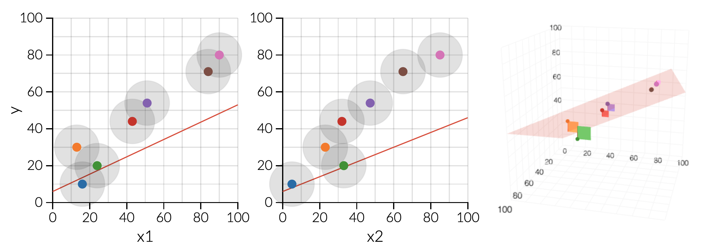
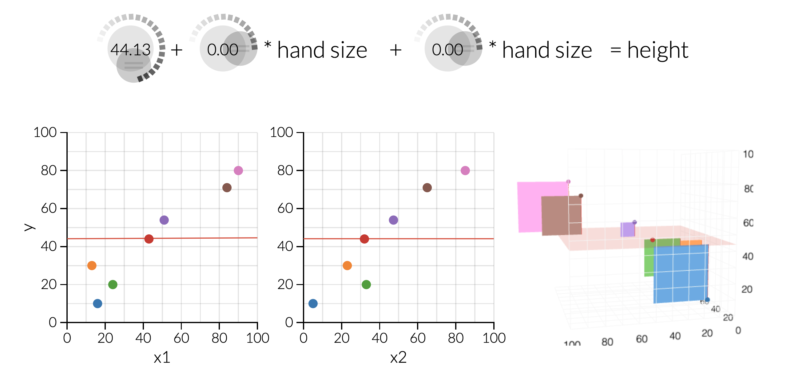
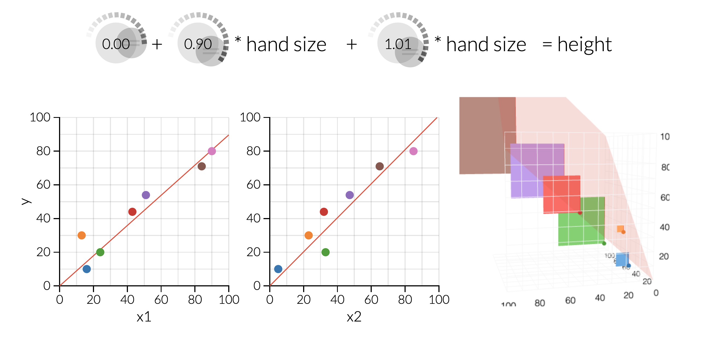
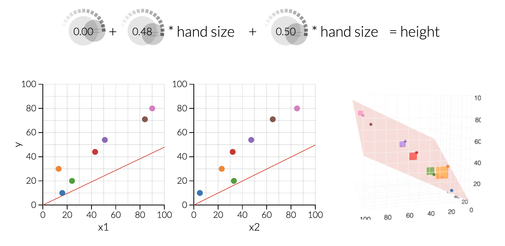
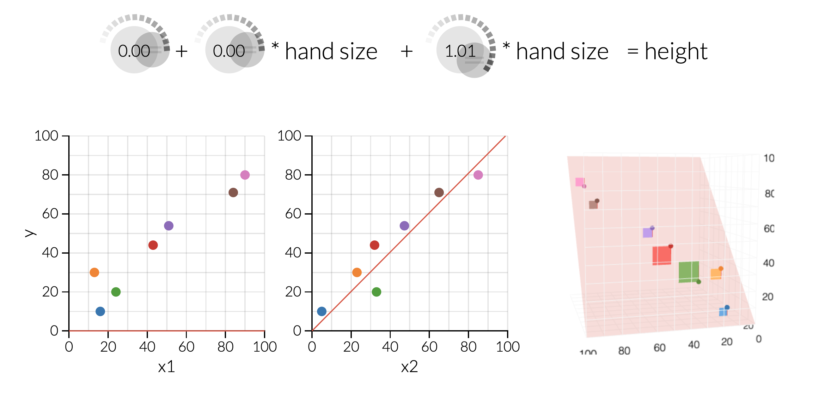
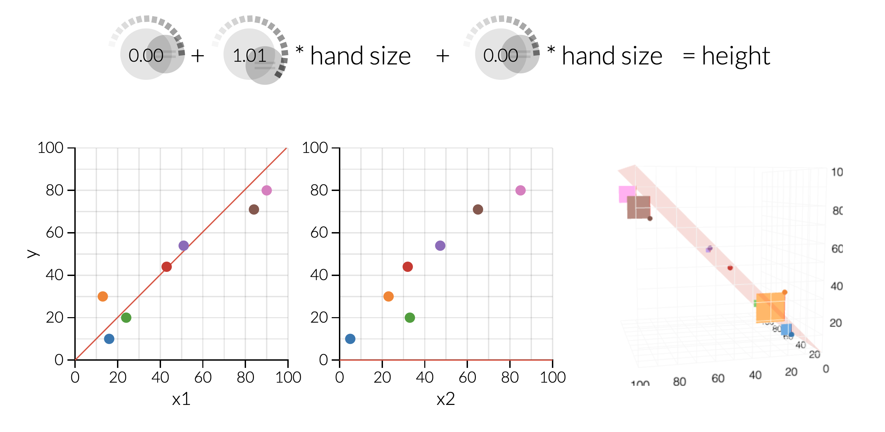

class: middle
background-size: contain

<br><br><br>

# .tuos_purple[SMI606: Week 8<br>Multiple Linear Regression]

<br><br>

**Dr. Calum Webb**<br>
Sheffield Methods Institute, the University of Sheffield.<br>
[c.j.webb@sheffield.ac.uk](mailto:c.j.webb@sheffield.ac.uk)

```{r setup, include=FALSE}
options(htmltools.dir.version = FALSE)

# These packages are required for creating the slides
# Many will need to be installed from Github
library(icons)
library(tidyverse)
library(xaringan)
library(xaringanExtra)
library(xaringanthemer)

# Defaults for code
knitr::opts_chunk$set(
  fig.width=9, fig.height=3.5, fig.retina=3,
  out.width = "100%",
  cache = FALSE,
  echo = TRUE,
  message = FALSE, 
  warning = FALSE,
  fig.show = TRUE,
  hiline = TRUE
)

# set global theme for ggplot to make background #F8F8F8F8 (off white),
# but otherwise keep all ggplot themes default (better for teaching)
theme_set(
  theme(plot.background = element_rect(fill = "#F8F8F8", colour = "#F8F8F8"), 
        panel.background = element_rect(fill = "#F8F8F8", colour = "#F8F8F8"), 
        legend.background = element_rect(fill = "#F8F8F8", colour = "#F8F8F8")
        )
  )

theme_minimal <- function() 
  {
    ggplot2::theme_minimal() +
    theme(plot.background = element_rect(fill = "#F8F8F8", colour = "#F8F8F8"), 
        panel.background = element_rect(fill = "#F8F8F8", colour = "#F8F8F8"), 
        legend.background = element_rect(fill = "#F8F8F8", colour = "#F8F8F8")
        )
}

theme_void <- function() 
  {
    ggplot2::theme_void() +
    theme(plot.background = element_rect(fill = "#F8F8F8", colour = "#F8F8F8"), 
        panel.background = element_rect(fill = "#F8F8F8", colour = "#F8F8F8"), 
        legend.background = element_rect(fill = "#F8F8F8", colour = "#F8F8F8")
        )
  }

```

```{r xaringan-tile-view, echo=FALSE}
# Use tile overview by hitting the o key when presenting
xaringanExtra::use_tile_view()
```

```{r xaringan-logo, echo=FALSE}
# Add logo to top right
xaringanExtra::use_logo(
  image_url = "header/smi-logo-white.png",
  exclude_class = c("inverse", "hide_logo"), 
  width = "180px", position = css_position(top = "1em", right = "2em")
)
```

```{r xaringan-themer, include=FALSE, warning=FALSE}

# Set some global objects containing the colours
# of the university's branding
primary_color <- "#131E29"
secondary_color <- "#440099"
tuos_blue <- "#9ADBE8"
white = "#F8F8F8"
tuos_yellow <- "#FCF281"
tuos_purple <- "#440099"
tuos_red <- "#E7004C"
tuos_midnight <- "#131E29"

# The bulk of the styling is handled by xaringanthemer
style_duo_accent(
  primary_color = "#131E29",
  secondary_color = "#440099",
  colors = c(tuos_purple = "#440099", 
             grey = "#131E2960", 
             tuos_blue ="#9ADBE8",
             tuos_mint = "#00CE7C"),
  header_font_google = xaringanthemer::google_font("Source Serif Pro", "600", "600i"),
  text_font_google   = xaringanthemer::google_font("Source Sans Pro", "300", "300i", "600", "600i"),
  code_font_google   = xaringanthemer::google_font("Lucida Console"),
  header_h1_font_size = "2rem",
  header_h2_font_size = "1.5rem", 
  header_h3_font_size = "1.25rem", 
  text_font_size = "0.9rem",
  code_font_size = "0.5rem", 
  code_inline_background_color = "#F8F8F8", 
  inverse_text_color = "#9ADBE8", 
  background_color = "#F8F8F8", 
  text_color = "#131E29", 
  link_color = "#005A8F", 
  inverse_link_color = "#F8F8F8",
  text_slide_number_color = "#44009970",
  table_row_even_background_color = "transparent", 
  table_border_color = "#44009970",
  text_bold_font_weight = 600
)

```


```{r xaringan-panelset, echo=FALSE}
# Allow for adding panelsets (see example on slide 2)
xaringanExtra::use_panelset(in_xaringan = TRUE)

style_panelset_tabs(
  background = "#F8F8F8",
  active_background = "#F8F8F8",
  hover_background = "#F8F8F8"
)


```

```{r xaringanExtra, echo = FALSE}
# Adds white progress bar to top
xaringanExtra::use_progress_bar(color = "#F8F8F8", location = "top")
```

```{r xaringan-extra-styles, echo = FALSE}
# Allow for code to be highlighted on hover
xaringanExtra::use_extra_styles(
  hover_code_line = TRUE,         #<<
  mute_unhighlighted_code = TRUE  #<<
)
```

```{r share-again, echo=FALSE}
# Add sharing links and other embedding tools
xaringanExtra::use_share_again()
```

```{r xaringanExtra-search, echo=FALSE}
# Add magnifying glass search function to bottom left for quick
# searching of slides
xaringanExtra::use_search(show_icon = TRUE, auto_search = FALSE)
```


---
class: middle

.pull-left[

]
.pull-right[

<br><br><br><br><br><br>

# Sign In

]
---
class: middle

## Learning Objectives

.panelset[

.panel[.panel-name[What will I learn?]

By the end of this week you will:

* Be able to incorporate multiple independent variables into a linear regression model to answer more interesting and complex research questions using `R`.

* Understand how multiple linear regression works by minimising squared residuals in multidimensional space.

* Be able to use the `mutate()` function to create recoded and transformed versions of variables, which can help create models with sensible reference points.

* Be able to check for linearity, heteroscedasticity, normality of residuals, outliers/leverage points, and multicollinearity in multiple regression models.

]

.panel[.panel-name[How does this week fit into my course?]

* By the end of this week, you will have gained the skills in quantitative research necessary to complete one of the possible options for assessment two for this module, and for a quantitative dissertation (if you wish to pursue one).

* This week will give you a solid foundation for extensions of the multiple linear regression model, including logistic regression (week 9), Poisson/negative binomial regression (advanced quants), and multilevel regression (advanced quants). 


]


]


???


---

class: middle, inverse


# Is there a gender pay gap?

--

According to the Labour Force Survey 2018, among men and women earning less than £1,500 per week, the average (mean) gross weekly pay for men was £659, whereas the average weekly gross pay for women was £423. (-£236 difference)

```{r, include = FALSE}

### Simulate labour market data
set.seed(100)
gender <- sample(c("Male", "Female"), 200, TRUE)
female <- ifelse(gender == "Female", 1, 0)

# Hours Worked
hrs_worked <- 40 + -10*female
hrs_worked <- hrs_worked + round(rnorm(200, 0, sd = 8))

# public/private
public_pr <- 0.475 + 0.05*female - 0.002*hrs_worked
public_pr <- public_pr  + rnorm(200, 0, 0.08)
public_pr <- round(public_pr, 0)
public_pr_chr <- ifelse(public_pr == 1, "Public", "Private")

# Pay
pay <- 250 + 14*hrs_worked - 80*female - 70*public_pr
pay <- pay + round(rnorm(200, 0, 150))

# Simulated labour data
pay_data <- tibble(gender, hrs_worked, pay, public_pr_chr)


pay_data %>%
  ggplot() +
  geom_point(aes(x = hrs_worked, y = pay, colour = gender))

# lm(data = pay_data, formula = pay ~ female) %>% summary()
# 
# lm(data = pay_data, formula = pay ~ hrs_worked) %>% summary()
# 
# lm(data = pay_data, formula = pay ~ hrs_worked + female) %>% summary()
# 
# lm(data = pay_data, formula = pay ~ hrs_worked + gender + public_pr_chr) %>% summary()


```


---

## Exploring the Gender Pay Gap with Multiple Regression

.pull-left[

```{r}

pay_data %>%
  group_by(gender) %>%
  summarise(mean_pay = mean(pay, na.rm = TRUE),
            median_pay = median(pay, na.rm = TRUE)) 

```

]

.pull-right[

```{r, echo = FALSE, out.height=500, out.width=500, fig.height=5, fig.width=5, dpi = 150}

pay_data %>%
  ggplot() +
  geom_point(aes(x = gender, y = pay, colour = gender)) +
  ggthemes::scale_color_colorblind() +
  theme_minimal()

```

]


---

## Exploring the Gender Pay Gap with Multiple Regression

.pull-left[

```{r}

pay_data %>%
  group_by(gender) %>%
  summarise(mean_pay = mean(pay, na.rm = TRUE),
            median_pay = median(pay, na.rm = TRUE))

```

```{r}

model_1 <- lm(data = pay_data, formula = pay ~ gender)

summary(model_1)

```

]

.pull-right[

```{r, echo = FALSE, out.height=500, out.width=500, fig.height=5, fig.width=5, dpi = 150}

pay_data %>%
  ggplot() +
  geom_point(aes(x = gender, y = pay, colour = gender)) +
  geom_smooth(aes(x = ifelse(gender == "Male", 2, 1), y = pay), method = "lm", colour = "black", se = FALSE) +
  ggthemes::scale_color_colorblind() +
  theme_minimal()

```

]


---

background-color: white

## Exploring the Gender Pay Gap with Multiple Regression

.pull-left[

```{r, echo = FALSE, out.height=500, out.width=500}

library(DiagrammeR)

grViz("digraph{

         graph[rankdir = TB]
         
         node[shape = circle, style = filled, fillcolor = PaleTurquoise, color = white]  
         A[label = 'Gender']
         B[label = 'Pay']
         C[label = '???']

         edge[color = black]
         {A C} -> B
         A -> C
         
         }")


```

]

.pull-right[

.center[[Link to Wooclap](https://app.wooclap.com/events/LEGKQP/questions/66e83c443fa62027393ec9d2) Event Code: LEGKQP

What other variables could be conditioning the relationship between gender and pay?]

<center>
```{r, echo = FALSE, out.height=400, out.width=400}


```
</center>

]


---

<br>

<iframe allowfullscreen frameborder="0" height="90%" mozallowfullscreen style="min-width: 500px; min-height: 355px" src="https://app.wooclap.com/events/LEGKQP/questions/66e83c443fa62027393ec9d2" width="100%"></iframe>


---

## Exploring the Gender Pay Gap with Multiple Regression

.pull-left[

#### Bivariate Linear Regression

```{r, eval = FALSE}

bivar_model <- lm(data = pay_data,
                  formula = pay ~ gender)

summary(bivar_model)

```

]

.pull-right[

#### Multiple Linear Regression

```{r, eval = FALSE}

mult_model <- lm(data = pay_data,
                  formula = pay ~ gender + hrs_worked)

summary(mult_model)

```

]

---

## Exploring the Gender Pay Gap with Multiple Regression

.pull-left[

#### Bivariate Linear Regression

```{r}

bivar_model <- lm(data = pay_data,
                  formula = pay ~ gender)

summary(bivar_model)

```

]

.pull-right[

#### Multiple Linear Regression

```{r}

mult_model <- lm(data = pay_data,
                  formula = pay ~ gender + hrs_worked)

summary(mult_model)

```

]


---

## Exploring the Gender Pay Gap with Multiple Regression

.pull-left[

#### Bivariate Linear Regression

Bivariate simple regression model with just gender as a predictor.

```{r}

bivar_model <- lm(data = pay_data,
                  formula = pay ~ gender)

summary(bivar_model)

```

]

.pull-right[

```{r, echo = FALSE, out.height=500, out.width=500, fig.height=5, fig.width=5, dpi = 150}

pay_data %>%
  ggplot() +
  geom_point(aes(x = hrs_worked, y = pay, colour = gender)) +
  stat_summary(fun = mean, aes(x = 1, y = pay, yintercept = ..y.., group = gender, colour = gender), geom = "hline", size = 1.5)+
  scale_x_continuous(limits = c(0,60)) +
  ggthemes::scale_color_colorblind() +
  theme_minimal()

```

]


---

## Exploring the Gender Pay Gap with Multiple Regression

.pull-left[

#### Bivariate Linear Regression

Bivariate simple regression model with just hours worked as a predictor.

```{r}

bivar_model <- lm(data = pay_data,
                  formula = pay ~ hrs_worked)

summary(bivar_model)

```

]

.pull-right[

```{r, echo = FALSE, out.height=500, out.width=500, fig.height=5, fig.width=5, dpi = 150}

pay_data %>%
  ggplot() +
  geom_point(aes(x = hrs_worked, y = pay, colour = gender)) +
  geom_abline(intercept = 79.297, slope = 17.470, colour = "black", se = FALSE, size = 1.5, method = "lm") +
  scale_x_continuous(limits = c(0,60)) +
  ggthemes::scale_color_colorblind() +
  theme_minimal()

```

]


---

## Exploring the Gender Pay Gap with Multiple Regression

.pull-left[

#### Multiple Linear Regression

Multiple linear regression model with both hours worked and gender as predictors.

```{r}

mult_model <- lm(data = pay_data,
                  formula = pay ~ hrs_worked + gender)

summary(mult_model)

```

]

.pull-right[

```{r, echo = FALSE, out.height=500, out.width=500, fig.height=5, fig.width=5, dpi = 150}

pay_data %>%
  ggplot() +
  geom_point(aes(x = hrs_worked, y = pay, colour = gender)) +
  geom_abline(intercept = 122.087, slope = 15.287, colour = "#010101", size = 1.5) +
  geom_abline(intercept = 122.087 + 69.524, slope = 15.287, colour = "#F19D00", size = 1.5) +
  scale_x_continuous(limits = c(0,60)) +
  ggthemes::scale_color_colorblind() +
  theme_minimal()

```

]


---

class: inverse, middle


# How does multiple linear regression work?


---

background-color: white

## But how does it work?

Multiple Linear Regression is continuing to minimize the residuals between the predictions and the real values, but now it is considering more than two dimensional space.

#### <center>[Setosa Explained Visually Example](https://setosa.io/ev/ordinary-least-squares-regression/)</center>


```{r, echo = FALSE, out.width="100%"}




```


---

background-color: white

## 3D Visualisation

```{r out.height=500, out.width=1000, echo = FALSE}

library(plotly)
library(reshape2)

#load data

pay_data <- pay_data %>%
  mutate(
    female = ifelse(gender == "Female", 1, 0)
  )

d3_lm <- lm(pay ~ female + hrs_worked, data = pay_data)

#Graph Resolution (more important for more complex shapes)
graph_reso <- 0.05

#Setup Axis
axis_x <- seq(min(pay_data$hrs_worked), max(pay_data$hrs_worked), by = graph_reso)
axis_y <- seq(min(pay_data$female), max(pay_data$female), by = graph_reso)

#Sample points
d3_lm_surface <- expand.grid(hrs_worked = axis_x, female = axis_y, KEEP.OUT.ATTRS = F)
d3_lm_surface$pay <- predict.lm(d3_lm, newdata = d3_lm_surface)

d3_lm_surface <- acast(d3_lm_surface, hrs_worked ~ female, value.var = "pay") #y ~ x

hcolors <- ifelse(pay_data$gender == "Male", "#F19D00", "#010101")

d3_plot <- plot_ly(pay_data, 
                     x = ~female, 
                     y = ~hrs_worked, 
                     z = ~pay,
                     text = ~gender, # EDIT: ~ added
                     type = "scatter3d", 
                     mode = "markers",
                     marker = list(color = hcolors, size = 4))

d3_plot <- add_trace(p = d3_plot,
                       z = d3_lm_surface,
                       x = axis_y,
                       y = axis_x,
                       opacity= 0.5,
                       type = "surface")

d3_plot


```

---

class: middle

## Four dimensions? Five dimensions? 

.pull-left[

In theory, we can include almost __as many independent variables as we want__ in our multiple linear regression models, providing we have a large enough sample size (Degrees of Freedom = N-k-1).

This helps us answer more complex, more interesting research questions with greater nuance.

```{r, eval = FALSE}

model_2 <- lm(data = pay_data, 
              formula = pay ~ gender + hrs_worked + public_pr_chr)

summary(model_2)

```


]

.pull-right[


```{r, echo = FALSE}

model_2 <- lm(data = pay_data, 
              formula = pay ~ gender + hrs_worked + public_pr_chr)

summary(model_2)

```

]

---

class: middle

## Many dimensions back to two.

.pull-left[

We can use the `ggeffects` and `effects` packages to create **predictions**, or **marginal effects** at different values of a variable of interest while **holding the other variables constant at their mean values**.

For example, for **hrs_worked**

```{r, eval = FALSE}

library(effects)
library(ggeffects)
ggeffect(model_2, terms = "hrs_worked")

```

]

.pull-right[


```{r, echo = FALSE}

library(effects)
library(ggeffects)
ggeffect(model_2, terms = "hrs_worked") 

```

]

---


class: middle

## Many dimensions back to two.

.pull-left[

We can use the `ggeffects` and `effects` packages to create **predictions**, or **marginal effects** at different values of a variable of interest while **holding the other variables constant at their mean values**.

We can also plot these predictions by adding %>% plot

```{r, eval = FALSE}

ggeffect(model_2, terms = "hrs_worked") %>% 
  plot()

```

]

.pull-right[


```{r, echo = FALSE, echo = FALSE, out.height=500, out.width=500, fig.height=5, fig.width=5, dpi = 150}

ggeffect(model_2, terms = "hrs_worked") %>% 
  plot() + theme_minimal()

```

]

---


class: middle

## Many dimensions back to two.

.pull-left[

We can use the `ggeffects` and `effects` packages to create **predictions**, or **marginal effects** at different values of a variable of interest while **holding the other variables constant at their mean values**.

Another example using sector

```{r, eval = FALSE}

ggeffect(model_2, terms = "public_pr_chr") %>% 
  plot() + coord_flip() 

```

]

.pull-right[


```{r, echo = FALSE, echo = FALSE, out.height=500, out.width=500, fig.height=5, fig.width=5, dpi = 150}

ggeffect(model_2, terms = "public_pr_chr") %>% plot() + coord_flip() + theme_minimal()

```

]


---

class: middle, inverse

# Do 'other factors' "explain" a gender pay gap in the Labour Force Survey?

The importance of theory and this particular example.

---

background-color: white

### Gender Pay Gap DAG - "Choice"

```{r, echo = FALSE}

library(dagitty)

dag_spec <- 'dag{

  "Gender" -> "D" -> "Pay"
  "Gender" -> "C" -> "L,F,E,I" -> "Pay"
  
  Gender [exposure]
  Pay [outcome]
  C [unobserved]
  D [unobserved]
   
}'

dag_coord <- list(x = c("Gender" = 0, "Pay" = 4,"L,F,E,I" = 2, "C" = 0, "D" = 2),
                   y = c("Gender" = 1, "Pay" = 1, "L,F,E,I" = -1, "D" = 1, "C" = -1)
                   )

dag <- dagitty(dag_spec)
coordinates(dag) <- dag_coord

rethinking::drawdag(dag, xlim = c(-2, 6), ylim = c(-3, 3))

```


.center[**C** = **C**hoice; **L** = **L**abour Participation (Hrs Worked); **F** = **F**amily Structure, N Dep. Children; **E** = **E**ducation; **I** = **I**ndustry; **D** = Direct Interpersonal **D**iscrimination]


---

background-color: white

### Gender Pay Gap DAG - "Choice" + Patriarchy & Heteronormativity

```{r, echo = FALSE}

dag_spec <- 'dag{

  "Gender" -> "D" -> "Pay"
  "Gender" -> "C" -> "L,F,E,I" -> "Pay"
  P -> {C "L,F,E,I"}
  H -> {C "L,F,E,I"}
  
  Gender [exposure]
  Pay [outcome]
  C [unobserved]
  D [unobserved]
  P [unobserved]
  H [unobserved]
   
}'

dag_coord <- list(x = c("Gender" = 0, "Pay" = 4, "L,F,E,I" = 2, "C" = 0, "D" = 2, "P" = 0.7, "H" = 1.3),
                   y = c("Gender" = 1, "Pay" = 1, "L,F,E,I" = -1, "D" = 1, "C" = -1, "P" = -2, "H" = -2)
                   )

dag <- dagitty(dag_spec)
coordinates(dag) <- dag_coord

rethinking::drawdag(dag, xlim = c(-2, 6), ylim = c(-3, 3))

```


.center[**C** = **C**hoice; **L** = **L**abour Participation (Hrs Worked); **F** = **F**amily Structure, N Dep. Children; **E** = **E**ducation; **I** = **I**ndustry; **P** = **P**atriarchal Systems/Structures; **H** = **H**eteronormative Systems/Structures]


---

class: middle, inverse

# A note on interaction terms/moderation

What if we theorise that the effect of some predictors varies based on the value of other predictors?


---

### A note on interaction effects

```{r, echo = FALSE, include = FALSE}

pay_data

set.seed(2001)
nb <- rep("Non-binary/Other", 100)
nbhw <- rnorm(100, 35, 9)
nbpay <- rnorm(100, 450 + 5*nbhw, 80)

nb_pay_data <- tibble(gender = nb, 
       hrs_worked = nbhw,
       pay = nbpay,
       public_pr_chr = NA,
       female = NA)

pay_data_2 <- bind_rows(pay_data, nb_pay_data)


```


.pull-left[

Imagine we also had data for non-binary people and people with who identified their gender as something other than female, male, or non-binary and found this kind of relationship in the data.


]

.pull-right[

```{r, echo = FALSE, out.height=500, out.width=500, fig.height=5, fig.width=5, dpi = 150}

pay_data_2 %>%
  ggplot() +
  geom_point(aes(x = hrs_worked, y = pay, colour = gender)) +
  ggthemes::scale_color_colorblind() +
  theme_minimal() +
  theme(legend.position = "bottom")

```

]


---

### A note on interaction effects

.pull-left[

We can estimate a regression model as before, but it's clear that there is a **different association between hours worked and pay depending on gender**.

```{r}

model_noint <- lm(data = pay_data_2, formula = pay ~ gender + hrs_worked)
summary(model_noint)

```


]


.pull-right[

```{r, echo = FALSE, out.height=500, out.width=500, fig.height=5, fig.width=5, dpi = 150}

ablines <- tibble(
  gender = c("Female", "Male", "Non-binary/Other"),
  intercept = c(260.043 + 115.043*0 + -9.411*0, 
                260.043 + 115.043*1 + -9.411*0, 
                260.043 + 115.043*0 + -9.411*1),
  slope = c(10.706,
            10.706,
            10.706)
)

pay_data_2 %>%
  ggplot() +
  geom_point(aes(x = hrs_worked, y = pay, colour = gender)) +
  geom_abline(data = ablines, aes(intercept = intercept, slope = slope, col = gender), size = 1) +
  #facet_wrap(~gender, nrow = 3, ncol = 1) +
  ggthemes::scale_color_colorblind() +
  theme_minimal() +
  theme(legend.position = "bottom")

```

]

---

### A note on interaction effects

.pull-left[

Visually, it looks like there is a weaker association between hours worked and pay for people who identify as non-binary or other genders than there is for people who identify as female or male.

```{r}

model_noint <- lm(data = pay_data_2, formula = pay ~ gender + hrs_worked)
summary(model_noint)

```


]


.pull-right[

```{r, echo = FALSE, out.height=500, out.width=500, fig.height=5, fig.width=5, dpi = 150}

ablines <- tibble(
  gender = c("Female", "Male", "Non-binary/Other"),
  intercept = c(260.043 + 115.043*0 + -9.411*0, 
                260.043 + 115.043*1 + -9.411*0, 
                260.043 + 115.043*0 + -9.411*1),
  slope = c(10.706,
            10.706,
            10.706)
)

pay_data_2 %>%
  ggplot() +
  geom_point(aes(x = hrs_worked, y = pay, colour = gender)) +
  geom_abline(data = ablines, aes(intercept = intercept, slope = slope, col = gender), size = 1) +
  facet_wrap(~gender, nrow = 3, ncol = 1) +
  ggthemes::scale_color_colorblind() +
  theme_minimal() +
  theme(legend.position = "none")

```

]


---

### A note on interaction effects

.pull-left[

We can add interaction terms in R using an asterisk \* between the terms we wish to interact. The interaction effects, e.g. genderMale:hrs_worked tell us how the effect of one changes when the value of the other changes.

```{r}

model_int <- lm(data = pay_data_2, formula = pay ~ gender * hrs_worked)
summary(model_int)

```


]


.pull-right[

```{r, echo = FALSE, out.height=500, out.width=500, fig.height=5, fig.width=5, dpi = 150}

ablines <- tibble(
  gender = c("Female", "Male", "Non-binary/Other"),
  intercept = c(143.295 + 20.160*0 + 326.610*0, 
                143.295 + 20.160*1 + 326.610*0, 
                143.295 + 20.160*0 + 326.610*1),
  slope = c(14.582 + 1.407*0 + -9.976*0,
            14.582 + 1.407*1 + -9.976*0,
            14.582 + 1.407*0 + -9.976*1)
)

pay_data_2 %>%
  ggplot() +
  geom_point(aes(x = hrs_worked, y = pay, colour = gender)) +
  geom_abline(data = ablines, aes(intercept = intercept, slope = slope, col = gender), size = 1) +
  facet_wrap(~gender, nrow = 3, ncol = 1) +
  ggthemes::scale_color_colorblind() +
  theme_minimal() +
  theme(legend.position = "none")

```

]

---

### A note on interaction effects


The regression model then becomes:

$$Intercept = (143.29 + 20.16*\text{genderMale} + 326*\text{genderNon-binaryOther})$$ 

$$\text{hrs_worked} Slope = (14.58 + 1.407*\text{genderMale} + -9.98*\text{genderNon-binaryOther})*\text{hrs_worked}$$

--

For example, the intercept and hours worked slope for non-binary and other people would equal:

--

$$Intercept = (143.29 + 20.16*\text{0} + 326*\text{1}) = 469.29$$

--

$$\text{hrs_worked} Slope = (14.58 + 1.407*0 + -9.98*1)*\text{hrs_worked} = 4.6 * \text{hrs_worked}$$

--

And for people who identify as female:

--

$$Intercept = (143.29 + 20.16*0 + 326*0) = 143.29$$ 

--

$$\text{hrs_worked} Slope = (14.58 + 1.407*0 + -9.98*0)*\text{hrs_worked} = 14.58 * \text{hrs_worked}$$

--

Notice how now that the values of our intercept(s) and slopes are dependent on each other, we cannot use the general differences between men/women/non-binary or other people from the gender coefficients to describe pay gaps because **they now specifically refer to the pay gap when hours worked = 0, an unrealistic reference point for employed people**.


---
class: middle, inverse

# Recoding and Transforming Variables with `mutate()`

#### Recode = Reordering, grouping, or ungrouping categories <br> Transform = Applying a mathematical function to convert a continuous value

You will often need to do some data processing before you can model, which requires plenty of practice!

---

# Dummy variables (binary)

We often need to do some tidying of our data to make sure the predictors we include in our models are appropriate (e.g. either continuous or binary categorical, or do not break any assumptions).

```{r, include = FALSE}

set.seed(200)
happy <- sample(c("Very unhappy", "Unhappy", "Neutral", "Happy", "Very happy"),
       200, replace = TRUE, prob = c(0.1, 0.2, 0.3, 0.2, 0.2))

quals <- sample(c("University", "A-level", "GCSE", "No quals"),
       200, replace = TRUE, prob = c(0.2, 0.1, 0.4, 0.3))


pay_data$quals <- quals
pay_data$happy <- happy

pay_data$female <- NULL


```

```{r}

pay_data

```


---

# Dummy variables (binary)

When we use a binary variable in a regression model, we __always have to have a reference group__ (the group that is zero). 

.pull-left[

```{r}

model_2 <- lm(data = pay_data, 
              formula = pay ~ gender + hrs_worked + public_pr_chr)
summary(model_2)


```

]

.pull-right[

By default, when we give `R` a character variable in a linear regression, the reference group chosen is always the first value alphabetically.

]


---

# Dummy variables (binary)

When we use a binary variable in a regression model, we __always have to have a reference group__ (the group that is zero). 

.pull-left[

```{r}

model_2 <- lm(data = pay_data, 
              formula = pay ~ gender + hrs_worked + public_pr_chr)
summary(model_2)


```

]

.pull-right[

By default, when we give `R` a character variable in a linear regression, the reference group chosen is always the first value alphabetically.

<br><br>

However, we may not always want this — for example, __what if we wanted our reference group to be men rather than women__?

It's useful for us to be able to manually code our binary/dummy variables, or at least manually set our reference group. This is especially true if the reference group `R` chose was __very small__ (e.g. setting Arab as the reference group in an analysis of ethnic inequality, rather than White British in the UK).

]


---

# Dummy variables (binary)

### .tuos_purple[`dplyr::case_when()` chr/fct/num]

`dplyr`'s `case_when()` function can be used to create a new variable based on conditional logic.

```{r}

pay_data <- pay_data %>%
  # Mutate creates new variables
  mutate(
    female = case_when(
                  # Start by setting all missing to stay missing
                    is.na(gender) ~ NA_real_,
                  # Set the group of interest to be 1
                    gender == "Female" ~ 1,
                  # Set everything else to be the reference category
                    TRUE ~ 0
                    )
  )

pay_data


```

---

# Dummy variables (binary)


### .tuos_purple[`dplyr::case_when()` chr/fct/num]

Using the new `female` variable now sets the reference group to all men in the sample.

.pull-left[

```{r}

model_before <- lm(data = pay_data, 
                   formula = pay ~ gender + hrs_worked)

summary(model_before)

```

]

.pull-right[

```{r}

model_after <- lm(data = pay_data, 
                  formula = pay ~ female + hrs_worked)

summary(model_after)

```

]


---

## Factor reference levels for categorical/ordinal variables

### .tuos_purple[`relevel()` fct]

Alternatively, we can turn our variable into a factor (if it's not already) and use `relevel` to set a reference category. This is very useful when you have lots of categories and can't be bothered to manually recode all of the non-reference categories into groups with `case_when`.

```{r}

pay_data <- pay_data %>%
  # Mutate creates new variables
  mutate(
    gender_fct = relevel(factor(gender), ref = "Male")
  )

pay_data


```

---

## Factor reference levels for categorical/ordinal variables

### .tuos_purple[`relevel()` fct]

.pull-left[

```{r}

model_chr <- lm(data = pay_data, 
                   formula = pay ~ gender + hrs_worked)

summary(model_chr)

```

]

.pull-right[

```{r}

model_fct <- lm(data = pay_data, 
                  formula = pay ~ gender_fct + hrs_worked)

summary(model_fct)

```

]


---

class: middle, inverse

### Ideally reference groups in models should be...<br><br>

* The most common/largest category, or the most appropriate baseline categorisation
  * e.g. in a study of different attitudes towards climate change by political party affiliation, either Conservative or Labour voters would be a good reference category, whereas the Scottish Greens may not.
  
<br>

* A sensible middle point in an ordinal variable
  * e.g. On a scale of "Very unlikely" < "Unlikely" < "Neither likely nor unlikely" < "Likely" < "Very likely", a sensible reference point would probably be "Neither likely nor unlikely".


---

class: middle, inverse

# A categorical predictor in a linear regression model always has a reference category! You MUST be able to identify the reference group and interpret the regression coefficient as the *difference between the the reference category and the dummy category*, and the p-value as whether *this difference is statistically significant*!


---

# Grouping values

Quite often we want to group our responses into a new variable with a smaller number of factors.

This is especially the case when we have some values with a very small number of responses, or we need to create a binary version of a multiple-item variable (which we'll see next week is very useful for logistic regression!)

For example, the `happy` (how happy are you with your current pay) variable here. 

```{r, include=FALSE}

pay_data <- pay_data %>% select(-gender_fct, -female)

```

```{r}

pay_data

```

---

# Grouping values with `case_when()`

We can use the same conditional logic to create groupings. 

First, I check what all the possible values of the variable are with a `tabyl`.

```{r}

pay_data %>% janitor::tabyl(happy)

```

---

# Grouping values with `case_when()`

We can use the same conditional logic to create groupings. 

Then, I can use `case_when` to group these into something different.

```{r}

pay_data <- pay_data %>% 
  mutate(
    happy_bn = case_when(is.na(happy) ~ NA_character_,
                         happy == "Very happy" ~ "Happy",
                         happy == "Happy" ~ "Happy",
                         TRUE ~ "Not happy")
  )

pay_data

```

.small[Note that a quirk with `case\_when()` is that you have to specify what kind of missing the missing value is. `NA\_real\_` for numeric variables and `NA\_character\_` for character ones.]


---

# Log and Square Root Transformation

.pull-left[

Natural log and square root transformations can be very useful when our variables are positively-skewed (right tailed). However, they do change the interpretation of our coefficients slightly: [see a short guide here](https://data.library.virginia.edu/interpreting-log-transformations-in-a-linear-model/). For example, if both X and Y are logged the interpretation becomes for a 1% increase in X what % change is there in Y.

```{r, eval = FALSE}

lfs_real <- read_csv("lfs_sample.csv")

lfs_real %>%
  ggplot() +
  geom_point(aes(x = ttushr, y = grsswk), size = 0.1) +
  ylab("Weekly Pay") +
  xlab("Weekly Hours") +
  theme_minimal()

```
]

.pull-right[
```{r, echo = FALSE, fig.width=5, fig.height=4.5, out.height=450, out.width=500}

lfs_real <- read_csv("lfs_sample.csv")

# lfs_real <- lfs_real %>%
#   filter(!grsswk < 100)
# 
# write_csv(lfs_real, "lfs_sample.csv")

lfs_real %>%
  ggplot() +
  geom_point(aes(x = ttushr, y = grsswk), 
             size = 0.1) +
  ylab("Weekly Pay") +
  xlab("Weekly Hours") +
  theme_minimal()


```
]

---

# Log and Square Root Transformation

.pull-left[

Natural log and square root transformations can be very useful when our variables are positively-skewed (right tailed). However, they do change the interpretation of our coefficients slightly: [see a short guide here](https://data.library.virginia.edu/interpreting-log-transformations-in-a-linear-model/). For example, if both X and Y are logged the interpretation becomes for a 1% increase in X what % change is there in Y.

```{r, eval = FALSE}

lfs_real %>%
  ggplot() +
  geom_histogram(aes(x = grsswk), 
                 bins = 50) +
  theme_minimal()

```
]

.pull-right[
```{r, echo = FALSE, fig.width=4.5, fig.height=4.5, out.height=450, out.width=450}

lfs_real %>%
  ggplot() +
  geom_histogram(aes(x = grsswk), 
                 bins = 50) +
  theme_minimal()


```
]

---

# Log and Square Root Transformation

.pull-left[

__Untransformed__

```{r, echo = FALSE, fig.width=4.5, fig.height=4, out.height=400, out.width=450}

lfs_real %>%
  ggplot() +
  geom_histogram(aes(x = grsswk), 
                 bins = 50) +
  theme_minimal()

```
]

.pull-right[

__Transformed__ using `log`

```{r, echo = FALSE, fig.width=4.5, fig.height=4, out.height=400, out.width=450}

lfs_real %>%
  mutate(log_grsswk = log(grsswk)) %>%
  ggplot() +
  geom_histogram(aes(x = log_grsswk), 
                 bins = 50) +
  theme_minimal()


```
]


---

# Log and Square Root Transformation

.pull-left[

__Untransformed__

```{r, echo = FALSE, fig.width=4.5, fig.height=4, out.height=400, out.width=450}

lfs_real %>%
  ggplot() +
  geom_point(aes(x = ttushr, y = grsswk), size = 0.1) +
  ylab("Weekly Pay") +
  xlab("Weekly Hours") +
  theme_minimal()

```
]

.pull-right[

__Transformed__ using `log`

```{r, echo = FALSE, fig.width=4.5, fig.height=4, out.height=400, out.width=450}

lfs_real %>%
  mutate(log_grsswk = log(grsswk)) %>%
  ggplot() +
  geom_point(aes(x = ttushr, y = log_grsswk), size = 0.1) +
  ylab("Weekly Pay") +
  xlab("Weekly Hours") +
  theme_minimal()


```
]

---

# Log and Square Root Transformation

.pull-left[

__Untransformed__

```{r, echo = FALSE, fig.width=4.5, fig.height=4, out.height=400, out.width=450}

lfs_real %>%
  ggplot() +
  geom_histogram(aes(x = grsswk), 
                 bins = 50) +
  theme_minimal()

```
]

.pull-right[

__Transformed__ using `sqrt()`

```{r, echo = FALSE, fig.width=4.5, fig.height=4, out.height=400, out.width=450}

lfs_real %>%
  mutate(sqrt_grsswk = sqrt(grsswk)) %>%
  ggplot() +
  geom_histogram(aes(x = sqrt_grsswk), 
                 bins = 50) +
  theme_minimal()


```
]

---

# Log and Square Root Transformation

.pull-left[

__Untransformed__

```{r, echo = FALSE, fig.width=4.5, fig.height=4, out.height=400, out.width=450}

lfs_real %>%
  ggplot() +
  geom_point(aes(x = ttushr, y = grsswk), size = 0.1) +
  ylab("Weekly Pay") +
  xlab("Weekly Hours") +
  theme_minimal()

```
]

.pull-right[

__Transformed__ using `sqrt()`

```{r, echo = FALSE, fig.width=4.5, fig.height=4, out.height=400, out.width=450}

lfs_real %>%
  mutate(sqrt_grsswk = sqrt(grsswk)) %>%
  ggplot() +
  geom_point(aes(x = ttushr, y = sqrt_grsswk), size = 0.1) +
  ylab("Weekly Pay") +
  xlab("Weekly Hours") +
  theme_minimal()


```
]

---

# Log and Square Root Transformation

```{r, eval = FALSE}

lfs_real %>%
  mutate(
    log_grsswk = log(grsswk),
    sqrt_grsswk = sqrt(grsswk)
  )

```

#### Important notes on log and square root transformation

* __Only numbers above 0 have a defined logarithmic value__. If you try and take the log of 0 you get negative infinity, if you try and take the log of a negative number you get a `NaN` result.

* (In R), __the square root of a negative number is undefined__, and will give a `NaN` result. This means that any negative values transformed using `sqrt()` will become missing.

--

* If you need to log or take the square root of a variable that has negative or zero values, you can add a __constant__ value to make all of the numbers positive (e.g. Pay + 500). Just remember to remove the constant if back-transforming.

```{r, eval = FALSE}

lfs_real %>%
  mutate(
    log_grsswk = log(grsswk + 500),
    sqrt_grsswk = sqrt(grsswk + 500)
  )

```


---

class: middle, inverse

### Data manipulation in `R` (and other programming languages for that matter) is always a bit fiddly and often takes some googling! 

It's always worth checking the results look like what you would expect by eyeballing the data or using a table/visualisation.


---

class: inverse, middle


# Assumptions updated!

Now we're dealing with multiple predictors we need more sophisticated ways to detect violations of assumptions...


---

background-color: white

# Assumptions Updated!

.pull-left[
  Last week we learned about four assumptions of linear regression.
  
  * __Linearity__
  
  * __Homoscedasticity__
  
  * __Outliers and Leverage Points__
  
  * __Normality of residuals__
  
However, it's no longer very easy to create a visualisation in 4, 5, or 6 dimensions to check these like we could do with our scatterplot! We now need to check multivariate linearity, multivariate homoscedasticity, etc.

Luckily, there are specialised kinds of plots to check these assumptions that are easy to use in R.
  
  ]


---

background-color: white

# Assumptions Updated!

```{r include = FALSE}

model_real <- lm(data = lfs_real, formula = grsswk ~ sexx + ttushr + publicr)

```

.pull-left[

<br>
  
  * __Linearity__

We can check linearity using a __residuals versus fitted values plot__. You can produce this plot in `R` by using `plot(model_2, which = 1)`.

If the .tuos_red[red line] roughly follows the dotted line at 0, the linear fit is close. If it diverges, a non-linear fit may be better.
  
  * __Homoscedasticity__
  
  * __Outliers and Leverage Points__
  
  * __Normality of residuals__


  
  ]
  
  .pull-right[

```{r, fig.height=4, fig.width=4.5, out.height=400, out.width=450}
  
  plot(model_2, which = 1)
  
```
  
  ]
  
---

background-color: white

# Assumptions Updated!

```{r include = FALSE}

model_real <- lm(data = lfs_real, formula = grsswk ~ sexx + ttushr + publicr)

```

.pull-left[

<br>
  
  * __Linearity__

We can check linearity using a __residuals versus fitted values plot__. You can produce this plot in `R` by using `plot(model_2, which = 1)`.

If the .tuos_red[red line] roughly follows the dotted line at 0, the linear fit is close. If it diverges, a non-linear fit may be better.
  
  * __Homoscedasticity__
  
  * __Outliers and Leverage Points__
  
  * __Normality of residuals__


  
  ]
  
  .pull-right[

```{r, fig.height=4, fig.width=4.5, out.height=400, out.width=450}
  
  plot(model_real, which = 1)
  
```
  
  ]


---

background-color: white

# Assumptions Updated!

.pull-left[

<br>
  
  * __Linearity__
  
  * __Homoscedasticity__
  
We can check for heteroscedasticity using a __spread/scale-location plot__. You can produce this plot with `plot(model_2, which = 3)`.

The red line should be close to be horizontal, and the spread around the line should be roughly uniform (the same as we would interpret a bivariate scatterplot). 
  
  * __Outliers and Leverage Points__
  
  * __Normality of residuals__


  
  ]
  
  .pull-right[

```{r, fig.height=4, fig.width=4.5, out.height=400, out.width=450}
  
  plot(model_2, which = 3)
  
```
  
  ]
  
  
---

background-color: white

# Assumptions Updated!

.pull-left[

<br>
  
  * __Linearity__
  
  * __Homoscedasticity__
  
We can check for heteroscedasticity using a __spread/scale-location plot__. You can produce this plot with `plot(model_2, which = 3)`.

The red line should be close to be horizontal, and the spread around the line should be roughly uniform (the same as we would interpret a bivariate scatterplot). 
  
  * __Outliers and Leverage Points__
  
  * __Normality of residuals__


  
  ]
  
  .pull-right[

```{r, fig.height=4, fig.width=4.5, out.height=400, out.width=450}
  
  plot(model_real, which = 3)
  
```
  
  ]
  
  
---

background-color: white

# Assumptions Updated!

.pull-left[

<br>
  
  * __Linearity__
  
  * __Homoscedasticity__
  
  * __Outliers and Leverage Points__
  
There are a few different ways to check for multivariate outliers/leverage points, but probably the easiest one to interpret is the __residuals versus leverage plot__ and the __Cook's distance__ plot.

The Cook's distance plot can be generated using `plot(model_2, which = 4)`, and the residuals versus leverage plot can be generated using `plot(model_2, which = 5)`. The numbers on the points/lines refer to the __observation row number__.


  
  * __Normality of residuals__


  
  ]
  
  .pull-right[

```{r, fig.height=4, fig.width=4.5, out.height=400, out.width=450}
  
plot(model_2, which = 4)
  
```
  
  ]

---

background-color: white

# Assumptions Updated!

.pull-left[

<br>
  
  * __Linearity__
  
  * __Homoscedasticity__
  
  * __Outliers and Leverage Points__
  
There are a few different ways to check for multivariate outliers/leverage points, but probably the easiest one to interpret is the __residuals versus leverage plot__ and the __Cook's distance__ plot.

The Cook's distance plot can be generated using `plot(model_2, which = 4)`, and the residuals versus leverage plot can be generated using `plot(model_2, which = 5)`. The numbers on the points/lines refer to the __observation row number__.


  
  * __Normality of residuals__


  
  ]
  
  .pull-right[

```{r, fig.height=4, fig.width=4.5, out.height=400, out.width=450}
  
plot(model_2, which = 5)
  
```
  
  ]
  
  
---

background-color: white

# Assumptions Updated!

.pull-left[

<br>
  
  * __Linearity__
  
  * __Homoscedasticity__
  
  * __Outliers and Leverage Points__
  
There are a few different ways to check for multivariate outliers/leverage points, but probably the easiest one to interpret is the __residuals versus leverage plot__ and the __Cook's distance__ plot.

The Cook's distance plot can be generated using `plot(model_2, which = 4)`, and the residuals versus leverage plot can be generated using `plot(model_2, which = 5)`. The numbers on the points/lines refer to the __observation row number__.


  
  * __Normality of residuals__


  
  ]
  
  .pull-right[
  
Outliers can be removed by row position using the `slice()` function.

```{r}
  
summary(model_2)
  
```
  
  ]


---

background-color: white

# Assumptions Updated!

.pull-left[

<br>
  
  * __Linearity__
  
  * __Homoscedasticity__
  
  * __Outliers and Leverage Points__
  
There are a few different ways to check for multivariate outliers/leverage points, but probably the easiest one to interpret is the __residuals versus leverage plot__ and the __Cook's distance__ plot.

The Cook's distance plot can be generated using `plot(model_2, which = 4)`, and the residuals versus leverage plot can be generated using `plot(model_2, which = 5)`. The numbers on the points/lines refer to the __observation row number__.


  
  * __Normality of residuals__


  
  ]
  
  .pull-right[
  
Outliers can be removed by row position using the `slice()` function.

```{r}

pay_data_no_outliers <- pay_data %>%
  slice(-32, -113, -150)

model_3 <- lm(data = pay_data_no_outliers,
   formula = pay ~ gender + hrs_worked + public_pr_chr)

summary(model_3)
  
```
  
  ]
  
  
---

background-color: white

# Assumptions Updated!

.pull-left[

<br>
  
  * __Linearity__
  
  * __Homoscedasticity__
  
  * __Outliers and Leverage Points__
  
  * __Normality of residuals__

Finally, multivariate normality of residuals can be checked using a __Normal Q-Q plot__. This can be generated in R using the `plot(model_2, which = 2)` function.

If residuals are normally distributed, they should approximately follow the diagonal line.

  
  ]
  
  .pull-right[
  
Approximately normally distributed.

```{r, fig.height=4, fig.width=4.5, out.height=400, out.width=450}

plot(model_2, which = 2)
  
```
  
  ]
  
  
---

background-color: white

# Assumptions Updated!

.pull-left[

<br>
  
  * __Linearity__
  
  * __Homoscedasticity__
  
  * __Outliers and Leverage Points__
  
  * __Normality of residuals__

Finally, multivariate normality of residuals can be checked using a __Normal Q-Q plot__. This can be generated in R using the `plot(model_2, which = 2)` function.

If residuals are normally distributed, they should approximately follow the diagonal line.

  
  ]
  
  .pull-right[
  
Not normally distributed.

```{r, fig.height=4, fig.width=4.5, out.height=400, out.width=450}

plot(model_real, which = 2)
  
```
  
  ]
  
  
---

class: middle

## Reminder - Cheat sheet on violated assumptions.

.pull-left[

* __Linearity__

This means that your estimates will be over- and under-estimated at different parts of the line. If your dependent variable is right-skewed (long tail of observations in the + direction), you can transform it to its log value using `log()`. Alternatively, you can fit a curvilinear model — bit more advanced but not too difficult!

* __Homoscedasticity__

Heteroscedasticity means that the standard errors will be biased (in different ways depending on the shape) — this can be resolved using robust standard errors and/or a weighted least squares estimator.


]

.pull-right[

* __Outliers and leverage points__

Outliers and leverage points can generally have an undue influence on the slope in a regression. Remove any error-based outliers (e.g. someone enters their age as 400 instead of 40). Compare results with 'true' outliers included and excluded to see how they differ, present both. 

* __Normality of residuals__

Non-normality of residuals can mean that standard errors are smaller than they should be, which can effect decisions made in hypothesis testing in marginal cases — but this is not generally a big problem outside of very small studies (N < 10 per variable) ([Schmidt & Finan, 2018](https://pubmed.ncbi.nlm.nih.gov/29258908/)). Make this clear if either is true.


]


---

background-color: white

## One more assumption: Multicollinearity

Independent variables are supposed to be __independent__. If two independent variables are strongly correlated (around r > 0.8), the estimates for the effect of each will not be accurate.

<center>
```{r, echo = FALSE, out.width="70%"}



```

</center>

.center[[Interactive: https://setosa.io/ev/ordinary-least-squares-regression/](https://setosa.io/ev/ordinary-least-squares-regression/)]


---

background-color: white

## One more assumption: Multicollinearity

Independent variables are supposed to be __independent__. If two independent variables are strongly correlated (around r > 0.8), the estimates for the effect of each will not be accurate.

<center>
```{r, echo = FALSE, out.width="70%"}



```

</center>

.center[[Interactive: https://setosa.io/ev/ordinary-least-squares-regression/](https://setosa.io/ev/ordinary-least-squares-regression/)]


---

background-color: white

## One more assumption: Multicollinearity

Independent variables are supposed to be __independent__. If two independent variables are strongly correlated (around r > 0.8), the estimates for the effect of each will not be accurate.

<center>
```{r, echo = FALSE, out.width="70%"}



```

</center>

.center[[Interactive: https://setosa.io/ev/ordinary-least-squares-regression/](https://setosa.io/ev/ordinary-least-squares-regression/)]


---

background-color: white

## One more assumption: Multicollinearity

Independent variables are supposed to be __independent__. If two independent variables are strongly correlated (around r > 0.8), the estimates for the effect of each will not be accurate.

<center>
```{r, echo = FALSE, out.width="70%"}



```

</center>

.center[[Interactive: https://setosa.io/ev/ordinary-least-squares-regression/](https://setosa.io/ev/ordinary-least-squares-regression/)]


---

background-color: white

## One more assumption: Multicollinearity

Independent variables are supposed to be __independent__. If two independent variables are strongly correlated (around r > 0.8), the estimates for the effect of each will not be accurate.

<center>
```{r, echo = FALSE, out.width="70%"}



```

</center>


.center[[Interactive: https://setosa.io/ev/ordinary-least-squares-regression/](https://setosa.io/ev/ordinary-least-squares-regression/)]


---

class: middle

# Multicollinearity

* __Check the correlation between your continuous independent variables__ before creating your model. Also check the crosstabs between independent dummy variables and Cramer's V.
  * If two variables have R > 0.8 or V > 0.4 you may wish to exclude one and consider why they are so highly correlated (e.g. hourly pay and weekly pay are likely highly correlated, but are not really conceptually distinct). 
  * If two variables are conceptually distinct, estimate models with both, and each variable separately and describe how the estimates differ.
  

---

class: middle

# Multicollinearity

* __Use the Variance Inflation Factor__ estimate to check for multicollinearity in your model.
  * Install and load the `car` package with `library(car)`, or call it with `car::`
  * Use the `vif()` function on your model.
  
```{r}

car::vif(model_2)

```
  
  * A VIF of 1 indicates no correlation between independent variables.
  * A VIF between 1 and 5 indicates some correlation between independent variables, but not much to be of any concern.
  * A VIF higher than 5 indicates high correlation between this independent variable and at least one other independent variable. The inclusion of both/all of these variables may bias model estimates.

---

class: inverse, middle

### Regression is a powerful and intuitive tool, and it becomes easy to misuse — especially when assumptions are not checked. It's also very difficult to people to check you haven't violated any assumptions if they don't have your data.

Always make sure you check the assumptions and briefly describe any possible issues there may be in your model, and what future research could do to adjust for these.


---

class: middle

# Summary

* Multiple linear regression allows us to answer more interesting research questions, taking account of potential __confounders__ or competing explanations.

* The number of independent variables that can be added has a very high ceiling, depending on our sample size, making __complex analytical designs feasible__.

* Sometimes, we need to use some data __recoding/transformation techniques__ to make our models "tidy" and straightforward to interpret, or to correct for violated assumptions.

* Checking for violated assumptions (including a new assumption of __independent of predictors/multicollinearity__), requires the use of some additional visualisations and statistics. However, these are reasonably easy to produce in `R` using the `plot()` function and `car` package.


---

class: middle

# R Exercises

#### This week, we are going to explore the gender pay gap using a sample of __real labour force survey__ data, incorporating a number of variables. 

* Download the `week-8-r-exercises.zip` file from Blackboard and open the .Rproj folder and .Rmd file.