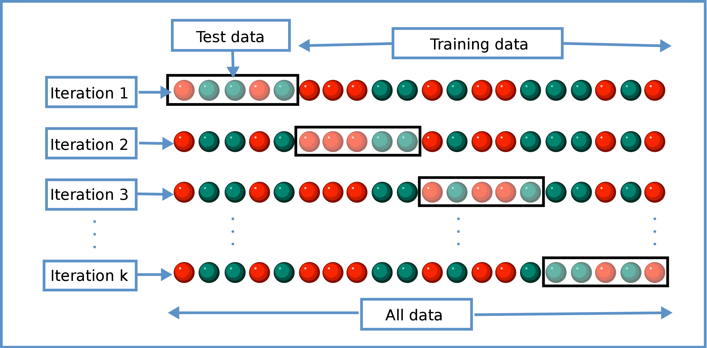

class: middle
background-size: contain

<!----- Make a pdf using:

decktape generic --key=ArrowRight --load-pause 1800 --slides '1-106' --size '1216x684' --url-load-timeout 80000 --page-load-timeout 40000  "week-09-logistic-regression/slides/week-09-logistic-regression.html" week-09-logistic-regression/slides/week-09-logistic-regression.pdf

----->

<br><br><br>

# .tuos_purple[EDC459: Week 9<br>Multiple Logistic Regression]

<br><br>

**Dr. Calum Webb**<br>
Sheffield Methods Institute, the University of Sheffield.<br>
[c.j.webb@sheffield.ac.uk](mailto:c.j.webb@sheffield.ac.uk)

```{r setup, include=FALSE}
options(htmltools.dir.version = FALSE)

# These packages are required for creating the slides
# Many will need to be installed from Github
library(icons)
library(tidyverse)
library(xaringan)
library(xaringanExtra)
library(xaringanthemer)

# Defaults for code
knitr::opts_chunk$set(
  fig.width=9, fig.height=3.5, fig.retina=3,
  out.width = "100%",
  cache = FALSE,
  echo = TRUE,
  message = FALSE, 
  warning = FALSE,
  fig.show = TRUE,
  hiline = TRUE
)

# set global theme for ggplot to make background #F8F8F8F8 (off white),
# but otherwise keep all ggplot themes default (better for teaching)
theme_set(
  theme(plot.background = element_rect(fill = "#F8F8F8", colour = "#F8F8F8"), 
        panel.background = element_rect(fill = "#F8F8F8", colour = "#F8F8F8"), 
        legend.background = element_rect(fill = "#F8F8F8", colour = "#F8F8F8")
        )
  )

theme_minimal <- function() 
  {
    ggplot2::theme_minimal() +
    theme(plot.background = element_rect(fill = "#F8F8F8", colour = "#F8F8F8"), 
        panel.background = element_rect(fill = "#F8F8F8", colour = "#F8F8F8"), 
        legend.background = element_rect(fill = "#F8F8F8", colour = "#F8F8F8")
        )
}

theme_classic <- function() 
  {
    ggplot2::theme_classic() +
    theme(plot.background = element_rect(fill = "#F8F8F8", colour = "#F8F8F8"), 
        panel.background = element_rect(fill = "#F8F8F8", colour = "#F8F8F8"), 
        legend.background = element_rect(fill = "#F8F8F8", colour = "#F8F8F8")
        )
}

theme_void <- function() 
  {
    ggplot2::theme_void() +
    theme(plot.background = element_rect(fill = "#F8F8F8", colour = "#F8F8F8"), 
        panel.background = element_rect(fill = "#F8F8F8", colour = "#F8F8F8"), 
        legend.background = element_rect(fill = "#F8F8F8", colour = "#F8F8F8")
        )
  }

```

```{r xaringan-tile-view, echo=FALSE}
# Use tile overview by hitting the o key when presenting
xaringanExtra::use_tile_view()
```

```{r xaringan-logo, echo=FALSE}
# Add logo to top right
xaringanExtra::use_logo(
  image_url = "header/smi-logo-white.png",
  exclude_class = c("inverse", "hide_logo"), 
  width = "180px", position = css_position(top = "1em", right = "2em")
)
```

```{r xaringan-themer, include=FALSE, warning=FALSE}

# Set some global objects containing the colours
# of the university's branding
primary_color <- "#131E29"
secondary_color <- "#440099"
tuos_blue <- "#9ADBE8"
white = "#F8F8F8"
tuos_yellow <- "#FCF281"
tuos_purple <- "#440099"
tuos_red <- "#E7004C"
tuos_midnight <- "#131E29"

# The bulk of the styling is handled by xaringanthemer
style_duo_accent(
  primary_color = "#131E29",
  secondary_color = "#440099",
  colors = c(tuos_purple = "#440099", 
             grey = "#131E2960", 
             tuos_blue ="#9ADBE8",
             tuos_mint = "#00CE7C"),
  header_font_google = xaringanthemer::google_font("Source Serif Pro", "600", "600i"),
  text_font_google   = xaringanthemer::google_font("Source Sans Pro", "300", "300i", "600", "600i"),
  code_font_google   = xaringanthemer::google_font("Lucida Console"),
  header_h1_font_size = "2rem",
  header_h2_font_size = "1.5rem", 
  header_h3_font_size = "1.25rem", 
  text_font_size = "0.9rem",
  code_font_size = "0.45rem", 
  code_inline_background_color = "#F8F8F8", 
  inverse_text_color = "#9ADBE8", 
  background_color = "#F8F8F8", 
  text_color = "#131E29", 
  link_color = "#005A8F", 
  inverse_link_color = "#F8F8F8",
  text_slide_number_color = "#44009970",
  table_row_even_background_color = "transparent", 
  table_border_color = "#44009970",
  text_bold_font_weight = 600
)

```


```{r xaringan-panelset, echo=FALSE}
# Allow for adding panelsets (see example on slide 2)
xaringanExtra::use_panelset(in_xaringan = TRUE)

style_panelset_tabs(
  background = "#F8F8F8",
  active_background = "#F8F8F8",
  hover_background = "#F8F8F8"
)


```

```{r xaringanExtra, echo = FALSE}
# Adds white progress bar to top
xaringanExtra::use_progress_bar(color = "#F8F8F8", location = "top")
```

```{r xaringan-extra-styles, echo = FALSE}
# Allow for code to be highlighted on hover
xaringanExtra::use_extra_styles(
  hover_code_line = TRUE,         #<<
  mute_unhighlighted_code = TRUE  #<<
)
```

```{r share-again, echo=FALSE}
# Add sharing links and other embedding tools
xaringanExtra::use_share_again()
```

```{r xaringanExtra-search, echo=FALSE}
# Add magnifying glass search function to bottom left for quick
# searching of slides
xaringanExtra::use_search(show_icon = TRUE, auto_search = FALSE)
```


```{r, include = FALSE}
library(broom)

set.seed(100)
age <- round(runif(300, min = 18, max = 85), 0)
noise <- rnorm(300, mean = 0, sd = 0.3)
tv_license <- exp(log(0.2) + log(0.1*age) + noise) / (1 + exp(log(0.2) + log(0.1*age) + noise))
tv_license <- round(tv_license, 0)

tv_licenses <- tibble(age, tv_license)

# LPM above 1 and below 0

lm(data = tv_licenses, formula = tv_license ~ age) %>% summary()


raw_data_plot <- ggplot(tv_licenses, aes(x = age, y = tv_license)) +
  geom_point(pch = 1, size = 2, alpha = 0.3) +
  theme_classic()

raw_data_plot_plus_mean <- ggplot(tv_licenses, aes(x = age, y = tv_license)) +
  geom_point(pch = 1, size = 2, alpha = 0.3) +
  theme_classic() +
  #geom_hline(yintercept = mean(tv_licenses$tv_license), col = "#3D6BFF", size = 1.5) +
  annotate("text", x = mean(tv_licenses$age), y = 0.6, label = paste("Odds TV License =", "159 / 141", "= 1.12766 : 1"))

raw_data_plot_log_mean <- ggplot(tv_licenses, aes(x = age, y = log(tv_license))) +
  geom_point(pch = 1, size = 2, alpha = 0.3) +
  theme_classic() +
  geom_hline(yintercept = log(1.12766), col = "#3D6BFF", size = 1.5) +
  ylim(c(-4, 2)) +
  annotate("text", x = mean(tv_licenses$age), y = 0.5, label = paste("Log Odds TV License =", "log(1.12766) =", "0.1201447"))

iter_1 <- ggplot(tv_licenses, aes(x = age, y = log(tv_license))) +
  geom_segment(aes(x = age, xend = age, y = log(1.12766), yend = log(tv_license)), size = 0.3) +
  geom_point(pch = 1, size = 2, alpha = 0.3) +
  theme_classic() +
  geom_hline(yintercept = log(1.12766), col = "#3D6BFF", size = 1.5) +
  ylim(c(-4, 2)) 

iter_2 <- ggplot(tv_licenses, aes(x = age, y = log(tv_license))) +
  geom_point(pch = 1, size = 2, alpha = 0.3) +
  theme_classic() +
  geom_hline(yintercept = log(1.12766), col = "#3D6BFF", size = 1.5) +
  geom_point(aes(x = age, y = log(1.12766))) +
  ylim(c(-4, 2)) 

iter_3 <- ggplot(tv_licenses, aes(x = age, y = tv_license)) +
  geom_point(pch = 1, size = 2, alpha = 0.3) +
  theme_classic() +
  geom_hline(yintercept = exp(log(1.12766)) / (1 + exp(log(1.12766))), col = "#3D6BFF", size = 1.5) +
  geom_point(aes(x = age, y = exp(log(1.12766)) / (1 + exp(log(1.12766))))) +
  annotate("text", x = mean(tv_licenses$age), y = 0.65, 
           label = paste("Predicted Probability Y=1|X =", "exp(logodds) / (1 + exp(logodds))\n=exp(log(1.12766)) / (1 + exp(log(1.12766))) = 0.53 or 53%"))

iter_4 <- ggplot(tv_licenses, aes(x = age, y = tv_license)) +
  geom_segment(aes(x = age, xend = age, y = mean(tv_licenses$tv_license), yend = tv_license), size = 0.1) +
  geom_point(pch = 1, size = 2, alpha = 0.3) +
  theme_classic() +
  geom_hline(yintercept = exp(log(mean(tv_licenses$tv_license))), col = "#3D6BFF", size = 1.5) +
  geom_point(aes(x = age, y = exp(log(mean(tv_licenses$tv_license))))) 

iter_5 <- ggplot(tv_licenses, aes(x = age, y = log(tv_license))) +
  geom_point(pch = 1, size = 2, alpha = 0.3) +
  theme_classic() +
  geom_hline(yintercept = log(1.12766), col = "#3D6BFF", size = 1.5) +
  ylim(c(-4, 4)) 

iter_6 <- ggplot(tv_licenses, aes(x = age, y = log(tv_license))) +
  #geom_segment(aes(x = age, xend = age, y = -3.9 + 0.0615*age, yend = log(tv_license)), size = 0.3) +
  geom_point(pch = 1, size = 2, alpha = 0.3) +
  theme_classic() +
  geom_abline(intercept = -3.9, slope = 0.0615, col = "#3D6BFF", size = 1.5) +
  ylim(c(-4, 4)) 

iter_7 <- ggplot(tv_licenses, aes(x = age, y = log(tv_license))) +
  geom_segment(aes(x = age, xend = age, y = -3.9 + 0.0615*age, yend = log(tv_license)), size = 0.1) +
  geom_point(pch = 1, size = 2, alpha = 0.3) +
  theme_classic() +
  geom_abline(intercept = -3.9, slope = 0.0615, col = "#3D6BFF", size = 1.5) +
  ylim(c(-4, 4)) 

iter_8 <- ggplot(tv_licenses, aes(x = age, y = log(tv_license))) +
  geom_segment(aes(x = age, xend = age, y = -3.9 + 0.0615*age, yend = log(tv_license)), size = 0.1) +
  geom_point(pch = 1, size = 2, alpha = 0.3) +
  theme_classic() +
  geom_abline(intercept = -3.9, slope = 0.0615, col = "#3D6BFF", size = 1.5) +
  geom_point(x = age, y = -3.9 + 0.0615*age) +
  ylim(c(-4, 4)) 

iter_9 <- ggplot(tv_licenses, aes(x = age, y = tv_license)) +
  geom_segment(aes(x = age, xend = age, y = exp(-3.9 + 0.0615*age) / (1 + exp(-3.9 + 0.0615*age)), yend = tv_license), size = 0.1) +
  geom_point(pch = 1, size = 2, alpha = 0.3) +
  theme_classic() +
  #geom_abline(intercept = exp(-3.9), slope = exp(0.0615), col = "#3D6BFF", size = 1.5) +
  geom_smooth(aes(x = age, y = exp(-3.9 + 0.0615*age) / (1 + exp(-3.9 + 0.0615*age)))) +
  geom_point(x = age, y = exp(-3.9 + 0.0615*age) / (1 + exp(-3.9 + 0.0615*age)) ) 


iter_10 <- ggplot(tv_licenses, aes(x = age, y = tv_license)) +
  #geom_segment(aes(x = age, xend = age, y = exp(-3.9 + 0.0615*age) / (1 + exp(-3.9 + 0.0615*age)), yend = tv_license), size = 0.1) +
  geom_point(pch = 1, size = 2, alpha = 0.3) +
  theme_classic() +
  #geom_abline(intercept = exp(-3.9), slope = exp(0.0615), col = "#3D6BFF", size = 1.5) +
  geom_smooth(aes(x = age, y = exp(-3.9 + 0.0615*age) / (1 + exp(-3.9 + 0.0615*age)))) 
  #geom_point(x = age, y = exp(-3.9 + 0.0615*age) / (1 + exp(-3.9 + 0.0615*age)) ) 

iter_11 <- ggplot(tv_licenses, aes(x = age, y = log(tv_license))) +
  #geom_segment(aes(x = age, xend = age, y = -3.9 + 0.0615*age, yend = log(tv_license)), size = 0.3) +
  geom_point(pch = 1, size = 2, alpha = 0.3) +
  theme_classic() +
  geom_abline(intercept = -3.9, slope = 0.0615, col = "#3D6BFF", size = 1.5) +
  ylim(c(-4, 5)) 

iter_12 <- ggplot(tv_licenses, aes(x = age, y = log(tv_license))) +
  #geom_segment(aes(x = age, xend = age, y = -3.9 + 0.0615*age, yend = log(tv_license)), size = 0.3) +
  geom_point(pch = 1, size = 2, alpha = 0.3) +
  theme_classic() +
  geom_abline(intercept = -6.176, slope = 0.12312, col = "#3D6BFF", size = 1.5) +
  ylim(c(-4, 5)) 

iter_13 <- ggplot(tv_licenses, aes(x = age, y = log(tv_license))) +
  geom_segment(aes(x = age, xend = age, y = -6.176 + 0.12312*age, yend = log(tv_license)), size = 0.3) +
  geom_point(pch = 1, size = 2, alpha = 0.3) +
  theme_classic() +
  geom_abline(intercept = -6.176, slope = 0.12312, col = "#3D6BFF", size = 1.5) +
  ylim(c(-4, 5)) 

iter_14 <- ggplot(tv_licenses, aes(x = age, y = log(tv_license))) +
  geom_segment(aes(x = age, xend = age, y = -6.176 + 0.12312*age, yend = log(tv_license)), size = 0.3) +
  geom_point(pch = 1, size = 2, alpha = 0.3) +
  theme_classic() +
  geom_abline(intercept = -6.176, slope = 0.12312, col = "#3D6BFF", size = 1.5) +
  geom_point(x = age, y = -6.176 + 0.12312*age) +
  ylim(c(-4, 5)) 

iter_15 <- ggplot(tv_licenses, aes(x = age, y = log(tv_license))) +
  #geom_segment(aes(x = age, xend = age, y = -6.176 + 0.12312*age, yend = log(tv_license)), size = 0.3) +
  geom_point(pch = 1, size = 2, alpha = 0.3) +
  theme_classic() +
  geom_abline(intercept = -6.176, slope = 0.12312, col = "#3D6BFF", size = 1.5) +
  geom_point(x = age, y = -6.176 + 0.12312*age) +
  ylim(c(-4, 5)) 

iter_16 <- ggplot(tv_licenses, aes(x = age, y = tv_license)) +
  geom_segment(aes(x = age, xend = age, y = exp(-6.176 + 0.12312*age) / (1 + exp(-6.176 + 0.12312*age)), yend = tv_license), size = 0.3) +
  geom_point(pch = 1, size = 2, alpha = 0.3) +
  theme_classic() +
  #geom_abline(intercept = -6.176, slope = 0.12312, col = "#3D6BFF", size = 1.5) +
  geom_smooth(aes(x = age, y = exp(-6.176 + 0.12312*age) / (1 + exp(-6.176 + 0.12312*age)))) +
  geom_point(x = age, y = exp(-6.176 + 0.12312*age) / (1 + exp(-6.176 + 0.12312*age))) 
  #ylim(c(-4, 5)) 

iter_17 <- ggplot(tv_licenses, aes(x = age, y = tv_license)) +
  #geom_segment(aes(x = age, xend = age, y = exp(-6.176 + 0.12312*age) / (1 + exp(-6.176 + 0.12312*age)), yend = tv_license), size = 0.3) +
  geom_point(pch = 1, size = 2, alpha = 0.3) +
  theme_classic() +
  #geom_abline(intercept = -6.176, slope = 0.12312, col = "#3D6BFF", size = 1.5) +
  geom_smooth(aes(x = age, y = exp(-6.176 + 0.12312*age) / (1 + exp(-6.176 + 0.12312*age)))) 
  #geom_point(x = age, y = exp(-6.176 + 0.12312*age) / (1 + exp(-6.176 + 0.12312*age))) 
  #ylim(c(-4, 5)) 


plm_plot <- ggplot(tv_licenses, aes(x = age, y = tv_license)) +
  geom_point(pch = 1, size = 2, alpha = 0.3) +
  theme_classic() +
  geom_abline(intercept = -0.443821, slope = 0.018704, col = "#3D6BFF", size = 1.5)

# Logit curve - no above 1 or below zero

logit_mod <- glm(data = tv_licenses, formula = tv_license ~ age, family = binomial)

tv_licenses_resp <- augment(logit_mod, type.predict = "response")

lr_plot <- ggplot(tv_licenses_resp, aes(x = age, y = tv_license)) +
  geom_point(pch = 1, size = 2, alpha = 0.3) +
  theme_classic() +
  geom_smooth(aes(y = .fitted)) + 
  xlim(c(18, 86)) +
  ylim(0, 1)


# Binned probabilities
# Grouped together every 6 years of age and then worked out the odds of them owning a 
# TV license of not owning a TV licenses

# Odds unlogged
bin_odds_plot <- ggplot(tv_licenses_resp, aes(x = age, y = tv_license)) +
  theme_classic() +
  geom_smooth(aes(y = .fitted)) +
  stat_summary_bin(geom = "point", fun = mean, aes(y = tv_license), bins = 22) + 
  xlim(c(18, 86)) +
  ylim(0, 1)

tv_licenses_logged <- augment(logit_mod)

# Logged odds
logged_odds_plot <- ggplot(tv_licenses_logged, aes(x = age, y = tv_license)) +
  theme_classic() +
  geom_smooth(aes(y = .fitted), method = "lm") +
  stat_summary_bin(geom = "point", fun = ~ifelse(log((mean(.)/(1-mean(.)))) == Inf, # set +Inf to 4
                                                 4, 
                                                 ifelse(log((mean(.)/(1-mean(.)))) == -Inf,
                                                        -4,
                                                        log((mean(.)/(1-mean(.)))))), aes(y = tv_license), bins = 22) +
  xlim(c(18, 86)) 
  #ylim(0, 1)

# Annotated plots - log odds

annotate_log_odds <- ggplot(tv_licenses_logged, aes(x = age, y = tv_license)) +
  theme_classic() +
  geom_smooth(aes(y = .fitted), method = "lm") +
  stat_summary_bin(geom = "point", fun = ~ifelse(log((mean(.)/(1-mean(.)))) == Inf, # set +Inf to 4
                                                 4, 
                                                 ifelse(log((mean(.)/(1-mean(.)))) == -Inf,
                                                        -4,
                                                        log((mean(.)/(1-mean(.)))))), aes(y = tv_license), bins = 22) +
  xlim(c(18, 86)) +
  annotate(
    "segment", x = 72.6, yend = 2.3, xend = 72.6, y = 0.6, col = "coral", size = 1, arrow = arrow(type = "closed", length = unit(0.1, "inches"))
  ) +
  annotate("text", x = 72.6, y = 0.5, vjust = 1, label = "log(odds) = 2.5\nP|Y=1 = exp(2.5) / (1 + exp(2.5)) = 0.924")


# Annotated plot - predicted probability
annotate_odds_ratio <- ggplot(tv_licenses_resp, aes(x = age, y = tv_license)) +
  theme_classic() +
  geom_smooth(aes(y = .fitted)) +
  stat_summary_bin(geom = "point", fun = mean, aes(y = tv_license), bins = 22) + 
  xlim(c(18, 86)) +
  ylim(0, 1) +
  annotate(
  "segment", x = 72.6, yend = 0.9, xend = 72.6, y = 0.6, col = "coral", size = 1, arrow = arrow(type = "closed", length = unit(0.1, "inches"))
  ) +
  annotate("text", x = 72.6, y = 0.55, vjust = 1, label = "P|Y=1 = exp(2.5) / (1 + exp(2.5)) = 0.924\nlog(exp(2.5)) = 2.5\n")


```


---
class: middle

.pull-left[


]
.pull-right[

<br><br><br><br><br><br>

# Sign In


]
---
class: middle

## Learning Objectives

.panelset[

.panel[.panel-name[What will I learn?]

By the end of this week you will:

* Be able to identify research questions suited to logistic regression.

* Be able to describe (at a basic level) how logistic regression works and what it can be used for.

* Be able to estimate logistic regression models in `R` using the `glm()` function.

* Be able to check the fit of logistic regression models in `R` using pseudo- $R^2$ statistics, model accuracy, and $k$-fold cross-validation.

* Be able to check whether your logistic regression model violates any assumptions of general linear regression.


]

.panel[.panel-name[How does this week fit into my course?]

* Logistic regression opens up a world of possible research questions that couldn't be adequately explored with a linear regression model.

* Your knowledge of model assumptions in general linear models will now be complete, enabling you to conduct quantitative research robustly. 


]


]


???


---

class: inverse, middle

Week 9: Logistic Regression — Part I
# What is logistic regression and why learn it?


---

class: inverse, middle

### Multiple linear regression is great... But what if the thing we're interested in isn't on a continuous scale?

(Let alone one with nice normally distributed residuals...)

---

background-color: white

## Wooclap activity

.pull-left[

<br><br><br><br>

#### What things are you interested in researching that aren't on a continuous scale?

Join the wooclap activity by clicking [this link](https://app.wooclap.com/events/AXUMRY/questions/66e8406bafc80076ce296f5d), or scanning the QR code on the right, and try and contribute at least one variable that you would be interested in analysing but either can't be measured on, or you haven't seen measured on, a continuous scale.

Event ID: **AXUMRY**


]

.pull-right[

```{r, echo = FALSE}

knitr::include_graphics("images/SMI606-week-9-wooclap-1.png")

```

]


---

# Predicting binary outcomes

.pull-left[
We can use linear regression to predict binary outcomes. This is called an LPM — a __linear probability model__ (not to be confused with a linear panel model!)

```{r}

plm_mod <- lm(data = tv_licenses, formula = tv_license ~ age)

summary(plm_mod)

```

.small[Every __1 year increase in age__ is associated with a __1.87 percentage point increase__ in the probability of owning a TV license.]

]

.pull-right[

```{r, echo = FALSE, fig.height = 4.5, fig.width=5, out.height=450, out.width=500}

plm_plot

```

]

---

# Predicting binary outcomes

.pull-left[

```{r}
summary(plm_mod)
```

But that means that if you are 85 your probability of owning a TV license would be...

$$\text{tv_license} = -0.44 + 0.0187*85 = 1.1495$$
__114.95%__??

]

.pull-right[

```{r, echo = FALSE, fig.height = 4.5, fig.width=5, out.height=450, out.width=500}

plm_plot

```

]


---

# Predicting binary outcomes

.pull-left[

```{r}
summary(plm_mod)
```

And if you were 20 years old your predicted probability of owning a TV license would be...

$$\text{tv_license} = -0.44 + 0.0187*20 = -0.066$$
__-6.6%__??

]

.pull-right[

```{r, echo = FALSE, fig.height = 4.5, fig.width=5, out.height=450, out.width=500}

plm_plot

```

]


---

# Predicting binary outcomes

.pull-left[

When we have binary outcomes to predict what we ideally want to do is constrain out model between either 1 (the thing happened, the person is in the group, etc.) and 0 (the thing didn't happen, the person wasn't in the group, etc.).

For this, we can use __logistic regression__.

]

.pull-right[

```{r, echo = FALSE, fig.height = 4.5, fig.width=5, out.height=450, out.width=500}

plm_plot

```

]

---

# Predicting binary outcomes

.pull-left[

When we have binary outcomes to predict what we ideally want to do is constrain out model between either 1 (the thing happened, the person is in the group, etc.) and 0 (the thing didn't happen, the person wasn't in the group, etc.).

For this, we can use __logistic regression__.

...Much better!

]

.pull-right[

```{r, echo = FALSE, fig.height = 4.5, fig.width=5, out.height=450, out.width=500}

lr_plot

```

]


---

class: inverse, middle

Week 9: Logistic Regression — Part II
# How does logistic regression work?


---

# Logistic regression

.pull-left[
#### How does this magic work?

Unlike multiple linear regression (which usually uses an ordinary least squares estimator), logistic regression uses __Maximum Likelihood__ estimation to calculate the best fitting probabilities for each data point.

Let's talk about what the ML estimator is doing...

]


---

# Logistic regression

.pull-left[

Logistic regression makes use of three things:

#### Odds

What are the odds of a thing happening?

If 150 people own a TV license for every 100 people who don't own a TV license, the odds of someone owning a TV license are 3:2 (usually just written as 1.5)

$$Odds|A = A/B$$

#### Log Odds 

The odds can be transformed to their natural log to create 'log odds'

$$logodds = log(Odds)$$


]

.pull-right[

This is very useful when combined with the logistic sigmoid function.

#### Logistic sigmoid function

The logistic sigmoid function is a function that returns a value that is always between 0 and 1. It can be defined as:

$$\frac{e^x}{(1 + e^x)}$$
When $x$ is our log odds of Y being equal to 1 the logistic sigmoid function returns a __predicted probability__.


]


---

# Logistic regression

#### Example

150 people own TV licenses and 100 people do not. The __odds__ of owning a TV license are equal to $150/100 = 1.5$.

--

The log odds of owning a TV license are equal to $log(1.5) = 0.4054651$

--

The predicted probability of owning a TV license can be calculated using the logistic sigmoid function as:

$$\frac{e^{0.4054651}}{1 + e^{(0.4054651)}}$$
Or in `R` code: `exp(0.4054651) / (1 + exp(0.4054651))` `= 0.6 = 60%`

--

This means that: if we know the log odds of something we can calculate its predicted probability. The maximum likelihood estimator takes advantage of the properties of log odds to model predicted probabilities that Y = 1 conditional on values of X (__Y=1|X__).

---

# Logistic regression

.pull-left[

#### Visual Explanation

Let's start off with our raw data. Along the top we have the people who do own a TV license (1), along the bottom we have people who do not own a TV license (0).


]

.pull-right[

```{r, echo = FALSE, fig.height = 4.5, fig.width=5, out.height=450, out.width=500}

raw_data_plot

```

]

---

# Logistic regression

.pull-left[

#### Visual Explanation

Let's start off with our raw data. Along the top we have the people who do own a TV license (1), along the bottom we have people who do not own a TV license (0).

<hr>

Maximum Likelihood is an iterative method, so let's start our first set of predictions at the general odds of owning a TV license (1.127 to 1) before we start to adjust the odds by age.


]

.pull-right[

```{r, echo = FALSE, fig.height = 4.5, fig.width=5, out.height=450, out.width=500}

raw_data_plot_plus_mean

```

]


---

# Logistic regression

.pull-left[

#### Visual Explanation

Maximum Likelihood is an iterative method, so let's start our first set of predictions at the general odds of owning a TV license (1.127 to 1) before we start to adjust the odds by age.

<hr>

We can then convert our odds to log odds. The log odds equal 0.1201447. 

We also log our real data 

* log(1) = 0
* log(0) = -Infinity


]

.pull-right[

```{r, echo = FALSE, fig.height = 4.5, fig.width=5, out.height=450, out.width=500}

raw_data_plot_log_mean

```

]


---

# Logistic regression

.pull-left[

#### Visual Explanation

We can then convert our odds to log odds. The log odds equal 0.1201447. 

We also log our real data 

* log(1) = 0
* log(0) = -Infinity

<hr>

We cannot really use negative infinity for anything, so we map our data points to the closest position on the line. 

]

.pull-right[

```{r, echo = FALSE, fig.height = 4.5, fig.width=5, out.height=450, out.width=500}

iter_1

```

]


---

# Logistic regression

.pull-left[

#### Visual Explanation

We cannot really use negative infinity for anything, so we map our data points to the closest position on the line. 

<hr>

Now we've assigned each data point to its closest position on a line, we can give it a new value based on the position of the line. We can then transform these new log odds values back into a predicted probability using the logistic sigmoid function.


]

.pull-right[

```{r, echo = FALSE, fig.height = 4.5, fig.width=5, out.height=450, out.width=500}

iter_2

```

]


---

# Logistic regression

.pull-left[

#### Visual Explanation

Now we've assigned each data point to its closest position on a line, we can give it a new value based on the position of the line. We can then transform these new log odds values back into a predicted probability using the logistic sigmoid function.

<hr>

We can use the logistic sigmoid function below to calculate the predicted probability for each point on the line. Here, every point has the same value, so the calculation is relatively simple:

$$P(Y=1|X) = \frac{e^{x}}{(1 + e^{x})} = \frac{e^{0.1201447 + 0*age}}{(1 + e^{0.1201447+0*age})}$$
Doesn't something look familiar about part of our $x$?

]

.pull-right[

```{r, echo = FALSE, fig.height = 4.5, fig.width=5, out.height=450, out.width=500}

iter_3

```

]

---

# Logistic regression

.pull-left[

#### Visual Explanation

$$P(Y=1|X) = \frac{e^{x}}{(1 + e^{x})} = \frac{e^{0.1201447 + 0*age}}{(1 + e^{0.1201447+0*age})}$$

Doesn't something look familiar about part of our $x$?

<hr>

We can then get a picture of how good our predictions were from the real values, similar to how we use residuals in ordinary least squares — these ones are not looking very good, are they?


]

.pull-right[

```{r, echo = FALSE, fig.height = 4.5, fig.width=5, out.height=450, out.width=500}

iter_4

```

]


---

# Logistic regression

.pull-left[

#### Visual Explanation

We can then get a picture of how good our predictions were from the real values, similar to how we use residuals in ordinary least squares — these ones are not looking very good, are they?

<hr>

Let's go back for another iteration — this time, __let's try giving the line a positive slope__.


]

.pull-right[

```{r, echo = FALSE, fig.height = 4.5, fig.width=5, out.height=450, out.width=500}

iter_5

```

]

---

# Logistic regression

.pull-left[

#### Visual Explanation

Let's go back for another iteration — this time, __let's try giving the line a positive slope__.

<hr>

Then we can repeat the process.


]

.pull-right[

```{r, echo = FALSE, fig.height = 4.5, fig.width=5, out.height=450, out.width=500}

iter_6

```

]

---

# Logistic regression

.pull-left[

#### Visual Explanation

Let's go back for another iteration — this time, __let's try giving the line a positive slope__.

<hr>

Then we can repeat the process.

<hr>

Let's map our negative infinity and 0 value data points back to their closest position on the log odds regression line.


]

.pull-right[

```{r, echo = FALSE, fig.height = 4.5, fig.width=5, out.height=450, out.width=500}

iter_7

```

]


---

# Logistic regression

.pull-left[

#### Visual Explanation

Let's go back for another iteration — this time, __let's try giving the line a positive slope__.

<hr>

Then we can repeat the process.

<hr>

Let's map our negative infinity and 0 value data points back to their closest position on the log odds regression line.

<hr>

Then we just need to convert these new values back into predictions using the logistic sigmoid function.


]

.pull-right[

```{r, echo = FALSE, fig.height = 4.5, fig.width=5, out.height=450, out.width=500}

iter_8

```

]


---

# Logistic regression

.pull-left[

#### Visual Explanation

Then we just need to convert these new values back into predictions using the logistic sigmoid function.

<hr>

Our logistic sigmoid function is now:

$$P(Y=1|X) = \frac{e^{x}}{(1 + e^{x})} = \frac{e^{-3.9 + 0.0615*age}}{(1 + e^{-3.9 + 0.0615*age})}$$


]

.pull-right[

```{r, echo = FALSE, fig.height = 4.5, fig.width=5, out.height=450, out.width=500}

iter_9

```

]


---

# Logistic regression

.pull-left[

#### Visual Explanation

Our logistic sigmoid function is now:

$$P(Y=1|X) = \frac{e^{x}}{(1 + e^{x})} = \frac{e^{-3.9 + 0.0615*age}}{(1 + e^{-3.9 + 0.0615*age})}$$

<hr>

If we wanted to, we could use this to calculate the predicted probability of any given age. For example:

The predicted probability of owning a TV license when age = 80 is:

$$\frac{e^{-3.9 + 0.0615*80}}{(1 + e^{-3.9 + 0.0615*80})} = 0.7349$$
Or in `R` code: `exp(-3.9 + 0.0615*80)/(1 + exp(-3.9 + 0.0615*80)) = 0.7349`

]

.pull-right[

```{r, echo = FALSE, fig.height = 4.5, fig.width=5, out.height=450, out.width=500}

iter_10

```

]


---

# Logistic regression

.pull-left[

#### Visual Explanation

Can we do even better? What happens if we increase the regression line for the log odds even further.


]

.pull-right[

```{r, echo = FALSE, fig.height = 4.5, fig.width=5, out.height=450, out.width=500}

iter_11

```

]

---

# Logistic regression

.pull-left[

#### Visual Explanation

Can we do even better? What happens if we increase the regression line for the log odds even further.

<hr>

Note that, even though the distance between the points is getting larger in terms of log odds, this does not happen in the predictions due to them always being forced to be between 0 and 1.


]

.pull-right[

```{r, echo = FALSE, fig.height = 4.5, fig.width=5, out.height=450, out.width=500}

iter_12

```

]

---

# Logistic regression

.pull-left[

#### Visual Explanation

Let's repeat the process. First, let's project all of the points to their closest position on the line.


]

.pull-right[

```{r, echo = FALSE, fig.height = 4.5, fig.width=5, out.height=450, out.width=500}

iter_13

```

]

---

# Logistic regression

.pull-left[

#### Visual Explanation

Let's repeat the process. First, let's project all of the points to their closest position on the line.

<hr>

Then we (or rather, the Maximum Likelihood Estimator) maps each point to its closest position on the line.


]

.pull-right[

```{r, echo = FALSE, fig.height = 4.5, fig.width=5, out.height=450, out.width=500}

iter_14

```

]

---

# Logistic regression

.pull-left[

#### Visual Explanation

Let's repeat the process. First, let's project all of the points to their closest position on the line.

<hr>

Then we (or rather, the Maximum Likelihood Estimator) maps each point to its closest position on the line.

<hr>

Then we can convert the resulting values for each point back into a predicted probability using the sigmoid function.


]

.pull-right[

```{r, echo = FALSE, fig.height = 4.5, fig.width=5, out.height=450, out.width=500}

iter_15

```

]

---

# Logistic regression

.pull-left[

#### Visual Explanation

Now we have another new set of predictions. Note that even though our logistic regression's sigmoid curve changed, our log odds regression remained a straight line (and could still be expressed in log odds as $\bar{Y} = B_0 + B_1X ...$).


]

.pull-right[

```{r, echo = FALSE, fig.height = 4.5, fig.width=5, out.height=450, out.width=500}

iter_16

```

]

---

# Logistic regression

.pull-left[

#### Visual Explanation

If these predictions are better than our last iteration, it would make sense to keep them! 

We could try making the line steeper again and see if it improves them further. If not, we could make the line more shallow and keep going until we can't get any better predictions by changing the slope of the log odds regression line. When this happens it is known as __convergence__, and our logistic regression model gives us the outcome in the form of:

$$log(Odds Y=1|X) = B_0 + B_1X_1 + ... + B_nX_n$$
Which we can always convert back into predicted probability using the logistic sigmoid function! Pretty cool!

]

.pull-right[

```{r, echo = FALSE, fig.height = 4.5, fig.width=5, out.height=450, out.width=500}

iter_17

```

]

---

# Logistic regression

.pull-left[

<br><br>

Don't worry if this is too much maths/doesn't make much sense! The most important thing in this module is knowing how to run and interpret logistic regression models in R (which is very easy!) 

__You can use logistic regression even if you aren't confident using any of the formulas here__ or don't understand how maximum likelihood estimation works (I barely do)!

I wouldn't be doing my job as an educator if I didn't at least try and explain to you how it works!

]

.pull-right[

```{r, echo = FALSE, fig.height = 4.5, fig.width=5, out.height=450, out.width=500}

iter_17

```

]

---

class: inverse, middle

Week 9: Logistic Regression — Part III
# Estimating, interpreting, and communicating logistic regression in `R`.


---

class: middle, inverse

Let's work through an example...

## Who believes the government is hiding evidence of aliens?

---

### Predicting belief in Alien conspiracy theories with logistic regression

.pull-left[

```{r}

conspiracy_data <- read_rds("conspiracy.rds")

```

```{r, include = FALSE}

conspiracy_data <- conspiracy_data %>%
  mutate(
    hedqual_rec = fct_recode(hedqual_rec,
                             "No quals" = "No qualifications", 
                             "Level 1 quals" = "Level 1 qualifications",
                             "Higher Ed, no degree" = "Higher education below degree")
  ) 

```


```{r}

conspiracy_data %>%
  janitor::tabyl(consp_alien)

```

]

.pull-right[

#### How true do you think the following statement is: 'The government covers up knowledge of aliens'

(Recoded so that "Definitely true" and "Probably true" = 1, and "Probably false" and "Definitely false = 0)

__Independent Variables__

* Age (`rage`)
* Whether plays video games (`games`): Ref = Doesn't play video games
* Highest education qualification (`hedqual_rec`): Ref = No qualifications
* Openness to new experiences (`openness`)
  * 0 = Lowest openness, 3 = highest openness


```{r, include=FALSE}

# Model
glm(data = conspiracy_data, 
    formula = consp_alien ~ rage + games + hedqual_rec + openness, 
    family = binomial(link = "logit"))

```


]

---

### Predicting belief in Alien conspiracy theories with logistic regression

.pull-left[

#### Estimating a multiple logistic regression model

]

.pull-right[

#### Code

```{r, eval=FALSE}

# Model
glm(data = conspiracy_data, 
    formula = consp_alien ~ rage + games + 
                            hedqual_rec + openness, 
    family = binomial(link = "logit"))

```

]


---

### Predicting belief in Alien conspiracy theories with logistic regression

.pull-left[

#### Estimating a multiple logistic regression model

* We need to use the `glm()` function (general linear model), rather than the `lm()` function we used for simple linear regression.

]

.pull-right[

#### Code

```{r, eval=FALSE}

# Model
glm(data = conspiracy_data, #<<
    formula = consp_alien ~ rage + games + 
                            hedqual_rec + openness, 
    family = binomial(link = "logit"))

```

]

---

### Predicting belief in Alien conspiracy theories with logistic regression

.pull-left[

#### Estimating a multiple logistic regression model

* We need to use the `glm()` function (general linear model), rather than the `lm()` function we used for simple linear regression.

* We add in our formula in exactly the same way — our dependent variable should be a binary categorical variable which can be a factor, character, numeric, or logical class. The value being predicted will be __1__ for a __numeric__ class, __TRUE__ for a __logical__ class, the __highest value/non reference level__ in a __factor__ class. It will not work for a character class. If in doubt, just recode into a binary numeric!

]

.pull-right[

#### Code

```{r, eval=FALSE}

# Model
glm(data = conspiracy_data, 
    formula = consp_alien ~ rage + games + #<<
                            hedqual_rec + openness, #<<
    family = binomial(link = "logit"))

```

]


---

### Predicting belief in Alien conspiracy theories with logistic regression

.pull-left[

#### Estimating a multiple logistic regression model

* We need to use the `glm()` function (general linear model), rather than the `lm()` function we used for simple linear regression.

* We add in our formula in exactly the same way — our dependent variable should be a binary categorical variable which can be a factor, character, numeric, or logical class. The value being predicted will be __1__ for a __numeric__ class, __TRUE__ for a __logical__ class, the __highest value/non reference level__ in a __factor__ class. It will not work for a character class. If in doubt, just recode into a binary numeric!

* Finally, and __importantly__ we add `binomial(link = "logit")` to the `family = ` argument. This tells `glm()` that we want a logistic regression, not a standard linear regression.

]

.pull-right[

#### Code

```{r, eval=FALSE}

glm(data = conspiracy_data, 
    formula = consp_alien ~ rage + games + 
                            hedqual_rec + openness, 
    family = binomial(link = "logit")) #<<

```

]


---

### Predicting belief in Alien conspiracy theories with logistic regression

.pull-left-big[
```{r}

alien_model <- glm(data = conspiracy_data, 
                    formula = consp_alien ~ rage + games + 
                                            hedqual_rec + openness, 
                    family = binomial(link = "logit")) 

summary(alien_model)

```
]

.pull-right-small[

__Estimates__

Estimates are now either the base log odds (Intercept) or the __change in log odds for a 1 unit change in X__.

__p-values__

p-values operate in the same way (albeit with a z-statistic rather than a t-statistic) and __test the hypothesis that the change in log odds associated with a 1-unit increase in X is equal to 0__.

But how do I communicate changes in log odds!?

]


---

### Predicting belief in Alien conspiracy theories with logistic regression

.pull-left-big[
```{r}

alien_model <- glm(data = conspiracy_data, 
                    formula = consp_alien ~ rage + games + 
                                            hedqual_rec + openness, 
                    family = binomial(link = "logit")) 

summary(alien_model)

```
]

.pull-right-small[

__Odds Ratios/ Exponentiated Coefficients__

If we exponentiate (using `exp()`) the change in log odds associated with 1-unit increases in our independent variables, we get something called an __odds ratio__.

This __odds ratio__ tells us the multiplicative change in the odds for a 1-unit increase — in other words __how many times as likely is it that Y = 1 when when the independent variable increases by 1__.

For example, __for a 1-unit increase in openness__ __the odds of believing in alien conspiracy theories increases by__ exp(0.215493) = __1.24 times__, or by around 24%.

]

---

### Predicting belief in Alien conspiracy theories with logistic regression

.pull-left-big[
```{r}

alien_model <- glm(data = conspiracy_data, 
                    formula = consp_alien ~ rage + games + 
                                            hedqual_rec + openness, 
                    family = binomial(link = "logit")) 

summary(alien_model)

```
]

.pull-right-small[

__Odds Ratios/ Exponentiated Coefficients__

Negative odds ratios can be a little bit more tricky to interpret, but are not too difficult with a bit of work.

For example, the multiplicative change in odds associated with having a postgraduate degree is exp(-1.844309) or __0.158__. 

This means that __the odds of believing in alien conspiracy theories decrease by 84.2% among those with higher education degrees, compared to those with no qualifications__ (1 - exp(-1.844309) or 1 - 0.158)

]


---

### Predicting belief in Alien conspiracy theories with logistic regression

#### Quickly Adding Odds Ratios to your Model Output using `broom` and `mutate`

* Use `broom::tidy()` to turn your model output into a tidy tibble


```{r}

# Convert model to tibble with broom::tidy
tidy_model <- broom::tidy(alien_model)
tidy_model

```

---

### Predicting belief in Alien conspiracy theories with logistic regression

#### Quickly Adding Odds Ratios to your Model Output using `broom` and `mutate`

* Use `broom::tidy()` to turn your model output into a tidy tibble

* Use `mutate` to create an extra column of exponentiated coefficients (a.k.a. odds ratios)


```{r}

# Create odds ratios column
tidy_model <- tidy_model %>%
  mutate(
    odds_ratios = exp(estimate) #<<
  )

tidy_model

```

---

### Predicting belief in Alien conspiracy theories with logistic regression

#### Quickly Adding Odds Ratios to your Model Output using `broom` and `mutate`

* Use `broom::tidy()` to turn your model output into a tidy tibble

* Use `mutate` to create an extra column of exponentiated coefficients (a.k.a. odds ratios)


```{r}

# Create odds ratios column
tidy_model <- tidy_model %>%
  mutate(
    odds_ratios = exp(estimate) #<<
  )

tidy_model

```

.center[What was the associated change in the odds of believing the government hides information related to aliens for a 1 year increase in age?]

---

### Predicting belief in Alien conspiracy theories with logistic regression

.pull-left[

What about if we want to look at the predictions themselves, not just the change in odds?

]

.pull-right[


]

---

### Predicting belief in Alien conspiracy theories with logistic regression

.pull-left[

What about if we want to look at the predictions themselves, not just the change in odds?

We can use a very nice package called `ggeffects` to plot the predictied probabilities for different independent variables, while keeping the value of other independent variables constant at their mean.

First, load the `ggeffects` library.

]

.pull-right[

```{r}

library(ggeffects)


```


]

---

### Predicting belief in Alien conspiracy theories with logistic regression

.pull-left[

What about if we want to look at the predictions themselves, not just the change in odds?

We can use a very nice package called `ggeffects` to plot the predictied probabilities for different independent variables, while keeping the value of other independent variables constant at their mean.

First, load the `ggeffects` library.

Then, run the `ggeffect` function; make sure to specify the variable you want predictions for in the `terms` argument. Here, I want predictions for `openness`. This will give me some text output for a few possible values of openness.

]

.pull-right[

```{r}

library(ggeffects)

ggeffect(alien_model, terms = "openness") #<<


```


]


---

### Predicting belief in Alien conspiracy theories with logistic regression

.pull-left[

What about if we want to look at the predictions themselves, not just the change in odds?

We can use a very nice package called `ggeffects` to plot the predictied probabilities for different independent variables, while keeping the value of other independent variables constant at their mean.

First, load the `ggeffects` library.

Then, run the `ggeffect` function; make sure to specify the variable you want predictions for in the `terms` argument. Here, I want predictions for `openness`. This will give me some text output for a few possible values of openness.

We can add a `plot()` function after this with a `%>%` to turn this into a ggplot! You can even customise it by using `ggplot` functions like you would normally. 

]

.pull-right[

```{r, eval=FALSE, fig.height=4, fig.width=5, out.height=400, out.width=500}

library(ggeffects)

ggeffect(alien_model, terms = "openness") %>%
  plot() #<<


```

```{r, echo = FALSE, fig.height=4, fig.width=5, out.height=400, out.width=500}

library(ggeffects)

ggeffect(alien_model, terms = "openness") %>%
  plot() + theme_minimal()


```


]


---

### Predicting belief in Alien conspiracy theories with logistic regression

.pull-left[

The plot you get will differ depending on whether your independent variable is categorical/ordinal or continuous.

]

.pull-right[

```{r, eval = FALSE, fig.height=3.8, fig.width=5, out.height=380, out.width=500}

library(ggeffects)

ggeffect(alien_model, terms = "hedqual_rec") %>%
  plot() +
  coord_flip()


```

```{r, echo = FALSE, fig.height=3.8, fig.width=5, out.height=380, out.width=500}

library(ggeffects)

ggeffect(alien_model, terms = "hedqual_rec") %>%
  plot() +
  coord_flip() + theme_minimal()


```


]

---

class: inverse, middle

Week 9: Logistic Regression — Part IV
# Logistic regression model fit and accuracy.

---


class: inverse, middle

## But wait, what happened to our R-squared statistic? How good is our model overall?

---

# Model fit/accuracy

.pull-left[
With logistic regression we cannot calculate an $R^2$ value for model fit in the same way we would for a multiple linear regression model.


]


---

# Model fit/accuracy

.pull-left[

#### Pseudo $R^2$

One option is to use one of [a range of Pseudo-](https://stats.idre.ucla.edu/other/mult-pkg/faq/general/faq-what-are-pseudo-r-squareds/) $R^2$s. However, these do not have quite as straightforward a definition as OLS $R^2$.

* __McFadden $R^2$__: Values between 0.2 and 0.4 represent excellent fit to the data ([Heshner & Stopher, 1979](https://books.google.co.uk/books/about/Behavioural_Travel_Modelling.html?id=jqEOAAAAQAAJ&redir_esc=y))
* __Cox & Snell $R^2$__: No exact interpretation. Closer to 1 = better fit.
* __Nagelkerke $R^2$__: No exact interpretation. Closer to 1 = better fit.
* __Efron $R^2$__: Based on the difference between the predicted probabilities and actual responses. Closer to 1 = better fit.


]


.pull-right[

```{r}

pseudo_r2s_alien <- DescTools::PseudoR2(alien_model, which = c("McFadden", "CoxSnell", "Nagelkerke", "Efron"))

tibble(
  r2_names = names(pseudo_r2s_alien),
  r2_vals = pseudo_r2s_alien
)

```

]

---

# Model fit/accuracy

.pull-left[

#### Pseudo $R^2$

One option is to use one of [a range of Pseudo- ](https://stats.idre.ucla.edu/other/mult-pkg/faq/general/faq-what-are-pseudo-r-squareds/) $R^2$s. However, these do not have quite as straightforward a definition as OLS $R^2$.

* __McFadden $R^2$__: Values between 0.2 and 0.4 represent excellent fit to the data ([Heshner & Stopher, 1979](https://books.google.co.uk/books/about/Behavioural_Travel_Modelling.html?id=jqEOAAAAQAAJ&redir_esc=y))
* __Cox & Snell $R^2$__: No exact interpretation. Closer to 1 = better fit.
* __Nagelkerke $R^2$__: No exact interpretation. Closer to 1 = better fit.
* __Efron $R^2$__: Based on the difference between the predicted probabilities and actual responses. Closer to 1 = better fit.


]


.pull-right[

However, Pseudo- $R^2$ values are of limited value for logistic regression — they can often be useful for __comparing the goodness of fit of different models__, but are not as useful as OLS $R^2$ for explaining how well a model fits the data overall ([Hosmer, Lemeshow & Sturdivant, 2013](https://books.google.co.uk/books?hl=en&lr=&id=64JYAwAAQBAJ&oi=fnd&pg=PR13&dq=info:QYB4u56LccYJ:scholar.google.com&ots=DteR616thH&sig=ilP_3paE7jN8FhOxoy05eR9erwI&redir_esc=y#v=onepage&q&f=false)).

However, we have two additional tools at our disposal for assessing our models: __accuracy__ and __cross-validation__.

]


---

# Model fit/accuracy

.pull-left[

#### Accuracy

In the context of logistic regression, __accuracy__ refers to whether our model's predictions are __able to correctly classify the underlying data__. 


]

---

# Model fit/accuracy

.pull-left[

#### Accuracy

In the context of logistic regression, __accuracy__ refers to whether our model's predictions are __able to correctly classify the underlying data__. 

The first stage is to calculate our predictions.

* We start by using the `mutate` function to create a new column called `pred_consp_alien` using the `predict` function. 
  * The first argument (`alien_model`) tells `R` the model to be used for prediction.
  * The second argument (`type = "response"`) tells `R` we want the predicted probability, not the logodds.
  * The third argument (`newdata = conspiracy_data`) provides `R` with the data that holds the independent variables required for the prediction of each case. 


]

.pull-right[

```{r}

conspiracy_data <- conspiracy_data %>%
  mutate(
    pred_consp_alien = predict(alien_model, 
                               type = "response", 
                               newdata = conspiracy_data)
  ) 

conspiracy_data %>%
  select(consp_alien, pred_consp_alien)

```


]

---

# Model fit/accuracy

.pull-left[

#### Accuracy

The second stage is to convert our predicted probabilities into predicted outcomes. 

* I use the `mutate` function again, this time to overwrite the `pred_consp_alien` variable with the outcome from a `case_when` function.
* The `case_when` function does the following:
  * Any `NA` predictions (because of missing independent variables) stay as missing (`NA_real_`).
  * When `pred_consp_alien` is greater than or equal to 0.5, it now becomes 1.
  * Else, `pred_cons_alien` is equal to 0 (whenever it's less than 0.5).
  
I then check the results with a temporary `select()`.

]

.pull-right[

```{r}

conspiracy_data <- conspiracy_data %>%
  mutate(
    pred_consp_alien = case_when(is.na(pred_consp_alien) ~ NA_real_,
                                 pred_consp_alien >= 0.5 ~ 1,
                                 TRUE ~ 0)
  )

conspiracy_data %>%
  select(consp_alien, pred_consp_alien)

```


]

---

# Model fit/accuracy

.pull-left[

#### Accuracy

Now I can calculate the accuracy of my model against the real data. A quick way to do this and get a collection of relevant statistics is using the `caret` package's `confusionMatrix` function.

* Note that I first change the predictions and original data into factors, and make 0 the reference level. This is because the `caret::confusionMatrix` function only accepts factor type variables.

]

.pull-right[

```{r}

library(caret)

confusionMatrix(
  data = relevel(factor( conspiracy_data$pred_consp_alien ), 
                     ref = "0"),
  reference = relevel(factor( conspiracy_data$consp_alien ), 
                          ref = "0"),
)

```


]


---

# Model fit/accuracy

.pull-left[

#### Accuracy

There is a lot of information here, but for this class I just want to focus on four things:

* The __Confusion Matrix/Classification Table__

* The __Accuracy__

* The __No Information Rate__

* The __Acc > NIR hypothesis test result__

]

.pull-right[

```{r}

library(caret)

confusionMatrix(
  data = relevel(factor( conspiracy_data$pred_consp_alien ), 
                     ref = "0"),
  reference = relevel(factor( conspiracy_data$consp_alien ), 
                          ref = "0"),
)

```


]

---

# Model fit/accuracy

.pull-left[

#### Accuracy

There is a lot of information here, but for this class I just want to focus on four things:

* The __Confusion Matrix/Classification Table__

The 2x2 table at the top of the output tells us how many values were correctly predicted (0 = 0 / 1 = 1) and how many were incorrectly predicted (false positives, predicted 1 when it should be 0; false negatives, predicted 0 when it should be 1). You can see that we had quite a large number of false negatives with this model: __443__!

* The __Accuracy__

* The __No Information Rate__

* The __Acc > NIR hypothesis test result__

]

.pull-right[

```{r}

library(caret)

confusionMatrix(
  data = relevel(factor( conspiracy_data$pred_consp_alien ), 
                     ref = "0"),
  reference = relevel(factor( conspiracy_data$consp_alien ), 
                          ref = "0"),
)

```


]


---

# Model fit/accuracy

.pull-left[

#### Accuracy

There is a lot of information here, but for this class I just want to focus on four things:

* The __Confusion Matrix/Classification Table__

* The __Accuracy__

Accuracy is a straightforward calculation of the proportion of classifications that the model got correct. 961 + 32 predictions were correct (993), and 443 + 33 predictions were incorrect (476). This means that 993 out of 1469 cases were correctly predicted by our model (67.6%).

* The __No Information Rate__

* The __Acc > NIR hypothesis test result__

]

.pull-right[

```{r}

library(caret)

confusionMatrix(
  data = relevel(factor( conspiracy_data$pred_consp_alien ), 
                     ref = "0"),
  reference = relevel(factor( conspiracy_data$consp_alien ), 
                          ref = "0"),
)

```


]


---

# Model fit/accuracy

.pull-left[

#### Accuracy

There is a lot of information here, but for this class I just want to focus on four things:

* The __Confusion Matrix/Classification Table__

* The __Accuracy__

* The __No Information Rate__

The No Information Rate is the proportion of observations we would expect to get correct by guessing without any additional information; equal to the proportion of the largest group (994 / 1469 = 67.67%).  

* The __Acc > NIR hypothesis test result__

]

.pull-right[

```{r}

library(caret)

confusionMatrix(
  data = relevel(factor( conspiracy_data$pred_consp_alien ), 
                     ref = "0"),
  reference = relevel(factor( conspiracy_data$consp_alien ), 
                          ref = "0"),
)

```


]


---

# Model fit/accuracy

.pull-left[

#### Accuracy

There is a lot of information here, but for this class I just want to focus on four things:

* The __Confusion Matrix/Classification Table__

* The __Accuracy__

* The __No Information Rate__

* The __Acc > NIR hypothesis test result__

Lastly, we have a hypothesis test for the hypothesis that our model's accuracy is not greater than the No Information Rate. A p-value less than 0.05 indicates our accuracy is significantly better than the No Information Rate.

]

.pull-right[

```{r}

library(caret)

confusionMatrix(
  data = relevel(factor( conspiracy_data$pred_consp_alien ), 
                     ref = "0"),
  reference = relevel(factor( conspiracy_data$consp_alien ), 
                          ref = "0"),
)

```


]

---

# Model fit/accuracy

.pull-left[

#### Accuracy Weaknesses

While intuitive, we should be cautious about relying only on accuracy for measuring model fit.

Accuracy alone __doesn't tell us how good our predicted probabilities are__. Most of our predicted probabilities could be very marginal.

This means that small amounts of random bias or error in our specific sample could make our model perform much better in an accuracy test than it would in the population.


]

.pull-right[

```{r, echo = FALSE}

conspiracy_data %>%
  mutate(
    pred_consp_alien = predict(alien_model, 
                               type = "response", 
                               newdata = conspiracy_data)
  ) %>%
  select(consp_alien, pred_consp_alien) %>%
  slice(10:20)

```

```{r, echo = FALSE}

tv_licenses %>%
  mutate(
    tv_license_pred = predict(logit_mod,
                              type = "response",
                              newdata = tv_licenses)
  ) %>%
  select(tv_license, tv_license_pred)

```


]


---

# Model fit/accuracy

.pull-left-small[

#### $K$-fold Cross-Validation

One of the ways of getting a better representation of model accuracy (a measure less influenced by the idiosyncrasies in our sample) is the __K-fold Cross-validation__.

* Take a unique subset of data to 'hold out' of our model estimation.
* Estimate our model on the remaining data.
* Check the accuracy of this model on our hold out data.
* Repeat this $k$ times and then look at the average accuracy and standard error. (Normally $k$ = 5 or 10)

]


.pull-right-big[

<br>

```{r, echo=FALSE}



```

]


---

# Model fit/accuracy

.pull-left[

#### $K$-fold Cross-Validation

$K$-fold Cross-Validation is very easy to perform in `R` using the `performance` package.

* Set a randomiser seed if you need your results to be replicable.
* Use the `performance_accuracy` function to perform k-fold cross-validation.

__Results__

* The average accuracy for our model was 63.5% — about 4 percentage points worse than our raw accuracy.
* Average standard error estimate of the accuracy was around 5%

]


.pull-right[

<br>

```{r}

# Set seed - Because the unique subsets are random
# for demonstration purposes I want to make sure 
# the they are always the same
set.seed(306)

# Use the performance package to perform k-fold 
# cross-validation
performance::performance_accuracy(alien_model, k = 5)

```

]


---

class: inverse, middle

Week 9: Logistic Regression — Part V
# Logistic regression assumptions.


---

# Assumptions


.pull-left[

* __Linearity__

* __Homoscedasticity__

* __No outliers or leverage points__

* __Normality of residuals__

* __No multicollinearity__

]

.pull-right[


]


---

# Assumptions


.pull-left[

* __Linearity__

* .grey[Homoscedasticity]

* __No outliers or leverage points__

* .grey[Normality of residuals]

* __No multicollinearity__

]

.pull-right[


]

---

# Assumptions


.pull-left[

* __Linearity__

* __No outliers or leverage points__

* __No multicollinearity__


]

.pull-right[


]

---

# Assumptions


.pull-left[

* __Linearity__

* __No outliers or leverage points__

* __No multicollinearity__

* __No autocorrelation__

]

.pull-right[


]


---

# Assumptions


.pull-left-small[

* __Linearity__

  * For continuous predictors only
  * Is a straight line the best fit to the data or would a curved line fit better?

* No outliers or leverage points

* No multicollinearity

* No autocorrelation

]

.pull-right-big[

```{r, out.width=700, out.height=320, fig.width=7, fig.height=3.2}

conspiracy_data %>%
  # Get predicted logodds
  mutate(
    pred_alien_logodds = predict(alien_model,
                                 type = "link",
                                 newdata = conspiracy_data)
  ) %>%
  # Plot logodds against continuous predictors
  ggplot() +
  geom_point(aes(x = rage, y = pred_alien_logodds)) +
  geom_smooth(aes(x = rage, y = pred_alien_logodds), method = "lm")

```


]


---

# Assumptions


.pull-left-small[

* __Linearity__

  * For continuous predictors only
  * Is a straight line the best fit to the data or would a curved line fit better?
  * Can use something called a Box-Tidwell test to check whether non-linearity is significant

* No outliers or leverage points

* No multicollinearity

* No autocorrelation

]

.pull-right-big[

```{r, out.width=700, out.height=320, fig.width=7, fig.height=3.2}

conspiracy_data %>%
  # Get predicted logodds
  mutate(
    pred_alien_logodds = predict(alien_model,
                                 type = "link",
                                 newdata = conspiracy_data)
  ) %>%
  # Plot logodds against continuous predictors
  ggplot() +
  geom_point(aes(x = openness, y = pred_alien_logodds)) +
  geom_smooth(aes(x = openness, y = pred_alien_logodds), method = "lm")

```


]


---
background-color: white 


# Assumptions


.pull-left-small[

* Linearity

* __No outliers or leverage points__

  * Just like in multiple linear regression, we can use our Cook's Distance plots to try and identify any potential outliers.

* No multicollinearity

* No autocorrelation

]

.pull-right-big[

```{r, out.width=700, out.height=400, fig.width=7, fig.height=4}

plot(alien_model, which = 4)

```


]


---

background-color: white 

# Assumptions


.pull-left-small[

* Linearity

* __No outliers or leverage points__

  * Just like in multiple linear regression, we can use our Cook's Distance plots to try and identify any potential outliers.

* No multicollinearity

* No autocorrelation

]

.pull-right-big[

```{r, out.width=700, out.height=400, fig.width=7, fig.height=4}

plot(alien_model, which = 5)

```


]

---

# Assumptions


.pull-left-small[

* Linearity

* __No outliers or leverage points__

  * Just like in multiple linear regression, we can use our Cook's Distance plots to try and identify any potential outliers.
  * We can also use the convenience function `check_outliers` in the `performance` package

* No multicollinearity

* No autocorrelation

]

.pull-right-big[

```{r, out.width=700, out.height=450, fig.width=7, fig.height=4.5}

performance::check_outliers(alien_model)

```


]


---

# Assumptions


.pull-left-small[

* Linearity

* No outliers or leverage points

* __No multicollinearity__

  * Reminder: multicollinearity occurs when our independent variables are too closely related (linearly).
  * We can check using VIFs, the same was as with standard Multiple Linear Regression, using either the `car` or `performance` package. All of our independent variables' VIF should be less than 5.

* No autocorrelation

]

.pull-right-big[

```{r, out.width=700, out.height=450, fig.width=7, fig.height=4.5}

car::vif(alien_model)

performance::multicollinearity(alien_model)

```


]

---

# Assumptions


.pull-left-small[

* Linearity

* No outliers or leverage points

* No multicollinearity

* __No autocorrelation__

]

.pull-right-big[

#### What is autocorrelation?

An assumption of general linear models that we have only briefly touched on (but is explored a lot in Advanced Quants methods' topics on multilevel modelling) is __autocorrelation__.

Just like our independent variables must be independent, our __observations should be independent__. Observations can become autocorrelated in a number of ways:


]

---

# Assumptions


.pull-left-small[

* Linearity

* No outliers or leverage points

* No multicollinearity

* __No autocorrelation__

]

.pull-right-big[

#### What is autocorrelation?

An assumption of general linear models that we have only briefly touched on (but is explored a lot in Advanced Quants methods' topics on multilevel modelling) is __autocorrelation__.

Just like our independent variables must be independent, our __observations should be independent__. Observations can become autocorrelated in a number of ways:

* Multiple observations of the same person (over time, or in error)


]


---

# Assumptions


.pull-left-small[

* Linearity

* No outliers or leverage points

* No multicollinearity

* __No autocorrelation__

]

.pull-right-big[

#### What is autocorrelation?

An assumption of general linear models that we have only briefly touched on (but is explored a lot in Advanced Quants methods' topics on multilevel modelling) is __autocorrelation__.

Just like our independent variables must be independent, our __observations should be independent__. Observations can become autocorrelated in a number of ways:

* Multiple observations of the same person (over time, or in error)

* Nested data structure (e.g. pupils in the same school will be more similar to each other than pupils in different schools)


]


---

# Assumptions


.pull-left-small[

* Linearity

* No outliers or leverage points

* No multicollinearity

* __No autocorrelation__

]

.pull-right-big[

#### What is autocorrelation?

An assumption of general linear models that we have only briefly touched on (but is explored a lot in Advanced Quants methods' topics on multilevel modelling) is __autocorrelation__.

Just like our independent variables must be independent, our __observations should be independent__. Observations can become autocorrelated in a number of ways:

* Multiple observations of the same person (over time, or in error)

* Nested data structure (e.g. pupils in the same school will be more similar to each other than pupils in different schools)

* An important variable has not been included in the model, but is still exhibited in the data


]


---

# Assumptions


.pull-left-small[

* Linearity

* No outliers or leverage points

* No multicollinearity

* __No autocorrelation__

  * Does spending more time with a Teaching Assistant improve a student's grades?

]

.pull-right-big[

#### Simpson's Paradox

```{r, echo = FALSE, out.width=700, out.height=400, fig.width=7, fig.height=4}

set.seed(111)
class_1_timeta <- rnorm(30, mean = 10, sd = 4)
class_2_timeta <- rnorm(30, mean = 20, sd = 4)
class_3_timeta <- rnorm(30, mean = 30, sd = 4)
class_1_grade <- 65 + 1*class_1_timeta
class_2_grade <- 50 + 1*class_2_timeta
class_3_grade <- 35 + 1*class_3_timeta
class_1_grade <- class_1_grade + rnorm(30, 0, 3)
class_2_grade <- class_2_grade + rnorm(30, 0, 3)
class_3_grade <- class_3_grade + rnorm(30, 0, 3)

sp_data <- tibble(time_with_ta = c(class_1_timeta, class_2_timeta, class_3_timeta),
       student_grade = c(class_1_grade, class_2_grade, class_3_grade),
       class = c(rep("Intro to Qual", 30), rep("Intro to Quant", 30), rep("Principles I", 30)))

sp_data %>%
  ggplot(aes(x = time_with_ta, y = student_grade)) +
  geom_point() +
  geom_smooth(se = FALSE, method = "lm", aes(col = "Regression ")) +
  theme_minimal() +
  ylab("Student Grade") +
  xlab("Time spent speaking with Teaching Assistant")


```


]


---

# Assumptions


.pull-left-small[

* Linearity

* No outliers or leverage points

* No multicollinearity

* __No autocorrelation__

  * Does spending more time with a Teaching Assistant improve a student's grades?

]

.pull-right-big[

#### Simpson's Paradox

```{r, echo = FALSE, out.width=700, out.height=400, fig.width=7, fig.height=4}

sp_data %>%
  ggplot(aes(x = time_with_ta, y = student_grade, col = class)) +
  geom_point() +
  #geom_smooth(se = FALSE, method = "lm") +
  theme_minimal() +
  ggthemes::scale_color_colorblind() +
  ylab("Student Grade") +
  xlab("Time spent speaking with Teaching Assistant")


```


]

---

# Assumptions


.pull-left-small[

* Linearity

* No outliers or leverage points

* No multicollinearity

* __No autocorrelation__

  * Does spending more time with a Teaching Assistant improve a student's grades?

]

.pull-right-big[

#### Simpson's Paradox

```{r, echo = FALSE, out.width=700, out.height=400, fig.width=7, fig.height=4}

sp_data %>%
  ggplot(aes(x = time_with_ta, y = student_grade, col = class)) +
  geom_point() +
  geom_smooth(se = FALSE, method = "lm", aes(col = class)) +
  theme_minimal() +
  ggthemes::scale_color_colorblind() +
  ylab("Student Grade") +
  xlab("Time spent speaking with Teaching Assistant")


```


]


---

class: middle

# Assumptions: Autocorrelation


.pull-left[

```{r}

lm_without_class <- lm(sp_data, 
                    formula = student_grade ~ time_with_ta)

summary(lm_without_class)

```

]

.pull-right[

```{r}

lm_with_class <- lm(sp_data, 
                    formula = student_grade ~ time_with_ta + class)

summary(lm_with_class)

```


]

.center[ __The best defense against autocorrelation is knowing your data, its structure, and possible sources of omitted variable bias, as well as your subject area and theory!__ ]

---

class: middle

# Assumptions: Autocorrelation


.pull-left[

However, we can test for autocorrelation using `car`'s Durbin Watson test...

```{r}

car::durbinWatsonTest(lm_without_class)

performance::check_autocorrelation(lm_without_class)

```

]

.pull-right[

Or `performance`'s `check_autocorrelation` test. &nbsp;&nbsp;&nbsp;&nbsp;&nbsp;

```{r}

car::durbinWatsonTest(lm_with_class)

performance::check_autocorrelation(lm_with_class)

```


]

.center[ __p < 0.05 means we reject the idea that cases are independent (not autocorrelated).__ ]


---

# Assumptions


.pull-left-small[

* Linearity

* No outliers or leverage points

* No multicollinearity

* __No autocorrelation__

  * Observations are not independent.
  * Check using a Durbin-Watson test (but best to __know your data well__!)

]

.pull-right-big[

#### Simpson's Paradox

```{r, echo = FALSE, out.width=700, out.height=400, fig.width=7, fig.height=4}

sp_data %>%
  ggplot(aes(x = time_with_ta, y = student_grade, col = class)) +
  geom_point() +
  geom_smooth(se = FALSE, method = "lm", aes(col = class)) +
  theme_minimal() +
  ggthemes::scale_color_colorblind() +
  ylab("Student Grade") +
  xlab("Time spent speaking with Teaching Assistant")


```


]


---

class: middle

## Reminder - Cheat sheet on violated assumptions.

.pull-left[

* __Linearity__

This means that your estimates will be over- and under-estimated at different parts of the line. For logistic regression, you can only resolve this by fitting a curvilinear model (non-linear relationship between X and Y) — bit more advanced but not too difficult!

* __Outliers and leverage points__

Outliers and leverage points can generally have an undue influence on the slope in a regression. Remove any error-based outliers (e.g. someone enters their age as 400 instead of 40). Compare results with 'true' outliers included and excluded to see how they differ, present both. 


]

.pull-right[


]


---

class: middle

## Reminder - Cheat sheet on violated assumptions.

.pull-left[

* __Linearity__

This means that your estimates will be over- and under-estimated at different parts of the line. For logistic regression, you can only resolve this by fitting a curvilinear model (non-linear relationship between X and Y) — bit more advanced but not too difficult!

* __Outliers and leverage points__

Outliers and leverage points can generally have an undue influence on the slope in a regression. Remove any error-based outliers (e.g. someone enters their age as 400 instead of 40). Compare results with 'true' outliers included and excluded to see how they differ, present both. 


]

.pull-right[

* __No multicollinearity__

Try removing highly correlated variables and re-running the model to see how estimates change. Are the two+ variables measuring the same underlying process, are they poorly measured, is data highly aggregated? Report models with one variable removed to show bias caused. 


]


---

class: middle

## Reminder - Cheat sheet on violated assumptions.

.pull-left[

* __Linearity__

This means that your estimates will be over- and under-estimated at different parts of the line. For logistic regression, you can only resolve this by fitting a curvilinear model (non-linear relationship between X and Y) — bit more advanced but not too difficult!

* __Outliers and leverage points__

Outliers and leverage points can generally have an undue influence on the slope in a regression. Remove any error-based outliers (e.g. someone enters their age as 400 instead of 40). Compare results with 'true' outliers included and excluded to see how they differ, present both. 


]

.pull-right[

* __No multicollinearity__

Try removing highly correlated variables and re-running the model to see how estimates change. Are the two+ variables measuring the same underlying process, are they poorly measured, is data highly aggregated? Report models with one variable removed to show bias caused. 

* __No autocorrelation__

Report Durbin-Watson test. Consider the source of autocorrelation. If from a measured variable (e.g. group), consider adding to the model. For very large numbers of groups (e.g. households), you may need a more complex __fixed effects__ or __multilevel model__.


]


---

class: inverse, middle

Week 9: Logistic Regression — Summary & Practical

# Summary & Practical.


---

class: middle

# Summary

* Logistic regression __allows us to explore any research question that uses a dependent variable that can be expressed as a binary outcome__ with all the power of multiple linear regression.

--

* This works through the Maximum Likelihood Estimator using the odds, log odds, and logistic sigmoid function to __create a best fitting logistic sigmoid curve__ to our underlying data.

--

* Logistic regression models can be estimated in `R` using the `glm()` function. Our results can be communicated as odds ratios by exponentiating our estimated change in log odds. Further, we can communicate our findings using the `ggeffects` package to produce predicted probabilities.

--

* We can check our model fit using a range of tools, including pseudo- $R^2$s, model accuracy, and k-fold cross-validation.

--

* We have a reduced number of assumptions to check for logistic regression, but we can check them using the `predict` function and `ggplot` (linearity with log odds), `plot()` function (outliers and leverage points), VIF statistics (multicollinearity), and Durbin-Watson test (autocorrelation). Autocorrelation also applies to OLS multiple linear models.


---

class: middle

# R Practical

#### What state-level variables are predictive of the presence of Neo-Nazi and anti-immigration hate groups in the United States?

* Download the `week-9-exercise.zip` file from Blackboard. Unzip the file and open the .Rproj file and associated .Rmd worksheet. Follow the steps to explore the above research question. 
