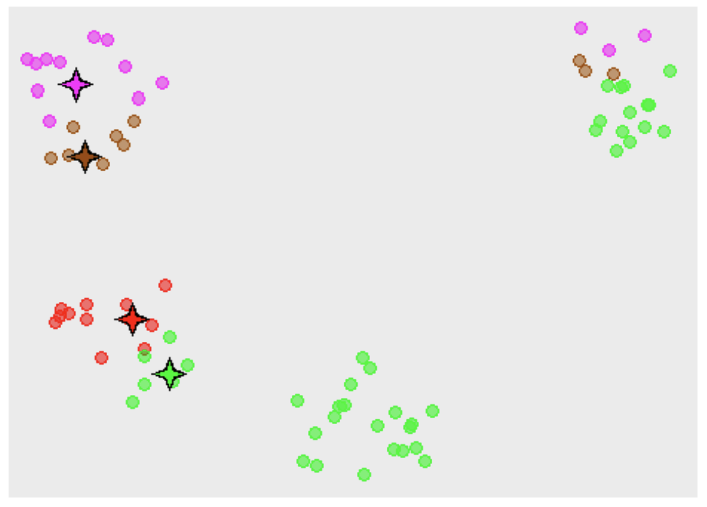
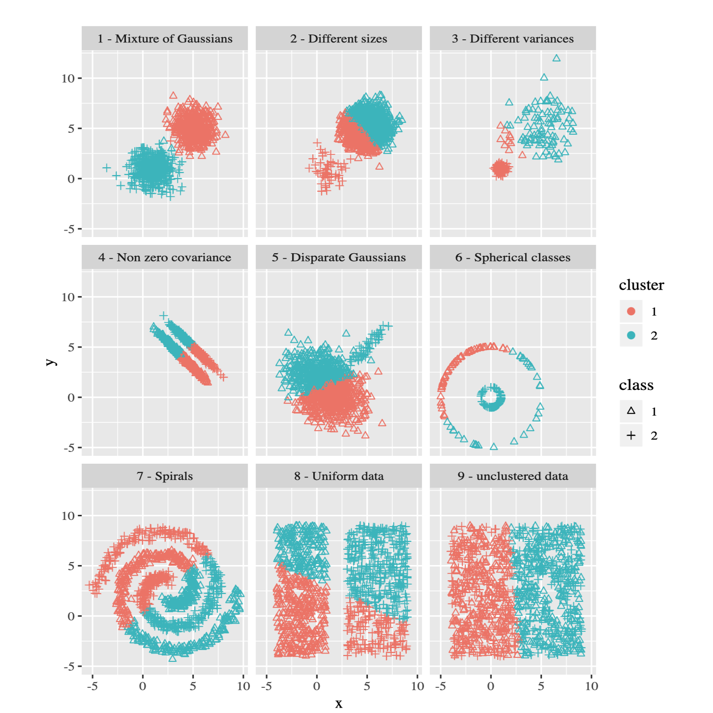
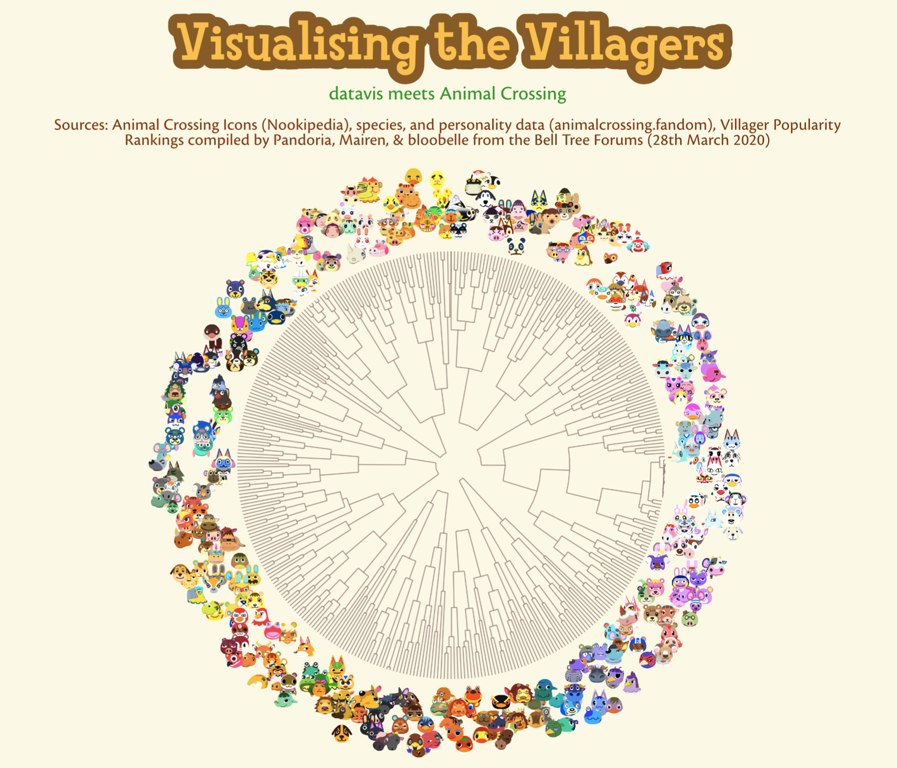
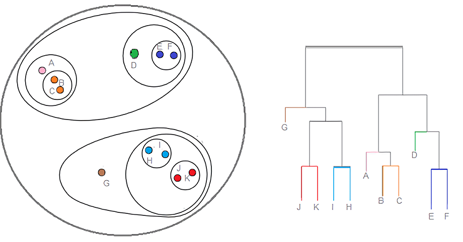

class: middle
background-size: contain

<br><br><br>

# .tuos_purple[SMI606: Week 10<br>Cluster Analysis]

<br><br>

**Dr. Calum Webb**<br>
Sheffield Methods Institute, the University of Sheffield.<br>
[c.j.webb@sheffield.ac.uk](mailto:c.j.webb@sheffield.ac.uk)

```{r setup, include=FALSE}
options(htmltools.dir.version = FALSE)

# These packages are required for creating the slides
# Many will need to be installed from Github
library(icons)
library(tidyverse)
library(xaringan)
library(xaringanExtra)
library(xaringanthemer)

# Defaults for code
knitr::opts_chunk$set(
  fig.width=9, fig.height=3.5, fig.retina=3,
  out.width = "100%",
  cache = FALSE,
  echo = TRUE,
  message = FALSE, 
  warning = FALSE,
  fig.show = TRUE,
  hiline = TRUE
)

# set global theme for ggplot to make background #F8F8F8F8 (off white),
# but otherwise keep all ggplot themes default (better for teaching)
theme_set(
  theme(plot.background = element_rect(fill = "#F8F8F8", colour = "#F8F8F8"), 
        panel.background = element_rect(fill = "#F8F8F8", colour = "#F8F8F8"), 
        legend.background = element_rect(fill = "#F8F8F8", colour = "#F8F8F8")
        )
  )

theme_minimal <- function() 
  {
    ggplot2::theme_minimal() +
    theme(plot.background = element_rect(fill = "#F8F8F8", colour = "#F8F8F8"), 
        panel.background = element_rect(fill = "#F8F8F8", colour = "#F8F8F8"), 
        legend.background = element_rect(fill = "#F8F8F8", colour = "#F8F8F8")
        )
}

theme_classic <- function() 
  {
    ggplot2::theme_classic() +
    theme(plot.background = element_rect(fill = "#F8F8F8", colour = "#F8F8F8"), 
        panel.background = element_rect(fill = "#F8F8F8", colour = "#F8F8F8"), 
        legend.background = element_rect(fill = "#F8F8F8", colour = "#F8F8F8")
        )
}

theme_void <- function() 
  {
    ggplot2::theme_void() +
    theme(plot.background = element_rect(fill = "#F8F8F8", colour = "#F8F8F8"), 
        panel.background = element_rect(fill = "#F8F8F8", colour = "#F8F8F8"), 
        legend.background = element_rect(fill = "#F8F8F8", colour = "#F8F8F8")
        )
  }

```

```{r xaringan-tile-view, echo=FALSE}
# Use tile overview by hitting the o key when presenting
xaringanExtra::use_tile_view()
```

```{r xaringan-logo, echo=FALSE}
# Add logo to top right
xaringanExtra::use_logo(
  image_url = "header/smi-logo-white.png",
  exclude_class = c("inverse", "hide_logo"), 
  width = "180px", position = css_position(top = "1em", right = "2em")
)
```

```{r xaringan-themer, include=FALSE, warning=FALSE}

# Set some global objects containing the colours
# of the university's branding
primary_color <- "#131E29"
secondary_color <- "#440099"
tuos_blue <- "#9ADBE8"
white = "#F8F8F8"
tuos_yellow <- "#FCF281"
tuos_purple <- "#440099"
tuos_red <- "#E7004C"
tuos_midnight <- "#131E29"

# The bulk of the styling is handled by xaringanthemer
style_duo_accent(
  primary_color = "#131E29",
  secondary_color = "#440099",
  colors = c(tuos_purple = "#440099", 
             grey = "#131E2960", 
             tuos_blue ="#9ADBE8",
             tuos_mint = "#00CE7C"),
  header_font_google = xaringanthemer::google_font("Source Serif Pro", "600", "600i"),
  text_font_google   = xaringanthemer::google_font("Source Sans Pro", "300", "300i", "600", "600i"),
  code_font_google   = xaringanthemer::google_font("Lucida Console"),
  header_h1_font_size = "2rem",
  header_h2_font_size = "1.5rem", 
  header_h3_font_size = "1.25rem", 
  text_font_size = "0.9rem",
  code_font_size = "0.45rem", 
  code_inline_background_color = "#F8F8F8", 
  inverse_text_color = "#9ADBE8", 
  background_color = "#F8F8F8", 
  text_color = "#131E29", 
  link_color = "#005A8F", 
  inverse_link_color = "#F8F8F8",
  text_slide_number_color = "#44009970",
  table_row_even_background_color = "transparent", 
  table_border_color = "#44009970",
  text_bold_font_weight = 600
)

```


```{r xaringan-panelset, echo=FALSE}
# Allow for adding panelsets (see example on slide 2)
xaringanExtra::use_panelset(in_xaringan = TRUE)

style_panelset_tabs(
  background = "#F8F8F8",
  active_background = "#F8F8F8",
  hover_background = "#F8F8F8"
)


```

```{r xaringanExtra, echo = FALSE}
# Adds white progress bar to top
xaringanExtra::use_progress_bar(color = "#F8F8F8", location = "top")
```

```{r xaringan-extra-styles, echo = FALSE}
# Allow for code to be highlighted on hover
xaringanExtra::use_extra_styles(
  hover_code_line = TRUE,         #<<
  mute_unhighlighted_code = TRUE  #<<
)
```

```{r share-again, echo=FALSE}
# Add sharing links and other embedding tools
xaringanExtra::use_share_again()
```

```{r xaringanExtra-search, echo=FALSE}
# Add magnifying glass search function to bottom left for quick
# searching of slides
xaringanExtra::use_search(show_icon = TRUE, auto_search = FALSE)
```

```{r, include = FALSE}

library(FactoMineR)


```


---
class: middle

.pull-left[

]
.pull-right[

<br><br><br><br><br><br>

# Sign In


]
---
class: middle

## Learning Objectives

.panelset[

.panel[.panel-name[What will I learn?]

By the end of this week you will:

* Be able to identify what kinds of social science research questions cluster analysis may be useful for answering.

* Be able to explain, in basic terms, how two types of cluster analysis methods work: __k-means__ clustering and __Hierarchical Cluster Analysis__ clustering.

* Know which forms of cluster analysis are appropriate for the specific data and underlying clustering phenomenon you are interested in.

* Be able to run and inspect the output of __k-means__ and __HCA__ analyses of data in `R`

* Be able to describe the characteristics of clusters derived from __k-means__ and __HCA__ analyses.


]

.panel[.panel-name[How does this week fit into my course?]

* Cluster analysis is an increasingly important tool — both in social research itself and in understanding how data and machine learning algorithms are used in society. This week will teach you how it operates.

* Cluster analysis can be used in conjunction with regression analysis to explore interesting research questions, or to frame them in interesting ways.

* Cluster analysis can be used for the refinement of theory, particularly in the study of social ordering and social grouping. It can also be useful (along with Factor Analysis) for dealing with multicollinearity (e.g. by changing a large number of highly correlated variables into mutually distinct clustered groups).


]


]

```{r data-sim, include = FALSE}

library(tidyverse)
library(factoextra)
library(cluster)

# Simulate museum visitors clusters (three clusters - wealthy older patrons; families with kids; students with no money)
set.seed(2021)

# Older people
group1_nadults <-  sample(c(1, 2, 3, 4, 5), 100, replace = TRUE, prob = c(0.2, 0.5, 0.1, 0.1, 0.1))
group1_nkids <-    sample(c(0, 1, 2, 3, 4, 5, 6), 100, replace = TRUE, prob = c(0.75, 0.1, 0.1, 0.05, 0, 0, 0))
group1_donation <- plyr::round_any(rnorm(n = 100, mean = 40, sd = 10), 5)
group1_age <-      round(rnorm(n = 100, mean = 70, sd = 5), 0)
group1_giftshop <- round(rnorm(n = 100, mean = 5, sd = 1), 2)
group1_cafe <-     round(rnorm(n = 100, mean = 12, sd = 3), 2)

# Families with kids
group2_nadults <-  sample(c(1, 2, 3, 4, 5), 100, replace = TRUE, prob = c(0.3, 0.6, 0.1, 0, 0))
group2_nkids <-    sample(c(0, 1, 2, 3, 4, 5, 6), 100, replace = TRUE, prob = c(0, 0.2, 0.3, 0.3, 0.1, 0.05, 0.05))
group2_donation <- round(rnorm(n = 100, mean = 10, sd = 3), 0)
group2_age <-      round(rnorm(n = 100, mean = 33, sd = 3), 0)
group2_giftshop <- round(rnorm(n = 100, mean = 33, sd = 4), 2)
group2_cafe <-     round(rnorm(n = 100, mean = 3, sd = 0.5), 2)

# Students
group3_nadults <-  sample(c(1, 2, 3, 4, 5), 100, replace = TRUE, prob = c(0.05, 0.2, 0.25, 0.4, 0.1))
group3_nkids <-    sample(c(0, 1, 2, 3, 4, 5, 6), 100, replace = TRUE, prob = c(0.95, 0.05, 0, 0, 0, 0, 0))
group3_donation <- round(rnorm(n = 100, mean = 3, sd = 1), 1)
group3_age <-      round(rnorm(n = 100, mean = 20, sd = 1), 0)
group3_giftshop <- round(rnorm(n = 100, mean = 2, sd = 0.5), 2)
group3_cafe <-     round(rnorm(n = 100, mean = 3, sd = 0.5), 2)

museum_data <- tibble(
  nadults =        c(group1_nadults, group2_nadults, group3_nadults),
  nkids =          c(group1_nkids, group2_nkids, group3_nkids),
  donation =       c(group1_donation, group2_donation, group3_donation),
  age =            c(group1_age, group2_age, group3_age),
  giftshop_spend = c(group1_giftshop, group2_giftshop, group3_giftshop),
  cafe_spend =     c(group1_cafe, group2_cafe, group3_cafe)
)

# 
# mod_1c <- kmeans(museum_data, centers = 1) 
# mod_2c <- kmeans(museum_data, centers = 2) 
# mod_3c <- kmeans(museum_data, centers = 3) 
# mod_4c <- kmeans(museum_data, centers = 4) 
# 
# # Silhouette plot
# fviz_nbclust(museum_data, kmeans)
# fviz_nbclust(museum_data, kmeans, method = "gap_stat")
# 
# # Biplots
# fviz_cluster(mod_3c, data = museum_data,
#              geom = "point") +
#   ggthemes::scale_color_colorblind()
# 
# fviz_cluster(mod_4c, data = museum_data,
#              geom = "point") +
#   ggthemes::scale_color_colorblind()
# 
# 
# # results and summary
# 
# museum_data_results <- museum_data %>%
#   mutate(
#     k3_cluster = mod_3c$cluster,
#     k4_cluster = mod_4c$cluster
#   )
# 
# museum_data_results %>%
#   group_by(k3_cluster) %>%
#   summarise_at(vars(nadults:cafe_spend), ~mean(., na.rm = TRUE))
# 
# museum_data_results %>%
#   group_by(k4_cluster) %>%
#   summarise_at(vars(nadults:cafe_spend), ~mean(., na.rm = TRUE))


######## Hierarchical Clustering simulation

# Groups:
#' Younger audience: games, entertainment, comedy
#' Long form informative content
#' Music, reviews and trailers (traditional)
#' Sports-only viewers

set.seed(2022)

# Group: Kids
group1_videogames     <- sample(c(0, 1), 50, replace = TRUE, prob = c(0.05, 0.95))
group1_vlogs          <- sample(c(0, 1), 50, replace = TRUE, prob = c(0.2, 0.8))
group1_animation      <- sample(c(0, 1), 50, replace = TRUE, prob = c(0.1, 0.9))
group1_comedy         <- sample(c(0, 1), 50, replace = TRUE, prob = c(0.2, 0.8))

group1_news           <- sample(c(0, 1), 50, replace = TRUE, prob = c(0.95, 0.05))
group1_documentaries  <- sample(c(0, 1), 50, replace = TRUE, prob = c(0.95, 0.05))
group1_tutorials      <- sample(c(0, 1), 50, replace = TRUE, prob = c(0.5, 0.5))
group1_videoessays    <- sample(c(0, 1), 50, replace = TRUE, prob = c(1, 0))

group1_trailers       <- sample(c(0, 1), 50, replace = TRUE, prob = c(0.4, 0.6))
group1_reviews        <- sample(c(0, 1), 50, replace = TRUE, prob = c(0.5, 0.5))
group1_music          <- sample(c(0, 1), 50, replace = TRUE, prob = c(0.3, 0.7))

group1_sport          <- sample(c(0, 1), 50, replace = TRUE, prob = c(0.95, 0.05))

# Group: Informative content
group2_videogames     <- sample(c(0, 1), 50, replace = TRUE, prob = c(0.95, 0.05))
group2_vlogs          <- sample(c(0, 1), 50, replace = TRUE, prob = c(0.9, 0.1))
group2_animation      <- sample(c(0, 1), 50, replace = TRUE, prob = c(0.95, 0.05))
group2_comedy         <- sample(c(0, 1), 50, replace = TRUE, prob = c(0.8, 0.2))

group2_news           <- sample(c(0, 1), 50, replace = TRUE, prob = c(0.05, 0.95))
group2_documentaries  <- sample(c(0, 1), 50, replace = TRUE, prob = c(0.15, 0.85))
group2_tutorials      <- sample(c(0, 1), 50, replace = TRUE, prob = c(0.1, 0.9))
group2_videoessays    <- sample(c(0, 1), 50, replace = TRUE, prob = c(0.4, 0.6))

group2_trailers       <- sample(c(0, 1), 50, replace = TRUE, prob = c(0.9, 0.1))
group2_reviews        <- sample(c(0, 1), 50, replace = TRUE, prob = c(0.7, 0.3))
group2_music          <- sample(c(0, 1), 50, replace = TRUE, prob = c(0.8, 0.2))

group2_sport          <- sample(c(0, 1), 50, replace = TRUE, prob = c(0.9, 0.1))

# Group: Traditional/adjacent media - trailers, reviews, music
group3_videogames     <- sample(c(0, 1), 50, replace = TRUE, prob = c(0.9, 0.1))
group3_vlogs          <- sample(c(0, 1), 50, replace = TRUE, prob = c(1, 0))
group3_animation      <- sample(c(0, 1), 50, replace = TRUE, prob = c(0.95, 0.05))
group3_comedy         <- sample(c(0, 1), 50, replace = TRUE, prob = c(0.95, 0.05))

group3_news           <- sample(c(0, 1), 50, replace = TRUE, prob = c(0.7, 0.3))
group3_documentaries  <- sample(c(0, 1), 50, replace = TRUE, prob = c(0.95, 0.05))
group3_tutorials      <- sample(c(0, 1), 50, replace = TRUE, prob = c(0.8, 0.2))
group3_videoessays    <- sample(c(0, 1), 50, replace = TRUE, prob = c(1, 0))

group3_trailers       <- sample(c(0, 1), 50, replace = TRUE, prob = c(0.05, 0.95))
group3_reviews        <- sample(c(0, 1), 50, replace = TRUE, prob = c(0.2, 0.8))
group3_music          <- sample(c(0, 1), 50, replace = TRUE, prob = c(0.1, 0.9))

group3_sport          <- sample(c(0, 1), 50, replace = TRUE, prob = c(0.9, 0.1))

# Group: Sports-only 
group4_videogames     <- sample(c(0, 1), 50, replace = TRUE, prob = c(0.7, 0.3))
group4_vlogs          <- sample(c(0, 1), 50, replace = TRUE, prob = c(0.9, 0.1))
group4_animation      <- sample(c(0, 1), 50, replace = TRUE, prob = c(0.9, 0.1))
group4_comedy         <- sample(c(0, 1), 50, replace = TRUE, prob = c(0.7, 0.3))

group4_news           <- sample(c(0, 1), 50, replace = TRUE, prob = c(0.85, 0.15))
group4_documentaries  <- sample(c(0, 1), 50, replace = TRUE, prob = c(0.95, 0.05))
group4_tutorials      <- sample(c(0, 1), 50, replace = TRUE, prob = c(0.9, 0.1))
group4_videoessays    <- sample(c(0, 1), 50, replace = TRUE, prob = c(1, 0))

group4_trailers       <- sample(c(0, 1), 50, replace = TRUE, prob = c(0.9, 0.2))
group4_reviews        <- sample(c(0, 1), 50, replace = TRUE, prob = c(0.8, 0.2))
group4_music          <- sample(c(0, 1), 50, replace = TRUE, prob = c(0.8, 0.2))

group4_sport          <- sample(c(0, 1), 50, replace = TRUE, prob = c(0.05, 0.95))


# combine dataset

youtube_data <- tibble(
  animation =     c(group1_animation, group2_animation, group3_animation, group4_animation),
  comedy =        c(group1_comedy, group2_comedy, group3_comedy, group4_comedy),
  documentaries = c(group1_documentaries, group2_documentaries, group3_documentaries, group4_documentaries),
  music =         c(group1_music, group2_music, group3_music, group4_music),
  news =          c(group1_news, group2_news, group3_news, group4_news),
  reviews =       c(group1_reviews, group2_reviews, group3_reviews, group4_reviews),
  sport =         c(group1_sport, group2_sport, group3_sport, group4_sport),
  tutorials =     c(group1_tutorials, group2_tutorials, group3_tutorials, group4_tutorials),
  trailers =      c(group1_trailers, group2_trailers, group3_trailers, group4_trailers),
  videoessays =   c(group1_videoessays, group2_videoessays, group3_videoessays, group4_videoessays),
  videogames =    c(group1_videogames, group2_videogames, group3_videogames, group4_videogames),
  vlogs =         c(group1_vlogs, group2_vlogs, group3_vlogs, group4_vlogs)
)

youtube_data <- youtube_data %>% mutate_all(~factor(as.character(.), levels = c("0", "1")))

# library(cluster)

# change to factor
# youtube_dist <- daisy(youtube_data, metric = "gower")
# 
# youtube_hclust <- hclust(youtube_dist, method = "complete")
# youtube_hclust <- hclust(youtube_dist, method = "ward.D")
# youtube_hclust <- hclust(youtube_dist, method = "average")
# 
# plot(youtube_hclust)
# 
# youtube_clusters3 <- cutree(youtube_hclust, k = 3)
# youtube_clusters4 <- cutree(youtube_hclust, k = 4)
# 
# youtube_data_results <- youtube_data %>%
#   mutate(
#     clusters_3 = youtube_clusters3,
#     clusters_4 = youtube_clusters4
#   )
# 
# youtube_data_results %>%
#   group_by(clusters_3) %>%
#   summarise_all(
#     ~mean(parse_number(as.character(.)), na.rm = TRUE)
#   )
# 
# youtube_data_results %>%
#   group_by(clusters_4) %>%
#   summarise_all(
#     ~mean(parse_number(as.character(.)), na.rm = TRUE)
#   )


```


???


---

class: inverse, middle

Week 10: Cluster Analysis — Part I
# What is cluster analysis and why learn it?


---

## What is cluster analysis?

.pull-left[

#### What if we have data but we are not interested in the relationship between variables? 

What if, instead, our theories are more about whether our observations fall into predictable groups (or "clusters")?

Alternatively, what if we think a collection of variables are really capturing a smaller number of underlying processes (or "factors")?

]


---

## What is cluster analysis?

.pull-left[

#### What if we have data but we are not interested in the relationship between variables? 

What if, instead, our theories are more about whether our observations fall into predictable groups (or "clusters")?

Alternatively, what if we think a collection of variables are really capturing a smaller number of underlying processes (or "factors")?

]

.pull-right[

#### For example...

What if we want to test a theory that most people fall into two 'types' of working patterns (e.g. "sprinters", "slow-and-steadys")?

Or that learners fall into four distinct groups (e.g. "visual-learners", "auditory-learners", "kinesthetic learners", "mixed learners")?

Or that the concept of 'introversion' could be measured by questions about the places a person prefers spending their free time, what their idea of a dream holiday is, and the extent to which they find social events draining or energizing?

]

---

## What is cluster analysis?

.pull-left[

#### What if we have data but we are not interested in the relationship between variables? 

What if, instead, our theories are more about whether our observations fall into predictable groups (or "clusters")?

Alternatively, what if we think a collection of variables are really capturing a smaller number of underlying processes (or "factors")?

]

.pull-right[

#### Cluster Analysis

__Cluster analysis__ refers to a collection of methods designed to __identify underlying group membership__ or __hierarchical structures__ in data, based on __similarities between observations__.


#### Factor Analysis

__Factor analysis__ refers to a collection of methods designed to __capture and approximate an underlying construct that cannot be measured directly__, but can be approximated based on __similarities between multiple variables__. 

]


---

## What is cluster analysis?

.pull-left[

#### What if we have data but we are not interested in the relationship between variables? 

What if, instead, our theories are more about whether our observations fall into predictable groups (or "clusters")?

Alternatively, what if we think a collection of variables are really capturing a smaller number of underlying processes (or "factors")?

]

.pull-right[

#### Cluster Analysis

"Learners fall into four distinct groups (e.g. "visual-learners", "auditory-learners", "kinesthetic learners", "mixed learners")."

__Variables__ might be: Learner's rating of a visual-focused teaching class (0-100), Learner's rating of a auditory-focused teaching class (0-100), Learner's rating of a kinesthetic-focused teaching class (0-100), Learner's rating of a mixed-style teaching class (0-100).

Hypothesis: Learners __cluster__ into three groups characterised by higher ratings of a single style, or a fourth group characterised by higher ratings of the mixed-style.


]


---

## What is cluster analysis?

.pull-left[

#### What if we have data but we are not interested in the relationship between variables? 

What if, instead, our theories are more about whether our observations fall into predictable groups (or "clusters")?

Alternatively, what if we think a collection of variables are really capturing a smaller number of underlying processes (or "factors")?

]

.pull-right[

#### Factor Analysis

"The concept of 'introversion' could be measured by questions about the places a person prefers spending their free time, what their idea of a dream holiday is, and the extent to which they find social events draining or energizing"

__Variables__ might be: How much do you agree with the following statements: I prefer to spend my free time at home, rather than out and about (Strong Disagree - Strong Agree); My dream holiday would involve lots of activities, new experiences, and time socialising (Strong Disagree - Strong Agree); I find social events (birthdays, holidays, etc) energizing (Strong Disagree - Strong Agree)

Hypothesis: Reponses to the above variables correspond strongly with an __underlying factor__ that can be called "introversion".


]

---

class: middle

#### For this module, we will only be able to cover two methods of __cluster analysis__; however, you may find factor analysis an interesting subject (especially if you are interested in statistical measurement, e.g. psychometrics)


---

class: inverse, middle

Week 10: Cluster Analysis — Part II
# k-means: What is it and how does it work?


---

## The k-means clustering algorithm: how does it work?

.pull-left[

* k-means is a clustering algorithm that __aims to group together observations within $k$ number of groups__. The researcher selects the number of groups and needs to decide how many should be used in the end.

]

.pull-right[

```{r kmeans-graphs, echo = FALSE, include = FALSE}



set.seed(2021)
var_1 <- rnorm(100)
var_2 <- rnorm(100)

kmexp_data <- tibble(var_1, var_2) %>%
  mutate(var_2 = ifelse(var_2 > 0, var_2+0.3, var_2-0.3),
         var_1 = ifelse(var_1 > 0, var_1+0.3, var_1-0.3))

init_1 <- tibble(var_1 = rnorm(1), var_2 = rnorm(1))
init_2 <- tibble(var_1 = rnorm(1), var_2 = rnorm(1))
init_3 <- tibble(var_1 = rnorm(1), var_2 = rnorm(1))
init_4 <- tibble(var_1 = rnorm(1), var_2 = rnorm(1))

step_0 <- tibble(k = c("k1", "k2", "k3", "k4"),
                 var_1 = c(init_1$var_1, init_2$var_1, init_3$var_1, init_4$var_1),
                 var_2 = c(init_1$var_2, init_2$var_2, init_3$var_2, init_4$var_2)
                 )


kmexp_data <- kmexp_data %>%
  mutate(
    step_0_dist_k1 = sqrt( (init_1$var_1 - var_1)^2 + (init_1$var_2 - var_2)^2 ),
    step_0_dist_k2 = sqrt( (init_2$var_1 - var_1)^2 + (init_2$var_2 - var_2)^2 ),
    step_0_dist_k3 = sqrt( (init_3$var_1 - var_1)^2 + (init_3$var_2 - var_2)^2 ),
    step_0_dist_k4 = sqrt( (init_4$var_1 - var_1)^2 + (init_4$var_2 - var_2)^2 )
  ) %>%
  mutate(
    step_0_cm = case_when(step_0_dist_k1 < step_0_dist_k2 & step_0_dist_k1 < step_0_dist_k3 & step_0_dist_k1 < step_0_dist_k4 ~ "k1",
                          step_0_dist_k2 < step_0_dist_k1 & step_0_dist_k2 < step_0_dist_k3 & step_0_dist_k2 < step_0_dist_k4 ~ "k2",
                          step_0_dist_k3 < step_0_dist_k1 & step_0_dist_k3 < step_0_dist_k2 & step_0_dist_k3 < step_0_dist_k4 ~ "k3",
                          TRUE ~ "k4")
  )


step_2_k <- kmexp_data %>%
  group_by(step_0_cm) %>%
  summarise(var_1 = mean(var_1),
            var_2 = mean(var_2))


kmexp_data <- kmexp_data %>%
  mutate(
    step_1_dist_k1 = sqrt( (step_2_k$var_1[step_2_k$step_0_cm == "k1"] - var_1)^2 + (step_2_k$var_2[step_2_k$step_0_cm == "k1"] - var_2)^2 ),
    step_1_dist_k2 = sqrt( (step_2_k$var_1[step_2_k$step_0_cm == "k2"] - var_1)^2 + (step_2_k$var_2[step_2_k$step_0_cm == "k2"] - var_2)^2 ),
    step_1_dist_k3 = sqrt( (step_2_k$var_1[step_2_k$step_0_cm == "k3"] - var_1)^2 + (step_2_k$var_2[step_2_k$step_0_cm == "k3"] - var_2)^2 ),
    step_1_dist_k4 = sqrt( (step_2_k$var_1[step_2_k$step_0_cm == "k4"] - var_1)^2 + (step_2_k$var_2[step_2_k$step_0_cm == "k4"] - var_2)^2 )
  ) %>%
  mutate(
    step_1_cm = case_when(step_1_dist_k1 < step_1_dist_k2 & step_1_dist_k1 < step_1_dist_k3 & step_1_dist_k1 < step_1_dist_k4 ~ "k1",
                          step_1_dist_k2 < step_1_dist_k1 & step_1_dist_k2 < step_1_dist_k3 & step_1_dist_k2 < step_1_dist_k4 ~ "k2",
                          step_1_dist_k3 < step_1_dist_k1 & step_1_dist_k3 < step_1_dist_k2 & step_1_dist_k3 < step_1_dist_k4 ~ "k3",
                          TRUE ~ "k4")
  )

step_3_k <-kmexp_data %>%
  ungroup() %>%
  group_by(step_1_cm) %>%
  summarise(
    var_1 = mean(var_1),
    var_2 = mean(var_2)
  )

kmexp_data <- kmexp_data %>%
  mutate(
    step_2_dist_k1 = sqrt( (step_3_k$var_1[step_3_k$step_1_cm == "k1"] - var_1)^2 + (step_3_k$var_2[step_3_k$step_1_cm == "k1"] - var_2)^2 ),
    step_2_dist_k2 = sqrt( (step_3_k$var_1[step_3_k$step_1_cm == "k2"] - var_1)^2 + (step_3_k$var_2[step_3_k$step_1_cm == "k2"] - var_2)^2 ),
    step_2_dist_k3 = sqrt( (step_3_k$var_1[step_3_k$step_1_cm == "k3"] - var_1)^2 + (step_3_k$var_2[step_3_k$step_1_cm == "k3"] - var_2)^2 ),
    step_2_dist_k4 = sqrt( (step_3_k$var_1[step_3_k$step_1_cm == "k4"] - var_1)^2 + (step_3_k$var_2[step_3_k$step_1_cm == "k4"] - var_2)^2 )
  ) %>%
  mutate(
    step_3_cm = case_when(step_2_dist_k1 < step_2_dist_k2 & step_2_dist_k1 < step_2_dist_k3 & step_2_dist_k1 < step_2_dist_k4 ~ "k1",
                          step_2_dist_k2 < step_2_dist_k1 & step_2_dist_k2 < step_2_dist_k3 & step_2_dist_k2 < step_2_dist_k4 ~ "k2",
                          step_2_dist_k3 < step_2_dist_k1 & step_2_dist_k3 < step_2_dist_k2 & step_2_dist_k3 < step_2_dist_k4 ~ "k3",
                          TRUE ~ "k4")
  )


step_4_k <- kmexp_data %>%
  ungroup() %>%
  group_by(step_3_cm) %>%
  summarise(
    var_1 = mean(var_1),
    var_2 = mean(var_2)
  )


kmexp_data <- kmexp_data %>%
  mutate(
    step_3_dist_k1 = sqrt( (step_4_k$var_1[step_4_k$step_3_cm == "k1"] - var_1)^2 + (step_4_k$var_2[step_4_k$step_3_cm == "k1"] - var_2)^2 ),
    step_3_dist_k2 = sqrt( (step_4_k$var_1[step_4_k$step_3_cm == "k2"] - var_1)^2 + (step_4_k$var_2[step_4_k$step_3_cm == "k2"] - var_2)^2 ),
    step_3_dist_k3 = sqrt( (step_4_k$var_1[step_4_k$step_3_cm == "k3"] - var_1)^2 + (step_4_k$var_2[step_4_k$step_3_cm == "k3"] - var_2)^2 ),
    step_3_dist_k4 = sqrt( (step_4_k$var_1[step_4_k$step_3_cm == "k4"] - var_1)^2 + (step_4_k$var_2[step_4_k$step_3_cm == "k4"] - var_2)^2 )
  ) %>%
  mutate(
    step_4_cm = case_when(step_3_dist_k1 < step_3_dist_k2 & step_3_dist_k1 < step_3_dist_k3 & step_3_dist_k1 < step_3_dist_k4 ~ "k1",
                          step_3_dist_k2 < step_3_dist_k1 & step_3_dist_k2 < step_3_dist_k3 & step_3_dist_k2 < step_3_dist_k4 ~ "k2",
                          step_3_dist_k3 < step_3_dist_k1 & step_3_dist_k3 < step_3_dist_k2 & step_3_dist_k3 < step_3_dist_k4 ~ "k3",
                          TRUE ~ "k4")
  )


# No steps
kme_1 <- ggplot() +
  geom_point(data = kmexp_data, aes(x = var_1, y = var_2), size = 1.5) +
  #geom_point(data = step_0, aes(x = var_1, y = var_2), size = 8, pch = 13) +
  theme_minimal()

# Step before assignment. Random clusters
kme_2 <- ggplot() +
  geom_point(data = kmexp_data, aes(x = var_1, y = var_2), size = 1.5) +
  geom_point(data = step_0, aes(x = var_1, y = var_2), size = 8, pch = 13) +
  theme_minimal()

# First assignment
kme_3 <- ggplot() +
  geom_point(data = kmexp_data, aes(x = var_1, y = var_2, colour = step_0_cm), size = 1.5) +
  geom_point(data = step_0, aes(x = var_1, y = var_2, colour = k), size = 8, pch = 13) +
  theme_minimal() +
  ggthemes::scale_color_colorblind() +
  ggeasy::easy_remove_legend()


# More points for iteration one
kme_4 <- ggplot() +
  geom_point(data = kmexp_data, aes(x = var_1, y = var_2, colour = step_0_cm), size = 1.5) +
  geom_point(data = step_2_k, aes(x = var_1, y = var_2, colour = step_0_cm), size = 8, pch = 13) +
  theme_minimal() +
  ggthemes::scale_color_colorblind() +
  ggeasy::easy_remove_legend()

# Reassign points to cluster
kme_5 <- ggplot() +
  geom_point(data = kmexp_data, aes(x = var_1, y = var_2, colour = step_1_cm), size = 1.5) +
  geom_point(data = step_2_k, aes(x = var_1, y = var_2, colour = step_0_cm), size = 8, pch = 13) +
  theme_minimal() +
  ggthemes::scale_color_colorblind() +
  ggeasy::easy_remove_legend()

# re calculate means of group membership
kme_6 <- ggplot() +
  geom_point(data = kmexp_data, aes(x = var_1, y = var_2, colour = step_1_cm), size = 1.5) +
  geom_point(data = step_3_k, aes(x = var_1, y = var_2, colour = step_1_cm), size = 8, pch = 13) +
  theme_minimal() +
  ggthemes::scale_color_colorblind() +
  ggeasy::easy_remove_legend()

# re assign point membership
kme_7 <- ggplot() +
  geom_point(data = kmexp_data, aes(x = var_1, y = var_2, colour = step_3_cm), size = 1.5) +
  geom_point(data = step_3_k, aes(x = var_1, y = var_2, colour = step_1_cm), size = 8, pch = 13) +
  theme_minimal() +
  ggthemes::scale_color_colorblind() +
  ggeasy::easy_remove_legend()

# move cluster centroids
kme_8 <- ggplot() +
  geom_point(data = kmexp_data, aes(x = var_1, y = var_2, colour = step_3_cm), size = 1.5) +
  geom_point(data = step_4_k, aes(x = var_1, y = var_2, colour = step_3_cm), size = 8, pch = 13) +
  theme_minimal() +
  ggthemes::scale_color_colorblind() +
  ggeasy::easy_remove_legend()

# Re assign groups
kme_9 <- ggplot() +
  geom_point(data = kmexp_data, aes(x = var_1, y = var_2, colour = step_4_cm), size = 1.5) +
  geom_point(data = step_4_k, aes(x = var_1, y = var_2, colour = step_3_cm), size = 8, pch = 13) +
  theme_minimal() +
  ggthemes::scale_color_colorblind() +
  ggeasy::easy_remove_legend()


```

```{r, echo = FALSE, fig.width=5, fig.height=5, out.height=500, out.width=500}

kme_1

```

]

---

## The k-means clustering algorithm: how does it work?

.pull-left[

* k-means starts by generating $k$ random '__centroids__'. It places these in random places in the data (indicated by circles with Xs in them). 

]


.pull-right[

```{r, echo = FALSE, fig.width=5, fig.height=5, out.height=500, out.width=500}

kme_2

```


]

---

## The k-means clustering algorithm: how does it work?

.pull-left[

* It then calculates the distance between all of the points and the $k$ centroids. It then assigns each observation to its closest centroid.

]


.pull-right[

```{r, echo = FALSE, fig.width=5, fig.height=5, out.height=500, out.width=500}

kme_3

```


]

---

## The k-means clustering algorithm: how does it work?

.pull-left[

* The algorithm then calculates the mean values of all variables for all of the points assigned to each centroid. It then assigns a new position to the centroid at the mean position of all of the points.

]


.pull-right[

```{r, echo = FALSE, fig.width=5, fig.height=5, out.height=500, out.width=500}

kme_4

```


]

---

## The k-means clustering algorithm: how does it work?

.pull-left[

* The algorithm reassigns all of the points to their new closest centroid (if the closest centroid has changed). 

]


.pull-right[

```{r, echo = FALSE, fig.width=5, fig.height=5, out.height=500, out.width=500}

kme_5

```


]

---

## The k-means clustering algorithm: how does it work?

.pull-left[

* The k-means algorithm then repeats the process: it calculates the mean values of all the points assigned to the centroids and moves their position according to this new value.

]


.pull-right[

```{r, echo = FALSE, fig.width=5, fig.height=5, out.height=500, out.width=500}

kme_6

```


]


---

## The k-means clustering algorithm: how does it work?

.pull-left[

* It then reassigns the points again...

]


.pull-right[

```{r, echo = FALSE, fig.width=5, fig.height=5, out.height=500, out.width=500}

kme_7

```


]

---

## The k-means clustering algorithm: how does it work?

.pull-left[

* And repeats the process of moving the centroids to the mean of their assigned points.

]


.pull-right[

```{r, echo = FALSE, fig.width=5, fig.height=5, out.height=500, out.width=500}

kme_8

```


]


---

## The k-means clustering algorithm: how does it work?

.pull-left[

* It does this until the points are no longer being reassigned between centroids (__convergence__), or, more preceisely, until no movement of the centroids makes the sum of the distance between them and their assigned points any smaller.

]


.pull-right[

```{r, echo = FALSE, fig.width=5, fig.height=5, out.height=500, out.width=500}

museum_data <- museum_data %>%
  mutate(
    museum = "Western Park Museum",
    .before = nadults
  )

kme_9

```


]


---

class: inverse, middle

Week 10: Cluster Analysis — Part III
# k-means: What kinds of people visit museums?


---

## k-means cluster analysis in `R`

.pull-left-small[

#### Do patrons of museums fall into clearly defined clusters?

This (simulated) data is about 300 visitors to a museum. The data includes variables about number of adults the person visited with; the number of children they visited with; the donation they gave (in ££.pp); their age; the amount they spent at the gift shop; and the amount they spent at the cafe.

]

.pull-right-big[

```{r}

head(museum_data, 5)

```

```{r, results = "asis"}

stargazer::stargazer(as.data.frame(museum_data), header = FALSE, type = "html")

```

]

---

## k-means cluster analysis in `R`

.pull-left[

* Prepare our data.

* Figure out the appropriate number of clusters for our data.

* Use k-means to cluster our data.

* Visualise the clusters (and their uniqueness).

* Add the cluster membership to our data.

* Describe the characteristics of each cluster.

]

.pull-right[

We are going to use the `factoextra` and `cluster` packages to help us run our cluster analysis.

```{r}

# install.packages("factoextra")
# install.packages("cluster")
library(factoextra)
library(cluster)


```

]


---

## k-means cluster analysis in `R`

.pull-left[

* __Prepare our data.__

k-means will only work with data that includes __only__ numeric variables (and all of these variables should be continuous). Therefore, we need to start by creating a subset of our data of __just__ the numeric variables we want to cluster on. 

* .grey[Figure out the appropriate number of clusters for our data.]

* .grey[Use k-means to cluster our data.]

* .grey[Visualise the clusters (and their uniqueness).]

* .grey[Add the cluster membership to our data.]

* .grey[Describe the characteristics of each cluster.]

]

.pull-right[


```{r}

museum_data_prepped <- museum_data %>%
  select(nadults, nkids, donation,
         age, giftshop_spend, cafe_spend)

museum_data_prepped

```

]

---

background-color: white

## k-means cluster analysis in `R`

.pull-left[

* .grey[Prepare our data.]

* __Figure out the appropriate number of clusters for our data.__

Sometimes, we have a pre-defined hypothesis of how many clusters there are in our data, but often we do not. We can use a silhouette or gap statistic plot, which tells us __which number of clusters best maximises the clustering of our data__. 

The highest silhouette value reflects the optimal number of clusters under this definition.

* .grey[Use k-means to cluster our data.]

* .grey[Visualise the clusters (and their uniqueness).]

* .grey[Add the cluster membership to our data.]

* .grey[Describe the characteristics of each cluster.]

]

.pull-right[


```{r, fig.height=4, fig.width=5, out.height=400, out.width=500}

factoextra::fviz_nbclust(museum_data_prepped, 
                         method = "silhouette",
                         FUNcluster = kmeans)

```

]

---

background-color: white

## k-means cluster analysis in `R`

.pull-left[

* .grey[Prepare our data.]

* __Figure out the appropriate number of clusters for our data.__

Sometimes, we have a pre-defined hypothesis of how many clusters there are in our data, but often we do not. We can use a silhouette or gap statistic plot, which tells us __which number of clusters best maximises the clustering of our data__. 

The highest gap statistic __above a margin of error__ tells us the best solution under this condition.

* .grey[Use k-means to cluster our data.]

* .grey[Visualise the clusters (and their uniqueness).]

* .grey[Add the cluster membership to our data.]

* .grey[Describe the characteristics of each cluster.]

]

.pull-right[


```{r, fig.height=4, fig.width=5, out.height=400, out.width=500}

factoextra::fviz_nbclust(museum_data_prepped, 
                         method = "gap",
                         FUNcluster = kmeans, verbose = FALSE)

```

]

---

background-color: white

## k-means cluster analysis in `R`

.pull-left[

* .grey[Prepare our data.]

* __Figure out the appropriate number of clusters for our data.__

Our silhouette and gap statistics seem to be indicating that either a __3__ or __4__ cluster solution would be a good fit to our data.

* .grey[Use k-means to cluster our data.]

* .grey[Visualise the clusters (and their uniqueness).]

* .grey[Add the cluster membership to our data.]

* .grey[Describe the characteristics of each cluster.]

]

.pull-right[


```{r, fig.height=4, fig.width=5, out.height=400, out.width=500}

factoextra::fviz_nbclust(museum_data_prepped, 
                         method = "gap",
                         FUNcluster = kmeans, verbose = FALSE)

```

]


---

## k-means cluster analysis in `R`

.pull-left[

* .grey[Prepare our data.]

* .grey[Figure out the appropriate number of clusters for our data.]

* __Use k-means to cluster our data.__

Now we know an appropriate number of clusters, we can create both 3-cluster and 4-cluster solutions for our data using the `kmeans()` function. `centers = 3` is for 3 clusters, `centers = 4` for 4 clusters, etc.

* .grey[Visualise the clusters (and their uniqueness).]

* .grey[Add the cluster membership to our data.]

* .grey[Describe the characteristics of each cluster.]

]

.pull-right[


```{r}

set.seed(2021)
museum_3k <- kmeans(museum_data_prepped, 
                    centers = 3)
set.seed(2021)
museum_4k <- kmeans(museum_data_prepped, 
                    centers = 4)

```

]

---

## k-means cluster analysis in `R`

.pull-left[

* .grey[Prepare our data.]

* .grey[Figure out the appropriate number of clusters for our data.]

* __Use k-means to cluster our data.__

Now we know an appropriate number of clusters, we can create both 3-cluster and 4-cluster solutions for our data using the `kmeans()` function. `centers = 3` is for 3 clusters, `centers = 4` for 4 clusters, etc.

If we inspect the k-means objects, we get the following information.

* .grey[Visualise the clusters (and their uniqueness).]

* .grey[Add the cluster membership to our data.]

* .grey[Describe the characteristics of each cluster.]

]

.pull-right[


```{r}

museum_3k

```

]


---

## k-means cluster analysis in `R`

.pull-left[

* .grey[Prepare our data.]

* .grey[Figure out the appropriate number of clusters for our data.]

* __Use k-means to cluster our data.__

1. We see descriptive statistics for each of our clusters (we will revisit these by adding them to our data)

2. We see the cluster assigned to each observation

3. We see the proportion of variance that can be explained by cluster membership (between_SS/total_SS) (93.6%)

* .grey[Visualise the clusters (and their uniqueness).]

* .grey[Add the cluster membership to our data.]

* .grey[Describe the characteristics of each cluster.]

]

.pull-right[


```{r}

museum_3k

```

]

---

## k-means cluster analysis in `R`

.pull-left[

* .grey[Prepare our data.]

* .grey[Figure out the appropriate number of clusters for our data.]

* __Use k-means to cluster our data.__

We can call specific parts of the k-means object using the `$` operator.

* .grey[Visualise the clusters (and their uniqueness).]

* .grey[Add the cluster membership to our data.]

* .grey[Describe the characteristics of each cluster.]

]

.pull-right[


```{r}

museum_3k$cluster

museum_3k$centers

```

]


---

background-color: white

## k-means cluster analysis in `R`

.pull-left[

* .grey[Prepare our data.]

* .grey[Figure out the appropriate number of clusters for our data.]

* .grey[Use k-means to cluster our data.]

* __Visualise the clusters (and their uniqueness).__

When we have two or more possible solutions to the number of clusters it can be helpful to visualise them with a __biplot__.

A biplot uses something called Principal Components Analysis to simplify multiple dimensions of data (multiple variables) down to two dimensions. We can then plot the observations and their cluster membership using `factoextra::fviz_cluster`. 


* .grey[Add the cluster membership to our data.]

* .grey[Describe the characteristics of each cluster.]

]

.pull-right[


```{r, fig.height=4, fig.width=5, out.height=400, out.width=500}

fviz_cluster(museum_3k, data = museum_data_prepped,
             geom = "point") +
  ggthemes::scale_color_colorblind()

```

]

---

background-color: white

## k-means cluster analysis in `R`

.pull-left[

* .grey[Prepare our data.]

* .grey[Figure out the appropriate number of clusters for our data.]

* .grey[Use k-means to cluster our data.]

* __Visualise the clusters (and their uniqueness).__

This creates a ggplot type plot that we can customise, e.g. with colourblind friendly scales from the `ggthemes` package.

Does the four cluster solution look much better than the three cluster solution?


* .grey[Add the cluster membership to our data.]

* .grey[Describe the characteristics of each cluster.]

]

.pull-right[


```{r, fig.height=4, fig.width=5, out.height=400, out.width=500}

fviz_cluster(museum_4k, data = museum_data_prepped,
             geom = "point") +
  ggthemes::scale_color_colorblind()

```

]

---

## k-means cluster analysis in `R`

.pull-left[

* .grey[Prepare our data.]

* .grey[Figure out the appropriate number of clusters for our data.]

* .grey[Use k-means to cluster our data.]

* .grey[Visualise the clusters (and their uniqueness).]

* __Add the cluster membership to our data.__

We can add the cluster membership to our data easily using the object from kmeans and the `dplyr` package from `tidyverse`.

* .grey[Describe the characteristics of each cluster.]

]

.pull-right[


```{r}

museum_data <- museum_data %>%
  mutate(
    cluster = museum_3k$cluster
  )

museum_data

```

]


---

## k-means cluster analysis in `R`

.pull-left[

* .grey[Prepare our data.]

* .grey[Figure out the appropriate number of clusters for our data.]

* .grey[Use k-means to cluster our data.]

* .grey[Visualise the clusters (and their uniqueness).]

* .grey[Add the cluster membership to our data.]

* __Describe the characteristics of each cluster.__

We can then carry out any bivariate statistics, tests, or other analyses with both variables that were in the cluster process and those that were not to better understand out clusters.

]

.pull-right[


```{r}

museum_data %>%
  group_by(cluster) %>%
  summarise(
    m_nadults = mean(nadults),
    m_nkids = mean(nkids),
    m_donation = mean(donation),
    m_age = mean(age),
    m_giftshop = mean(giftshop_spend),
    m_cafe = mean(cafe_spend)
  )

```

]

---

background-color: white

## k-means cluster analysis in `R`

.pull-left[

* .grey[Prepare our data.]

* .grey[Figure out the appropriate number of clusters for our data.]

* .grey[Use k-means to cluster our data.]

* .grey[Visualise the clusters (and their uniqueness).]

* .grey[Add the cluster membership to our data.]

* __Describe the characteristics of each cluster.__

[Join the Wooclap (Week 10: Wooclap 1)](https://app.wooclap.com/events/SMIGJA/questions/66e84343e4f5d5ad4d599f0c) using this [link](https://app.wooclap.com/events/SMIGJA/questions/66e84343e4f5d5ad4d599f0c) (Event ID: **SMIGJA**) and try interpreting the clusters produced by k-means, based on their mean values.

]

.pull-right[

<center>
```{r, echo = FALSE, out.width = "80%"}


```
</center>

]


---

## k-means cluster analysis in `R`

.pull-left[

* .grey[Prepare our data.]

* .grey[Figure out the appropriate number of clusters for our data.]

* .grey[Use k-means to cluster our data.]

* .grey[Visualise the clusters (and their uniqueness).]

* .grey[Add the cluster membership to our data.]

* __Describe the characteristics of each cluster.__

e.g. 1 = Around 2 adults, large number of children, average donation, age 30s, high gift shop spend, low cafe spend... __Families with kids bringing packed lunches and buying mementos__?

]

.pull-right[


```{r}

museum_data %>%
  group_by(cluster) %>%
  summarise(
    m_nadults = mean(nadults),
    m_nkids = mean(nkids),
    m_donation = mean(donation),
    m_age = mean(age),
    m_giftshop = mean(giftshop_spend),
    m_cafe = mean(cafe_spend)
  )

```

]

---

## k-means cluster analysis in `R`

.pull-left[

* .grey[Prepare our data.]

* .grey[Figure out the appropriate number of clusters for our data.]

* .grey[Use k-means to cluster our data.]

* .grey[Visualise the clusters (and their uniqueness).]

* .grey[Add the cluster membership to our data.]

* __Describe the characteristics of each cluster.__

e.g. 2 = Larger number of adults, very few if ever kids, low donations, overall quite young (around 20), low giftshop spend, low cafe spend... __Groups of students killing time, on a field trip, or stopping for a coffee__?

]

.pull-right[


```{r}

museum_data %>%
  group_by(cluster) %>%
  summarise(
    m_nadults = mean(nadults),
    m_nkids = mean(nkids),
    m_donation = mean(donation),
    m_age = mean(age),
    m_giftshop = mean(giftshop_spend),
    m_cafe = mean(cafe_spend)
  )

```

]

---

## k-means cluster analysis in `R`

.pull-left[

* .grey[Prepare our data.]

* .grey[Figure out the appropriate number of clusters for our data.]

* .grey[Use k-means to cluster our data.]

* .grey[Visualise the clusters (and their uniqueness).]

* .grey[Add the cluster membership to our data.]

* __Describe the characteristics of each cluster.__

e.g. 3 = Often 2, sometimes 3 adults; sometimes children, but not often; average very high donation; very high average age (around 70 years); modest giftshop spend, and high cafe spend... __retired patrons of the museum who like to have a full lunch at the cafe__?

]

.pull-right[


```{r}

museum_data %>%
  group_by(cluster) %>%
  summarise(
    m_nadults = mean(nadults),
    m_nkids = mean(nkids),
    m_donation = mean(donation),
    m_age = mean(age),
    m_giftshop = mean(giftshop_spend),
    m_cafe = mean(cafe_spend)
  )

```

]


---

## k-means cluster analysis in `R`

.pull-left[

* .grey[Prepare our data.]

* .grey[Figure out the appropriate number of clusters for our data.]

* .grey[Use k-means to cluster our data.]

* .grey[Visualise the clusters (and their uniqueness).]

* .grey[Add the cluster membership to our data.]

* __Describe the characteristics of each cluster.__

It's quite common to give either straightforward or amusing names to the clusters, based on their characteristics. You will often see this in Facebook/Spotify/etc. website metadata as a way to target ads! 

]

.pull-right[


```{r}

museum_data %>%
  group_by(cluster) %>%
  summarise(
    m_nadults = mean(nadults),
    m_nkids = mean(nkids),
    m_donation = mean(donation),
    m_age = mean(age),
    m_giftshop = mean(giftshop_spend),
    m_cafe = mean(cafe_spend)
  ) %>%
  mutate(
    cluster = case_when(cluster == 1 ~ "Young Families",
                        cluster == 2 ~ "Student Groups",
                        cluster == 3 ~ "High-rolling Oldies")
  )

```

]


---

class: inverse, middle

Week 10: Cluster Analysis — Part IV
# k-means: Assumptions.


---

## k-means assumptions

.pull-left[

k-means does not quite have the same kinds of 'assumptions' as statistical models like regression, t-tests, etc., but it does make some assumptions about the data and it does have some requirements.

#### Data must be continuous

It is not recommended to use k-means with binary or other forms of data, though pseudo-continuous variables (e.g. likert scales) may be fine.

]

.pull-right[

]

---

## k-means assumptions

.pull-left[

k-means does not quite have the same kinds of 'assumptions' as statistical models like regression, t-tests, etc., but it does make some assumptions about the data and it does have some requirements.

#### Data must be continuous

It is not recommended to use k-means with binary or other forms of data, though pseudo-continuous variables (e.g. likert scales) may be fine.

]

.pull-right[

#### Clusters must be (approximately) spherical, of similar size, and with similar variance

k-means also assumes that the best fitting clusters to your data are approximately spherical (e.g. not oblong, or any other weird shape). This can be checked using your biplot (to see where misclassifications may be occuring). There are some methods designed to handle non-spherical clustering.

]

---

background-color: white

## k-means assumptions

.pull-left[
.center[
```{r, fig.width=4.5, fig.height=4.5, out.height=450, out.width=450, echo = FALSE}



```
]


Source: [Morbieu, 2018](https://smorbieu.gitlab.io/k-means-is-not-all-about-sunshines-and-rainbows/)

]

.pull-right[

#### Clusters must be (approximately) spherical, of similar size, and with similar variance

k-means also assumes that the best fitting clusters to your data are approximately spherical (e.g. not oblong, or any other weird shape). This can be checked using your biplot (to see where misclassifications may be occuring). There are some methods designed to handle non-spherical clustering.

]


---

class: hide_logo, middle
background-image: url("images/ac-bg.png")
background-size: contain

.center[
```{r, echo = FALSE, out.width="60%"}



```
]

---

class: inverse, middle

Week 10: Cluster Analysis — Part V
# Hierarchical Cluster Analysis: How does it work?


---

background-color: white

## Hierarchical Cluster Analysis

.pull-left-big[

<br>

```{r, echo = FALSE}



```

]

.pull-right-small[


]


---

background-color: white

## Hierarchical Cluster Analysis

.pull-left-big[

<br>

```{r, echo = FALSE}


```

]

.pull-right-small[

* __Calculate an appropriate distance (dissimilarity) measure between all points__ in a matrix.


]

---

background-color: white

## Hierarchical Cluster Analysis

.pull-left-big[

<br>

```{r, echo = FALSE}


```

]

.pull-right-small[

* __Calculate an appropriate distance (dissimilarity) measure between all points__ in a matrix.

* Use one of several algorithms to __agglomoratively__ or __divisively__ link all points, depending on the theoretical type of clusters.


]

---

background-color: white

## Hierarchical Cluster Analysis

.pull-left-big[

<br>

```{r, echo = FALSE}


```

]

.pull-right-small[

* __Calculate an appropriate distance (dissimilarity) measure between all points__ in a matrix.

* Use one of several algorithms to __agglomoratively__ or __divisively__ link all points, depending on the theoretical type of clusters.

* Visualise result in a __dendrogram__ and decide on (one or more) solutions.


]


---

background-color: white

## Hierarchical Cluster Analysis

.pull-left-big[

<br>

```{r, echo = FALSE}


```

]

.pull-right-small[

* __Calculate an appropriate distance (dissimilarity) measure between all points__ in a matrix.

* Use one of several algorithms to __agglomoratively__ or __divisively__ link all points, depending on the theoretical type of clusters.

* Visualise result in a __dendrogram__ and decide on (one or more) solutions.

* __"Cut" tree__ to assign observations to clusters, and then describe clusters with bivariate statistics.


]


---

class: middle

## Hierarchical Cluster Analysis

#### Pros and Cons compared to k-means

.pull-left[

#### Pros

* Highly flexible — range of methods means that non-spherical, unusual, types of clustering (e.g. single point of power causing a 'chain' effect; identifying a common "type"; 'spheres of influence' that diffuse gradually; 'tight', highly defined clusters; or general unity). Often better defines strangely shaped clusters.

]

.pull-right[

#### Cons

* High degree of subjectivity in choice of hierarchical clustering algorithm, as well as choice of distance matrix and final number of clusters. No straightforward statistics for deciding on optimal number of clusters.

* Can be harder to work with, visualise nicely, etc, without more programming knowledge.

]


---

class: inverse, middle

Week 10: Cluster Analysis — Part VI
# Hierarchical Cluster Analysis: What groups do Youtube viewers fall into?


---

## HCA: Example

.pull-left-small[

#### Can we find a general typology of Youtube viewers?

We collected a random sample of videos watched on 200 Youtube users and then recorded which types of videos they had watched in the random sample of 10 that was collected for each viewer. If the person watched a video of the genre listed, a 1 was recorded. If they did not watch a video of that genre, a 0 was recorded.

]

.pull-right-big[

```{r, include = FALSE}

options(width = 80)

```

```{r}

youtube_data


```

]


---

## HCA: Example

.pull-left[

#### Step 1: Select the most appropriate dissimilarity/distance calculation.

* __Euclidean__ distance: Distance calculated as a straight line ("as the bird flies"). Most appropriate form of distance when all variables are continuous.

* __Manhattan__ distance: Distance calculated as steps of travel (like navigating a city via blocks). Most appropriate form when we have a large number of continuous variables and/or continuous variables with very different scales, variance, or mixtures of ratio, discrete, and interval.

* __Gower__ distance: Uses a range of distance measures depending on variable type. Most appropriate when you have all categorical binary, ordinal, or mixtures of categorical, binary, and continuous data.

]


---

## HCA: Example

.pull-left[

#### Step 1: Select the most appropriate dissimilarity/distance calculation.

* __Euclidean__ distance: Distance calculated as a straight line ("as the bird flies"). Most appropriate form of distance when all variables are continuous.

* __Manhattan__ distance: Distance calculated as steps of travel (like navigating a city via blocks). Most appropriate form when we have a large number of continuous variables and/or continuous variables with very different scales, variance, or mixtures of ratio, discrete, and interval.

* __Gower__ distance: Uses a range of distance measures depending on variable type. Most appropriate when you have all categorical binary, ordinal, or mixtures of categorical, binary, and continuous data.

]

.pull-right[

We can calculate a distance/dissimilarity matrix (distance between all points) using the `daisy()` function from the `cluster` package.

Binary continuous variables __must__ be coded as factors for `daisy` to calculate Gower's distance correctly.

```{r}

library(cluster)

# Calculate a distance matrix and save it as youtube_d
youtube_d <- daisy(youtube_data, metric = "gower")

```


]

---

## HCA: Example

.pull-left[

#### Step 1: Select the most appropriate dissimilarity/distance calculation.

* __Euclidean__ distance: Distance calculated as a straight line ("as the bird flies"). Most appropriate form of distance when all variables are continuous.

* __Manhattan__ distance: Distance calculated as steps of travel (like navigating a city via blocks). Most appropriate form when we have a large number of continuous variables and/or continuous variables with very different scales, variance, or mixtures of ratio, discrete, and interval.

* __Gower__ distance: Uses a range of distance measures depending on variable type. Most appropriate when you have all categorical binary, ordinal, or mixtures of categorical, binary, and continuous data.

]

.pull-right[

#### Visualisation of Dissimilarity Matrix

You don't need to do this, I'm just illustrating what `daisy` is calculating! Darker colours = more dissimilar observations.

<center>
```{r, echo = FALSE, fig.width=3.8, fig.height=3.8, out.height=380, out.width=380}

mat_yd <- as.matrix(youtube_d)

mat_yd[lower.tri(mat_yd)] <- NA

as.tibble(mat_yd) %>% 
  add_rownames() %>%
  pivot_longer(cols = -rowname, names_to = "obs", values_to = "diss") %>%
  ggplot() +
  geom_tile(aes(x = as.numeric(rowname), y = as.numeric(obs), fill = diss)) +
  scico::scale_fill_scico("bilbao", na.value = "white") +
  coord_fixed() +
  theme_minimal() +
  ylab("Observation") +
  xlab("Observation") +
  ggeasy::easy_remove_legend()

```
</center>

]


---

## HCA: Example

.pull-left[

#### Step 2: Decide on an appropriate clustering method

* __Ward__: Identifies underlying defined 'types' (e.g. species). Should only be used with Euclidean distance.

* __single__: Identifies underlying hierarchical 'chains' — strictly most similar to least.

* __complete__: Identifies underlying 'circles' (as in: runs in the same circles). Discriminates between dissimilar overall clusters as well as individuals.

* __centroid__: Identifies clusters based on the there being a clear center with dispersion in the membership. Comparable to k-means. Should only be used with Euclidean distance.

]

.pull-right[

* __median__: Same as centroid but less sensitive to outliers. Should only be used with Euclidean distance.

* __average__: Like complete but tends towards identifying clusters of approximately equal size, defined very generically (i.e. not a chain of command, or a clear center). Based on average dissimilarity of each pair/group from all other pairs/groups as clusters are formed. 

General rule of thumb: __average__ and __complete__ linkage is a good choice for any underlying theory and data.

]

---

## HCA: Example

.pull-left[

#### Step 2: Decide on an appropriate clustering method

* .grey[__Ward__: Identifies underlying defined 'types' (e.g. species). Should only be used with Euclidean distance.]

* __single__: Identifies underlying hierarchical 'chains' — strictly most similar to least.

* __complete__: Identifies underlying 'circles' (as in: runs in the same circles). Discriminates between dissimilar overall clusters as well as individuals.

* .grey[__centroid__: Identifies clusters based on the there being a clear center with dispersion in the membership. Comparable to k-means. Should only be used with Euclidean distance.]

]

.pull-right[

* .grey[__median__: Same as centroid but less sensitive to outliers. Should only be used with Euclidean distance.]

* __average__: Like complete but tends towards identifying clusters of approximately equal size, defined very generically (i.e. not a chain of command, or a clear center). Based on average dissimilarity of each pair/group from all other pairs/groups as clusters are formed. 

General rule of thumb: __average__ and __complete__ linkage is a good choice for any underlying theory and data.

* Not going to use any that require Euclidean distance

]


---

## HCA: Example

.pull-left[

#### Step 2: Decide on an appropriate clustering method

* .grey[__Ward__: Identifies underlying defined 'types' (e.g. species). Should only be used with Euclidean distance.]

* .grey[__single__: Identifies underlying hierarchical 'chains' — strictly most similar to least.]

* __complete__: Identifies underlying 'circles' (as in: runs in the same circles). Discriminates between dissimilar overall clusters as well as individuals.

* .grey[__centroid__: Identifies clusters based on the there being a clear center with dispersion in the membership. Comparable to k-means. Should only be used with Euclidean distance.]

]

.pull-right[

* .grey[__median__: Same as centroid but less sensitive to outliers. Should only be used with Euclidean distance.]

* __average__: Like complete but tends towards identifying clusters of approximately equal size, defined very generically (i.e. not a chain of command, or a clear center). Based on average dissimilarity of each pair/group from all other pairs/groups as clusters are formed. 

General rule of thumb: __average__ and __complete__ linkage is a good choice for any underlying theory and data.

* Not going to use any that require Euclidean distance
* Not going to use single as it doesn't fit underlying theory (no highly weighted individual youtube viewer)

]


---

background-color: white

## HCA: Example

.pull-left-small[

#### Step 3: Cluster data using `hclust`

* Cluster data based on __complete linkage__

```{r}
set.seed(2021)
hca_comp <- hclust(d = youtube_d,
                   method = "complete")

```

* Cluster data based on __average linkage__

```{r}
set.seed(2021)
hca_avg <- hclust(d = youtube_d,
                  method = "average")

```


]


---

background-color: white

## HCA: Example

.pull-left-small[

#### Step 3: Cluster data using `hclust`

* Cluster data based on __complete linkage__

```{r}
set.seed(2021)
hca_comp <- hclust(d = youtube_d,
                   method = "complete")

```

* Cluster data based on __average linkage__

```{r}
set.seed(2021)
hca_avg <- hclust(d = youtube_d,
                  method = "average")

```


__Complete__: Maybe 4, maybe 6 clusters?


]

.pull-right-big[

#### Step 4: Visualise HCAs using dendrograms

```{r, fig.height=3.8, fig.width=7, out.height=380, out.width=700}

plot(hca_comp, main = "Complete Linkage")

```

]

---

background-color: white

## HCA: Example

.pull-left-small[

#### Step 3: Cluster data using `hclust`

* Cluster data based on __complete linkage__

```{r}
set.seed(2021)
hca_comp <- hclust(d = youtube_d,
                   method = "complete")

```

* Cluster data based on __average linkage__

```{r}
set.seed(2021)
hca_avg <- hclust(d = youtube_d,
                  method = "average")

```


__Complete__: Maybe 4, maybe 6 clusters?

__Average__: Probably 4 clusters


]

.pull-right-big[

#### Step 4: Visualise HCAs using dendrograms

```{r, fig.height=3.8, fig.width=7, out.height=380, out.width=700}

plot(hca_avg, main = "Average Linkage")

```

]

---

background-color: white

## HCA: Example


.pull-left-small[

#### Step 5: "Cut" tree to decide on cluster membership

* The `cutree` (NB: only one "t") can be used to cut based on either height (h =) or resultant number of clusters.


]


.pull-right-big[

```{r, fig.height=4, fig.width=7, out.height=400, out.width=700}

plot(hca_avg, main = "Average Linkage")

```

]

---

background-color: white

## HCA: Example


.pull-left-small[

#### Step 5: "Cut" tree to decide on cluster membership

* The `cutree` (NB: only one "t") can be used to cut based on either height (h =) or resultant number of clusters.

* e.g. `cutree(hca_avg, h = 0.4)` would cut the tree here. 


]


.pull-right-big[

```{r, fig.height=4, fig.width=7, out.height=400, out.width=700}

plot(hca_avg, main = "Average Linkage")
abline(a = 0.4, b = 0, col = "blue")

```

]

---

## HCA: Example


.pull-left-small[

#### Step 5: "Cut" tree to decide on cluster membership

* The `cutree` (NB: only one "t") can be used to cut based on either height (h =) or resultant number of clusters.

* e.g. `cutree(hca_avg, h = 0.4)` would cut the tree here. 

* Usually easiest to just specify the number of groups and have `R` calculate the equivalent height, e.g. `cutree(hca_avg, k = 4)`


]


.pull-right-big[

```{r, fig.height=4, fig.width=7, out.height=400, out.width=700}

hca_avg_k4  <- cutree(hca_avg, k = 4)
hca_comp_k4 <- cutree(hca_comp, k = 4)
hca_comp_k6 <- cutree(hca_comp, k = 6)

# Example of what you get

hca_avg_k4

```

]

---

## HCA: Example

.pull-left[

#### Step 6: Add cluster membership 

We can add the cluster membership to our data using the `mutate` function.

]

.pull-right[

```{r}

youtube_data_results <- youtube_data %>%
  mutate(
    hca_avg_k4 = hca_avg_k4,
    hca_comp_k4 = hca_comp_k4,
    hca_comp_k6 = hca_comp_k6
  )

youtube_data_results

```

]


---

## HCA: Example

#### Step 7: Explore how the clusters differ with bivariate statistics

```{r, include = FALSE}

options(width = 120)

```

```{r}

youtube_data_results %>%
  # change my factor variables to numeric for 
  # calculating proportions
  mutate_at(vars(animation:vlogs), ~as.numeric(.)-1) %>%
  group_by(hca_avg_k4) %>%
  # Means for all youtube genres
  summarise_at(vars(animation:vlogs), ~mean(., na.rm = TRUE))

```

.center[

<br>

Class Activity: Join the [Wooclap Activity](https://app.wooclap.com/events/SMIGJA/questions/66e847db000342198d5906ee) and try to give appropriate labels to each 'group' of Youtube Viewers

[Link](https://app.wooclap.com/events/SMIGJA/questions/66e847db000342198d5906ee)

Event ID: **SMIGJA** (Question 2)

]

---

background-color: white

class: middle

<center>

```{r, echo = FALSE, out.width = "60%"}


```

</center>

---

## HCA: Example

#### Step 7: Explore how the clusters differ with bivariate statistics

```{r, include = FALSE}

options(width = 200)

```

```{r}

youtube_data_results %>%
  # change my factor variables to numeric for 
  # calculating proportions
  mutate_at(vars(animation:vlogs), ~as.numeric(.)-1) %>%
  group_by(hca_avg_k4) %>%
  # Means for all youtube genres
  summarise_at(vars(animation:vlogs), ~mean(., na.rm = TRUE))

```


* __Average Linkage 4 Group__
  * group 1: High (>60%) animation, comedy, music, videogames, vlogs — "Young People Youtube"?
  * group 2: High (>60%) music, reviews, trailers — "Traditional Media Adjacent"?
  * group 3: High (>60%) sport, and nothing else — "Sport fans"
  * group 4: High (>60%) documentaries, news, tutorials, video essays — "Info-tainment seekers"?


---

## HCA: Example

#### Step 7: Explore how the clusters differ with bivariate statistics

```{r}

youtube_data_results %>%
  # change my factor variables to numeric for 
  # calculating proportions
  mutate_at(vars(animation:vlogs), ~as.numeric(.)-1) %>%
  group_by(hca_comp_k4) %>%
  # Means for all youtube genres
  summarise_at(vars(animation:vlogs), ~mean(., na.rm = TRUE))

```


* __Complete Linkage 4 Group__
  * group 1: High (>60%) animation, comedy, music, videogames, vlogs — "Young People Youtube"?
  * group 2: High (>60%) music, reviews, trailers — "Traditional Media Adjacent"?
  * group 3: High (>60%) sport, and nothing else (maybe + videogames?) — "Sport fans"
  * group 4: High (>60%) documentaries, news, tutorials — "Info-tainment seekers"?

---

## HCA: Example

#### Step 7: Explore how the clusters differ with bivariate statistics

```{r}

youtube_data_results %>%
  # change my factor variables to numeric for 
  # calculating proportions
  mutate_at(vars(animation:vlogs), ~as.numeric(.)-1) %>%
  group_by(hca_comp_k6) %>%
  # Means for all youtube genres
  summarise_at(vars(animation:vlogs), ~mean(., na.rm = TRUE)) %>%
  print(width = Inf) 

```


* __Complete Linkage 6 Group__
  * group 1: High (>60%) animation, comedy, music, videogames, vlogs — "Young People Youtube"?
  * group 2: High (>60%) music, news, reviews, tutorials — "Traditional Media Adjacent + Guides"?
  * group 3: High (>60%) sport, and nothing else (maybe + videogames?) — "Sport fans"
  * group 4: High (>60%) documentaries, news, tutorials — "Info-tainment seekers"? 
  * group 5: High (>60%) music, reviews, trailers — "Traditional Media Adjacent"?
  * group 6: High (>60%) reviews and sport only — "Traditional Media Adjacent + Sport"?


---

class: inverse, middle

### With Cluster Analysis you can use the derived clusters for anything: e.g. interesting visualisations or further regression models on other variables.

---

class: inverse, middle

Week 10: Cluster Analysis — Summary & Practical
# Summary & Practical.


---

class: middle

## Summary

* Cluster Analysis can be used in quantitative social research when we are __interested in identifying an underlying grouping — or typology — of observations__.

--

* There are multiple forms of cluster analysis that can be used for defining clusters under different conditions: differently shaped clusters, different types of hierarchy in their definition, and different types of data. We have learned how two of these __k-means__ and __Hierarchical Cluster Analysis (HCA)__ can be estimated using `R`.

--

* Generally speaking, in Cluster analysis, we need to:
  * __Choose the most appropriate method__ (k-means or HCA) and measurements (distance metric & clustering method for HCA)
  * Use data visualisation and Silhouette/Gap statistics (in k-means) to __decide on a number of underlying clusters__
  * __Describe our clusters__ using bivariate statistics (we only used summary tables here, but we could also use data visualisations and other tools to show variation, ranges, different strength of correlations, etc.)


---

class: middle

## Practical

#### Do US states and English Community Safety Partnerships fall into clearly defined clusters of types and scales of criminal offences committed?

* Download and extract the data and .Rmd files from the `week-10-exercise.zip`. Open the exercise Rmarkdown file and follow the instructions to complete the practical.

