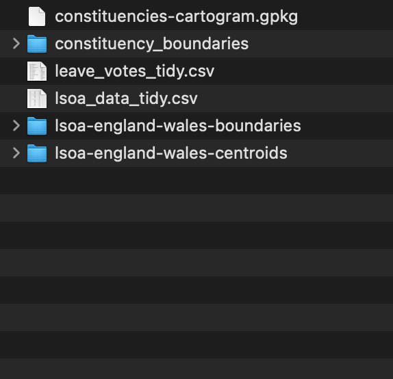
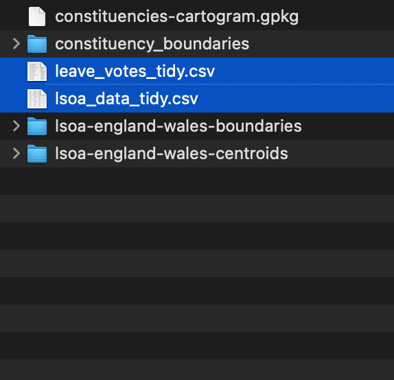
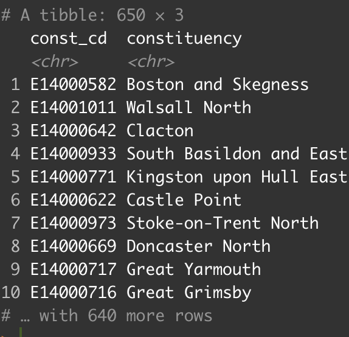
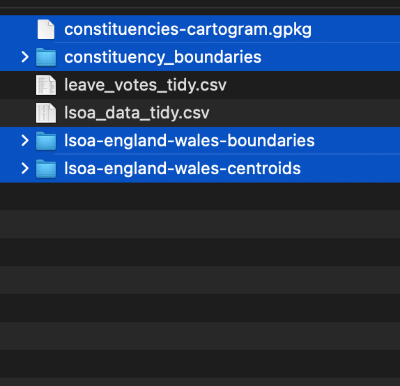
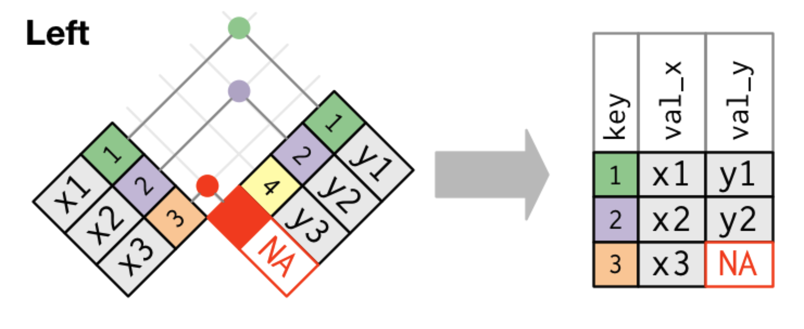
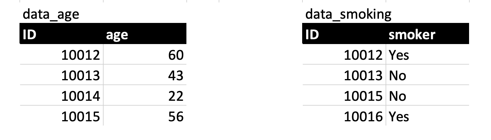
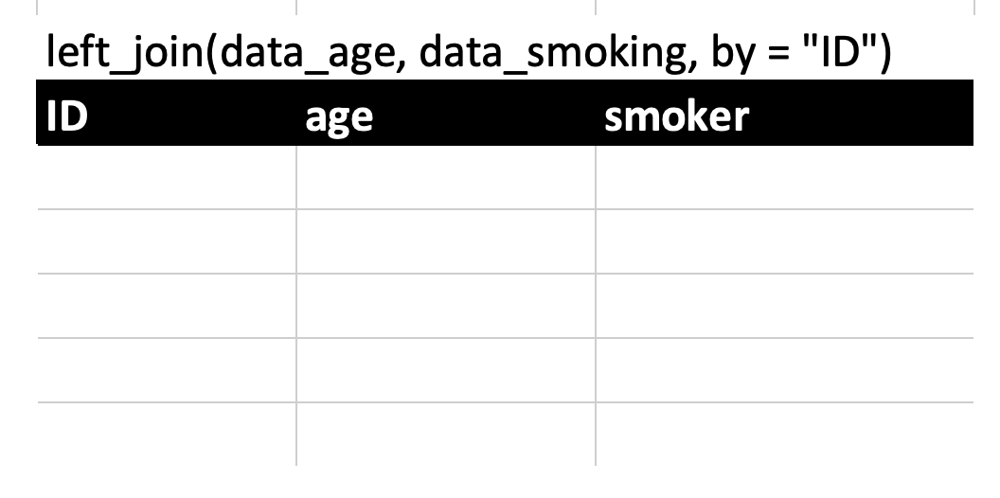
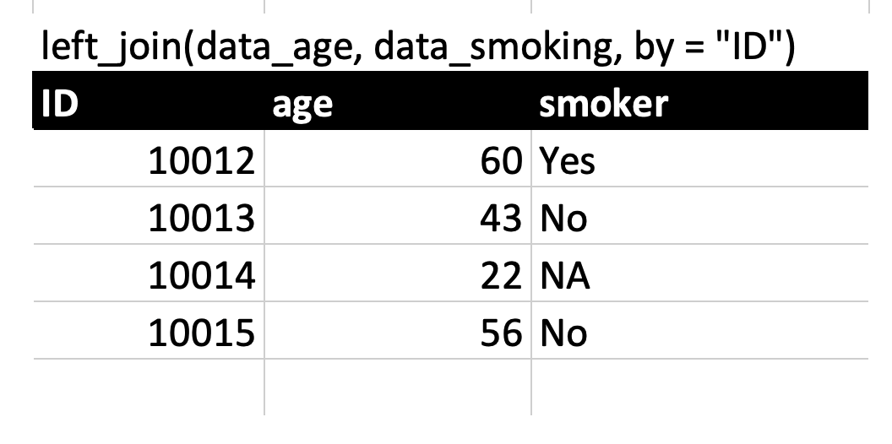
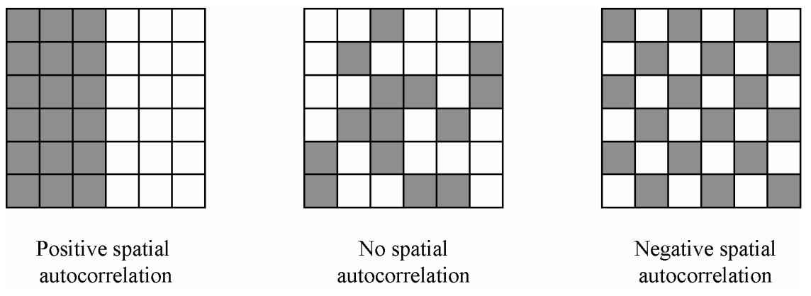

class: middle
background-size: contain

<br><br><br>

# .tuos_purple[SMI606: Week 11<br>Spatial Analysis]

<br><br>

**Dr. Calum Webb**<br>
Sheffield Methods Institute, the University of Sheffield.<br>
[c.j.webb@sheffield.ac.uk](mailto:c.j.webb@sheffield.ac.uk)

```{r setup, include=FALSE}
options(htmltools.dir.version = FALSE)

# These packages are required for creating the slides
# Many will need to be installed from Github
library(icons)
library(tidyverse)
library(xaringan)
library(xaringanExtra)
library(xaringanthemer)

# Defaults for code
knitr::opts_chunk$set(
  fig.width=9, fig.height=3.5, fig.retina=3,
  out.width = "100%",
  cache = FALSE,
  echo = TRUE,
  message = FALSE, 
  warning = FALSE,
  fig.show = TRUE,
  hiline = TRUE
)

# set global theme for ggplot to make background #F8F8F8F8 (off white),
# but otherwise keep all ggplot themes default (better for teaching)
theme_set(
  theme(plot.background = element_rect(fill = "#F8F8F8", colour = "#F8F8F8"), 
        panel.background = element_rect(fill = "#F8F8F8", colour = "#F8F8F8"), 
        legend.background = element_rect(fill = "#F8F8F8", colour = "#F8F8F8")
        )
  )

theme_minimal <- function() 
  {
    ggplot2::theme_minimal() +
    theme(plot.background = element_rect(fill = "#F8F8F8", colour = "#F8F8F8"), 
        panel.background = element_rect(fill = "#F8F8F8", colour = "#F8F8F8"), 
        legend.background = element_rect(fill = "#F8F8F8", colour = "#F8F8F8")
        )
}

theme_classic <- function() 
  {
    ggplot2::theme_classic() +
    theme(plot.background = element_rect(fill = "#F8F8F8", colour = "#F8F8F8"), 
        panel.background = element_rect(fill = "#F8F8F8", colour = "#F8F8F8"), 
        legend.background = element_rect(fill = "#F8F8F8", colour = "#F8F8F8")
        )
}

theme_void <- function() 
  {
    ggplot2::theme_void() +
    theme(plot.background = element_rect(fill = "#F8F8F8", colour = "#F8F8F8"), 
        panel.background = element_rect(fill = "#F8F8F8", colour = "#F8F8F8"), 
        legend.background = element_rect(fill = "#F8F8F8", colour = "#F8F8F8")
        )
  }

```

```{r xaringan-tile-view, echo=FALSE}
# Use tile overview by hitting the o key when presenting
xaringanExtra::use_tile_view()
```

```{r xaringan-logo, echo=FALSE}
# Add logo to top right
xaringanExtra::use_logo(
  image_url = "header/smi-logo-white.png",
  exclude_class = c("inverse", "hide_logo"), 
  width = "180px", position = css_position(top = "1em", right = "2em")
)
```

```{r xaringan-themer, include=FALSE, warning=FALSE}

# Set some global objects containing the colours
# of the university's branding
primary_color <- "#131E29"
secondary_color <- "#440099"
tuos_blue <- "#9ADBE8"
white = "#F8F8F8"
tuos_yellow <- "#FCF281"
tuos_purple <- "#440099"
tuos_red <- "#E7004C"
tuos_midnight <- "#131E29"

# The bulk of the styling is handled by xaringanthemer
style_duo_accent(
  primary_color = "#131E29",
  secondary_color = "#440099",
  colors = c(tuos_purple = "#440099", 
             grey = "#131E2960", 
             tuos_blue ="#9ADBE8",
             tuos_mint = "#00CE7C"),
  header_font_google = xaringanthemer::google_font("Source Serif Pro", "600", "600i"),
  text_font_google   = xaringanthemer::google_font("Source Sans Pro", "300", "300i", "600", "600i"),
  code_font_google   = xaringanthemer::google_font("Lucida Console"),
  header_h1_font_size = "2rem",
  header_h2_font_size = "1.5rem", 
  header_h3_font_size = "1.25rem", 
  text_font_size = "0.9rem",
  code_font_size = "0.65rem", 
  code_inline_font_size = "0.85rem",
  inverse_text_color = "#9ADBE8", 
  background_color = "#F8F8F8", 
  text_color = "#131E29", 
  link_color = "#005A8F", 
  inverse_link_color = "#F8F8F8",
  text_slide_number_color = "#44009970",
  table_row_even_background_color = "transparent", 
  table_border_color = "#44009970",
  text_bold_font_weight = 600
)

```


```{r xaringanExtra, echo = FALSE}
# Adds white progress bar to top
xaringanExtra::use_progress_bar(color = "#F8F8F8", location = "top")
```

```{r xaringan-extra-styles, echo = FALSE}
# Allow for code to be highlighted on hover
xaringanExtra::use_extra_styles(
  hover_code_line = TRUE,         #<<
  mute_unhighlighted_code = TRUE  #<<
)
```

```{r share-again, echo=FALSE}
# Add sharing links and other embedding tools
xaringanExtra::use_share_again()
```

```{r xaringanExtra-search, echo=FALSE}
# Add magnifying glass search function to bottom left for quick
# searching of slides
xaringanExtra::use_search(show_icon = TRUE, auto_search = FALSE)
```


```{r xaringan-panelset, echo=FALSE}
# Allow for adding panelsets (see example on slide 2)
xaringanExtra::use_panelset(in_xaringan = TRUE)

style_panelset_tabs(
  background = "#F8F8F8",
  active_background = "#F8F8F8",
  hover_background = "#F8F8F8"
)


```


```{r, include = FALSE}
# Data prep and library loading
library(tidyverse)
library(sf)
library(leaflet)
library(cartogram)

lsoa_boundaries <- read_sf("data/lsoa-england-wales-boundaries/")
lsoa_centroids <- read_sf("data/lsoa-england-wales-centroids/")
const_boundaries <- read_sf("data/constituency_boundaries/")
const_centroids <- sf::st_centroid(const_boundaries)
st_layers("data/constituencies-cartogram.gpkg")
const_hexcart_grn <- st_read("data/constituencies-cartogram.gpkg", layer = "1 Group names")
const_hexcart_gro <- st_read("data/constituencies-cartogram.gpkg", layer = "2 Group outlines")
const_hexcart_city <- st_read("data/constituencies-cartogram.gpkg", layer = "3 City outlines")
const_hexcart_cons <- st_read("data/constituencies-cartogram.gpkg", layer = "4 Constituencies")
const_hexcart_bg <- st_read("data/constituencies-cartogram.gpkg", layer = "5 Background")

# Tidy up data

# lsoa_utla_lookup <- read_csv("data/lsoa-utla-lookup.csv") %>%
#   janitor::clean_names()
# 
# house_sales <- read_csv("data/home-purchase-transactions.csv") %>%
#   slice(-1) %>%
#   janitor::clean_names() %>%
#   mutate_at(vars(count_95q1:count_18q4), ~ifelse(is.na(.), 0, .)) %>%
#   select(-1) %>%
#   select(lsoa_cd, count_98q1:count_98q4, count_18q1:count_18q4) %>%
#   mutate(housesales_1998 = count_98q1+count_98q2+count_98q3+count_98q4,
#          housesales_2018 = count_18q1+count_18q2+count_18q3+count_18q4) %>%
#   select(-count_98q1:-count_18q4)
# 
# epc_ratings <- readxl::read_xlsx("data/lsoa-energy-efficiency-properties.xlsx", sheet = 3, skip = 3) %>%
#   janitor::clean_names() %>%
#   mutate_at(vars(a_b:g), ~as.numeric(ifelse(. == "..", 0, .))) %>%
#   mutate(
#     total_properties = rowSums(across(a_b:g)),
#     e_g = rowSums(across(e:g)),
#     percent_eg_rated = (e_g/total_properties)*100
#   ) %>%
#   select(-a_b:-e_g)
# 
# idaopi_2019 <- read_csv("data/idaopi-lsoa.csv", skip = 7) %>%
#   rename(lsoa_code = 1, lsoa_name = 2, idaopi_2019 = 3) %>%
#   mutate(
#     lsoa_code = str_remove_all(lsoa_code, "http://opendatacommunities.org/id/geography/administration/lsoa/"),
#     idaopi_2019 = idaopi_2019*100
#   )
# 
# leave_votes <- readxl::read_xlsx("data/eureferendum_constitunecy.xlsx", sheet = 2, skip = 5) %>%
#   drop_na() %>%
#   janitor::clean_names() %>%
#   select(const_cd = 1, constituency, vote_leave = to_use) %>%
#   mutate(vote_leave = vote_leave*100)
# 
# lsoa_data <- idaopi_2019 %>%
#   left_join(epc_ratings, by = c("lsoa_code" = "lsoa_2011")) %>%
#   left_join(house_sales, by = c("lsoa_code" = "lsoa_cd")) %>%
#   left_join(lsoa_utla_lookup %>% select(lsoa11cd, utla17nm), by = c("lsoa_code" = "lsoa11cd"))

# lsoa_data <- lsoa_data %>%
#   mutate(housesales_1998_quantiles = ntile(housesales_1998, 20),
#          housesales_2018_quantiles = ntile(housesales_2018, 20))
# 

# lsoa_pop <- readxl::read_xlsx("data/sape23dt2mid2020lsoasyoaestimatesunformatted.xlsx", sheet = 4, skip = 3) %>%
#   janitor::clean_names() %>%
#   select(lsoa_code, population = all_ages)
# 
# lsoa_data <- left_join(lsoa_data, lsoa_pop, by = "lsoa_code")

#write_csv(lsoa_data, "data/lsoa_data_tidy.csv")
#write_csv(leave_votes, "data/leave_votes_tidy.csv")

lsoa_data <- read_csv("data/lsoa_data_tidy.csv")
leave_votes <- read_csv("data/leave_votes_tidy.csv")


# lsoa_boundaries_c <- lsoa_boundaries %>%
#   left_join(lsoa_data %>% select(-lsoa_name), by = c("lsoa11cd"="lsoa_code"))
# 
# sort(unique(lsoa_boundaries_c$utla17nm))
# 
# lsoa_boundaries_c %>%
#   filter(str_detect(lsoa11nm, "Sheffield")) %>%
#   ggplot() +
#   geom_sf(aes(fill = percent_eg_rated), colour = "transparent") +
#   scale_fill_viridis_c() +
#   theme(legend.position = "bottom")
# 
# lsoa_boundaries_c %>%
#   filter(str_detect(lsoa11nm, "Sheffield")) %>%
#   ggplot() +
#   geom_sf(aes(fill = idaopi_2019), colour = "transparent")+
#   scale_fill_viridis_c() +
#   theme(legend.position = "bottom")
# 
# lsoa_boundaries_c %>%
#   filter(str_detect(lsoa11nm, "Sheffield")) %>%
#   ggplot() +
#   geom_sf(aes(fill = housesales_1998_quantiles), colour = "transparent")+
#   scale_fill_viridis_c() +
#   theme(legend.position = "bottom") 
# 
# lsoa_boundaries_c %>%
#   filter(str_detect(lsoa11nm, "Sheffield")) %>%
#   ggplot() +
#   geom_sf(aes(fill = housesales_2018_quantiles), colour = "transparent")+
#   scale_fill_viridis_c() +
#   theme(legend.position = "bottom")
# 
# # Static Vote Leave Map
# const_hexcart_cons_lv <- const_hexcart_cons %>%
#   left_join(leave_votes, by = c("pcon.code" = "const_cd"))
# 
# const_boundaries_lv <- const_boundaries %>%
#   left_join(leave_votes, by = c("PCON17CD" = "const_cd"))
# 
# 
# ggplot() +
#   geom_sf(data = const_boundaries_lv, aes(fill = vote_leave), size = 0.1) +
#   theme_void() +
#   scico::scale_fill_scico() +
#   ggeasy::easy_add_legend_title("% Vote Leave EU")
# 
# ggplot() +
#   geom_sf(data = const_hexcart_bg, fill = "grey", col = "transparent") +
#   geom_sf(data = const_hexcart_gro) +
#   geom_sf(data = const_hexcart_cons_lv, aes(fill = vote_leave), size = 0.1) +
#   theme_void() +
#   scico::scale_fill_scico() +
#   ggeasy::easy_add_legend_title("% Vote Leave EU")
# 
# 
# # Interactive Brexit Map
# const_boundaries_lv_t <- st_transform(x = const_boundaries_lv, crs = CRS("+proj=longlat +datum=WGS84"))
# 
# leave_palette <- colorNumeric(palette = "viridis", 
#                               domain = const_boundaries_lv$vote_leave, 
#                               na.color = "transparent")
# 
# leaflet(const_boundaries_lv_t) %>%
#   addPolygons(weight = 0.1, stroke = FALSE,
#               fillColor = ~leave_palette(vote_leave), 
#               fillOpacity = 0.7) %>%
#   addTiles() %>%
#   addLegend(pal = leave_palette, 
#             values = ~vote_leave)
# 
# 
# # Interactive House Prices Map
# 
# lsoa_boundaries_c_t <- lsoa_boundaries_c %>%
#   filter(str_detect(lsoa11nm, "Sheffield")) %>%
#   mutate(housesales_1998_quantiles = ntile(housesales_1998, 20),
#          housesales_2018_quantiles = ntile(housesales_2018, 20)) %>%
#   st_transform(., crs = CRS("+proj=longlat +datum=WGS84"))
# 
# sales_palette <- colorNumeric(palette = "viridis",
#                               domain = lsoa_boundaries_c_t$housesales_1998_quantiles,
#                               na.color = "transparent")
# 
# leaflet(lsoa_boundaries_c_t) %>%
#   addPolygons(weight = 0.1, stroke = FALSE,
#               fillColor = ~sales_palette(housesales_1998_quantiles),
#               fillOpacity = 0.8) %>%
#   addTiles() %>%
#   addLegend(pal = sales_palette,
#             values = ~housesales_1998_quantiles)
# 
# leaflet(lsoa_boundaries_c_t) %>%
#   addPolygons(weight = 0.1, stroke = FALSE,
#               fillColor = ~sales_palette(housesales_2018_quantiles),
#               fillOpacity = 0.8) %>%
#   addTiles() %>%
#   addLegend(pal = sales_palette,
#             values = ~housesales_2018_quantiles)
# 
# 


```


---
class: middle

.pull-left[


]
.pull-right[

<br><br><br><br><br><br>

# Sign In


]
---
class: middle

## Learning Objectives

.panelset[

.panel[.panel-name[What will I learn?]

By the end of this week you will:

* Be able to identify when spatial analysis may be beneficial for a social research project/question.

* Be able to read spatial data into `R` for use in spatial analysis and visualisation.

* Be able to interpret and create choropleth and cartogram maps, showing how the variables of interest vary over space.

* Be able to calculate a statistic for measuring spatial concentration/dispersion — Moran's I — using `R`.

* Be aware of more advanced methods that can control for spatial autocorrelation in data.

]

.panel[.panel-name[How does this week fit into my course?]

* Spatial analysis is often a complementary component to any research project: it can serve as a way to identify interesting qualitative fieldwork sites or as a way to help communicate your research findings and create impact.

* Greater availability of computing power means that it's becoming easier (and more expected) to incorporate interactive features (like interactive maps) into research. In more advanced methods, it's also becoming increasingly common to account for and describe spatial autocorrelation. 

* Greater prevalance of geo-tracking technology and sensors means there is likely to be growing amounts of interesting spatial data that can be analysed in the future.


]


]

---

class: inverse, middle

Week 11: Spatial Analysis — Part I
# What is spatial analysis and why learn it?


---

class: middle

### .tuos_purple[How have the most popular areas for buying houses in Sheffield changed over time?]

The two links below will take you to interactive maps of Sheffield where each small area has been colour coded according to the quantity of __houses sold during the year__. House sales have been grouped into 20 quantiles, meaning that an area being in quantile 20 means __it's in the 5% highest sales of homes in the city__ and an area being in quantile 1 means __it's in the 5% lowest sales of homes in the city__.

.center[Work with a partner, or on your own, to document which areas (roughly defined) have grown or declined in popularity.]

.pull-left[

.center[
__[House Sales in 1998](https://calumwebb.co.uk/teaching/SMI606-content/week-11/shef_sales_1998/)__
]

]

.pull-right[

.center[
__[House Sales in 2018](https://calumwebb.co.uk/teaching/SMI606-content/week-11/shef_sales_2018/)__
]

]

.center[Put your findings on [this Jamboard Page](https://jamboard.google.com/d/1f6kVxx1ANoMKJ6E7cZqwCU0hmK1CMf-26fIIkLJBfoY/edit?usp=sharing).]


---

### What is spatial analysis and why learn it?

.pull-left[

#### Argument 1: Because it's interesting.

<br>

> If this is small area data... Why can't I just look at it on a map? That makes much more sense to me.

.right[.small[My paraphrasing of many students' response<br>to small area data]]

<br>

* Often an engaging way to present data — few people are interested in general patterns, everyone's interested in where they live.

* Can show interesting things in its own right — concentration or dispersion; social frontiers (Dean, et al. [2018](https://onlinelibrary.wiley.com/doi/pdfdirect/10.1111/tesg.12316))


]

.pull-right[

```{r, echo = FALSE, fig.width=5, fig.height=4.5, out.height=450, out.width=500}

library(grid)

lsoa_boundaries_c <- lsoa_boundaries %>%
  left_join(lsoa_data %>% select(-lsoa_name), by = c("lsoa11cd"="lsoa_code"))

epc_map <- lsoa_boundaries_c %>%
  filter(str_detect(lsoa11nm, "Sheffield")) %>%
  ggplot() +
  geom_sf(aes(fill = percent_eg_rated), colour = "transparent") +
  scico::scale_fill_scico(palette = "roma", direction = -1) +
  theme_void() +
  theme(legend.position = "bottom") +
  ggeasy::easy_add_legend_title("Percent Houses EPG Rating E-G") +
  ggtitle("Poor Energy Efficiency Housing in Sheffield")


epc_mapt <- ggplotGrob(epc_map)
grid.newpage()
# Draw a black rectangle
grid.draw(rectGrob(gp = gpar(fill = "#f8f8f8", col = "#f8f8f8")))
grid.draw(epc_mapt)

```


]

---

### What is spatial analysis and why learn it?

.pull-left[

#### Argument 2: Because it's useful.

<br>

* Knowing the spatial characteristics of a social problem (how concentrated or dispersed it is) can help in designing effective policy. For example:<br><br>
  * Targeted mailing to residences in certain areas about subsidised insulation programmes.<br><br>
  * Identifying potentially effective areas for place-based intervention, e.g. drug harm reduction facilities in areas with high rates of drug overdose.


]

.pull-right[

```{r, echo = FALSE, fig.width=5, fig.height=4.5, out.height=450, out.width=500}

grid.newpage()
# Draw a black rectangle
grid.draw(rectGrob(gp = gpar(fill = "#f8f8f8", col = "#f8f8f8")))
grid.draw(epc_mapt)

```


]


---

### What is spatial analysis and why learn it?

.pull-left[

#### Argument 3: Because it can cause some errors in our modelling

<br>

> "Everything is related to everything else, but near things are more related than distant things."

.right[.small[Tobler's first law of geography. Miller ([2004](https://d1wqtxts1xzle7.cloudfront.net/35972826/Miller_Harvey_J_2004_Tobler_s_first_law_and_spatial_analysis-with-cover-page-v2.pdf?Expires=1638452304&Signature=TXLGCIzKgAgvb4KR5XvWaMZegFpI5oEh2SPOsbbGLb~7kVkf-7eE5HEmbdv8ljerza~Gaf3bigCWBbqO7QUfxlMzxlhoZDKIrSPXMfiJ3N~OM6lkW2THohxpl1GbVTJDC-JW-N13ZUFP017ewIHSppDb6s61~ct29lSoBlGJRhHzFlscOlHx0cvLJzdfQbA3WeMIoPqpDE2oDk2-sv5PnUHQSdaItBgHW-wU72o7mYA3JiZqLjkBCXRP2BfF8J~KO~eI2l3f-GSBIfO3geF8vummW25WEK0flbmq3YV83dUrJC8g~dZ6sFIUSP~CZtBt6zqrS7HxfemTB0vrFfUpdw__&Key-Pair-Id=APKAJLOHF5GGSLRBV4ZA))]]

<br>

* Recall from Week 9 the concept of "autocorrelation" — in a regression model we assume that observations are independent of each other.

* However, if observations are spatially distributed, they will be related to eachother through proximity/distance (a Gaussian Process).


]

.pull-right[

```{r, echo = FALSE, fig.width=5, fig.height=4.5, out.height=450, out.width=500}

grid.newpage()
# Draw a black rectangle
grid.draw(rectGrob(gp = gpar(fill = "#f8f8f8", col = "#f8f8f8")))
grid.draw(epc_mapt)

```


]


---

class: inverse, middle

Week 11: Spatial Analysis — Part II
# Spatial Analysis in `R`: Reading in spatial data (boundaries and centroids)


---

class: middle
background-color: white

.center[

```{r, echo = FALSE, out.width="70%"}

knitr::include_graphics("images/sf.jpg")

```

]

---

class: middle

#### Spatial data is... complicated.

--

* Comes in multiple different __formats__ (e.g. Shapefiles, GeoJSON, GeoPackage)

--

* Can be __boundaries__ or __points__.

--

* Uses different forms of __projection__ and coordinate reference systems.

--

* Comes in different forms of __geometry type__ and coordinates systems (e.g. X & Y coordinates, latitude & longitude coordinates)

--

* Some packages only work with certain combinations of the above.

--

* However, the `sf` package makes reading in and converting data to different types very easy.


---

### Reading in spatial data

.pull-left[

On the right is my data folder. Inside it are multiple different forms of spatial and non-spatial data.

]

.pull-right[

.center[.middle[
```{r, echo = FALSE, out.width="100%"}



```
]]

]

---

### Reading in spatial data

.pull-left[

On the right is my data folder. Inside it are multiple different forms of spatial and non-spatial data.

* These two files are just plain CSVs (comma-separated values). They contain my non-spatial data. 

* These might be things I want to project onto the spatial boundaries (e.g. EU leave vote share by constituency; percentage of houses with E to G energy efficiency)

]

.pull-right[

.center[.middle[
```{r, echo = FALSE, out.width="100%"}



```
]]

]

---

### Reading in spatial data

.pull-left[

On the right is my data folder. Inside it are multiple different forms of spatial and non-spatial data.

* These two files are just plain CSVs (comma-separated values). They contain my non-spatial data. 

* These might be things I want to project onto the spatial boundaries (e.g. EU leave vote share by constituency; percentage of houses with E to G energy efficiency)

* Inportantly, they contain a **unique identifier** for each geographic area. For example, in the `leave_votes_tidy.csv` file, there is a column called `const_cd`, or "constituency code". This will allow me to join it to the spatial data later.

]

.pull-right[

.center[.middle[
```{r, echo = FALSE, out.width="100%"}



```
]]

]


---

### Reading in spatial data

.pull-left[

On the right is my data folder. Inside it are multiple different forms of spatial and non-spatial data.

* I also have two different types of spatial data: a GeoPackage dataset `constituencies-cartogram.gpkg`, and several shapefile data folders `constituency_boundaries`, `lsoa-england-wales-boundaries`, and `lsoa-england-wales-centroids`.

]

.pull-right[

.center[.middle[
```{r, echo = FALSE, out.width="100%"}



```
]]

]


---

### Reading in spatial data

.pull-left[

On the right is my data folder. Inside it are multiple different forms of spatial and non-spatial data.

* GeoPackages contain several different 'layers' of spatial data. When you read them in, you need to specify which layer you want. Often, you can combine several layers to get a desired effect (e.g. one layer for the entire country, another for the cities, another for small areas)

  * You can view the layers in a GeoPackage type data file using the `st_layers` function in `sf`

]

.pull-right[

.middle[

```{r, echo = FALSE}

options(width = 80)

```

```{r, out.width="100%"}

library(sf)

st_layers("data/constituencies-cartogram.gpkg")


```
]

]

---

### Reading in spatial data

.pull-left[

On the right is my data folder. Inside it are multiple different forms of spatial and non-spatial data.

* GeoPackages contain several different 'layers' of spatial data. When you read them in, you need to specify which layer you want. Often, you can combine several layers to get a desired effect (e.g. one layer for the entire country, another for the cities, another for small areas)

  * You can view the layers in a GeoPackage type data file using the `st_layers` function in `sf`
  
  * We can see that the package has multiple layers, e.g. "3 City outlines" contains the spatial data required to draw larger city groups, whereas "4 Constituencies" contains the spatial data required to draw parliamentary constituencies.

]

.pull-right[

.middle[

```{r, echo = FALSE}

options(width = 80)

```

```{r, out.width="100%"}

library(sf)

st_layers("data/constituencies-cartogram.gpkg")


```
]

]


---

### Reading in spatial data

.pull-left[

On the right is my data folder. Inside it are multiple different forms of spatial and non-spatial data.

* Once we've decided which layer or layers we want, we can read them into `R` using the `st_read` function.

]

.pull-right[

.middle[

```{r, echo = FALSE}

options(width = 80)

```

```{r, out.width="100%"}

wpc_background <- st_read("data/constituencies-cartogram.gpkg", 
                       layer = "5 Background")

wpc_constituencies <- st_read("data/constituencies-cartogram.gpkg", 
                       layer = "4 Constituencies")

```
]

]


---

### Reading in spatial data

.pull-left[

On the right is my data folder. Inside it are multiple different forms of spatial and non-spatial data.

* Shapefiles are a little bit easier to work with. We only need to use `st_read` and tell it where the shape file is. 

  * You can find many geographical boundary and centroid shapefiles for UK areas at [https://geoportal.statistics.gov.uk](https://geoportal.statistics.gov.uk)

]

.pull-right[

.middle[

```{r, echo = FALSE}

options(width = 60)

```

```{r, out.width="100%"}

lsoa_bounds <- st_read("data/lsoa-england-wales-boundaries/")
lsoa_centres <- st_read("data/lsoa-england-wales-centroids/")

```
]

]


---

class: inverse, middle

Week 11: Spatial Analysis — Part III
# Spatial Analysis in `R`: Joining social science data to spatial data


---

### Joining social science data to spatial data

.pull-left-big[

```{r}

lsoa_boundaries

```

]

.pull-right-small[

Once we've read in our spatial data we normally need to add the things we're interested in mapping or analysing spatially to it. Spatial data doesn't often come with social science data attached (and vice versa).

We can merge datasets together using the `join` functions in the `tidyverse` package. Specifically, `left_join`.

]

---

### Joining social science data to spatial data

Let's read in some non-spatial, social science-related LSOA level data.

.pull-left[


```{r}

lsoa_data <- read_csv("data/lsoa_data_tidy.csv")
lsoa_data

```

]


---

### Joining social science data to spatial data

Let's read in some non-spatial, social science-related LSOA level data.

.pull-left[

```{r}

lsoa_data <- read_csv("data/lsoa_data_tidy.csv")
lsoa_data

```

]

.pull-right[

```{r}

lsoa_boundaries

```

]

.center[ __Note the same ID column for small areas: `lsoa_code` in the `lsoa_data` object, `lsoa11cd` in the `lsoa_boundaries` object__ ]


---

background-color: white

### Joining social science data to spatial data


.center[
#### `left_join` (Wickham & Grolemund, [2017](https://r4ds.had.co.nz/index.html))

<br>

]
.center[

```{r, echo = FALSE, out.width="80%"}




```

]

---

background-color: white

### Joining social science data to spatial data

.center[What would a `left_join` of the following two datasets look like?]

.center[

```{r, echo = FALSE, out.width="80%"}




```

]

.center[

Draw the table below and fill in the gaps based on the rules of a `left_join`.

```{r, echo = FALSE, out.width="30%"}




```

]

---

background-color: white

### Joining social science data to spatial data

.center[What would a `left_join` of the following two datasets look like?]

.center[

```{r, echo = FALSE, out.width="80%"}


```

]

.center[

Draw the table below and fill in the gaps based on the rules of a `left_join`.

```{r, echo = FALSE, out.width="30%"}




```

]

---

### Joining social science data to spatial data

.pull-left-small[

`left_join` takes three main arguments: `x` (your 'left' dataset), `y` (your 'right' dataset), and `by`, which identifies the key (or ID) column.

The `by` argument is always entered as a string. __Important:__ If the name of the key/ID variable is different in the two datasets, the `by` argument needs to be written like: `by = c("left_key_variable" = "right_key_variable")`

Our spatial data should __always__ be our "left" variable, else we'll lose our spatial information.

]

.pull-right-big[

```{r, echo = FALSE}

options(width = 80)

```

```{r}

lsoa_boundaries_c <- left_join(lsoa_boundaries, lsoa_data, by = c("lsoa11cd" = "lsoa_code"))
lsoa_boundaries_c

```

]


---

class: inverse, middle

Week 11: Spatial Analysis — Part IV
# Spatial Analysis in `R`: Spatial Data Visualisation — Choropleth Maps


---

## Choropleth Maps

.pull-left-small[

Okay, now we can finally start making maps!

Let's start by just plotting our LSOA boundaries. But first, I'm going to select just Sheffield by filtering out all data that doesn't have "Sheffield" in the LSOA name using `str_detect`.

I'm also going to re-create the housing quantiles variables so that they now reflect only the most popular buying areas of Sheffield.

]

.pull-right-big[

```{r}

sheffield_data <- lsoa_boundaries_c %>%
  filter(str_detect(lsoa11nm, "Sheffield")) %>%
  mutate(housesales_1998_quantiles = ntile(housesales_1998, 20),
         housesales_2018_quantiles = ntile(housesales_2018, 20))


sheffield_data

```

]

---

## Choropleth Maps

.pull-left-small[

Now let's plot our map using `ggplot`.

To plot spatial features (or 'simple features'), we use `geom_sf` from the `sf` package.

]

.pull-right-big[

```{r, eval = FALSE, out.height=450, out.width=550, fig.height=4.5, fig.width=5.5, fig.align='center'}

ggplot(data = sheffield_data) +
  geom_sf()

```

```{r, echo = FALSE, out.height=450, out.width=550, fig.height=4.5, fig.width=5.5, fig.align='center'}

g <- ggplot(data = sheffield_data) +
  geom_sf()

gt <- ggplotGrob(g)
grid.newpage()
# Draw a black rectangle
grid.draw(rectGrob(gp = gpar(fill = "#f8f8f8", col = "#f8f8f8")))
grid.draw(gt)

```


]


---

## Choropleth Maps

.pull-left-small[

Now let's plot our map using `ggplot`.

We can 'fill' our shapes in using variables in the dataset.

]

.pull-right-big[

```{r, eval = FALSE, out.height=450, out.width=550, fig.height=4.5, fig.width=5.5, fig.align='center'}

ggplot(data = sheffield_data) +
  geom_sf(aes(fill = percent_eg_rated))

```

```{r, echo = FALSE, out.height=450, out.width=550, fig.height=4.5, fig.width=5.5, fig.align='center'}

g <- ggplot(data = sheffield_data) +
  geom_sf(aes(fill = percent_eg_rated))

gt <- ggplotGrob(g)
grid.newpage()
# Draw a black rectangle
grid.draw(rectGrob(gp = gpar(fill = "#f8f8f8", col = "#f8f8f8")))
grid.draw(gt)

```


]

---

## Choropleth Maps

.pull-left-small[

Let's see if we can improve how our map looks with a few extra options. Let's start by turning off the boundary lines with `colour = "transparent"`.

]

.pull-right-big[

```{r, eval = FALSE, out.height=450, out.width=550, fig.height=4.5, fig.width=5.5, fig.align='center'}

ggplot(data = sheffield_data) +
  geom_sf(aes(fill = percent_eg_rated), colour = "transparent")

```

```{r, echo = FALSE, out.height=450, out.width=550, fig.height=4.5, fig.width=5.5, fig.align='center'}

g <- ggplot(data = sheffield_data) +
  geom_sf(aes(fill = percent_eg_rated), colour = "transparent")


gt <- ggplotGrob(g)
grid.newpage()
# Draw a black rectangle
grid.draw(rectGrob(gp = gpar(fill = "#f8f8f8", col = "#f8f8f8")))
grid.draw(gt)

```


]


---

## Choropleth Maps

.pull-left-small[

That's better. Let's get rid of the plot background as we don't really need to know the latitude and longitude. We can use `theme_void()` to do this quickly.

]

.pull-right-big[

```{r, eval = FALSE, out.height=400, out.width=500, fig.height=4, fig.width=5, fig.align='center'}

ggplot(data = sheffield_data) +
  geom_sf(aes(fill = percent_eg_rated), colour = "transparent") +
  theme_void()

```

```{r, echo = FALSE, out.height=400, out.width=500, fig.height=4, fig.width=5, fig.align='center'}

g <- ggplot(data = sheffield_data) +
  geom_sf(aes(fill = percent_eg_rated), colour = "transparent") +
  theme_void()

gt <- ggplotGrob(g)
grid.newpage()
# Draw a black rectangle
grid.draw(rectGrob(gp = gpar(fill = "#f8f8f8", col = "#f8f8f8")))
grid.draw(gt)

```


]


---

## Choropleth Maps

.pull-left-small[

We can also change our colour scheme if we want. One easy option is to use `scale_fill_viridis_c()`

]

.pull-right-big[

```{r, eval = FALSE, out.height=450, out.width=550, fig.height=4.5, fig.width=5.5, fig.align='center'}

ggplot(data = sheffield_data) +
  geom_sf(aes(fill = percent_eg_rated), colour = "transparent") +
  theme_void() +
  scale_fill_viridis_c()

```

```{r, echo = FALSE, out.height=450, out.width=550, fig.height=4.5, fig.width=5.5, fig.align='center'}

g <- ggplot(data = sheffield_data) +
  geom_sf(aes(fill = percent_eg_rated), colour = "transparent") +
  theme_void() +
  scale_fill_viridis_c()

gt <- ggplotGrob(g)
grid.newpage()
# Draw a black rectangle
grid.draw(rectGrob(gp = gpar(fill = "#f8f8f8", col = "#f8f8f8")))
grid.draw(gt)

```


]


---

## Choropleth Maps

.pull-left-small[

We can choose our own high and low colours using the `scale_fill_gradient()` function if we want too.

]

.pull-right-big[

```{r, eval = FALSE, out.height=450, out.width=550, fig.height=4.5, fig.width=5.5, fig.align='center'}

ggplot(data = sheffield_data) +
  geom_sf(aes(fill = percent_eg_rated), colour = "transparent") +
  theme_void() +
  scale_fill_gradient(low = "seagreen", high = "pink")

```

```{r, echo = FALSE, out.height=450, out.width=550, fig.height=4.5, fig.width=5.5, fig.align='center'}

g <- ggplot(data = sheffield_data) +
  geom_sf(aes(fill = percent_eg_rated), colour = "transparent") +
  theme_void() +
  scale_fill_gradient(low = "seagreen", high = "pink")

gt <- ggplotGrob(g)
grid.newpage()
# Draw a black rectangle
grid.draw(rectGrob(gp = gpar(fill = "#f8f8f8", col = "#f8f8f8")))
grid.draw(gt)

```


]


---

class: middle


#### .tuos_purple[What is a potential problem with our choropleth map?]


---

class: inverse, middle

Week 11: Spatial Analysis — Part V
# Spatial Analysis in `R`: Spatial Data Visualisation — Cartograms


---

class: middle

### Cartograms

While a __choropleth map__ refers to the colour-coding of a __geographically accurate__ map, a __cartogram__ refers to the colour-coding of a map that has been __transformed__ in some way while (mostly) maintaining spatial arrangement, for example, to account for population size.

---

### Cartograms

.pull-left[

```{r, echo = FALSE, fig.width=5, fig.height=4.5, out.height=450, out.width=500}

g <- epc_map +
  ggtitle("Choropleth")

gt <- ggplotGrob(g)
grid.newpage()
# Draw a black rectangle
grid.draw(rectGrob(gp = gpar(fill = "#f8f8f8", col = "#f8f8f8")))
grid.draw(gt)

```


]

.pull-right[

```{r, echo = FALSE, fig.width=5, fig.height=4.5, out.height=450, out.width=500}

set.seed(2021)
# sheffield_longlat <- st_transform(sheffield_data, crs = 23038)
# sheffield_longlat <- sheffield_longlat %>% mutate(population = as.numeric(population))
# shef_cart <- cartogram_cont(sheffield_longlat, weight = "population")

#write_rds(shef_cart, "data/sheffield_cartogram.rds")

shef_cart <- read_rds("data/sheffield_cartogram.rds")

g <- shef_cart %>%
  ggplot() +
  geom_sf(aes(fill = percent_eg_rated), colour = "transparent") +
  scico::scale_fill_scico(palette = "roma", direction = -1) +
  theme_void() +
  theme(legend.position = "bottom") +
  ggeasy::easy_add_legend_title("Percent Houses EPG Rating E-G") +
  ggtitle("'Rubber Sheet' Population Cartogram")

gt <- ggplotGrob(g)
grid.newpage()
# Draw a black rectangle
grid.draw(rectGrob(gp = gpar(fill = "#f8f8f8", col = "#f8f8f8")))
grid.draw(gt)


```

]


---

### Cartograms

.pull-left[

```{r, echo = FALSE, fig.width=5, fig.height=4.5, out.height=450, out.width=500}

const_boundaries_lv <- const_boundaries %>%
  left_join(leave_votes, by = c("PCON17CD" = "const_cd"))

g <- ggplot() +
  geom_sf(data = const_boundaries_lv, aes(fill = vote_leave), size = 0.1) +
  theme_void() +
  scico::scale_fill_scico() +
  ggeasy::easy_add_legend_title("% Vote Leave EU") +
  ggtitle("Choropleth")

gt <- ggplotGrob(g)
grid.newpage()
# Draw a black rectangle
grid.draw(rectGrob(gp = gpar(fill = "#f8f8f8", col = "#f8f8f8")))
grid.draw(gt)


```


]

.pull-right[

```{r, echo = FALSE, fig.width=5, fig.height=4.5, out.height=450, out.width=500}

const_hexcart_cons_lv <- const_hexcart_cons %>%
  left_join(leave_votes, by = c("pcon.code" = "const_cd"))

g <- ggplot() +
  geom_sf(data = const_hexcart_bg, fill = "grey", col = "transparent") +
  geom_sf(data = const_hexcart_gro) +
  geom_sf(data = const_hexcart_cons_lv, aes(fill = vote_leave), size = 0.1) +
  theme_void() +
  scico::scale_fill_scico() +
  ggeasy::easy_add_legend_title("% Vote Leave EU") +
  ggtitle("Non-contiguous Hex-map Cartogram")

gt <- ggplotGrob(g)
grid.newpage()
# Draw a black rectangle
grid.draw(rectGrob(gp = gpar(fill = "#f8f8f8", col = "#f8f8f8")))
grid.draw(gt)


```

]

---

class: middle

.pull-left[

You can either find cartogram spatial data files that other people have already designed, for example, the one used in the previous slide is available from the [House of Commons Library](https://github.com/houseofcommonslibrary/uk-hex-cartograms-noncontiguous)'s github page.

<br><br><br><br><br><br><br><br>

]

---

class: middle

.pull-left[

You can either find cartogram spatial data files that other people have already designed, for example, the one used in the previous slide is available from the [House of Commons Library](https://github.com/houseofcommonslibrary/uk-hex-cartograms-noncontiguous)'s github page.

]


.pull-right[

Or you can create them yourself using various cartogram algorithms — the `cartogram` package in `R` has been created to do this. For example, the above cartogram of Sheffield was created with the following code:

```{r, echo = TRUE, eval = FALSE}

library(cartogram)
set.seed(2021)
# Need to convert the data to a projected spatial dataframe 
# first
sheffield_longlat <- st_transform(sheffield_data, crs = 23038)
# Then can create a rubber sheet style population cartogram
# using the cartogram_cont function from cartogram
shef_cart <- cartogram_cont(sheffield_longlat, 
                            weight = "population")

```


]


---

class: inverse, middle

Week 11: Spatial Analysis — Part V
# Spatial Analysis in `R`: Spatial Data Visualisation — Interactive


---

### Interactive Maps

.pull-left-small[

__Interactivity__ is increasingly used as a way to allow researchers and others to explore at various levels of scale.

One benefit to working in `R` is that it's relatively easy to create these impressive kinds of maps.

...It's still quite fiddly, but easier than you'd think using the `leaflet` package.


]

.pull-right-big[

```{r, echo = FALSE, out.height=500, out.width=700}

library(sp)

sheffield_data_longlat <- sheffield_data %>%
  st_transform(., crs = CRS("+proj=longlat +datum=WGS84"))

sales_palette <- colorNumeric(palette = "viridis",
                              domain = sheffield_data_longlat$percent_eg_rated,
                              na.color = "transparent")

leaflet(sheffield_data_longlat) %>%
  addPolygons(weight = 0.1, stroke = FALSE,
              fillColor = ~sales_palette(percent_eg_rated),
              fillOpacity = 0.8) %>%
  addTiles() %>%
  addLegend(pal = sales_palette,
            values = ~percent_eg_rated)


```


]


---

### Interactive Maps

.pull-left-small[

__Interactivity__ is increasingly used as a way to allow researchers and others to explore at various levels of scale.

One benefit to working in `R` is that it's relatively easy to create these impressive kinds of maps.

...It's still quite fiddly, but easier than you'd think using the `leaflet` package.


]

.pull-right-big[

#### Underlying Code

```{r, echo = TRUE, eval = FALSE, out.height=500, out.width=700}

library(leaflet)

# Need to transform data into long and lat (rather than XY), as it's what leaflet 
# uses
sheffield_data_longlat <- sheffield_data %>%
  st_transform(., crs = CRS("+proj=longlat +datum=WGS84"))

# Need to create a continuous colour palette for leaflet to use to fill in areas
sales_palette <- colorNumeric(palette = "viridis",
                              domain = sheffield_data_longlat$percent_eg_rated,
                              na.color = "transparent")

# Use the leaflet package in a similar way to ggplot
leaflet(sheffield_data_longlat) %>%
  addPolygons(weight = 0.1, stroke = FALSE,
              fillColor = ~sales_palette(percent_eg_rated),
              fillOpacity = 0.8) %>%
  addTiles() %>%
  addLegend(pal = sales_palette,
            values = ~percent_eg_rated)


```


]


---

class: inverse, middle

Week 11: Spatial Analysis — Part VI
# Spatial Analysis in `R`: Moran's I

---

class: middle

#### But how can I express the spatial relationship of a variable? 


---

background-color: white

### Moran's I

__Moran's I__ is a statistical measure of the autocorrelation in spatial data.

```{r, echo = FALSE}



```

<br>

.center[Source: Kirkegaard, [2015](https://thewinnower.com/papers/2847-some-methods-for-measuring-and-correcting-for-spatial-autocorrelation)]


---

### Moran's I

.pull-left[

#### Data Preparation

To calculate Moran's I, we need three things:

* The __variable__ we're interested in finding the spatial autocorrelation of.

* The population-weighted or geometric __centroids__ of our boundaries (or a list of their bordering neighbours, but we are going to use the centroid approach).

* A closeness matrix (the inverse of the distance matrix we used last week in factor analysis) which tells us the __closeness of each centroid to every other centroid__


]

.pull-right[


]


---

### Moran's I

.pull-left[

#### Data Preparation

I'll start by reading in the centroid data and joining it to the LSOA data, using what we covered in the second and third part of this lecture. I'll also filter the data to be just Sheffield again.

I'm also going to re-calculate the house sales quantiles (as they are currently national popularity) — recalculating them on the Sheffield only data will give me house buying popularity only relative to areas in Sheffield.


]

.pull-right[

```{r}

sheff_cent <- read_sf("data/data_dummy/lsoa-england-wales-centroids/") %>%
  filter(str_detect(lsoa11nm, "Sheffield")) 

sheff_cent <- left_join(sheff_cent, lsoa_data, 
          by = c("lsoa11cd" = "lsoa_code")) %>%
  mutate(housesales_1998_quantiles = ntile(housesales_1998, 20),
         housesales_2018_quantiles = ntile(housesales_2018, 20))

sheff_cent

```

]

---

### Moran's I

.pull-left[

#### Data Preparation

I'll start by reading in the centroid data and joining it to the LSOA data, using what we covered in the second and third part of this lecture. I'll also filter the data to be just Sheffield again.

I'm also going to re-calculate the house sales quantiles (as they are currently national popularity) — recalculating them on the Sheffield only data will give me house buying popularity only relative to areas in Sheffield.


]

.pull-right[

```{r, echo = FALSE, fig.height=5, fig.width=5, out.height=500, out.width=500}

g <- ggplot() +
  geom_sf(data = sheffield_data, size = 0.1) +
  geom_sf(data = sheff_cent, size = 1, 
          aes(colour = housesales_1998_quantiles)) +
  scale_color_viridis_c() +
  ggeasy::easy_remove_legend()

gt <- ggplotGrob(g)
grid.newpage()
# Draw a black rectangle
grid.draw(rectGrob(gp = gpar(fill = "#f8f8f8", col = "#f8f8f8")))
grid.draw(gt)

```

]


---

### Moran's I

.pull-left[

#### Data Preparation

Next, I need to get our X and Y coordinates from our data. I can use the `st_coordinates()` function to do this easily.


]

.pull-right[

```{r}

# Get X and Y coordinates
sheff_cent_coords <- st_coordinates(sheff_cent)

head(sheff_cent_coords)

```

]


---

### Moran's I

.pull-left[

#### Data Preparation

Next, I need to calculate our Euclidean ('as the crow flies') distance matrix. I can use the `dist` function built into `R` to do this. This is easier than using the `daisy` function from last week as we need to do further manipulation to make it a **closeness** matrix. I also need to change it to explicitly be a `matrix` class object for this manipulation.


]

.pull-right[

```{r}

# Calculate Euclidean distance matrix
sheff_dist <- dist(sheff_cent_coords)

# Change to be matrix object (for further manipulation)
sheff_dist <- as.matrix(sheff_dist)

```

]

---

### Moran's I

.pull-left[

#### Data Preparation

Now I need to __invert the distance matrix__, so that it becomes a "closeness" matrix. This is easy to do with the following two steps:

* Calculate 1 divided by every value in the distance matrix
* Replace the diagonal values in the new matrix with 0


]

.pull-right[

```{r}

# Calculate inverse of distance
sheff_close <- 1/sheff_dist
# Set diagonals to 0
diag(sheff_close) <- 0

# Preview output
sheff_close[1:5, 1:5]

```

]


---

### Moran's I

.pull-left[

#### Data Preparation

We can finally calculate the Moran's I statistic using the `spdep` (Spatial Dependence) package.

The `moran.test` function needs two arguments:

* `x` = The variable of interest.

* `listw` = The closeness matrix. Note that we have to put our matrix in the `mat2listw()` function from `spdep` to turn it into the necessary kind of class for it work.


]

.pull-right[

```{r}

library(spdep)

# Disable scientific notation for less than 10 length
options(scipen = 10)

# Moran's I statistic for Housing Sales 1998
moran.test(x = sheff_cent$housesales_1998_quantiles, 
           listw = mat2listw(sheff_close))

```

]

---

### Moran's I

.center[Morans I = __1__, Highly Clustered Spatially; Moran's I = __-1__, Highly Dispersed; Moran's I = __0__, Random Distribution in Space]

.pull-left[
```{r}

# Moran's I statistic for Housing Sales 1998
moran.test(x = sheff_cent$housesales_1998_quantiles, 
           listw = mat2listw(sheff_close))

```
]

.pull-right[

```{r}

# Moran's I statistic for Housing Sales 2018
moran.test(x = sheff_cent$housesales_2018_quantiles, 
           listw = mat2listw(sheff_close))

```


]

<br><br>

#### .center[Have the areas where people buy the most property in Sheffield grown more or less spatially concentrated over time?]


---

class: inverse, middle

Week 11: Spatial Analysis — Part VII
# Spatial Analysis in `R`: Taking Spatial Analysis Further with Spatial Regression Models

---

### Spatial Regression Models


.pull-left[

The effect of spatial autocorrelation can be controlled for by means of a [spatial regression model](https://datascienceplus.com/spatial-regression-in-r-part-1-spamm-vs-glmmtmb/). This, however, is a quite advanced method. 

```{r}

simple_model <- lm(data = sheff_cent,
   formula = percent_eg_rated ~ idaopi_2019) 

summary(simple_model)

```

]

.pull-right[

```{r, eval = FALSE}
library(spaMM)
sheff_cent_sr <- sheff_cent
sheff_cent_sr$x <- sheff_cent_coords[,1]
sheff_cent_sr$y <- sheff_cent_coords[,2]
m_spamm <- fitme(percent_eg_rated ~ idaopi_2019 + 
                  Matern(1 | x + y), 
                data= sheff_cent_sr, family= "gaussian")
summary(m_spamm, verbose = FALSE)$beta_table
anova(m_spamm)

```

```{r, echo = FALSE}

# sheff_cent_sr <- sheff_cent
# sheff_cent_sr$pos <- glmmTMB::numFactor(scale(sheff_cent_coords[,1]), scale(sheff_cent_coords[,2]))
# sheff_cent_sr$ID <- factor(rep(1, nrow(sheff_cent_sr)))
# 
# # Spatial autocorrelation model
# m_tmb <- glmmTMB::glmmTMB(percent_eg_rated ~ idaopi_2019 + mat(pos + 0 | ID), sheff_cent_sr) 
# 
# # model summary of fixed effects
# summary(m_tmb)
# 
# 
# # spaMM model example - much faster
# sheff_cent_sr$x <- sheff_cent_coords[,1]
# sheff_cent_sr$y <- sheff_cent_coords[,2]
# 
# m_spamm <- spaMM::fitme(percent_eg_rated ~ idaopi_2019 + Matern(1 | x + y), data = sheff_cent_sr, family = "gaussian") 
# 
# write_rds(m_spamm, file = "spamm_model.rds")
# m_spamm <- read_rds("spamm_model.rds")
# 
# write_rds(m_tmb, file = "glmmTMB_model.rds")
# m_tmb <- read_rds("glmmTMB_model.rds")
library(spaMM)
m_spamm <- read_rds("spamm_model.rds")

# model summary
summary(m_spamm, verbose = FALSE)$beta_table
anova(m_spamm)

```

]


---

class: inverse, middle

Week 11: Spatial Analysis — Part VIII
# Summary & Practical


---

class: middle

# Summary

* Spatial analysis can include an __interesting new dimension in your research project__ — either through visualising your findings to make them easier to communicate; using it to complement qualitative research designs; or for incorporating spatial autocorrelation to re-visit classic research studies.

--

* However, spatial data is highly varied and __requires some technical skill to work with__. You need to be able to read in a variety of spatial data formats, convert them in various ways for use with packages of your choice, and join the geospatial data to the social science data of interest.

--

* We can represent spatial data visually through various types of maps: most commonly we use a static __choropleth__, but we may also wish to use __interactive maps__ or __cartograms__ to adjust for population size.

--

* We can summarise __spatial autocorrelation__ using the __Moran's I__ statistic, where -1 indicates total dispersion and +1 indicates total concentration of a variable. 

--

* Spatial autocorrelation and analysis can be taken further using __spatial regression models__, which can account for the impact of spatial dependence. Though they are too advanced to cover in this module, they are not too difficult to get working in `R`.

---

class: middle

# Practical

#### In this week's practical, we are going to be recreating the maps of Sheffield areas based on house buying popularity, but you will also be following along and adapting the code to replicate this analysis for a city or region of your choice.

* Download and unzip the `week-11-exercise.zip` file from the Blackboard page. Open the `week-11-exercise.Rproj` Rproject file and open the accompanying .Rmd file.


---

class: middle
background-color: white

.pull-left[

<br><br><br><br><br><br>

# Thank you and well done!

[A reminder of where we started...](https://jamboard.google.com/d/1jFYCgK5wrihDK_Z7lOGvcTi6ZA8EQVJ5DsyHT0EX3Nw/edit?usp=sharing)

]

.pull-right[

```{r, echo = FALSE}


```

]


---

class: middle, inverse

# Be like Florence.

### "Whenever I am infuriated, I revenge myself with a new diagram."

---

class: middle

## .tuos_purple["It’s worth noting, before getting started, that this material is hard. If you find yourself confused at any point, you are normal. Any sense of confusion you feel is just your brain correctly calibrating to the subject matter. Over time, confusion is replaced by comprehension..."]

#### .tuos_purple[Richard McElreath. (2020). *Statistical Rethinking: A Bayesian Course with Examples in R and Stan. 2nd Ed.*. Boca Raton, FL: CRC Press. p.193]


---

class: middle


# Additional Resources & Workshops from the University 

.pull-left[

## [Library](https://www.sheffield.ac.uk/library/study/workshops)

.small[

Research Skills and Critical Thinking (RSCT) workshops

* [Discovering Information: A masterclass](https://www.sheffield.ac.uk/library/study/workshops)
* [Referencing and preventing plagiarism](https://www.sheffield.ac.uk/library/study/workshops)
* [Using reference management software: an introduction](https://www.sheffield.ac.uk/library/study/workshops)

]

Online resources

.small[

* [Developing a search strategy](https://librarydevelopment.group.shef.ac.uk/storyline/discovering/developing-search-strategy/story_html5.html)
* [Producing a literature review](https://librarydevelopment.group.shef.ac.uk/storyline/creating/literature-review/story_html5.html)
* [Tutorials A-Z](https://www.sheffield.ac.uk/library/study/tutorials)

]

## [301 Skills Centre](https://students.sheffield.ac.uk/301)

.small[

* [Essay structure & planning](https://301skills.shef.ac.uk/events/50/upcoming)
* [Developing an academic argument](https://301skills.shef.ac.uk/events/112/upcoming)

]

]

.pull-right[

.small[

* [Reflecting on your academic progress](https://301skills.shef.ac.uk/events/370/upcoming)
* [Making the most of feedback](https://www.sheffield.ac.uk/academic-skills/study-skills-online/feedback)

]

## [M.A.S.H.](https://www.sheffield.ac.uk/mash)

.small[

* [Statistics resources](https://www.sheffield.ac.uk/mash/stats-resources):
* [1-to-1 Support](https://students.sheffield.ac.uk/mash/bookings)
* [General statistics workshops](https://students.sheffield.ac.uk/mash/workshops/stats)

]

## [Career's Service](https://students.sheffield.ac.uk/skills/myskills)

.small[

* [Reflecting & recording personal development](https://digitalmedia.sheffield.ac.uk/media/Reflecting+and+recording+personal+development+in+mySkills/1_hi47ii81)

]

]


