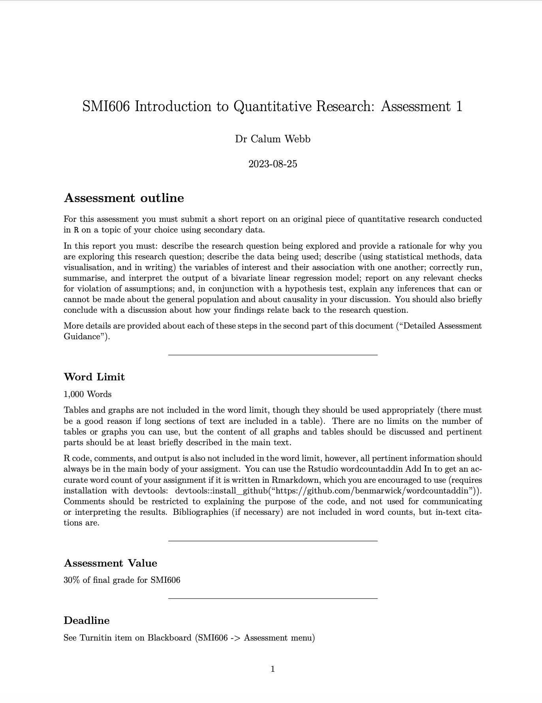

class: middle, title
background-size: contain


<br><br>

# SMI606: Assessment 1
#### Guidance & Walkthrough

<br><br>

**Dr. Calum Webb**<br>
Sheffield Methods Institute, the University of Sheffield<br>
[c.j.webb@sheffield.ac.uk](mailto:c.j.webb@sheffield.ac.uk)

```{r setup, include=FALSE}
options(htmltools.dir.version = FALSE)

# These packages are required for creating the slides
# Many will need to be installed from Github
library(icons)
library(tidyverse)
library(xaringan)
library(xaringanExtra)
library(xaringanthemer)

# Defaults for code
knitr::opts_chunk$set(
  fig.width=9, fig.height=3.5, fig.retina=3,
  out.width = "100%",
  cache = FALSE,
  echo = TRUE,
  message = FALSE, 
  warning = FALSE,
  fig.show = TRUE,
  hiline = TRUE
)

# set global theme for ggplot to make background #F8F8F8F8 (off white),
# but otherwise keep all ggplot themes default (better for teaching)
theme_set(
  theme(plot.background = element_rect(fill = "#F8F8F8", colour = "#F8F8F8"), 
        panel.background = element_rect(fill = "#F8F8F8", colour = "#F8F8F8"),
        legend.background = element_rect(fill = "#F8F8F8", colour = "#F8F8F8")
        )
  )

```

```{r xaringan-tile-view, echo=FALSE}
# Use tile overview by hitting the o key when presenting
xaringanExtra::use_tile_view()
```

```{r xaringan-logo, echo=FALSE}
# Add logo to top right
xaringanExtra::use_logo(
  image_url = "header/smi-logo-white.png",
  exclude_class = c("inverse", "hide_logo"), 
  width = "180px", position = css_position(top = "1em", right = "2em")
)
```

```{r xaringan-themer, include=FALSE, warning=FALSE}

# Set some global objects containing the colours
# of the university's branding
primary_color <- "#131E29"
secondary_color <- "#440099"
tuos_blue <- "#9ADBE8"
white = "#F8F8F8"
tuos_yellow <- "#FCF281"
tuos_purple <- "#440099"
tuos_red <- "#E7004C"
tuos_midnight <- "#131E29"

# The bulk of the styling is handled by xaringanthemer
style_duo_accent(
  primary_color = "#131E29",
  secondary_color = "#440099",
  colors = c(tuos_purple = "#440099", 
             grey = "#131E2960", 
             tuos_blue ="#9ADBE8",
             tuos_mint = "#00CE7C"),
  header_font_google = xaringanthemer::google_font("Source Serif Pro", "600", "600i"),
  text_font_google   = xaringanthemer::google_font("Source Sans Pro", "300", "300i", "600", "600i"),
  code_font_google   = xaringanthemer::google_font("Lucida Console"),
  header_h1_font_size = "2rem",
  header_h2_font_size = "1.5rem", 
  header_h3_font_size = "1.25rem", 
  text_font_size = "0.9rem",
  code_font_size = "0.65rem", 
  code_inline_font_size = "0.85rem",
  inverse_text_color = "#9ADBE8", 
  background_color = "#F8F8F8", 
  text_color = "#131E29", 
  link_color = "#005A8F", 
  inverse_link_color = "#F8F8F8",
  text_slide_number_color = "#44009970",
  table_row_even_background_color = "transparent", 
  table_border_color = "#44009970",
  text_bold_font_weight = 600
)

```


```{r xaringan-panelset, echo=FALSE}
# Allow for adding panelsets (see example on slide 2)
xaringanExtra::use_panelset()
```

```{r xaringanExtra, echo = FALSE}
# Adds white progress bar to top
xaringanExtra::use_progress_bar(color = "#F8F8F8", location = "top")
```

```{r xaringan-extra-styles, echo = FALSE}
# Allow for code to be highlighted on hover
xaringanExtra::use_extra_styles(
  hover_code_line = TRUE,         #<<
  mute_unhighlighted_code = TRUE  #<<
)
```

```{r share-again, echo=FALSE}
# Add sharing links and other embedding tools
xaringanExtra::use_share_again()
```

```{r xaringanExtra-search, echo=FALSE}
# Add magnifying glass search function to bottom left for quick
# searching of slides
xaringanExtra::use_search(show_icon = TRUE, auto_search = FALSE)
```


---

# Assessment Guidance

.pull-left[

[Link to the assessment guidance](https://www.calumwebb.co.uk/teaching/SMI606-content/assessment-1-guidance/assessment-1-details.pdf).

* Pick and dataset and research question

* Write a rationale

* Describe the dataset

* Describe the data using univariate and bivariate statistics

* Estimate a bivariate linear regression and describe the findings

* Check for violations of assumptions

* Make appropriate statements about inference and causality throughout

* Discuss the findings and conclude the report

]

.pull-right[

.center[
```{r, echo = FALSE, out.width = "70%"}



```
]

]


---

### Pick and dataset and research question

.pull-left[

> What is your research about?


* Look in the description of datasets file found on the assessments page *or* find some data you are interested in. 

* Try and pick something you are interested in (the assessment will be less painful that way)

* **Remember** that in assessment 1 you are only looking at **two** variables, so your research question will need to be quite precise


]

---

### Pick and dataset and research question

.pull-left[

> What is your research about?


* Look in the description of datasets file found on the assessments page *or* find some data you are interested in. 

* Try and pick something you are interested in (the assessment will be less painful that way)

* **Remember** that in assessment 1 you are only looking at **two** variables, so your research question will need to be quite precise


]

.pull-right[

#### Bad:

`r icons::feather_icons("x-circle")` "How does poverty and local political party control cause increases in housing insecurity?"

****

#### What's wrong:

- **More than one independent variable**, not appropriate for assessment 1.
- **Implies causality**, is it possible to demonstrate with the data and method?
- **Imprecise outcome/variables**, how is 'housing insecurity' measured in the data? Often it is better to use the specific variable's definition and then widen the concept in the discussion.
- No clear **unit of analysis**, individuals, local authorities, countries?

]

---

### Pick and dataset and research question

.pull-left[

> What is your research about?


* Look in the description of datasets file found on the assessments page *or* find some data you are interested in. 

* Try and pick something you are interested in (the assessment will be less painful that way)

* **Remember** that in assessment 1 you are only looking at **two** variables, so your research question will need to be quite precise


]

.pull-right[

#### Better:

`r icons::feather_icons("check-circle")` "Are higher rates of poverty in local authorities associated with higher rates of homelessness applications?"

****

#### What's better:

- **Only one independent and one dependent variable**
- **Restricted to association**, not setting such a high bar to demonstrate causality
- **More precise description of variables**
- **Defines the unit of analysis (local authorities)**

]

---

# Write a rationale

.pull-left[

> Why should I **care** about your research?

* Now you have come up with a question, explain to me in a sentence or two **why I should care about it**.

* A good rationale has an explicit call to policy discussions or academic debate.

* The rationale allows you to explain how your more precise research question fits within the wider scholarship.

]

---

# Write a rationale

.pull-left[

> Why should I **care** about your research?

* Now you have come up with a question, explain to me in a sentence or two **why I should care about it**.

* A good rationale has an explicit call to policy discussions or academic debate.

* The rationale allows you to explain how your more precise research question fits within the wider scholarship.

]

.pull-right[


#### Bad:

`r icons::feather_icons("x-circle")` "Not much is known about how strongly related poverty and housing insecurity is. However, it is important to research this so that we can identify policies to prevent homelessness. In addition, both variables are continuous and suited to bivariate linear regression."

****

#### What's wrong:

- **Vague, unevidenced claim about lack of research** - is that really true?
- Vague claim about it being important to research - **why** is it important to research??
- Okay for an undergraduate assignment, but at postgraduate we want you to think more deeply about this.


]


---

# Write a rationale

.pull-left[

> Why should I **care** about your research?

* Now you have come up with a question, explain to me in a sentence or two **why I should care about it**.

* A good rationale has an explicit call to policy discussions or academic debate.

* The rationale allows you to explain how your more precise research question fits within the wider scholarship.

]

.pull-right[


#### Better:

`r icons::feather_icons("check-circle")` "The end of the COVID-19 pandemic has seen a surge in housing demand across England and Wales, especially in historically deprived cities as internal migration out of London has increased. Costs associated with housing have been one of the greatest contributers to a cost of living crisis; as this crisis continues and a recession looms, understanding the association between homelessness and poverty rates may help policymakers direct resources towards people areas of the country at the highest risk of homelessness."

****

#### What is better:

* **Direct** link to contemporary policy concerns.
* Demonstrates the ability to think about how the research findings might result in some impact.


]

---

# Describe the dataset

.pull-left[

> Where is your data from? How was it collected, and what can that tell us about the wider population or causality?

* If you are using one of the provided datasets: **look in the description of datasets folder on Blackboard for clues on how it was collected.**

* Who collected the data?

* What is the unit of analysis (country? local authority? neighbourhood? person?)

* Is the data an entire population of interest? A random sample? A stratefied random sample? Or an opportunity sample? 
  - Based on this, what will we be able to say about inference (Check [Week 4 Slides](https://calumwebb.co.uk/teaching/SMI606-content/week-4/slides/#1))?

* Does it come from a causal design? Keep this in mind when talking about causality.

]


---

# Describe the dataset

.pull-left[

> Where is your data from? How was it collected, and what can that tell us about the wider population or causality?

* If you are using one of the provided datasets: **look in the description of datasets folder on Blackboard for clues on how it was collected.**

* Who collected the data?

* What is the unit of analysis (country? local authority? neighbourhood? person?)

* Is the data an entire population of interest? A random sample? A stratefied random sample? Or an opportunity sample? 
  - Based on this, what will we be able to say about inference (Check [Week 4 Slides](https://calumwebb.co.uk/teaching/SMI606-content/week-4/slides/#1))?

* Does it come from a causal design? Keep this in mind when talking about causality.

]

.pull-right[


#### Bad:

`r icons::feather_icons("x-circle")` "The data is the la-dat.csv. It includes 6 continuous variables and 2 categorical variables."

****

#### What's wrong:

- **No details that tell us anything about the source**
- **No details on the sample**
- **No details on the unit of analysis**
- **Variable types not important for the reader**

]

---

# Describe the dataset

.pull-left[

> Where is your data from? How was it collected, and what can that tell us about the wider population or causality?

* If you are using one of the provided datasets: **look in the description of datasets folder on Blackboard for clues on how it was collected.**

* Who collected the data?

* What is the unit of analysis (country? local authority? neighbourhood? person?)

* Is the data an entire population of interest? A random sample? A stratefied random sample? Or an opportunity sample? 
  - Based on this, what will we be able to say about inference (Check [Week 4 Slides](https://calumwebb.co.uk/teaching/SMI606-content/week-4/slides/#1))?

* Does it come from a causal design? Keep this in mind when talking about causality.

]

.pull-right[


#### Better:

`r icons::feather_icons("check-circle")` "The data used includes variables about homelessness applications per 10,000 households in 2021, sourced from the Ministry of Housing and Local Government, and about the proportion of children living in low income families in 2021, sourced from the Department for Work and Pensions. This data is at the local authority level and includes all 151 local authorities. These administrative data are collected routinely."

****

#### What's improved:

- **Tell us about the source** for the data.
- **Tells us about the unit of analysis**
- **Tells us this is a population, not a sample of a population**.
- **Tells us this did not come from an experimental design**.

]


---

### Describe the data using univariate and bivariate statistics

.pull-left[

> Demonstrate that you can use descriptive statistics and data visualisation to describe the two variables you are interested in independently, and their association with one another.

- **Use the tables in the Week 2 slides to identify the appropriate univariate descriptive statistics and data visualisations and their interpretation for your variables, depending on if they are continuous, categorical, or ordinal**: [Link to slides](https://calumwebb.co.uk/teaching/SMI606-content/week-2/slides/#1)

- **Use the tables in the Week 3 slides to identify the appropriate bivariate descriptive statistics and data visualisation and their interpretation for your two chosen variables**: [Link to slides](https://calumwebb.co.uk/teaching/SMI606-content/week-3/slides/#1)

]


---

### Estimate a bivariate linear regression and describe the findings

.pull-left[

> Demonstrate you can express the relationship between the two variables in the form of a bivariate linear regression (Week 7)

This part of the assignment refers to Week 7: Bivariate Linear regression. [Link to slides](https://calumwebb.co.uk/teaching/SMI606-content/week-7/slides/#1).

In your assignment, you should report:

* The estimated change in the dependent variable for a 1 unit increase in the independent variable (Estimate - for the indepdenent variable)
* The R-squared statistic.
* The p-value of the estimate (if appropriate)

See the specific assessment guidance for a general workflow.


]

.pull-right[

#### Most common mistakes:

* Dependent variable is on the wrong side of the regression symbol:
  * `r icons::feather_icons("x-circle")` Incorrect: <br> `poverty_rate ~ homeless_rate`
  * `r icons::feather_icons("check-circle")` Correct: <br> `homeless_rate ~ poverty_rate`

* Interpretation uses the wrong scale, e.g. if poverty rate is measured per 100 children and homelessness rate per 10,000 households:
  * `r icons::feather_icons("x-circle")` Incorrect: <br> A 1 percentage point increase in poverty was associated with a 0.1 percentage point increase in homelessness.
  * `r icons::feather_icons("check-circle")` Correct: <br> A 1 percentage point increase in poverty was associated with a 0.1 household per 10,000 increase in homelessness.

]


---

# Check for violations of assumptions

.pull-left[

> Critically assess what violations of assumptions there may be and the consequences this might have for your model.

**Important: use the slides and cheat sheet for these from Week 7**:

* [Linearity](https://calumwebb.co.uk/teaching/SMI606-content/week-7/slides/?panelset1=what-will-i-learn%253F2#59)
* [Homoscedasticity](https://calumwebb.co.uk/teaching/SMI606-content/week-7/slides/?panelset1=what-will-i-learn%253F2#61)
* [Outliers and Leverage Points](https://calumwebb.co.uk/teaching/SMI606-content/week-7/slides/?panelset1=what-will-i-learn%253F2#63)
* [Normality of residuals](https://calumwebb.co.uk/teaching/SMI606-content/week-7/slides/?panelset1=what-will-i-learn%253F2#65)

If you find that any of these assumptions are violated, you should use the cheat sheet to assess the consequences this might have and what you could potentially do to resolve them: [Consequences cheat sheet](https://calumwebb.co.uk/teaching/SMI606-content/week-7/slides/?panelset1=what-will-i-learn%253F2#67)


]

---

# Check for violations of assumptions

.pull-left[

> Critically assess what violations of assumptions there may be and the consequences this might have for your model.

**Important: use the slides and cheat sheet for these from Week 7**:

* [Linearity](https://calumwebb.co.uk/teaching/SMI606-content/week-7/slides/?panelset1=what-will-i-learn%253F2#59)
* [Homoscedasticity](https://calumwebb.co.uk/teaching/SMI606-content/week-7/slides/?panelset1=what-will-i-learn%253F2#61)
* [Outliers and Leverage Points](https://calumwebb.co.uk/teaching/SMI606-content/week-7/slides/?panelset1=what-will-i-learn%253F2#63)
* [Normality of residuals](https://calumwebb.co.uk/teaching/SMI606-content/week-7/slides/?panelset1=what-will-i-learn%253F2#65)

If you find that any of these assumptions are violated, you should use the cheat sheet to assess the consequences this might have and what you could potentially do to resolve them: [Consequences cheat sheet](https://calumwebb.co.uk/teaching/SMI606-content/week-7/slides/?panelset1=what-will-i-learn%253F2#67)


]

.pull-right[

<br>

An assumption being violated is not **bad**; it doesn't mean the findings are worthless. Knowing that an assumption has been violated means that:

1) We can communicate to a reader which statistical tools we should be more cautious about interpreting (e.g. standard error) and what we might do in future research to improve.

2) It often tells us something **interesting** about our data - e.g. if the strength of an association between two things gets weaker at higher values of one, heteroscedasticity.


]


---

class: middle

# Make appropriate statements about inference and causality throughout

* It's okay to interpret your p-values **as long as** you make it clear whether they are meaningfully generalisable to a larger population or not.
* Avoid talking about causlity when you are interpreting your analysis specifically (unless you feel you can demonstrate causality), but it is okay to speculate about reasonable causal pathways in the discussion/introduction.

---

### Discuss the findings and conclude the report

.pull-left[

> What is your answer to the research question? How does it contribute to the rationale?


The discussion and conclusion is your opportunity to bring together your original research with the rationale you established at the start. The stronger your rationale was, the easier you will find writing the discussion and conclusion. 

* Be concise
* Don't go beyond what your research can tell you
* Explore any limitations or directions for future research
* It's okay to speculate about causality here as long as you are cautious ("may")


]

.pull-right[


#### Bad:

`r icons::feather_icons("x-circle")` "In conclusion, the research found that a 1 percentage point increase in poverty was associated with a 0.1 per 10,000 increase in homelessness rates. This contributes to the literature by showing that there is a link between poverty rates and homelessness."

****

#### What's wrong:

- **Repeats** what is already in the findings section too precisely
- **Vague** statement about a contribution to knowledge
- **No discussion** of future research or policy directions.

]

---

### Discuss the findings and conclude the report

.pull-left[

> What is your answer to the research question? How does it contribute to the rationale?


The discussion and conclusion is your opportunity to bring together your original research with the rationale you established at the start. The stronger your rationale was, the easier you will find writing the discussion and conclusion. 

* Be concise
* Don't go beyond what your research can tell you
* Explore any limitations or directions for future research
* It's okay to speculate about causality here as long as you are cautious ("may")


]

.pull-right[


#### Better:

`r icons::feather_icons("check-circle")` "This research project found that there was a strong association between poverty rates and homelessness rates in local authorities in England; while this is not surprising on its own, it reinforces the concern that already disadvantaged communities will be more likely to experience housing repurcussions as a consequence of the cost of living crisis. Policies that distribute funding towards areas with existing high levels of poverty may be effective in preventing homelessness. Further research that takes account of the availability of affordable social housing is needed to better understand the association between poverty and homelessness."

****

]


---

## Most common mistakes:

.pull-left[

* Too worried about getting the technical bits correct that you ignore the quality of your academic writing.

]

--

.pull-right[

* Getting the scales wrong when reporting the results (e.g. not everything is on the percentage point scale)

]

--

.pull-left[

* Mixing up the dependent and independent variables (in model or interpretation). 

]

--

.pull-right[

* Interpreting the p-value when it's not appropriate, or getting the interpretation wrong (p < 0.05 = significant)

]

--

* **Trying to explain how the statistical methods work; what a p-value is, etc.** You are not writing a methods textbook: you are writing a research report as an applied user of statistics.

  * It's better to only write: 'There was a statistically significant association between X and Y (p<0.05)' `r icons::feather_icons("check-circle")`
  * Than to get it wrong by writing:
      * 'There was no statistically significant association between X and Y (p = 0.5), this means the null hypothesis is true' `r icons::feather_icons("x-circle")`
      * 'There was a statistically significant association between X and Y (p < 0.05), which means the results are very unlikely to be due to chance' `r icons::feather_icons("x-circle")`
      * 'There was a statistically significant association between X and Y (p < 0.05), which means there is a more than 95% probability of the association being true' `r icons::feather_icons("x-circle")`
      
--
      
.center[If you think any of the three above is accurate it's not so much that you don't understand the p-value but that it has no shorthand, intuitive definition: that is why we use the shared language of "significance".]

---

class: middle


# Live demo: how I would do Assignment 1


