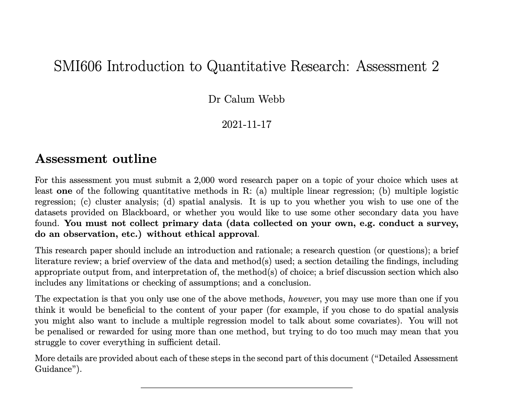

class: middle, title
background-size: contain


<br><br>

# SMI606: Assessment 2
#### Guidance & Walkthrough

<br><br>

**Dr. Calum Webb**<br>
Sheffield Methods Institute, the University of Sheffield<br>
[c.j.webb@sheffield.ac.uk](mailto:c.j.webb@sheffield.ac.uk)

```{r setup, include=FALSE}
options(htmltools.dir.version = FALSE)

# These packages are required for creating the slides
# Many will need to be installed from Github
library(icons)
library(tidyverse)
library(xaringan)
library(xaringanExtra)
library(xaringanthemer)

# Defaults for code
knitr::opts_chunk$set(
  fig.width=9, fig.height=3.5, fig.retina=3,
  out.width = "100%",
  cache = FALSE,
  echo = TRUE,
  message = FALSE, 
  warning = FALSE,
  fig.show = TRUE,
  hiline = TRUE
)

# set global theme for ggplot to make background #F8F8F8F8 (off white),
# but otherwise keep all ggplot themes default (better for teaching)
theme_set(
  theme(plot.background = element_rect(fill = "#F8F8F8", colour = "#F8F8F8"), 
        panel.background = element_rect(fill = "#F8F8F8", colour = "#F8F8F8"),
        legend.background = element_rect(fill = "#F8F8F8", colour = "#F8F8F8")
        )
  )

```

```{r xaringan-tile-view, echo=FALSE}
# Use tile overview by hitting the o key when presenting
xaringanExtra::use_tile_view()
```

```{r xaringan-logo, echo=FALSE}
# Add logo to top right
xaringanExtra::use_logo(
  image_url = "header/smi-logo-white.png",
  exclude_class = c("inverse", "hide_logo"), 
  width = "180px", position = css_position(top = "1em", right = "2em")
)
```

```{r xaringan-themer, include=FALSE, warning=FALSE}

# Set some global objects containing the colours
# of the university's branding
primary_color <- "#131E29"
secondary_color <- "#440099"
tuos_blue <- "#9ADBE8"
white = "#F8F8F8"
tuos_yellow <- "#FCF281"
tuos_purple <- "#440099"
tuos_red <- "#E7004C"
tuos_midnight <- "#131E29"

# The bulk of the styling is handled by xaringanthemer
style_duo_accent(
  primary_color = "#131E29",
  secondary_color = "#440099",
  colors = c(tuos_purple = "#440099", 
             grey = "#131E2960", 
             tuos_blue ="#9ADBE8",
             tuos_mint = "#00CE7C"),
  header_font_google = xaringanthemer::google_font("Source Serif Pro", "600", "600i"),
  text_font_google   = xaringanthemer::google_font("Source Sans Pro", "300", "300i", "600", "600i"),
  code_font_google   = xaringanthemer::google_font("Lucida Console"),
  header_h1_font_size = "2rem",
  header_h2_font_size = "1.5rem", 
  header_h3_font_size = "1.25rem", 
  text_font_size = "0.9rem",
  code_font_size = "0.65rem", 
  code_inline_font_size = "0.85rem",
  inverse_text_color = "#9ADBE8", 
  background_color = "#F8F8F8", 
  text_color = "#131E29", 
  link_color = "#005A8F", 
  inverse_link_color = "#F8F8F8",
  text_slide_number_color = "#44009970",
  table_row_even_background_color = "transparent", 
  table_border_color = "#44009970",
  text_bold_font_weight = 600
)

```


```{r xaringan-panelset, echo=FALSE}
# Allow for adding panelsets (see example on slide 2)
xaringanExtra::use_panelset()
```

```{r xaringanExtra, echo = FALSE}
# Adds white progress bar to top
xaringanExtra::use_progress_bar(color = "#F8F8F8", location = "top")
```

```{r xaringan-extra-styles, echo = FALSE}
# Allow for code to be highlighted on hover
xaringanExtra::use_extra_styles(
  hover_code_line = TRUE,         #<<
  mute_unhighlighted_code = TRUE  #<<
)
```

```{r share-again, echo=FALSE}
# Add sharing links and other embedding tools
xaringanExtra::use_share_again()
```

```{r xaringanExtra-search, echo=FALSE}
# Add magnifying glass search function to bottom left for quick
# searching of slides
xaringanExtra::use_search(show_icon = TRUE, auto_search = FALSE)
```

---

# Assessment Guidance

.pull-left[

[Link to the assessment guidance](https://www.calumwebb.co.uk/teaching/SMI606-content/assessment-2-guidance/assessment-2-details.pdf).

* Structure/Tone/Code

* Introduction, rationale, & research question

* Literature review

* Description of data

* Description of method(s)

* Findings

* Discussion 

* Conclusions

]

.pull-right[

.center[

2,000 Word **Limit** (No ±10%!)

Code, bibliography, code comments do not count.

70% of final mark.

```{r, echo = FALSE, out.width = "70%"}



```
]

]


---

# Assessment Guidance

.pull-left[

[Link to the assessment guidance](https://www.calumwebb.co.uk/teaching/SMI606-content/assessment-2-guidance/assessment-2-details.pdf).

* **Structure/Tone/Code**

* Introduction, rationale, & research question

* Literature review

* Description of data

* Description of method(s)

* Findings

* Discussion 

* Conclusions

]

.pull-right[

.center[

2,000 Word **Limit** (No ±10%!)

Code, bibliography, code comments do not count.

70% of final mark.

```{r, echo = FALSE, out.width = "70%"}


```
]

]


---

### Structure/Tone/Code

.pull-left[

**Struture**

The report should follow the general structure of short form research articles found in some social science disciplines (e.g. common in social epidemiology). See the examples on Blackboard:

* Webb, et al. (2021) - [3,000 word article published in the Journal of Epidemiology and Community Health](https://vle.shef.ac.uk/bbcswebdav/xid-43961407_1)
* Bennett, et al. (2022) - [~3,000 word article published in Lancet Public Health](https://vle.shef.ac.uk/bbcswebdav/xid-46448240_1)

Use the assessment guidance, the example articles, and your best judgement. 


]

---

### Structure/Tone/Code

.pull-left[

**Struture**

The report should follow the general structure of short form research articles found in some social science disciplines (e.g. common in social epidemiology). See the examples on Blackboard:

* Webb, et al. (2021) - [3,000 word article published in the Journal of Epidemiology and Community Health](https://vle.shef.ac.uk/bbcswebdav/xid-43961407_1)
* Bennett, et al. (2022) - [~3,000 word article published in Lancet Public Health](https://vle.shef.ac.uk/bbcswebdav/xid-46448240_1)

Use the assessment guidance, the example articles, and your best judgement. 

**Tone**

The report should be written as a professional piece of academic writing: write in full paragraphs, avoid informal language.

]

.pull-right[

Your aim is to showcase and defend your original quantitative research to **other people interested in the topic**, not to explain how the methods work or to showcase the method itself.

]


---

### Structure/Tone/Code

.pull-left[

**Struture**

The report should follow the general structure of short form research articles found in some social science disciplines (e.g. common in social epidemiology). See the examples on Blackboard:

* Webb, et al. (2021) - [3,000 word article published in the Journal of Epidemiology and Community Health](https://vle.shef.ac.uk/bbcswebdav/xid-43961407_1)
* Bennett, et al. (2022) - [~3,000 word article published in Lancet Public Health](https://vle.shef.ac.uk/bbcswebdav/xid-46448240_1)

Use the assessment guidance, the example articles, and your best judgement. 

**Tone**

The report should be written as a professional piece of academic writing: write in full paragraphs, avoid informal language.

]

.pull-right[

Your aim is to showcase and defend your original quantitative research to **other people interested in the topic**, not to explain how the methods work or to showcase the method itself.


**Code**

It does not matter if your code is messy, inefficient, hard to read, poorly commented/not commented at all, uses functions or packages outside of what I have taught you, etc. **as long as it works and you interpret the output correctly**.

It is good to have clear, efficient, easy to read, well-explained code but this is **not** a learning outcome for the module.


]


---

# Assessment Guidance

.pull-left[

[Link to the assessment guidance](https://www.calumwebb.co.uk/teaching/SMI606-content/assessment-2-guidance/assessment-2-details.pdf).

* Structure/Tone/Code

* **Introduction, rationale, & research question**

* Literature review

* Description of data

* Description of method(s)

* Findings

* Discussion 

* Conclusions

]

.pull-right[

.center[

2,000 Word **Limit** (No ±10%!)

Code, bibliography, code comments do not count.

70% of final mark.

```{r, echo = FALSE, out.width = "70%"}


```
]

]


---

### Introduction, rationale, research question

.pull-left[

**Precursor: Find a dataset where you can answer a question you're interested in and identify the kind of method you'll need to use to answer it**

Picking a dataset

* Look in the [description of datasets file](https://vle.shef.ac.uk/bbcswebdav/xid-43961409_1) found on the assessments page *or* find some data you are interested in. There are many to choose from this time around, and you can also pick your own from places like the [UK Data Service](https://ukdataservice.ac.uk/), the [TidyTuesday archive](https://github.com/rfordatascience/tidytuesday), the [DataIsPlural archive](https://www.data-is-plural.com/archive/), or others. Link to description of datasets. **Give yourself plenty of time to find some data and a question you're interested in**

* Try and pick something you are interested in (the assessment will be less painful that way)

]


--

.pull-right[

Coming up with a research question...

* Are you interested in whether some variables are able to predict a certain outcome, or inequalities in a certain outcome (e.g. what might contribute to some people go to university or not; whether there is unequal access to good-quality housing; whether people with caring responsibilities are more likely to have more prosocial tendencies at Age 17)?

* Are you interested in whether there is evidence of stratification of people into distinctive groups and are there any external predictors of these groups (e.g. do people have specific tastes in humour that can be grouped and are younger people less likely to appreciate humour at the expense of others? Are there archetypes of stereotypical gender expression and are younger people more likely to be assigned to groups with more mixed masculine and feminine gender expression stereotypes)?


]


---

### Introduction, rationale, research question

.pull-left[

**Precursor: Find a dataset where you can answer a question you're interested in and identify the kind of method you'll need to use to answer it**

Picking a dataset

* Look in the [description of datasets file](https://vle.shef.ac.uk/bbcswebdav/xid-43961409_1) found on the assessments page *or* find some data you are interested in. There are many to choose from this time around, and you can also pick your own from places like the [UK Data Service](https://ukdataservice.ac.uk/), the [TidyTuesday archive](https://github.com/rfordatascience/tidytuesday), the [DataIsPlural archive](https://www.data-is-plural.com/archive/), or others. Link to description of datasets. **Give yourself plenty of time to find some data and a question you're interested in**

* Try and pick something you are interested in (the assessment will be less painful that way)

]


.pull-right[

Coming up with a research question...

* Are you interested in how something might be geographically unequal across space (e.g. does deprivation compound across geography, in other words, are people at greater risk of multiple forms of deprivation depending on where they live? Is employment deprivation more spatially concentrated in Northern cities than in Southern cities? Are the effects of climate change more likely to be concentrated in the Global South? How does social identity shape segregation between neighbourhoods, and does contemporary segregation reflect historic structural segregation?)? 


**Each of these kinds of questions implies different methods (from weeks 8-11), or combinations of methods, to answer.**


]


---

### Introduction, rationale, research question

.pull-left[

**Rationale**

*Identifying the novelty of your research question.* 

* **What are you doing that hasn't been done before?**
  * Good reasons: "new" data, more "up-to-date" research, "lack of research on this topic", "not researched in England before". Sometimes legitimate but not very compelling.
  * Better reasons: novel application of a method or novel inclusion of a variable (have previous studies only used bivariate regression not multiple? Have previous studies not included some other predictors that might confound results? Have previous studies lacked a spatial dimension? Have attempts at cluster analysis not been done before?); novel unit of analysis (have other studies only considered neighbourhoods, not individuals, or vice versa?); pressing contemporary policy matter, or matter of social importance (inequality, justice, climate crisis, innovation, inclusion of marginalised group)

]

--

.pull-right[

#### OK:

`r icons::feather_icons("minus-circle")` "The aim of this research was to establish whether there were specific clusters of trends in child welfare intervention rates between 2010-2021. Research has previously reported that deprivation was associated with trends in intervention and spending (Webb & Bywaters, 2018; Bennett, et al. 2021), so cluster analysis may lead to interesting results. Further, prior research was limited to data between 2011 and 2019, and this research will update the dataset to include 2020 and 2021."

****

* Establishes why it may be academically interesting and how it is an extension of other research, but doesn't really appeal to why the research is important or the logic behind the method.


]


---

### Introduction, rationale, research question

.pull-left[

**Rationale**

*Identifying the novelty of your research question.* 

* **What are you doing that hasn't been done before?**
  * Good reasons: "new" data, more "up-to-date" research, "lack of research on this topic", "not researched in England before". Sometimes legitimate but not very compelling.
  * Better reasons: novel application of a method or novel inclusion of a variable (have previous studies only used bivariate regression not multiple? Have previous studies not included some other predictors that might confound results? Have previous studies lacked a spatial dimension? Have attempts at cluster analysis not been done before?); novel unit of analysis (have other studies only considered neighbourhoods, not individuals, or vice versa?); pressing contemporary policy matter, or matter of social importance (inequality, justice, climate crisis, innovation, inclusion of marginalised group)

]

.pull-right[

#### Better:

`r icons::feather_icons("check-circle")` "The aim of this research was to establish whether there were specific clusters of trends in child welfare intervention rates between 2010-2021. While other research has established that trends in interventions (Bennett, et al. 2021) and spending (Webb & Bywaters, 2018) have been uneven depending on the the deprivation tertile of local authorities, no research has assessed whether trends in spending and interventions cluster into well-defined groups that may illustrate more complex inequalities that result from combinations of trends. Establishing informative clusters may enable policies to be developed that can start to identify and reverse increasing inequalities in intervention, and this will be aided by an exploration of what demographic and socioeconomic variables are associated with cluster membership."

****


]


---

### Introduction, rationale, research question

**Research Question**

.pull-left[

* **Multiple Linear Regression** [(Week 8)](https://calumwebb.co.uk/teaching/SMI606-content/week-8/slides/#1)
  * Multiple independent variables (dependent ~ independent) a.k.a. multiple predictors of the value of something you're interested in. Can be any type (continuous, ordinal, categorical)
  * Continuous dependent variable (outcome variable)
  * Key benefits: 
      * Adjust for the effect of potential confounding or mediating variables (see [Week 5](https://calumwebb.co.uk/teaching/SMI606-content/week-5/slides/#1)), e.g. the effect of gender on pay after adjusting for industry, public/private sector, education, age, family structure, etc. 
      * Compare the relative strength of each predictor, e.g. does having a postgraduate degree increase pay as much as only having an undergraduate degree.


]

.pull-right[

* **Multiple Logistic Regression** [(Week 9)](https://calumwebb.co.uk/teaching/SMI606-content/week-9/slides/#1)
  * Multiple independent variables (dependent ~ independent) a.k.a. multiple predictors of the value of something you're interested in. Can be any type (continuous, ordinal, categorical)
  * Binary categorical/ordinal dependent variable (outcome variable)
  * Key benefits: 
      * Adjust for the effect of potential confounding or mediating variables (see [Week 5](https://calumwebb.co.uk/teaching/SMI606-content/week-5/slides/#1)), e.g. are people from poorer backgrounds less likely to be accepted to elite universities after adjusting for A-level results, GCSE-results, and entry exam score? 
      * Compare the relative strength of each predictor, e.g. is housing affordability or distance from family home a stronger predictor of a young person not taking up a university offer?


]


---

### Introduction, rationale, research question

**Research Question**

.pull-left[

* **Cluster Analysis** [(Week 10)](https://calumwebb.co.uk/teaching/SMI606-content/week-10/slides/#1)
  * Multiple variables, neither independent or dependent, just features that define groups.
      * Variables should be all continuous with similar variance (for *k-means*) or a mixture of continuous, ordinal, and binary categorical (for *HCA*)
      * Usually more interesting if cluster assignment and cluster description is followed by some futher analysis like regression, but not required.
  * Key benefits: 
      * Aims to identify unobserved class membership based variable responses for when research questions are about hypotheses of underlying group-membership/behaviour.
      * Useful for studies about market segmentation, disrupting binary or limited classifications.


]

.pull-right[

* **Spatial Analysis** [(Week 11)](https://calumwebb.co.uk/teaching/SMI606-content/week-11/slides/#1)
  * Variables linked to spatial data; no independent or dependent variables but it will be common to compare more than one variable over space ('space' can be thought of as the independent variable), or the same variable in two different areas (cities, regions).
      * Variable distributed over space can be continuous, ordinal, or binary categorical (though most common in aggregate data is continuous)
      * Spatial weight matrix can be distance based (as learned in class and practical) or neighbours (contiguity/adjacency/shared borders) based (see [this guide](https://cran.r-project.org/web/packages/spNetwork/vignettes/SpatialWeightMatrices.html)).
      * If challenging yourself with a [spatial lag model](https://calumwebb.co.uk/teaching/SMI606-content/assessment-2-guidance/spaMMintro.pdf) distance based matrices follow a Matérn function, neighbour matrices follow an adjacency function.


]


---

### Introduction, rationale, research question

**Research Question**

.pull-left[

* **Cluster Analysis** [(Week 10)](https://calumwebb.co.uk/teaching/SMI606-content/week-10/slides/#1)
  * Multiple variables, neither independent or dependent, just features that define groups.
      * Variables should be all continuous with similar variance (for *k-means*) or a mixture of continuous, ordinal, and binary categorical (for *HCA*)
      * Usually more interesting if cluster assignment and cluster description is followed by some futher analysis like regression, but not required.
  * Key benefits: 
      * Example research questions: How many clusters of combined masculine and feminine gender expression stereotypes do people tend to fall into and does cluster membership differ significantly by age group? 

]

.pull-right[

* **Spatial Analysis** [(Week 11)](https://calumwebb.co.uk/teaching/SMI606-content/week-11/slides/#1)
  * Variables linked to spatial data; no independent or dependent variables but it will be common to compare more than one variable over space ('space' can be thought of as the independent variable), or the same variable in two different areas (cities, regions).
      * Variable distributed over space can be continuous, ordinal, or binary categorical (though most common in aggregate data is continuous)
 * Key benefits:
      * Measures autocorrelation over space, which can lead to interesting new findings about how a variable is spatially distributed which can relate to spatial concentration of inequality, or service provision, or indicators of segregation (e.g. are cities in England more ethnically segregated in the South compared to the North)


]


---

class: middle


**Your research question does not have to be your magnum opus: you are applying skills you have just learned. Be fair to yourself and don't set too high expectations.**

"[Your model will] inevitably [be] not exactly what you wanted to end up with … but hopefully resembles the goal enough to be of use"

.right[*Richard McElreath*]


---

# Assessment Guidance

.pull-left[

[Link to the assessment guidance](https://www.calumwebb.co.uk/teaching/SMI606-content/assessment-2-guidance/assessment-2-details.pdf).

* Structure/Tone/Code

* Introduction, rationale, & research question

* **Literature review**

* Description of data

* Description of method(s)

* Findings

* Discussion 

* Conclusions

]

.pull-right[

.center[

2,000 Word **Limit** (No ±10%!)

Code, bibliography, code comments do not count.

70% of final mark.

```{r, echo = FALSE, out.width = "70%"}


```
]

]


---

### Literature review

**Top tips**

.pull-left[

* **Group literature by theme, not by author.**


]

.pull-right[

#### OK:

`r icons::feather_icons("minus-circle")` "Townsend (1979) argued that poverty could be defined as a lack of the ability to participate to minimally expected normative levels in society through a deprivation of resources. Lister (2004) argue that poverty is multidimensional and contains a socio-relational core. Spicker (2009) expands the multidimensional definition of poverty to include material conditions, economic circumstances, and social position, all of which can lead to 'unacceptable hardship'. More recently, studies have focused on 'types' of poverty, for example: Garthwaite (2016) has highlighted the rise of food poverty in the UK and Simcock, et al. (2016) have highlighted the rise of fuel poverty."

]

---

### Literature review

**Top tips**

.pull-left[

* **Group literature by theme, not by author.**


]

.pull-right[

#### Better:

`r icons::feather_icons("check-circle")` "While the concept of poverty is frequently used in academic research, its definition remains contentious. Challenging views of poverty that viewed it as strictly subsistence-based, Townsend (1979) defined poverty as a lack of the ability to participate to minimally expected normative levels in society through a deprivation of resources. This concept of normative participation naturally led to an acknowledgement that poverty was multidimensional; it includes the deprivation of access to participate in social and relational parts of life that can not be easily costed like access to activities, products, or services can (Lister, 2004; Spicker, 2009). However, subsequent to austerity policies in the UK there has been a reversion to discussions of poverty as a lack of resources required for subsistence, including the normalisation of concepts such as food poverty (Garthwaite, 2016) and fuel poverty (Simcock, et al. 2016)."

]

---

### Literature review

**Top tips**

.pull-left[

* Group literature by theme, not by author.

* **Have an argument or a story, don't just give a play-by-play.**


]

.pull-right[

#### Better:

`r icons::feather_icons("check-circle")` "While the concept of poverty is frequently used in academic research, its definition remains contentious. Challenging views of poverty that viewed it as strictly subsistence-based, Townsend (1979) defined poverty as a lack of the ability to participate to minimally expected normative levels in society through a deprivation of resources. This concept of normative participation naturally led to an acknowledgement that poverty was multidimensional; it includes the deprivation of access to participate in social and relational parts of life that can not be easily costed like access to activities, products, or services can (Lister, 2004; Spicker, 2009). However, subsequent to austerity policies in the UK there has been a reversion to discussions of poverty as a lack of resources required for subsistence, including the normalisation of concepts such as food poverty (Garthwaite, 2016) and fuel poverty (Simcock, et al. 2016)."

]


---

### Literature review

**Top tips**

.pull-left[

* Group literature by theme, not by author.

* Have an argument or a story, don't just give a play-by-play.

* **Make your literature review specifically related to your research question and illustrative of its contribution**, not a general overview/"introduction to..."


]

.pull-right[

**RQ**: How are different forms of media consumption associated with climate change scepticism?

* How well has previous literature differentiated between different forms of media consumption (newspapers, television, social media)? 

* How have climate change skepticism variables been defined in the literature and has research largely just considered one homogenous 'type' of skepticism before?

* Are there specific groups that have been excluded from previous research studies, or specific variables that may confound or interact with other variables that previous research hasn't considered?


]


---

### Literature review

**Top tips**

.pull-left[

* Group literature by theme, not by author.

* Have an argument or a story, don't just give a play-by-play.

* Make your literature review specifically related to your research question and illustrative of its contribution, not a general overview/"introduction to..."

* "How many references should I include?": **There is no set number**. You should include as many references as you have claims that require evidence.


]

.pull-right[

Needs a reference:

* There has been an increased focus on the importance of national energy independence in light of the Russian invasion of Ukraine. *Where is the focus? Who is focusing on what? States? NGOs? Everyday people? Academics?*

Doesn't need a reference:

* The Russian invasion of Ukraine has highlighted the importance of national energy independence. *This statement is okay because it's not passively implying an action or reaction of some implicit or explicit actor. It would benefit from a referenced example afterwards that illustrates how the invasion has highlighted the importance of the issue.*

]

---

### Literature review

**Top tips**

.pull-left[

* Group literature by theme, not by author.

* Have an argument or a story, don't just give a play-by-play.

* Make your literature review specifically related to your research question and illustrative of its contribution, not a general overview/"introduction to..."

* "How many references should I include?": **There is no set number**. You should include as many references as you have claims that require evidence.


]

.pull-right[

Needs a reference:

`r icons::feather_icons("x-circle")` Growing rates of depression among teenagers and young adults is an international concern. *Who says it's growing? Who is concerned? Who gets to say that they're speaking for the international community?*

Better:

`r icons::feather_icons("check-circle")` Growing rates of depression among teenagers and young adults have been observed in several OECD countries (Mojtabai, et al. 2016; Twenge, et al. 2019; Collishaw, et al. 2010; Kelly, et al. 2018; Bachmann, et al. 2016) and are an international concern (WHO Comphrehensive Mental Health Action Plan 2013-2030, WHO, 2021). 


]


---

### Literature review

**Top tips**

.pull-left[

* Group literature by theme, not by author.

* Have an argument or a story, don't just give a play-by-play.

* Make your literature review specifically related to your research question and illustrative of its contribution, not a general overview/"introduction to..."

* "How many references should I include?": There is no set number. You should include as many references as you have claims that require evidence.

* Your literature review should set the **scaffolding for your discussion**. What does your research add to what you reviewed?


]

.pull-right[

* For **linear/logistic regression**: does your analysis explore associations with a previously under-research group? Does it include a variable that wasn't previously included (either as a control or as the key thing of interest?)

* For **cluster analysis**: do your clusters add nuance to a concept or theory about underlying group memberships that we might have?

* For **spatial analysis**: does incorporating space tell us something new about a social problem or inequality between two areas that we hadn't previously explored?

Resources and support for literature reviewing is available from the [library](https://www.sheffield.ac.uk/library/study/research-skills/discovering) and the [301 Skills Centre](https://www.sheffield.ac.uk/academic-skills/study-skills-online/literature-reviews).


]

---

# Assessment Guidance

.pull-left[

[Link to the assessment guidance](https://www.calumwebb.co.uk/teaching/SMI606-content/assessment-2-guidance/assessment-2-details.pdf).

* Structure/Tone/Code

* Introduction, rationale, & research question

* Literature review

* **Description of data**

* Description of method(s)

* Findings

* Discussion 

* Conclusions

]

.pull-right[

.center[

2,000 Word **Limit** (No ±10%!)

Code, bibliography, code comments do not count.

70% of final mark.

```{r, echo = FALSE, out.width = "70%"}


```
]

]


---

### Description of data

.pull-left[

Similar to assessment 1, you need to describe **where your data** (or the specific variables you are using from the dataset) **come from**, and **whether the data are a sample from which you can generalise** — as well as what population you can generalise to — or whether the data are an entire population.


]

.pull-right[

**Checklist**

`r icons::feather_icons("circle")` Where does your data come from, or, if the data is a compilation of variables like the small area data, where does each variable come from? 
  * If using provided data look in: the [description of datasets files](https://vle.shef.ac.uk/bbcswebdav/xid-43961409_1), in the codebook file included with each dataset, and on the web pages for any surveys (e.g. [Wellcome Trust Monitor 3](https://beta.ukdataservice.ac.uk/datacatalogue/studies/study?id=7927))
  * *This can require some googling of the variable/survey names in the codebook.* 
  
`r icons::feather_icons("circle")` Is the data a sample or population? If a sample, can it be generalised?
  * Look in: [description of datasets files](https://vle.shef.ac.uk/bbcswebdav/xid-43961409_1), and on survey/data webpages (especially the "Coverage and Methodology" section if on the UK Data Service)

]


---

# Assessment Guidance

.pull-left[

[Link to the assessment guidance](https://www.calumwebb.co.uk/teaching/SMI606-content/assessment-2-guidance/assessment-2-details.pdf).

* Structure/Tone/Code

* Introduction, rationale, & research question

* Literature review

* Description of data

* **Description of method(s)**

* Findings

* Discussion 

* Conclusions

]

.pull-right[

.center[

2,000 Word **Limit** (No ±10%!)

Code, bibliography, code comments do not count.

70% of final mark.

```{r, echo = FALSE, out.width = "70%"}


```
]

]

---

### Description of method(s)

.center[**Keep it short and sweet: say what you did, don't try and teach the reader how the method works.**]

--

.pull-left[

**Multiple linear/logistic regression** ([Week 8](https://calumwebb.co.uk/teaching/SMI606-content/week-8/slides/#1) / [Week 9](https://calumwebb.co.uk/teaching/SMI606-content/week-9/slides/#1))

`r icons::feather_icons("circle")` What was your dependent variable and what were your independent variables?

`r icons::feather_icons("circle")` Why did you select the independent variables you selected (which were of substantive interest and which were just because of their potential confounding effects?)

`r icons::feather_icons("circle")` Did you transform/recode your variables in any way? (Recoding: [Week 8 Slides 37-48](https://calumwebb.co.uk/teaching/SMI606-content/week-8/slides/?panelset1=what-will-i-learn%253F2#37), Transforming: [Week 8 Slides 50-58](https://calumwebb.co.uk/teaching/SMI606-content/week-8/slides/?panelset1=what-will-i-learn%253F2#50))

`r icons::feather_icons("circle")` How did you assess model fit ([R-square](https://calumwebb.co.uk/teaching/SMI606-content/week-7/slides/?panelset1=what-will-i-learn%253F2#57)/[Accuracy](https://calumwebb.co.uk/teaching/SMI606-content/week-9/slides/?panelset1=what-will-i-learn%253F2#60)/[k-fold validation](https://calumwebb.co.uk/teaching/SMI606-content/week-9/slides/?panelset1=what-will-i-learn%253F2#73))?

`r icons::feather_icons("circle")` How did you check for any violations of assumptions ([linearity, homoscedasticity, outliers/leverage points, normality of residuals](https://calumwebb.co.uk/teaching/SMI606-content/week-8/slides/?panelset1=what-will-i-learn%253F2#60), [multicollinearity](https://calumwebb.co.uk/teaching/SMI606-content/week-8/slides/?panelset1=what-will-i-learn%253F2#77), [autocorrelation](https://calumwebb.co.uk/teaching/SMI606-content/week-9/slides/?panelset1=what-will-i-learn%253F2#89))?


]

.pull-right[

<br>

`r icons::feather_icons("circle")` If a generalisable sample, what critical value did you use for interpreting the significance of the results? ([Week 4](https://calumwebb.co.uk/teaching/SMI606-content/week-4/slides/#1))

`r icons::feather_icons("circle")` (Logistic regression) How did you communicate the results (e.g. did you transform coefficients into [odds ratios](https://calumwebb.co.uk/teaching/SMI606-content/week-9/slides/?panelset1=what-will-i-learn%253F2#48) using `exp()`? Did you use [prediction/marginal effects plots](https://calumwebb.co.uk/teaching/SMI606-content/week-9/slides/?panelset1=what-will-i-learn%253F2#55)?)

]

---

### Description of method(s)

.center[**Keep it short and sweet: say what you did, don't try and teach the reader how the method works.**]

.pull-left[

**Cluster Analysis** ([Week 10](https://calumwebb.co.uk/teaching/SMI606-content/week-10/slides/#1))

`r icons::feather_icons("circle")` Which variables (features) did you include? ([Week 10: Slides 24-25](https://calumwebb.co.uk/teaching/SMI606-content/week-10/slides/?panelset1=what-will-i-learn%253F2#24))

`r icons::feather_icons("circle")` Did you transform/recode your variables in any way? (Recoding: [Week 8 Slides 36-49](https://calumwebb.co.uk/teaching/SMI606-content/week-8/slides/?panelset1=what-will-i-learn%253F2#37), Transforming: [Week 8 Slides 50-57](https://calumwebb.co.uk/teaching/SMI606-content/week-8/slides/?panelset1=what-will-i-learn%253F2#48))

`r icons::feather_icons("circle")` Did you use *k-means* or *Hierarchical Cluster Analysis*?

`r icons::feather_icons("circle")` How did you decide on a number of clusters? (*k-means*: [Silhouette plot/Gap statistic](https://calumwebb.co.uk/teaching/SMI606-content/week-10/slides/?panelset1=what-will-i-learn%253F2#25), *HCA*: [dendrogram](https://calumwebb.co.uk/teaching/SMI606-content/week-10/slides/?panelset1=what-will-i-learn%253F2#62))

`r icons::feather_icons("circle")` What kind of [distance/dissimilarity matrix](https://calumwebb.co.uk/teaching/SMI606-content/week-10/slides/?panelset1=what-will-i-learn%253F2#55) did you use and why?

`r icons::feather_icons("circle")` (HCA) Which [linkage algorithm(s)](https://calumwebb.co.uk/teaching/SMI606-content/week-10/slides/?panelset1=what-will-i-learn%253F2#58) did you use and why?

]

.pull-right[

<br>

`r icons::feather_icons("circle")` (k-means) How did you check how [well defined your clusters were](https://calumwebb.co.uk/teaching/SMI606-content/week-10/slides/?panelset1=what-will-i-learn%253F2#32)?

`r icons::feather_icons("circle")` What descriptive statistics and/or visualisations did you use to describe your clusters? ([Week 2](https://calumwebb.co.uk/teaching/SMI606-content/week-2/slides/#1) and [Week 3](https://calumwebb.co.uk/teaching/SMI606-content/week-3/slides/#1))

`r icons::feather_icons("circle")` Did you do any kind of follow up analysis on cluster membership (e.g. logistic regression) and what independent variables did you use in this?

]


---

### Description of method(s)

.center[**Keep it short and sweet: say what you did, don't try and teach the reader how the method works.**]

.pull-left[

**Spatial Analysis** ([Week 11](https://calumwebb.co.uk/teaching/SMI606-content/week-11/slides/#1))

`r icons::feather_icons("circle")` At what level is your spatial data (e.g. LSOAs, MSOAs, Local Authority Districts, US Census Tracts, US Counties, US States, EU member states)?

`r icons::feather_icons("circle")` Where did you focus your spatial analysis (a particular region? A particular set or pair of cities to compare?)

`r icons::feather_icons("circle")` Which variables did you visualise spatially and did you transform/recode your variable(s) in any way?

`r icons::feather_icons("circle")` What kind of [distance matrix](https://calumwebb.co.uk/teaching/SMI606-content/week-11/slides/?panelset1=what-will-i-learn%253F2#55) did you use (Euclidean distance or a neighbouring/shared borders matrix)?

`r icons::feather_icons("circle")` How did you visualise your results ([Choropleth?](https://calumwebb.co.uk/teaching/SMI606-content/week-11/slides/?panelset1=what-will-i-learn%253F2#34)[Cartogram?](https://calumwebb.co.uk/teaching/SMI606-content/week-11/slides/?panelset1=what-will-i-learn%253F2#43))?


]

.pull-right[

<br>

`r icons::feather_icons("circle")` How did you [assess spatial autocorrelation](https://calumwebb.co.uk/teaching/SMI606-content/week-11/slides/?panelset1=what-will-i-learn%253F2#54)?

`r icons::feather_icons("circle")` Did you do any complementary analysis and if so, what (e.g. if looking at the relationship between two variables and their spatial autocorrelation, did you do a bivariate linear regression as well? Did you attempt a [spatial lag model](https://calumwebb.co.uk/teaching/SMI606-content/week-11/slides/?panelset1=what-will-i-learn%253F2#64)?)

]

---

# Assessment Guidance

.pull-left[

[Link to the assessment guidance](https://www.calumwebb.co.uk/teaching/SMI606-content/assessment-2-guidance/assessment-2-details.pdf).

* Structure/Tone/Code

* Introduction, rationale, & research question

* Literature review

* Description of data

* Description of method(s)

* **Findings**

* Discussion 

* Conclusions

]

.pull-right[

.center[

2,000 Word **Limit** (No ±10%!)

Code, bibliography, code comments do not count.

70% of final mark.

```{r, echo = FALSE, out.width = "70%"}


```
]

]


---

class: middle

### Findings

**Some people like to combine their findings and discussion, e.g.** This is fine.

"There was a significant association between age and the likelihood of voting to leave the European Union in the 2016 Brexit Referendum (p<0.05), after adjusting for participants' home region, education levels, and past levels of political engagement. Each additional 10 years of age were associated with a 20% increase in the odds of voting to leave the EU. This finding corresponds with those of Becker, et al. (2017) who reported that support for Leave increased to 70% among voters aged 65 or over, compared to 27% for 18-24 year olds. The probability plot (Figure X) suggests that the strength of this association with was similar in this study even after controlling for region and education levels. This might suggest generational differences in attitudes towards the EU, or differences in the messaging and strategies of the leave and remain campaigns themselves, are a better explanation of support for leaving the EU among older people than the general political ennui of younger people or the lower (average) educational capital of older people required to interrogate the claims made by campaigns."

---

class: middle

### Findings

**Some people like to keep their findings and discussion seperate, e.g.** This is also fine.

"There was a significant association between age and the likelihood of voting to leave the European Union in the 2016 Brexit Referendum (p<0.05), after adjusting for participants' home region, education levels, and past levels of political engagement. Each additional 10 years of age were associated with a 20% increase in the odds of voting to leave the EU. The predicted probability plot (Figure X) suggests that support for leaving the EU was, on average, around 20-30% for people aged between 20 and 30 years old at the time of the survey but increases to between 50 to 70% for people aged between 60 and 70, holding education, region, and past levels of political engagement at average levels."

... *Later in the discussion section* ...

"In reviewing the literature, age was often reported as a significant predictor of support for leaving the EU but rarely considered the unequal levels of education and political participation between younger and older people. One of the aims of this study was to explore whether this increased support for Leave among older voters was consistent even after adjusting for differences associated with education and political participation. The regression model suggested that the strength of association between age and voting to leave the EU only diminished slightly after conditioning on education, region, and past political engagement, with estimated probabilities being similar to previously reported levels (Becker, et al. 2017). This might suggest generational differences in attitudes towards the EU, or differences in the messaging and strategies of the leave and remain campaigns themselves, are a better explanation of support for leaving the EU among older people than the general political ennui of younger people or the lower (average) educational capital of older people required to interrogate the claims made by campaigns."


---

### Findings

.center[**What should be included?**]

.pull-left[

**Multiple Linear Regression** ([Week 8](https://calumwebb.co.uk/teaching/SMI606-content/week-8/slides/))

`r icons::feather_icons("circle")` Regression coefficients and interpretation ([Week 7: Slides 57-58](https://calumwebb.co.uk/teaching/SMI606-content/week-7/slides/?panelset1=what-will-i-learn%253F2#57))
  * Remember to use the correct scale units when interpreting coefficients! 

`r icons::feather_icons("circle")` Model fit ([Week 7: Slides 57-58](https://calumwebb.co.uk/teaching/SMI606-content/week-7/slides/?panelset1=what-will-i-learn%253F2#57))

`r icons::feather_icons("circle")` Null hypothesis significance tests and interpretation, if appropriate (p-values) ([Week 7: Slides 57-58](https://calumwebb.co.uk/teaching/SMI606-content/week-7/slides/?panelset1=what-will-i-learn%253F2#57))

`r icons::feather_icons("circle")` (Optional but can be helpful) Marginal effects/predicted values plot ([Week 8: Slides 18-20](https://calumwebb.co.uk/teaching/SMI606-content/week-8/slides/?panelset1=what-will-i-learn%253F2#18))


]

.pull-right[

<br>

`r icons::feather_icons("circle")` Assumptions (some people like to put these in the discussion section, or in a 'limitations and model checking' section after their discussion but before their conclusions. Either way is fine with me!)
  * Linearity ([Week 8: Slides 61-62](https://calumwebb.co.uk/teaching/SMI606-content/week-8/slides/?panelset1=what-will-i-learn%253F2#61))
  * Homoscedasticity ([Week 8: Slides 63-64](https://calumwebb.co.uk/teaching/SMI606-content/week-8/slides/?panelset1=what-will-i-learn%253F2#63))
  * No outliers or leverage points ([Week 8: Slides 65-68](https://calumwebb.co.uk/teaching/SMI606-content/week-8/slides/?panelset1=what-will-i-learn%253F2#65))
  * Normality of residuals ([Week 8: Slides 69-70](https://calumwebb.co.uk/teaching/SMI606-content/week-8/slides/?panelset1=what-will-i-learn%253F2#69))
  * No multicollinearity ([Week 8: Slides 69-75](https://calumwebb.co.uk/teaching/SMI606-content/week-8/slides/?panelset1=what-will-i-learn%253F2#69))
  * No autocorrelation ([Week 9: Slides 72-78](https://calumwebb.co.uk/teaching/SMI606-content/week-8/slides/?panelset1=what-will-i-learn%253F2#72))
  * What could you do if assumptions are violated? 
    * Linearity, homoscedasticity, outliers, normality: [Week 8 Slide 71](https://calumwebb.co.uk/teaching/SMI606-content/week-8/slides/?panelset1=what-will-i-learn%253F2#71)
    * Multicollinearity, autocorrelation: [Week 9 Slide 98](https://calumwebb.co.uk/teaching/SMI606-content/week-9/slides/?panelset1=what-will-i-learn%253F2#98)


]


---

### Findings

.center[**What should be included?**]

.pull-left[

**Multiple Logistic Regression** ([Week 9](https://calumwebb.co.uk/teaching/SMI606-content/week-9/slides/))

`r icons::feather_icons("circle")` Regression coefficients and interpretation ([Week 9: Slides 47-52](https://calumwebb.co.uk/teaching/SMI606-content/week-9/slides/?panelset1=what-will-i-learn%253F2#47))
  * Remember to use odds ratios and the correct scale units when interpreting coefficients! 

`r icons::feather_icons("circle")` Model fit ([Week 9: Slides 60-74](https://calumwebb.co.uk/teaching/SMI606-content/week-9/slides/?panelset1=what-will-i-learn%253F2#60))
  * Only need to pick one: Pseudo $\text{-}R^2$, Accuracy, k-fold cross-validation.

`r icons::feather_icons("circle")` Null hypothesis significance tests and interpretation, if appropriate (p-values) ([Week 7: Slides 53](https://calumwebb.co.uk/teaching/SMI606-content/week-7/slides/?panelset1=what-will-i-learn%253F2#53), [Week 4](https://calumwebb.co.uk/teaching/SMI606-content/week-4/slides/?panelset1=what-will-i-learn%253F2#1))

`r icons::feather_icons("circle")` (Optional but can be helpful) Marginal effects/predicted values plot ([Week 9: Slides 53-57](https://calumwebb.co.uk/teaching/SMI606-content/week-9/slides/?panelset1=what-will-i-learn%253F2#53))


]

.pull-right[

<br>

`r icons::feather_icons("circle")` Assumptions (some people like to put these in the discussion section, or in a 'limitations and model checking' section after their discussion but before their conclusions. Either way is fine with me!)
  * Linearity ([Week 9: Slides 80-81](https://calumwebb.co.uk/teaching/SMI606-content/week-9/slides/?panelset1=what-will-i-learn%253F2#80))
      * Only if you have a continuous **independent** variable (e.g. age, year).
  * No outliers or leverage points ([Week 9: Slides 82-84](https://calumwebb.co.uk/teaching/SMI606-content/week-9/slides/?panelset1=what-will-i-learn%253F2#82))
  * No multicollinearity ([Week 9: Slide 85](https://calumwebb.co.uk/teaching/SMI606-content/week-9/slides/?panelset1=what-will-i-learn%253F2#85))
  * No autocorrelation ([Week 9: Slides 89-95](https://calumwebb.co.uk/teaching/SMI606-content/week-9/slides/?panelset1=what-will-i-learn%253F2#86))
  * What could you do if assumptions are violated? 
    * Linearity, Outliers, Multicollinearity, autocorrelation: [Week 9 Slide 98](https://calumwebb.co.uk/teaching/SMI606-content/week-9/slides/?panelset1=what-will-i-learn%253F2#98)


]


---

### Findings

.center[**What should be included?**]

.pull-left[

**Cluster Analysis** ([Week 10](https://calumwebb.co.uk/teaching/SMI606-content/week-10/slides/))

**k-means** ([Slides 11-45](https://calumwebb.co.uk/teaching/SMI606-content/week-10/slides/?panelset1=what-will-i-learn%253F2#11))

`r icons::feather_icons("circle")` Provide some initial descriptive statistics for the variables included in the analysis, for the entire dataset ([Week 10: Slide 22](https://calumwebb.co.uk/teaching/SMI606-content/week-10/slides/?panelset1=what-will-i-learn%253F2#22)/[Week 2](https://calumwebb.co.uk/teaching/SMI606-content/week-2/slides/))

`r icons::feather_icons("circle")` Suggested number of clusters based on silhouette/gap statistic ([Week 10: Slides 25-27](https://calumwebb.co.uk/teaching/SMI606-content/week-10/slides/?panelset1=what-will-i-learn%253F2#25))

`r icons::feather_icons("circle")` Assess the cluster separation (biplots and within cluster sum of squares) (Week 10: [Slides 30](https://calumwebb.co.uk/teaching/SMI606-content/week-10/slides/?panelset1=what-will-i-learn%253F2#30), [32-33](https://calumwebb.co.uk/teaching/SMI606-content/week-10/slides/?panelset1=what-will-i-learn%253F2#32))

`r icons::feather_icons("circle")` Describe the characteristics of each cluster using bivariate descriptive statistics and (optionally) bivariate visualisations (Week 10: [Slides 34-40](https://calumwebb.co.uk/teaching/SMI606-content/week-10/slides/?panelset1=what-will-i-learn%253F2#34))

`r icons::feather_icons("circle")` (Optional) Any follow up logistic regression on cluster membership? ([Week 9](https://calumwebb.co.uk/teaching/SMI606-content/week-9/slides/))


]

.pull-right[

<br>

**Hierarchical Cluster Analysis** ([Slides 46-73](https://calumwebb.co.uk/teaching/SMI606-content/week-10/slides/?panelset1=what-will-i-learn%253F2#46))

`r icons::feather_icons("circle")` Provide some initial descriptive statistics for the variables included in the analysis, for the entire dataset ([Week 10: Slide 22](https://calumwebb.co.uk/teaching/SMI606-content/week-10/slides/?panelset1=what-will-i-learn%253F2#22)/[Week 2](https://calumwebb.co.uk/teaching/SMI606-content/week-2/slides/))

`r icons::feather_icons("circle")` Suggested number of clusters based on dendrogram ([Week 10: Slides 64-66](https://calumwebb.co.uk/teaching/SMI606-content/week-10/slides/?panelset1=what-will-i-learn%253F2#64))

`r icons::feather_icons("circle")` Describe the characteristics of each cluster using bivariate descriptive statistics and (optionally) bivariate visualisations (Week 10: [Slides 68-72](https://calumwebb.co.uk/teaching/SMI606-content/week-10/slides/?panelset1=what-will-i-learn%253F2#68))

`r icons::feather_icons("circle")` (Optional) Any follow up logistic regression on cluster membership? ([Week 9](https://calumwebb.co.uk/teaching/SMI606-content/week-9/slides/))

(HCA seems like less work but remember you have a whole lot of distance/linkage justification to do in the methods!)


]


---

### Findings

.center[**What should be included?**]

.pull-left[

**Spatial Analysis** ([Week 11](https://calumwebb.co.uk/teaching/SMI606-content/week-11/slides/))

`r icons::feather_icons("circle")` One or more choropleth (Week 11, [Slides 34-42](https://calumwebb.co.uk/teaching/SMI606-content/week-11/slides/?panelset1=what-will-i-learn%253F2#34)) or cartogram (Week 11, [Slides 43-48](https://calumwebb.co.uk/teaching/SMI606-content/week-11/slides/?panelset1=what-will-i-learn%253F2#43))) visualisations.
  * I strongly suggest having at least 2 maps, either comparing different areas on the same variables, or comparing different variables in the same area, otherwise you will struggle to have much to talk about.
  
`r icons::feather_icons("circle")` One or more Moran's I statistics and tests
  * Again, it's heavily suggested you have at least two Moran's I statistics to compare the spatial concentration/dispersion of a variable across two different places, or across two different variables.

]

.pull-right[

<br>

`r icons::feather_icons("circle")` (Optional) Any follow-up analysis, such as a spatial lag model, or any complementary analysis (e.g. a linear regression of two variables to show how they are related to complement how they are spatially distributed).

****

.tuos_blue[While spatial analysis initially looks like the easiest, it can be deceptively difficult! It requires the most coding and the code can take a long time to run. 

It can also be hard to talk about choropleth maps if you don't have certain landmarks you can identify, so can rely on some knowledge about the area.]


]

---

# Assessment Guidance

.pull-left[

[Link to the assessment guidance](https://www.calumwebb.co.uk/teaching/SMI606-content/assessment-2-guidance/assessment-2-details.pdf).

* Structure/Tone/Code

* Introduction, rationale, & research question

* Literature review

* Description of data

* Description of method(s)

* Findings

* **Discussion**

* **Conclusions**

]

.pull-right[

.center[

2,000 Word **Limit** (No ±10%!)

Code, bibliography, code comments do not count.

70% of final mark.

```{r, echo = FALSE, out.width = "70%"}


```
]

]

---

### Discussion and Conclusions

.pull-left[

**Synthesising the literature and findings**

LO: Demonstrate you are able to evaluate your research findings against the existing literature and content.

* How do your findings corroborate, contradict, or contribute to existing research?
* What might the policy or social consequences of this research be?
* What further research could/should be done?

.tuos_blue[If your rationale/literature review were too broad/contained no argument, you will find this difficult!]


]

---

### Discussion and Conclusions

.pull-left[

**Synthesising the literature and findings**

LO: Demonstrate you are able to evaluate your research findings against the existing literature and content.

* How do your findings corroborate, contradict, or contribute to existing research?
* What might the policy or social consequences of this research be?
* What further research could/should be done?

.tuos_blue[If your rationale/literature review were too broad/contained no argument, you will find this difficult!]


]

.pull-right[

#### OK:

`r icons::feather_icons("minus-circle")` "Previous research found that there was a positive association between government spending and child welfare intervention rates (National Audit Office, 2016). This analysis found the opposite, that higher spending was associated with lower intervention rates. Increasing government spending may be an effective intervention for reducing the numbers of children taken into care, however, more research needs to be done."

****

* Doesn't identify why this study might have found different results.
* No acknowledgement of the context of the study.
* Lacks specificity: what further research should be done and where should it improve on this study?
* What is the story?? Quantitative research should build and develop narratives, not just add to a list of lab reports.


]


---

### Discussion and Conclusions

.pull-left[

**Synthesising the literature and findings**

LO: Demonstrate you are able to evaluate your research findings against the existing literature and content.

* How do your findings corroborate, contradict, or contribute to existing research?
* What might the policy or social consequences of this research be?
* What further research could/should be done?

.tuos_blue[If your rationale/literature review were too broad/contained no argument, you will find this difficult!]


]

.pull-right[

#### Better:

`r icons::feather_icons("check-circle")` "Previous research found that there was a positive association between government spending and child welfare intervention rates, but did not consider changes in poverty and pre-existing trends (National Audit Office, 2016). This analysis found that, after holding local authority trends constant and adjusting for changes in child poverty, higher spending in prior years was associated with lower intervention rates in subsequent years. Increasing government spending may be an effective intervention for reducing the numbers of children taken into care, but only when local authorities already have adequate resources to meet demand. This research currently underestimates the effect of spending, and further analysis is required to establish the indirect effects of greater spending on the numbers of children taken into care via the mechanism of services resolving children's needs at earlier points of crisis, such as in the Child Protection Plan or Child in Need stage."

]


---

### Discussion and Conclusions

.pull-left[

**Synthesising the literature and findings**

LO: Demonstrate you are able to evaluate your research findings against the existing literature and content.

* How do your findings corroborate, contradict, or contribute to existing research?
* What might the policy or social consequences of this research be?
* What further research could/should be done?

.tuos_blue[If your rationale/literature review were too broad/contained no argument, you will find this difficult!]


**Acknowledging the limitations of the study design**

LO: Critically reflect on any limitations in study design.

* What were you wanting to do but couldn’t?


]

.pull-right[

* What variables may have been not included in or unmeasured in the dataset but are potentially
important, especially if they are confounders (omitted variable bias)?
* Does the study design that collected the data limit the findings in any way? E.g. are we unable to
generalise to a wider population ([Week 4](https://calumwebb.co.uk/teaching/SMI606-content/week-4/slides/))? Unable to make claims about causality ([Week 5](https://calumwebb.co.uk/teaching/SMI606-content/week-5/slides/))?


]

---

### Discussion and Conclusions

.pull-left[

**Synthesising the literature and findings**

LO: Demonstrate you are able to evaluate your research findings against the existing literature and content.

* How do your findings corroborate, contradict, or contribute to existing research?
* What might the policy or social consequences of this research be?
* What further research could/should be done?

.tuos_blue[If your rationale/literature review were too broad/contained no argument, you will find this difficult!]


**Acknowledging the limitations of the study design**

LO: Critically reflect on any limitations in study design.

* What were you wanting to do but couldn’t?


]

.pull-right[

* What variables may have been not included in or unmeasured in the dataset but are potentially
important, especially if they are confounders (omitted variable bias)?
* Does the study design that collected the data limit the findings in any way? E.g. are we unable to
generalise to a wider population ([Week 4](https://calumwebb.co.uk/teaching/SMI606-content/week-4/slides/))? Unable to make claims about causality ([Week 5](https://calumwebb.co.uk/teaching/SMI606-content/week-5/slides/))?

**Reporting any violation of assumptions**
*NB: (This could also be in the Findings section)*

LO: Demonstrate that you can conduct any relevant checks for violation of assumptions and explain
what they mean and how future research might address them.

* Were any of the assumptions violated?
* If so, how might this being have affected the results you found?
* What would you recommend to correct for this violation of assumptions? (You don't have to actually do these). Regression Cheatsheets [1](https://calumwebb.co.uk/teaching/SMI606-content/week-8/slides/?panelset1=what-will-i-learn%253F2#71), [2](https://calumwebb.co.uk/teaching/SMI606-content/week-9/slides/?panelset1=what-will-i-learn%253F2#98).


]


---

## Most common mistakes:

.pull-left[

* **Too worried about getting the technical bits correct** that you ignore the quality of your academic writing.

]

--

.pull-right[

* **Getting the scales wrong when reporting the results** (e.g. not everything is on the percentage point scale)

]

--

.pull-left[

* **Mixing up the dependent and independent variables** (in model or interpretation). 

]

--

.pull-right[

* **Interpreting the p-value when it's not appropriate**, or getting the interpretation wrong (p < 0.05 = significant)

]

--

* **Trying to explain how the statistical methods work; what a p-value is, etc.** You are not writing a methods textbook: you are writing a research report as an applied user of statistics.

  * It's better to only write: 'There was a statistically significant association between X and Y (p<0.05)' `r icons::feather_icons("check-circle")`
      * Than to get it wrong by writing: 'There was a statistically significant association between X and Y (p < 0.05), which means the results are very unlikely to be due to chance' `r icons::feather_icons("x-circle")` etc.

--

* **Trying to include lots and lots of univariate and bivariate descriptive statistics and visualisations like in assessment 1.** It's okay to include one, general table showing the mean, median, SD etc. of all of the variables you are using, but you will run out of words if you try and summarise all the bivariate relationships between them and describe them in-text.

--

* **Not giving yourself enough interesting things to talk about** (not ambitious enough number of variables, weak literature review/rationale)


---

class: middle


# Good luck!


